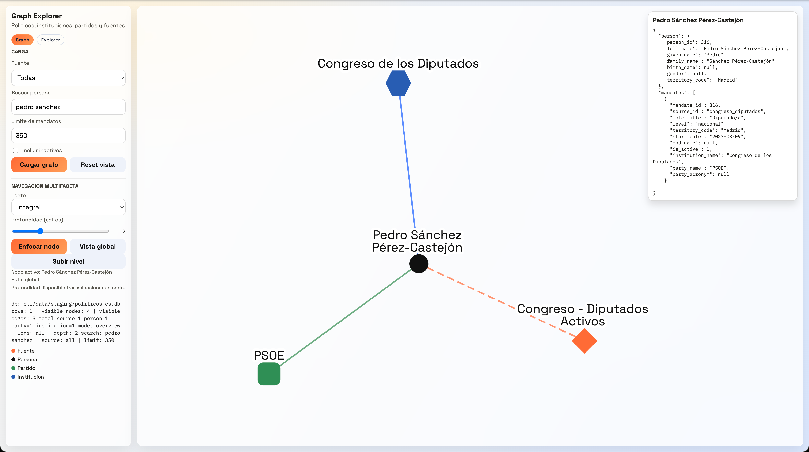
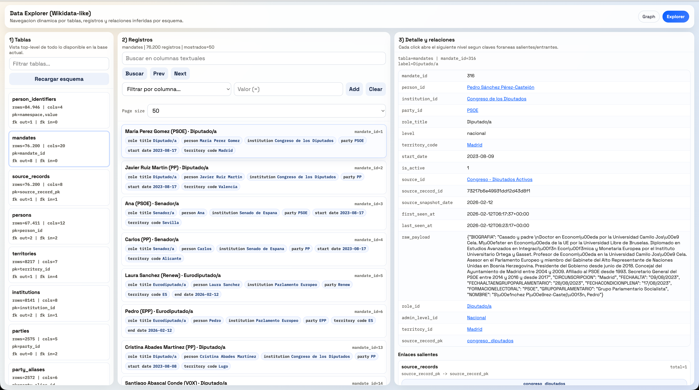
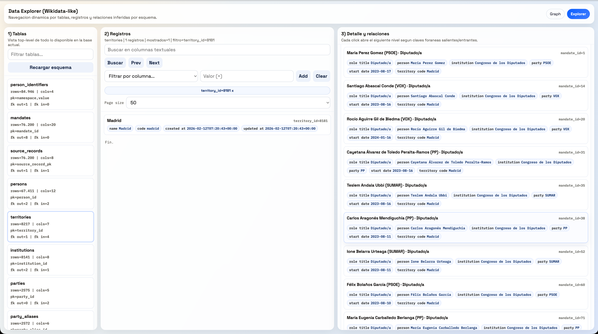

# Vota Con La Chola


Herramienta abierta y orientada a la evidencia para ayudar a decidir el voto: cruza tus prioridades con lo que actores políticos y partidos **dicen** y **hacen**, con explicaciones trazables y fuentes auditables.

Este repositorio es intencionalmente **ultraligero**: pocas piezas, muchas reglas claras, y un foco fuerte en reproducibilidad y trazabilidad.

## Estado (producto mínimo viable)

Implementado hoy:

- **ETL** de representantes y mandatos (varias fuentes oficiales) hacia **un único archivo SQLite**.
- **Interfaz web local** para explorar el “grafo” (personas, instituciones, partidos, mandatos) y un **explorador genérico de SQLite** basado en esquema.
- **Modelo de “posiciones por temas” (schema-first)**: tablas para taxonomía de temas, evidencia auditable y agregación reproducible de posicionamiento por `scope` (ver `etl/load/sqlite_schema.sql`: `topics`, `topic_sets`, `topic_evidence`, `topic_positions`).
- **Instantánea publicada** de “próximas elecciones por nivel” (Markdown + JSON).
- **Instantánea publicada** de representantes/mandatos activos (excluye `municipal` por defecto) en `etl/data/published/representantes-es-2026-02-12.json`.
- **Publicador canónico de votaciones parlamentarias** (`scripts/publicar_votaciones_es.py`) con salida en `etl/data/published/votaciones-es-<snapshot_date>.json`.
- **Publicador canónico de descargas y procesos de Infoelectoral** (`scripts/publicar_infoelectoral_es.py`) con salida en `etl/data/published/infoelectoral-es-<snapshot_date>.json`.
- **Ingesta inicial** del catálogo de descargas y procesos de Infoelectoral (tipos de convocatoria, convocatorias, archivos y resultados) a SQLite (tablas `infoelectoral_*`).
- **Ingesta inicial** de **votaciones del Congreso** (OpenData) a SQLite (`parl_vote_events` + `parl_vote_member_votes`).
- **Web provisional** (estática y/o Cloudflare Worker) para página de aterrizaje.
- Cobertura actual (representantes/mandatos) verificada E2E en Docker: **20 fuentes** (incluye **Cortes de Aragón** con activos + bajas, y **Asamblea de Ceuta**).

Pendiente (ver seguimiento):

- Conectores de **votaciones / iniciativas / intervenciones** y evidencia textual.
- Pipeline de **temas high-stakes por scope** + **evidencia (dicho/hecho)** + **posiciones agregadas** con KPIs/gates de calidad y drill-down a fuentes.
- Fuentes con `--strict-network` bloqueado por WAF/anti-bot (a `2026-02-12` desde este entorno): Parlamento de Galicia (403) y Parlamento de Navarra (Cloudflare challenge/403). **Aceptamos el camino manual**: captura de fichas HTML con Playwright (no headless) + ingesta con `--from-file <directorio>` (ver `justfile`: `etl-extract-parlamento-galicia-manual` y `etl-extract-parlamento-navarra-manual`). Asamblea de Melilla pendiente de discovery de fuente nominal estable.

Documento de seguimiento operativo: `docs/etl/e2e-scrape-load-tracker.md`.

## Principios y metodología

Los “no negociables” de este repo (resumen):

- **Reproducibilidad**: un solo SQLite; resultados razonablemente deterministas por `snapshot_date` (y mejor aún con `--from-file` o `--strict-network`).
- **Trazabilidad**: se guardan payloads en crudo, hashes, metadatos y ejecuciones para poder auditar de dónde salió cada dato.
- **Ingesta rápida**: evitar N+1 en DB; cachés en memoria por corrida; inserciones/actualizaciones idempotentes (upsert).
- **Navegación por esquema**: el Explorador genérico debe seguir funcionando aunque el esquema evolucione.

Documentos guía (recomendado leer):

- Objetivo: `docs/objetivo.md`
- Principios operativos: `docs/principios-operativos.md`
- Arquitectura MVP: `docs/arquitectura.md`
- Fuentes de datos: `docs/fuentes-datos.md`
- ETL: `docs/etl/README.md` y `docs/etl/calidad-dato.md`

## Estructura del repo (mapa rápido)

- `etl/load/sqlite_schema.sql`: **fuente de verdad** del esquema SQLite.
- `scripts/ingestar_politicos_es.py`: **punto de entrada** del ETL (CLI estable).
- `etl/politicos_es/`: implementación ETL (conectores, parseo, canalización, utilidades de base de datos).
- `scripts/graph_ui_server.py`: servidor HTTP mínimo para interfaz de grafo + explorador SQLite.
- `ui/graph/index.html`: vista “grafo” (Cytoscape desde CDN).
- `ui/graph/explorer.html`: explorador genérico de SQLite.
- `docs/`: metodología, arquitectura, fuentes y seguimiento.
- `scripts/generar_proximas_elecciones_espana.py`: genera `docs/proximas-elecciones-espana.md` + `etl/data/published/proximas-elecciones-espana.json`.
- `placeholder-site/`: HTML + recursos de página de aterrizaje (estático).
- `cf-worker-votaconlachola/`: Cloudflare Worker equivalente para la web provisional.
- `justfile`, `docker-compose.yml`, `Dockerfile`: entorno reproducible.

Peculiaridad importante:

- Antes de desplegar, revisa dominios/canónicos y ajusta nombres/rutas (por ejemplo, `placeholder-site/` y `cf-worker-votaconlachola/`).

## Qué se versiona (y qué no)

Este repo evita subir artefactos pesados o sensibles al control de versiones:

- `etl/data/raw/` contiene descargas en crudo. En git se conserva solo `etl/data/raw/samples/` (muestras curadas para pruebas y alternativa controlada).
- `etl/data/staging/` contiene bases SQLite locales (intermedias). No se versionan.
- Cualquier `*.db`, `*.sqlite`, `*.sqlite3` se ignora globalmente.
- `.wrangler/` se ignora porque puede contener estado y credenciales locales de Cloudflare.
- `intro.md` está pensado como nota local y está en `.gitignore`.

Regla práctica: si necesitas que algo sea reproducible en integración continua (CI) o por terceros, añade una **muestra** pequeña o un artefacto en `etl/data/published/`, no una base completa.

## Acuerdo de trabajo (AGENTS.md)

Antes de tocar ETL/esquema/interfaz, lee `AGENTS.md`: ahí están las reglas de evolución del esquema, rendimiento de ingesta y compatibilidad con el Explorador.

## Requisitos

Opción recomendada (reproducible):

- Docker + Docker Compose
- `just` (en macOS: `brew install just`)

Dependencias Python:

- `requirements.txt` está **vacío a propósito** hoy (solo librería estándar). Si se añaden dependencias, se reflejan ahí; el `Dockerfile` las instalará automáticamente.

## Inicio rápido (Docker + just)

1) Construir la imagen:

```bash
just etl-build
```

2) Inicializa/actualiza el esquema SQLite:

```bash
just etl-init
```

3) Ingesta determinista de muestras (sin red):

```bash
just etl-samples
just parl-samples
just parl-backfill-member-ids
just parl-link-votes
just parl-quality-report
just etl-stats
just etl-publish-votaciones
```

Flujo recomendado para votaciones parlamentarias: `ingest -> backfill-member-ids -> link-votes -> quality-report -> publish`.

Si cambias o expandes normalización en esquema, ejecuta el backfill histórico una vez tras `init-db`:

```bash
just etl-backfill-normalized
```

4) Levanta la interfaz de exploración (web):

```bash
just graph-ui
```

Por defecto escucha en `http://localhost:8080` y usa `DB_PATH=etl/data/staging/politicos-es.db`.

Variables útiles (y por qué):

- `DB_PATH`: ruta al SQLite a usar.
- `SNAPSHOT_DATE`: fecha ISO (`YYYY-MM-DD`) que queda registrada en los datos y se usa para “cerrar” mandatos no vistos.
- `GRAPH_PORT`: expone el 8080 del contenedor en otro puerto local.
- `MUNICIPAL_TIMEOUT`: el municipal puede ser pesado; sube timeout si hace falta.
 
Nota sobre `SNAPSHOT_DATE`:
 
- En `justfile` el valor por defecto está fijado a `2026-02-12` para que los ejemplos sean reproducibles. En ejecuciones reales conviene exportarlo explícitamente.

Ejemplos:

```bash
DB_PATH=etl/data/staging/politicos-es.just-e2e-20260212.db SNAPSHOT_DATE=2026-02-12 just etl-e2e
DB_PATH=etl/data/staging/politicos-es.db GRAPH_PORT=8090 just graph-ui
```

Verificación (recomendado tras una corrida real):

```bash
DB_PATH=etl/data/staging/politicos-es.e2e19.db just etl-tracker-status
DB_PATH=etl/data/staging/politicos-es.e2e19.db just etl-tracker-gate
```

## Peculiaridades operativas (lo que suele sorprender)

- `SNAPSHOT_DATE` afecta a cierres de mandatos: si un `source_record_id` deja de aparecer, se marca `is_active=0` y (si procede) se rellena `end_date` con la fecha de snapshot.
- La vista de grafo (`ui/graph/index.html`) carga Cytoscape desde CDN. Si estás sin red, usa el Explorador (`/explorer`) o abre la UI sabiendo que el grafo puede no renderizar.
- `scripts/graph_ui_server.py` es una herramienta local: no tiene autenticación ni refuerzo de seguridad para exponerla a Internet.
- Para reproducir comportamiento de CI, usa `--strict-network` (sin alternativa a muestras y con umbrales mínimos).
- No se versionan bases ni raws grandes: usa muestras (`etl/data/raw/samples/`) o salidas publicadas (`etl/data/published/`).
- Algunas fuentes “oficiales” fallan de forma transitoria (ej. fichas individuales del Senado con HTTP 500). Los conectores deben ser resilientes: no abortar toda la ingesta por un registro puntual si se puede seguir con datos del listado.

## Inicio rápido (Docker sin just)

No es necesario tener `python`/`python3` en el host. Si no quieres usar `just`, los comandos equivalentes se pueden ejecutar con Docker Compose:

```bash
docker compose run --rm --build etl "python3 scripts/ingestar_politicos_es.py init-db --db etl/data/staging/politicos-es.db"
docker compose run --rm --build etl "python3 scripts/ingestar_politicos_es.py ingest --db etl/data/staging/politicos-es.db --source all --snapshot-date 2026-02-12 --strict-network"
docker compose run --rm --build etl "python3 scripts/ingestar_politicos_es.py stats --db etl/data/staging/politicos-es.db"

DB_PATH=etl/data/staging/politicos-es.db docker compose up --build graph-ui
```

Si tienes `just`, usa siempre los targets del `justfile` (recomendado):

```bash
just etl-init
just etl-live
just etl-stats
just graph-ui
```

## ETL: comandos, modos y peculiaridades

CLI: `scripts/ingestar_politicos_es.py` (la implementación vive en `etl/politicos_es/cli.py`).

Comandos:

- `init-db`: crea/actualiza el esquema (`etl/load/sqlite_schema.sql`) y hace la carga inicial de dimensiones.
- `ingest`: ingiere una fuente (`--source <id>` o `--source all`).
- `stats`: métricas rápidas.
- `backfill-normalized`: relleno retroactivo (backfill) para normalización histórica (no se ejecuta en la ingesta normal).
- `backfill-member-ids`: relleno retroactivo de `parl_vote_member_votes.person_id` por nombre+legislatura (usando `mandates` del mismo período).

  - `--dry-run`: calcula emparejamientos sin escribir `person_id`.
  - `--source-ids`: filtra orígenes (`congreso_votaciones,senado_votaciones`).
  - `--batch-size`: tamaño de lote SQL para updates.
  - `--unmatched-sample-limit`: incluye hasta N ejemplos de filas sin emparejar en `unmatched_sample`.

Parámetros que importan:

- `--snapshot-date YYYY-MM-DD`: “fecha de foto”. Se almacena en `mandates.source_snapshot_date` y se usa para cerrar mandatos no vistos (ver `close_missing_mandates()`).
- `--strict-network`: si falla la red, **no** se usa alternativa local; además aplica umbrales mínimos por fuente (`min_records_loaded_strict`).
- `--from-file <path>`: ingiere desde un archivo local (ideal para reproducibilidad y tests).
- `--raw-dir`: dónde guardar descargas brutas (por defecto `etl/data/raw/`, “raw” = en crudo).
- `--timeout`: timeout HTTP (municipal suele requerir más).

Alternativa con muestras (deliberado):

- Si no pasas `--strict-network`, algunos conectores intentan red y, si hay error, caen a una **muestra** en `etl/data/raw/samples/` para no bloquear el desarrollo.
- La nota de la alternativa queda trazada en `ingestion_runs.message` y `raw_fetches.source_url` (ver `scripts/e2e_tracker_status.py`).

Guardarraíles de extracción:

- Si una fuente responde HTML cuando se espera CSV/JSON/XML, se considera error (evita “parsear basura”).
- En `strict-network` una corrida con `records_seen > 0` y `records_loaded == 0` aborta (protege contra parsers rotos).

Atajo para ejecutar el CLI sin Python local (Docker):

```bash
just etl-cli "stats --db etl/data/staging/politicos-es.db"
just etl-cli "ingest --db etl/data/staging/politicos-es.db --source congreso_diputados --snapshot-date 2026-02-12 --strict-network"
```

## TODO operativo: continuar con votos del Senado (backlog senado_votaciones)

Estado actual del proyecto (válido en esta rama):
- En `senado_votaciones`, hay mezcla de problemas:
  - sesiones válidas con detalle accesible,
  - y casos en los que se generan URLs `ses_<n>.xml` que no existen en host pero sí hay alternativa `ses_<sesion>_<voto>.xml`.
- `last run` muestra 98 eventos sin `parl_vote_member_votes` (sin fallback viable):
  - `leg=10`: 61
  - `leg=12`: 7
  - `leg=14`: 26
  - `leg=15`: 4
- En `votaciones` quedan pendiente de normalización (backlog confirmado en este DB):
  - `leg=10`: 61 eventos
  - `leg=12`: 7 eventos
  - `leg=14`: 26 eventos
  - `leg=15`: 4 eventos
  - Total faltante: 98 eventos
- En una pasada dedicada con `--max-events` exactos por legislatura + `SENADO_DETAIL_DIR` local + 1 worker, no hubo reingestas nuevas (`events_reingested=0` en 10/12/14 y `detail-prefetch` 404 en 15).
- Hallazgo técnico (2026-02-13): de los 98 pendientes:
  - 94 `vote_file_url` existen pero no contienen bloque de votos (`resultado` con `VotoSenador`).
  - 4 URLs de detalle acaban en 404.
  - Los `ses_<session>.xml` locales de respaldo suelen traer bloques de votos planos (`escano/grupo/nombre/voto`) pero con identificación de votación distinta a la `vote_id` (`num_vot` típicamente 1000+), sin emparejamiento fiable por título/expediente.
- PIN operativo: `events_without_member_votes` no avanza con el flujo actual sin una fuente alternativa de detalle por senador.

Notas importantes de implementación (ya aplicadas):
- `etl/parlamentario_es/connectors/senado_votaciones.py`: en `_enrich_senado_record_with_details` ya no sigue intentando URLs de `ses_*.xml` una vez que encuentra una con datos nominales (`member_votes` o totales), para evitar trabajo redundante.
- `etl/parlamentario_es/pipeline.py`: en `backfill_senado_vote_details` ya prefetch solo de la URL candidata principal por evento (`first_session_urls`), reduciendo peticiones concurrentes innecesarias al mismo contexto.
- `scripts/export_senado_missing_detail_urls.py`: modo `session` valida candidatos con HEAD antes de exportarlos (TTL de 5s en `justfile`) y hace fallback a `vote_file_url`/otras candidatas cuando `ses_<n>.xml` no es XML válido.
- `scripts/export_senado_missing_detail_urls.py` ya no asume que `ses_<n>.xml` exista por convención. La URL se construye a partir de `session_id`; si ese patrón no es válido para la legislatura, se intenta `vote_file_url` del payload primero y sólo entonces se guarda.
- Si hay URL de detalle en XML, puede venir en la forma `ses_<sesion>_<voto>.xml` o `ses_<voto>_<sesion>.xml`; el código conserva la deduplicación de candidatos.
- Los `vote_event_id` del Senado se construyen como `url:<...>` si no hay `vote_file_url`, por eso al exportar manualmente URLs desde listados hay que manejar ese prefijo con limpieza (`url:`).
- `scripts/download_senado_missing_detail_urls_headful.py` + receta `parl-senado-download-missing-details`: intenta descarga normal y, si falla, usa navegador visible (Playwright) para resolver bloqueos anti-bot y guardar el XML.
  - Variables útiles: `SENADO_HEADFUL_TIMEOUT`, `SENADO_HEADFUL_WAIT_SECONDS`, `SENADO_HEADFUL_CHANNEL`, `SENADO_HEADFUL_VIEWPORT`, `SENADO_HEADFUL_USER_DATA_DIR`.

### Origen de las URLs “malas” (no es que el HTML esté roto por sí solo)

- La URL no sale “directamente” de una lista limpia de detalle del Senado.
- Sale de cómo el evento normalizado guarda `session_id` y de cómo el exportador la “proyecta”:
  - `session_id=10`, `vote_id=27` + patrón legacy -> `https://www.senado.es/legis14/votaciones/ses_10.xml` (inventada por convención de sesión).
  - El mismo evento trae `vote_file_url` con valor concreto `https://www.senado.es/legis14/votaciones/ses_10_27.xml` (`payload` del evento).
- Por eso la acción correcta es:
  - priorizar siempre `vote_file_url` si existe,
  - y tratar `ses_<session>.xml` como candidato de ahorro, no como único origen.

Si quieres auditar esto en cualquier DB:

```bash
python3 - <<'PY'
import sqlite3, json
conn = sqlite3.connect("etl/data/staging/politicos-es.db")
conn.row_factory = sqlite3.Row
for r in conn.execute(\"\"\"SELECT e.vote_event_id, sr.raw_payload
FROM parl_vote_events e
JOIN source_records sr ON sr.source_record_pk=e.source_record_pk
WHERE e.source_id='senado_votaciones' AND e.legislature='14'
LIMIT 5\"\"\").fetchall():
    p=json.loads(r[1] or '{}')
    print(r[0], p.get('session_id'), p.get('vote_id'), p.get('vote_file_url'))
PY
```

Próximos pasos (siguientes acciones recomendadas para retomar):
- [ ] En manual pipeline, exportar primero la lista con `parl-senado-export-missing-detail-urls` y confirmar que no quedan URLs de sesión no válidas; si aparecen, revisa `session_id` contra `vote_file_url` del mismo evento.
- [ ] Descargar/centralizar `ses_*.xml` en `etl/data/raw/manual/senado_votaciones_ses` para la lista faltante de URLs (sin prefijo `url:`).
  - Si una fuente externa de listas ya existe, limpiar con: `sed 's/^url://'` antes de descargar.
- [ ] Ejecutar backfill en modo `--dry-run` por bloque legislativo:
  - `--legislature 15 --max-events 4`
  - `--legislature 10 --max-events 61`
  - `--legislature 12 --max-events 7`
  - `--legislature 14 --max-events 26`
- [ ] Repetir las mismas llamadas sin `--dry-run` cuando exista conectividad real o cache local funcional.
- [ ] Validar con `quality-report` para confirmar que suben:
  - `events_with_date_pct`
  - `events_with_totals_pct`
  - `member_votes_with_person_id_pct`
- [ ] Si persiste 0 resultados por red/DNS, seguir con captura manual reproducible de `ses_*.xml` y reintento del backfill con `--senado-detail-dir`.

Comando base de referencia:
```bash
python3 scripts/ingestar_parlamentario_es.py backfill-senado-details \\
  --db etl/data/staging/politicos-es.db \\
  --snapshot-date 2026-02-12 \\
  --senado-detail-dir etl/data/raw/manual/senado_votaciones_ses \\
  --detail-workers 4 --timeout 20 --legislature 14 --max-events 3451 --dry-run
```

## Modelo de datos (SQLite)

Esquema fuente de verdad: `etl/load/sqlite_schema.sql`.

Tablas principales (resumen):

- `sources`: catálogo de fuentes (`source_id`, URL, formato, etc.).
- `ingestion_runs`: historial de corridas (estado, mensajes, contadores).
- `raw_fetches`: descargas brutas (ruta local, hash, tipo, bytes); dedupe por `(source_id, content_sha256)`.
- `source_records`: registro por “fila” con `raw_payload` + hash (para trazabilidad fina).
- `persons`: personas normalizadas (clave estable `canonical_key`).
- `person_identifiers`: identificadores externos (`PRIMARY KEY (namespace, value)`).
- `parties`, `party_aliases`: partidos y aliases (normalización de nombres/siglas).
- `institutions`: instituciones (UNIQUE por `(name, level, territory_code)`).
- `mandates`: relación persona-institución (y partido/rol/territorio) con `UNIQUE (source_id, source_record_id)`.
- Dimensiones normalizadas: `roles`, `admin_levels`, `genders`, `territories`.

Idempotencia (clave):

- La identidad de `mandates` es `(source_id, source_record_id)`. Repetir una ingesta debe dejar los totales estables (ver `tests/test_samples_e2e.py`).

Evolución del esquema (reglas):

- Preferir cambios **aditivos** (tablas/columnas/índices nuevos).
- Evitar migraciones destructivas salvo petición explícita.
- `apply_schema()` y `ensure_schema_compat()` están diseñadas para que DBs antiguas se “pongan al día” con `ALTER TABLE ... ADD COLUMN ...` cuando sea necesario.

## Interfaz: grafo + explorador

Servidor: `scripts/graph_ui_server.py`.

Rutas principales:

- `/` o `/index.html`: vista “grafo” (usa `/api/graph`).
- `/explorer` o `/explorer.html`: explorador (Explorer) genérico de SQLite.

Capturas (ver `docs/screenshots/`):

Grafo: búsqueda `pedro sanchez` (activos, `depth=2`).



Explorer: detalle de un mandato (ejemplo: `mandate_id=316`).



Explorer: territorio `Madrid` (ejemplo: `territory_id=8181`) y lista de mandatos relacionados.



API (útil para depurar):

- `/api/health`
- `/api/graph?limit=...&source_id=...&q=...&include_inactive=...`
- `/api/person/<person_id>`
- `/api/explorer/schema`
- `/api/explorer/rows?table=...&q=...&limit=...&offset=...`
- `/api/explorer/record?table=...&(pk|rowid)=...`
- `/api/explorer/related?table=...&col=...&val=...&limit=...&offset=...`

Explorador y relaciones (importante):

- Las relaciones se infieren desde metadatos de FKs (`PRAGMA foreign_key_list`).
- Para que una tabla sea navegable “bien”:
  - ideal: `PRIMARY KEY` de una sola columna.
  - si no hay PK, se cae a `rowid` (solo si la tabla no es `WITHOUT ROWID`).
  - tablas `WITHOUT ROWID` sin PK no son navegables “por detalle”.
- Las etiquetas humanas se infieren con candidatos en `LABEL_COLUMN_CANDIDATES` dentro de `scripts/graph_ui_server.py`. Si añades una entidad grande nueva, dale una columna tipo `name` / `full_name` / `title`.

## Seguimiento, pruebas y calidad

Reglas pragmáticas:

- Tras una ingesta, `PRAGMA foreign_key_check` debería devolver 0 filas.
- Para una fuente ingesta, `ingestion_runs.records_loaded` debe ser > 0 en ejecuciones reales.

Seguimiento:

- `docs/etl/e2e-scrape-load-tracker.md` es la lista única de pendientes para el extremo a extremo (E2E) de extracción + carga.
- `scripts/e2e_tracker_status.py` compara “DONE/PARTIAL/TODO” del seguimiento con métricas reales en SQLite.

Pruebas (muestras, sin red):

```bash
just etl-test
```

Esto ejecuta `tests/test_samples_e2e.py`, que ingiere todas las muestras 2 veces y verifica idempotencia.

CI:

- Flujo: `.github/workflows/etl-tracker-gate.yml`
- Ejecuta ingestas `--strict-network` para todas las fuentes marcadas como `DONE` en el seguimiento y falla si alguna carga 0 registros reales.

## Cómo añadir una fuente nueva (conector)

Lista de verificación mínima (para mantener el repo rápido y auditable):

1) Añade metadatos en `etl/politicos_es/config.py` (`SOURCE_CONFIG`):

- `source_id` estable
- `default_url`, `format`, `fallback_file`
- (si aplica) `min_records_loaded_strict`

2) Implementa un conector en `etl/politicos_es/connectors/` (ver `BaseConnector`):

- `resolve_url()`: opcional descubrimiento automático del recurso real.
- `extract()`: descarga/lee, guarda raw en `etl/data/raw/` y parsea a registros (`records`).
- `normalize()`: mapea a un diccionario canónico (mínimos):
  - `source_record_id` (estable, no aleatorio)
  - `full_name`
  - `institution_name`, `level`, `role_title`
  - `raw_payload` (serialización estable, p. ej. `stable_json(record)`)

3) Registra el conector en `etl/politicos_es/registry.py`.

4) Añade una muestra pequeña y reproducible en `etl/data/raw/samples/`.

5) Actualiza `docs/etl/e2e-scrape-load-tracker.md` y añade receta `just` si procede.

Notas de rendimiento:

- Evita consultas por fila; apóyate en cachés por corrida (ver `etl/politicos_es/pipeline.py`).
- Mantén upserts simples (`INSERT ... ON CONFLICT DO UPDATE`) y commits por lote.

## Instantánea: próximas elecciones (por nivel)

Fuente de verdad y salida publicada:

- Markdown: `docs/proximas-elecciones-espana.md`
- JSON: `etl/data/published/proximas-elecciones-espana.json`

Generación:

```bash
just etl-elecciones
```

o:

```bash
just py "scripts/generar_proximas_elecciones_espana.py --today 2026-02-12"
```

El script es idempotente: solo escribe si cambia el contenido.

## Web provisional / Cloudflare (opcional)

Hay dos implementaciones equivalentes de página de aterrizaje:

- `placeholder-site/`: sitio estático (HTML + recursos).
- `cf-worker-votaconlachola/`: Cloudflare Worker que sirve HTML + recursos embebidos (favicons y `og.png`).

Peculiaridad: revisa `canonical`, dominios y rutas en `placeholder-site/index.html` y `cf-worker-votaconlachola/wrangler.toml` antes de desplegar.

## Contribución y gobernanza

- Contribuir: `CONTRIBUTING.md`
- Gobernanza: `GOVERNANCE.md`
- Responsables de código: `.github/CODEOWNERS`

## Licencia

Este repositorio todavía no incluye un archivo `LICENSE`. Si se va a abrir a contribuciones externas y reutilización, conviene definirla explícitamente.
