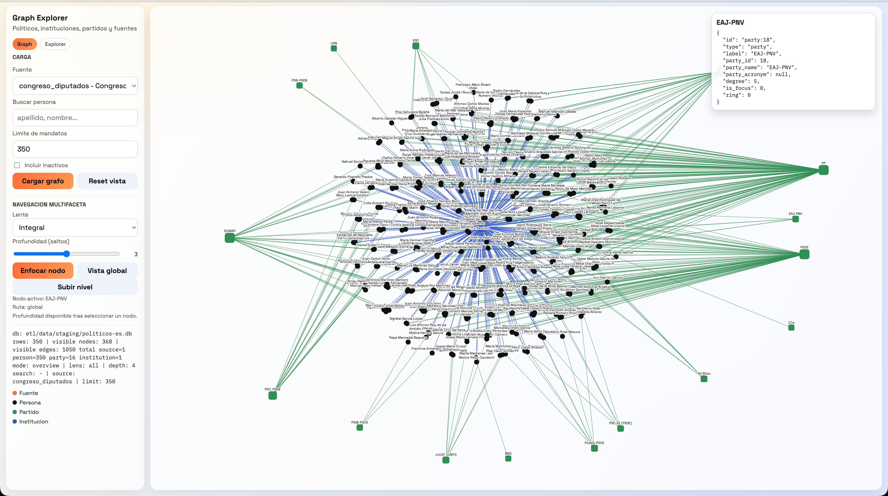

# Vota Con La Chola



Herramienta abierta y orientada a la evidencia para ayudar a decidir el voto: cruza tus prioridades con lo que actores políticos y partidos **dicen** y **hacen**, con explicaciones trazables y fuentes auditables.

Este repo es intencionalmente **ultraligero**: un solo SQLite, snapshots reproducibles y trazabilidad por defecto.

## Leer primero

- Índice de docs: `docs/README.md`
- Roadmap (macro): `docs/roadmap.md`
- Roadmap técnico (ejecución): `docs/roadmap-tecnico.md`
- Backlog operativo (conectores + DoD): `docs/etl/e2e-scrape-load-tracker.md`
- Cómo correr ETL/UI: `docs/etl/README.md`

## Qué hay hoy (MVP)

- ETL de representantes y mandatos a un único SQLite.
- Ingesta parlamentaria (Congreso/Senado) para votaciones e iniciativas (con pipeline de calidad en curso).
- Ingesta inicial de Infoelectoral (procesos/descargas/resultados).
- Publicación de snapshots canónicos en `etl/data/published/`.
- UI local para explorar el esquema y la evidencia: `just graph-ui` (ver `docs/etl/README.md`).

## Fuente de verdad (código)

- Esquema SQLite: `etl/load/sqlite_schema.sql`
- ETL (personas/mandatos): `scripts/ingestar_politicos_es.py`
- ETL (parlamentario): `scripts/ingestar_parlamentario_es.py`
- Servidor UI/API local: `scripts/graph_ui_server.py`
- Explorer UI: `ui/graph/explorer.html`

Antes de tocar ETL/esquema/UI: `AGENTS.md` (reglas de rendimiento, idempotencia y compatibilidad con Explorer).

## Inicio rápido (Docker + just)

```bash
just etl-build
just etl-init
just etl-samples
just graph-ui
```

Si quieres una corrida más completa (y reproducible) en local:

```bash
just etl-e2e
just parl-quality-pipeline
just etl-publish-votaciones
```

## Notas (KISS)

- `docs/roadmap.md` + `docs/roadmap-tecnico.md` son los únicos roadmaps.
- `docs/etl/e2e-scrape-load-tracker.md` es la única lista operativa de TODO.
- `intro.md` está ignorado por git (nota local); evita convertirlo en otro roadmap.
- No se versionan bases ni raws grandes: usa `etl/data/raw/samples/` y artefactos publicados pequeños.

## Contribución y gobernanza

- Contribuir: `CONTRIBUTING.md`
- Gobernanza: `GOVERNANCE.md`
- Responsables de código: `.github/CODEOWNERS`

## Licencia

Este repositorio todavía no incluye un archivo `LICENSE`.
