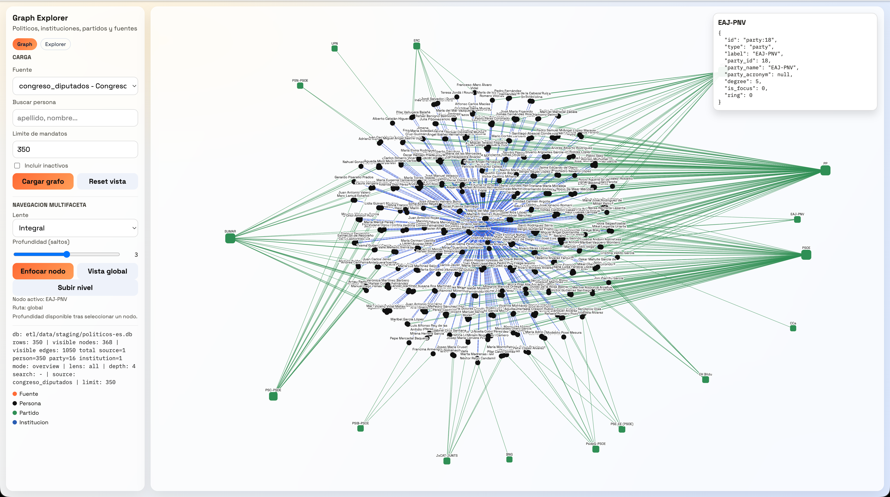

# Vota Con La Chola



[](https://github.com/gsusI/vota-con-la-chola/actions/workflows/etl-tracker-gate.yml)


[](https://huggingface.co/datasets/JesusIC/vota-con-la-chola-data)

Herramienta abierta y orientada a la evidencia para ayudar a decidir tu voto: cruza tus prioridades con lo que actores políticos y partidos **dicen** y **hacen**, con explicaciones trazables y fuentes auditables.

Este repo es intencionalmente **ultraligero**: SQLite reproducible para control/snapshots, objetos content-addressed para documentos, artefactos analíticos/publicación acotados y trazabilidad por defecto.

## Sobre el repo (para colaboradores)

**Resumen para GitHub / About:**

- Infraestructura cívica de evidencia pública para transparencia política reproducible.
- Enfoque operativo en la trazabilidad: cada afirmación pública puede reconducirse a consulta y fuente.
- Público objetivo actual: ciudadanía de decisión rápida, periodistas de verificación y analistas ciudadanos.
- Estado: MVP funcional con prioridades claras de mejora continua y documentación de calidad.

## Visión y misión

Visión:
- Que cualquier persona en España pueda decidir su voto con la misma exigencia con la que audita una cuenta pública: comparando **lo que se promete, lo que se ejecuta y lo que impacta**, con evidencia verificable en su nivel territorial (Estado, CCAA, municipal, UE).

Misión:
- Construir y operar una infraestructura cívica abierta, reproducible y auditable que transforme datos públicos fragmentados en explicaciones claras y trazables para:
  1. medir alineamiento ciudadano-político,
  2. contrastar “dicen vs hacen”,
  3. estimar impacto cuando sea metodológicamente defendible.

## Estado actual de gobierno del repositorio

- Política de gobernanza general: [`GOVERNANCE.md`](GOVERNANCE.md)
- Proceso de decisiones: [`docs/governance/decision-log-process.md`](docs/governance/decision-log-process.md)
- Sobre el proyecto para GitHub/About, tópicos sugeridos y checklist de roles: [`docs/ops/github-about.md`](docs/ops/github-about.md)

## Leer primero

- Índice de docs: `docs/README.md`
- KB de agentes / aprendizajes duraderos: `project_kb/README.md`
- Roadmap canónico del futuro: `ROADMAP.md`
- Roadmap macro de modelo/arquitectura: `docs/roadmap.md`
- Roadmap técnico derivado (ejecución): `docs/roadmap-tecnico.md`
- Backlog operativo (conectores + DoD): `docs/etl/e2e-scrape-load-tracker.md`
- Índice único de TODO: `docs/todo/README.md`
- Cómo correr ETL/UI: `docs/etl/README.md`
- Sitio público canónico (Cloudflare Pages): https://votaconlachola.org/
- Hugging Face (dataset público): https://huggingface.co/datasets/JesusIC/vota-con-la-chola-data

## Qué hay hoy (MVP)

- ETL de representantes y mandatos a un único SQLite.
- Ingesta parlamentaria (Congreso/Senado) para votaciones e iniciativas (con pipeline de calidad en curso).
- Ingesta inicial de Infoelectoral (procesos/descargas/resultados).
- Publicación de snapshots canónicos en `etl/data/published/`.
- App pública estática para Cloudflare Pages en `ui/gh-pages-next/`; salida de build en `ui/gh-pages-next/out/`.
- Espejo público de snapshots en Hugging Face Datasets (`just etl-publish-hf`): https://huggingface.co/datasets/JesusIC/vota-con-la-chola-data
- Origen analítico versionado en Hugging Face (`just etl-scale-origin-hf-publish`): `scale/snapshots/<snapshot-date>/<full-manifest-sha256>/` empaqueta solo archivos declarados por manifests validados y mueve `scale/latest.json` al final. El bundle incluye un hash estable del contrato de datos/provenance, independiente del estado mutable de publicación. `just etl-scale-origin-hf-verify` exige path content-addressed, contrato válido y parity exacta. La release publicada v2 `5872efaf...` pasa con metadata local/remota exacta y cero warnings.
- Restore reproducible (`just etl-scale-origin-hf-restore-validate`): por defecto sigue `scale/latest.json`; `HF_SCALE_RESTORE_SNAPSHOT_PATH=scale/snapshots/<date>/<full-sha256>` fija una release inmutable para recovery/rollback sin depender del pointer mutable. Un restore real explícito de `actor_mandates` descargó y verificó `114` ficheros / `9,688,787` bytes y full-validó `88,031` filas.
- Rebuild SQLite desde origin restaurado (`just etl-scale-origin-sqlite-rebuild`): importa Parquet por batches, exige checksums/contrato real-only, conserva campos públicos sin transformación, valida hash lógico e integridad y publica el DB solo mediante rename atómico. Dos rebuilds del corpus actor produjeron el mismo SHA-256 SQLite `61cfdf8e...` para `88,031` filas.
- CAS de objetos documentales (`just etl-object-store-replicate` / `etl-object-store-restore-drill`): upload y restore usan batches con workers acotados, claves SHA-256, writes atómicos y manifest determinista. La prueba local real replica/deduplica `6,792` objetos / `133,219,457` bytes con `16` workers y restaura el manifest completo. Esto prueba el contrato y throughput local; el origen S3-compatible remoto sigue pendiente.
- UI local para explorar el esquema y la evidencia: `just graph-ui` (ver `docs/etl/README.md`).

Estado de escala (`2026-08-12`): solo datos capturados de fuentes oficiales cuentan. `just etl-scale-readiness` valida todos los ficheros, bytes, SHA-256, filas, `source_id` y hosts de seis corpora actuales:

- votos nominales: `1,809,222` filas / `8,373` shards; URL pública y source record `100%`; las `102,172` filas HTTP / `1,166` URLs están clasificadas, con captura checksum para `33,683` filas / `484` URLs y `68,489` filas / `682` URLs pendientes de replacement inmutable;
- Eurostat: `1,755,809` observaciones / `37` Parquet; full validation y replay `26/26`;
- PLACSP: `263,302` facts / `50` Parquet; `128,849/128,849` nombres e identificadores de contraparte publicados por la fuente se conservan exactamente; full validation y replay `50/50`;
- BDNS: `1,360,382` facts / `14` Parquet; nombres `1,360,382/1,360,382` e identificadores source `163,270/163,270` retenidos exactamente; full validation y replay `1/1` partición mediante `14/14` hardlinks;
- accountability ledger: `126,760` facts / `13` Parquet; full validation y replay `13/13`;
- actores: `88,031` mandatos / `108` Parquet; full validation y replay `108/108`.

Hay `3` lanes reales por encima de un millón, `6` corpora registrados y `0` lanes promocionadas. La release HF v2 content-addressed publicada `5872efaf...` y el contrato estable `bb99c119...c2c` verifican `5,403,506` filas, `8,595` ficheros y `498,631,274` bytes sin transformar identidades públicas. Pointer, manifest, registry y readiness coinciden con el estado local; la verificación pasa sin errores ni warnings. Los seis corpora pasan además clean-room restore desde cache vacío: `8,619` ficheros de bundle verificados por checksum y validadores aislados que leen todas las filas. Todavía faltan segundo snapshot y cobertura histórica completa. El worker BDNS bloquea antes de claim cuando falta storage; el preflight capturado más reciente devuelve `blocked_storage`: `5,685,862,400` bytes libres frente a `10,863,247,360` requeridos, headroom `-5,177,384,960`. Candidaturas nominales siguen en `0` por bloqueo del origen oficial. El inventario documental real contiene `21,398` instancias / `19,538` hashes; el audit file-level verifica checksum lineage para `10,219`, URL pública para `10,195`, todos los `6,792` textos referenciados y deja `11,179` ficheros unlinked explícitos. Estado honesto: `real_foundation_ready_scale_incomplete`. Ver `etl/data/published/scale-readiness-latest.json`, `docs/etl/real-corpus-registry.json` y `ROADMAP.md`.

## Fuente de verdad (código)

- Esquema SQLite: `etl/load/sqlite_schema.sql`
- ETL (personas/mandatos): `scripts/ingestar_politicos_es.py`
- ETL (parlamentario): `scripts/ingestar_parlamentario_es.py`
- Servidor UI/API local: `scripts/graph_ui_server.py`
- Explorer UI: `ui/graph/explorer.html`

Antes de tocar ETL/esquema/UI: `AGENTS.md` (reglas de rendimiento, idempotencia y compatibilidad con Explorer).

## Inicio rápido (Docker + just)

```bash
just dev
```

Ojo: este es el flujo recomendado para entrar rápido. Si quieres detalles completos del path de fixture y del smoke de arranque, consulta [`docs/dev/quickstart.md`](docs/dev/quickstart.md).

Comandos completos sin fixture:

```bash
just etl-build
just etl-init
just etl-samples
just graph-ui
```

Si quieres una corrida más completa (y reproducible) en local:

```bash
just etl-e2e
just parl-quality-pipeline
just etl-publish-votaciones
```

Gates y pipelines de escala real:

```bash
just etl-scale-readiness
just etl-scale-origin-hf-dry-run
just etl-scale-origin-hf-verify
just etl-scale-origin-hf-restore-bdns
just etl-scale-audit-vote-db
just parl-refresh-senado-local-cache
just etl-scale-export-vote-db-shards
just etl-scale-validate-vote-db-shards
just etl-scale-export-semantic-member-votes
just etl-scale-validate-semantic-member-votes
just etl-scale-export-semantic-accountability-ledger
just etl-scale-validate-semantic-accountability-ledger
just etl-scale-export-semantic-actor-mandates
just etl-scale-validate-semantic-actor-mandates
just etl-scale-export-semantic-public-money
just etl-scale-validate-semantic-public-money
just etl-scale-export-semantic-indicators
just etl-scale-validate-semantic-indicators
just etl-scale-bdns-bulk-enqueue
just etl-scale-bdns-bulk-work
just etl-scale-bdns-bulk-report
just etl-scale-eurostat-indicators-enqueue
just etl-scale-eurostat-indicators-work
just etl-scale-eurostat-indicators-backfill
just etl-scale-eurostat-indicators-report
just etl-scale-eurostat-indicators-export
just etl-scale-eurostat-indicators-validate
just etl-scale-eurostat-indicators-replay
just etl-scale-eurostat-indicators-replay-validate
just etl-scale-placsp-archives-enqueue
just etl-scale-placsp-archives-work
just etl-scale-placsp-members-work
just etl-scale-placsp-report
just etl-scale-placsp-export
just etl-scale-placsp-validate
just etl-scale-placsp-replay
just etl-scale-placsp-replay-validate
just etl-scale-placsp-documents-enqueue
just etl-scale-placsp-documents-work
just etl-scale-placsp-integrity-review
just etl-scale-gate
```

El worker Eurostat renueva su lease durante cada chunk descargado y cada commit batch; aborta si pierde ownership. Cada query del registry declara `maximum_bytes` y `maximum_cube_cells`; payloads legacy de queue reciben un techo conservador. `EUROSTAT_INDICATOR_CA_BUNDLE` solo es necesario si el CA store del runtime está desactualizado: mantener esa ruta fuera del repo. No usar TLS inseguro en la lane reproducible.

PLACSP usa dos queues para archivos ZIP y miembros Atom, y una tercera queue independiente para documentos. El parser inspecciona ZIP en streaming y falla ante límites de path, tamaño, ratio, records o documentos. `PLACSP_BULK_ARCHIVE_ARGS` permite ampliar meses/años sin cambiar el loader. No drenar la queue de `998,392` documentos con los defaults de muestra: definir primero presupuesto por host, ventana, concurrencia, origin remoto, coste y cohortes crecientes. Los imports son notices/awards publicados; no son pagos. Las señales de integridad quedan internas y requieren revisión humana.

Ningún resultado generado localmente sustituye las promociones reales por lane (`100k` documentos estratificados; `1M` actores/votos/ledger/dinero/indicadores). Los gates están desglosados en `docs/roadmap-tecnico.md` y su estado vive en el tracker.

## Notas (KISS)

- `ROADMAP.md` es la única fuente de verdad para el futuro y la secuencia del proyecto.
- `docs/roadmap.md` y `docs/roadmap-tecnico.md` son docs de soporte; no deben abrir scope nuevo por su cuenta.
- `docs/etl/e2e-scrape-load-tracker.md` es la única lista operativa de TODO.
- `intro.md` está ignorado por git (nota local); evita convertirlo en otro roadmap.
- No se versionan bases ni raws grandes: usa `etl/data/raw/samples/` y artefactos publicados pequeños.

## Contribución y gobernanza

- Contribuir: `CONTRIBUTING.md`
- Gobernanza: `GOVERNANCE.md`
- Código de conducta: `CODE_OF_CONDUCT.md`
- Seguridad y reporte responsable: `SECURITY.md`
- Citación: `CITATION.cff`
- Política para señales de integridad: `docs/method/integrity-signal-policy.md`
- Retos de fuentes: `docs/community/contributor-challenges-v1.md`
- Guía de integración: `docs/community/partner-integration-guide.md`
- Steward map: `docs/community/steward-map.md`
- Plantillas de issue: `.github/ISSUE_TEMPLATE/`
- Plantilla de PR: `.github/PULL_REQUEST_TEMPLATE.md`
- Responsables de código: `.github/CODEOWNERS`

## Licencia

- Código y documentación técnica: licencia MIT (`LICENSE`).
- Política de derechos de datos y reutilización: [`docs/legal/data-rights.md`](docs/legal/data-rights.md)
- Snapshots públicos (HF): `license: other` con condiciones mixtas por `source_id` documentadas en `sources/<source_id>.json`.
