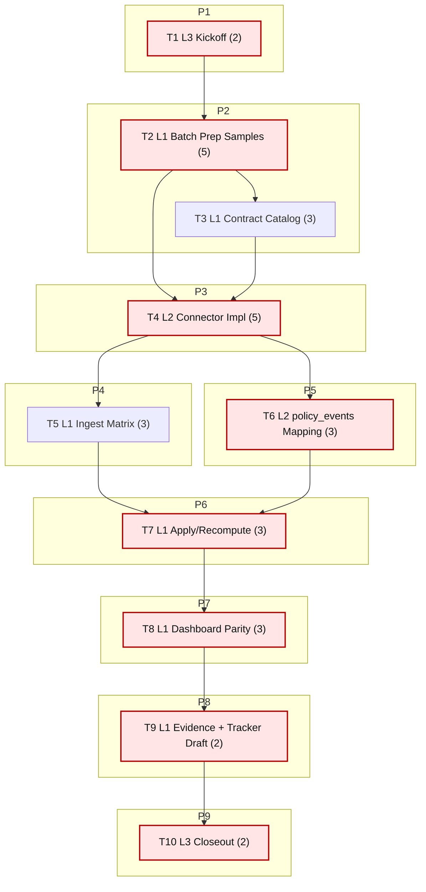

# Sprint AI-OPS-04 Prompt Pack

Repository root:
- `/Users/jesus/Library/CloudStorage/GoogleDrive-gsus123456@gmail.com/My Drive/CdC/Obsidian Vault/vota-con-la-chola`

Sprint scope (single source family):
- `Accion ejecutiva (Consejo de Ministros)`
- Target sources in this family: `La Moncloa referencias + RSS`

Sprint objective:
- Move tracker row `Accion ejecutiva (Consejo de Ministros)` from `TODO` to evidence-backed `PARTIAL` with reproducible ingest + normalization into `policy_events`, full traceability, and publish visibility.

Baseline snapshot (for kickoff reference):
- `policy_events_total = 0`
- `policy_instruments_total = 0`
- `source_records_total = 92860`
- `sources` rows matching moncloa/consejo: none
- tracker row status: `TODO`

Bottleneck class:
- `source bottleneck` + `pipeline bottleneck`

Workload balance:
- total points: `31`
- `L1 = 19 pts (61.3%)`
- `L2 = 8 pts (25.8%)`
- `L3 = 4 pts (12.9%)`
- `L1 task share = 6/10 (60%)`

1. **Agent: L3 Orchestrator (2 pts)**
- `depends_on: []`
- `parallel_group: P1`
```text
goal:
Freeze AI-OPS-04 baseline and gates aligned to roadmap critical path.

repository:
/Users/jesus/Library/CloudStorage/GoogleDrive-gsus123456@gmail.com/My Drive/CdC/Obsidian Vault/vota-con-la-chola

inputs:
- docs/roadmap.md
- docs/roadmap-tecnico.md
- docs/etl/e2e-scrape-load-tracker.md
- docs/etl/sprints/AI-OPS-03/closeout.md
- sqlite3 etl/data/staging/politicos-es.db

tasks:
1) Run kickoff baseline commands:
- sqlite3 etl/data/staging/politicos-es.db "SELECT COUNT(*) AS fk_violations FROM pragma_foreign_key_check;"
- sqlite3 etl/data/staging/politicos-es.db "SELECT COUNT(*) AS policy_events_total FROM policy_events;"
- sqlite3 etl/data/staging/politicos-es.db "SELECT COUNT(*) AS policy_instruments_total FROM policy_instruments;"
- sqlite3 etl/data/staging/politicos-es.db "SELECT source_id, is_active, name FROM sources WHERE lower(source_id) LIKE '%moncloa%' OR lower(name) LIKE '%moncloa%' OR lower(name) LIKE '%consejo de ministros%';"
2) Lock sprint gates and sequence.
3) Write kickoff artifact.

output_contract:
- docs/etl/sprints/AI-OPS-04/kickoff.md with exact command outputs, gates, and execution order.

acceptance_query:
- test -f docs/etl/sprints/AI-OPS-04/kickoff.md && rg -n "fk_violations|policy_events_total|policy_instruments_total" docs/etl/sprints/AI-OPS-04/kickoff.md

escalation_rule:
- escalate to user only if baseline DB is missing or unreadable.

depends_on:
- none

parallel_group:
- P1

artifact_path:
- docs/etl/sprints/AI-OPS-04/kickoff.md
```

2. **Agent: L1 Mechanical Executor (5 pts)**
- `depends_on: [1]`
- `parallel_group: P2`
```text
goal:
Batch-prep reproducible raw captures for Moncloa references + RSS (manual throughput step).

repository:
/Users/jesus/Library/CloudStorage/GoogleDrive-gsus123456@gmail.com/My Drive/CdC/Obsidian Vault/vota-con-la-chola

inputs:
- docs/ideal_sources_say_do.json
- docs/fuentes-datos.md
- docs/etl/e2e-scrape-load-tracker.md

tasks:
1) Create dated capture batch root:
- etl/data/raw/manual/moncloa_exec/ai-ops-04-<YYYYMMDD>/
2) Capture source contracts and sample payloads for:
- referencias index/list pages
- detail pages (at least 20 unique records)
- RSS feed(s)
3) Save metadata manifest with URL, fetched_at, http_status, content_type, sha256.
4) Validate sample set is replayable from files (no network required for parser tests).
5) Write prep report.

output_contract:
- sample files + manifest JSON in batch folder
- docs/etl/sprints/AI-OPS-04/reports/moncloa-batch-prep.md

acceptance_query:
- rg -n "manifest|sha256|http_status|replayable" docs/etl/sprints/AI-OPS-04/reports/moncloa-batch-prep.md
- find etl/data/raw/manual/moncloa_exec -type f | wc -l

escalation_rule:
- if source blocks requests (403/challenge), document evidence and continue with best-effort cached/manual samples.

depends_on:
- 1

parallel_group:
- P2

artifact_path:
- docs/etl/sprints/AI-OPS-04/reports/moncloa-batch-prep.md
```

3. **Agent: L1 Mechanical Executor (3 pts)**
- `depends_on: [2]`
- `parallel_group: P2`
```text
goal:
Produce deterministic contract tables for RSS/referencias fields before code implementation.

repository:
/Users/jesus/Library/CloudStorage/GoogleDrive-gsus123456@gmail.com/My Drive/CdC/Obsidian Vault/vota-con-la-chola

inputs:
- etl/data/raw/manual/moncloa_exec/ai-ops-04-<YYYYMMDD>/manifest.json
- sampled HTML/XML files from task 2

tasks:
1) Build field inventory tables:
- stable_id candidates
- title
- published_at/event_date
- source_url
- summary/body excerpt
2) Record null-rate estimates per field from sample batch.
3) Mark parser edge cases with examples.
4) Write contract report to guide L2 implementation.

output_contract:
- docs/etl/sprints/AI-OPS-04/reports/moncloa-contract-catalog.md

acceptance_query:
- rg -n "stable_id|published_at|null-rate|edge case" docs/etl/sprints/AI-OPS-04/reports/moncloa-contract-catalog.md

escalation_rule:
- if no stable_id candidate appears, escalate with 3 concrete alternatives and examples.

depends_on:
- 2

parallel_group:
- P2

artifact_path:
- docs/etl/sprints/AI-OPS-04/reports/moncloa-contract-catalog.md
```

4. **Agent: L2 Specialist Builder (5 pts)**
- `depends_on: [2,3]`
- `parallel_group: P3`
```text
goal:
Implement ingest connector(s) for Moncloa references + RSS with traceability and idempotence.

repository:
/Users/jesus/Library/CloudStorage/GoogleDrive-gsus123456@gmail.com/My Drive/CdC/Obsidian Vault/vota-con-la-chola

inputs:
- docs/etl/sprints/AI-OPS-04/reports/moncloa-contract-catalog.md
- etl/data/raw/manual/moncloa_exec/ai-ops-04-<YYYYMMDD>/
- etl/politicos_es/config.py
- etl/politicos_es/connectors/
- scripts/ingestar_politicos_es.py

tasks:
1) Add source config entries for Moncloa references/RSS.
2) Implement connector parser(s) with deterministic `source_record_id`.
3) Wire ingest path to write `source_records`, `raw_fetches`, `run_fetches`, `ingestion_runs`.
4) Add sample-based tests for idempotence and parser stability.

output_contract:
- code changes + tests
- docs/etl/sprints/AI-OPS-04/reports/moncloa-connector-implementation.md with commands/results.

acceptance_query:
- python3 -m unittest tests.test_samples_e2e
- sqlite3 etl/data/staging/politicos-es.db "SELECT source_id, records_loaded FROM ingestion_runs WHERE source_id LIKE 'moncloa_%' ORDER BY run_id DESC LIMIT 10;"

escalation_rule:
- if upstream contract drift breaks parser, keep ingest non-fatal and emit explicit failure reason in report.

depends_on:
- 2
- 3

parallel_group:
- P3

artifact_path:
- docs/etl/sprints/AI-OPS-04/reports/moncloa-connector-implementation.md
```

5. **Agent: L1 Mechanical Executor (3 pts)**
- `depends_on: [4]`
- `parallel_group: P4`
```text
goal:
Run ingestion matrix (strict-network + from-file replay) and produce throughput/blocker evidence.

repository:
/Users/jesus/Library/CloudStorage/GoogleDrive-gsus123456@gmail.com/My Drive/CdC/Obsidian Vault/vota-con-la-chola

inputs:
- new moncloa source_ids from config
- sample batch from task 2

tasks:
1) Execute strict-network ingest run(s) for moncloa source_ids.
2) Execute from-file replay run(s) using prepared batch.
3) Compare loaded counts, failure rates, and repeatability.
4) Write matrix report.

output_contract:
- docs/etl/sprints/AI-OPS-04/reports/moncloa-ingest-matrix.md

acceptance_query:
- rg -n "strict-network|from-file|records_loaded|repeatability" docs/etl/sprints/AI-OPS-04/reports/moncloa-ingest-matrix.md

escalation_rule:
- if strict-network fails and from-file succeeds, mark blocker explicitly and continue sprint.

depends_on:
- 4

parallel_group:
- P4

artifact_path:
- docs/etl/sprints/AI-OPS-04/reports/moncloa-ingest-matrix.md
```

6. **Agent: L2 Specialist Builder (3 pts)**
- `depends_on: [4]`
- `parallel_group: P5`
```text
goal:
Map Moncloa records into `policy_events` minimally and reproducibly.

repository:
/Users/jesus/Library/CloudStorage/GoogleDrive-gsus123456@gmail.com/My Drive/CdC/Obsidian Vault/vota-con-la-chola

inputs:
- source_records generated by moncloa ingest
- sqlite tables: policy_instruments, policy_events
- etl/load/sqlite_schema.sql

tasks:
1) Seed/ensure `policy_instruments` code(s) for executive references/RSS.
2) Implement mapping/backfill command from moncloa source_records -> policy_events.
3) Preserve traceability fields (`source_id`, `source_url`, `source_record_pk`, `raw_payload`, snapshot date).
4) Add tests for idempotent upsert and required fields.

output_contract:
- code + tests + report
- docs/etl/sprints/AI-OPS-04/reports/moncloa-policy-events-mapping.md

acceptance_query:
- sqlite3 etl/data/staging/politicos-es.db "SELECT COUNT(*) FROM policy_events WHERE source_id LIKE 'moncloa_%';"
- sqlite3 etl/data/staging/politicos-es.db "SELECT COUNT(*) FROM policy_events WHERE source_id LIKE 'moncloa_%' AND source_url IS NOT NULL AND trim(source_url)<>'';"

escalation_rule:
- if mapping cannot extract event_date reliably, keep `published_date`, set `event_date` NULL, and document rule.

depends_on:
- 4

parallel_group:
- P5

artifact_path:
- docs/etl/sprints/AI-OPS-04/reports/moncloa-policy-events-mapping.md
```

7. **Agent: L1 Mechanical Executor (3 pts)**
- `depends_on: [5,6]`
- `parallel_group: P6`
```text
goal:
Apply override/recompute loop for parser misses and re-materialize moncloa policy_events.

repository:
/Users/jesus/Library/CloudStorage/GoogleDrive-gsus123456@gmail.com/My Drive/CdC/Obsidian Vault/vota-con-la-chola

inputs:
- docs/etl/sprints/AI-OPS-04/reports/moncloa-ingest-matrix.md
- docs/etl/sprints/AI-OPS-04/reports/moncloa-policy-events-mapping.md

tasks:
1) Prepare override batch file for known deterministic parser misses.
2) Re-run ingest + mapping pipeline once with overrides applied.
3) Compare before/after metrics (loaded rows, parse nulls, policy_events coverage).
4) Write apply/recompute report.

output_contract:
- docs/etl/sprints/AI-OPS-04/reports/moncloa-apply-recompute.md

acceptance_query:
- rg -n "before|after|policy_events|override" docs/etl/sprints/AI-OPS-04/reports/moncloa-apply-recompute.md

escalation_rule:
- if override volume exceeds 20% of rows, escalate to L2 for parser redesign.

depends_on:
- 5
- 6

parallel_group:
- P6

artifact_path:
- docs/etl/sprints/AI-OPS-04/reports/moncloa-apply-recompute.md
```

8. **Agent: L1 Mechanical Executor (3 pts)**
- `depends_on: [7]`
- `parallel_group: P7`
```text
goal:
Refresh static dashboard/export visibility and verify live-vs-export parity for moncloa KPIs.

repository:
/Users/jesus/Library/CloudStorage/GoogleDrive-gsus123456@gmail.com/My Drive/CdC/Obsidian Vault/vota-con-la-chola

inputs:
- scripts/export_explorer_sources_snapshot.py
- docs/gh-pages/explorer-sources/data/status.json

tasks:
1) Refresh explorer-sources snapshot export.
2) Verify parity for moncloa source presence and policy_events counts.
3) Capture command evidence and parity outcomes.

output_contract:
- docs/etl/sprints/AI-OPS-04/exports/explorer-sources-status.json (or refreshed canonical output)
- docs/etl/sprints/AI-OPS-04/reports/moncloa-dashboard-parity.md

acceptance_query:
- rg -n "moncloa|policy_events|parity|all_match" docs/etl/sprints/AI-OPS-04/reports/moncloa-dashboard-parity.md

escalation_rule:
- if parity fails, document field-level mismatch and escalate to L2 only for export-code fixes.

depends_on:
- 7

parallel_group:
- P7

artifact_path:
- docs/etl/sprints/AI-OPS-04/reports/moncloa-dashboard-parity.md
```

9. **Agent: L1 Mechanical Executor (2 pts)**
- `depends_on: [8]`
- `parallel_group: P8`
```text
goal:
Produce evidence packet and tracker reconciliation draft for the moncloa tracker row.

repository:
/Users/jesus/Library/CloudStorage/GoogleDrive-gsus123456@gmail.com/My Drive/CdC/Obsidian Vault/vota-con-la-chola

inputs:
- docs/etl/e2e-scrape-load-tracker.md
- reports from tasks 5, 7, 8

tasks:
1) Build reproducible evidence packet with SQL/CLI outputs.
2) Draft tracker row update for `Accion ejecutiva (Consejo de Ministros)` using DoD wording:
- what is done,
- blocker,
- one next command.
3) Save draft for L2 final review.

output_contract:
- docs/etl/sprints/AI-OPS-04/evidence/moncloa-tracker-evidence.md
- docs/etl/sprints/AI-OPS-04/reports/moncloa-tracker-row-draft.md

acceptance_query:
- rg -n "Accion ejecutiva \(Consejo de Ministros\)|Bloqueador|Siguiente comando" docs/etl/sprints/AI-OPS-04/reports/moncloa-tracker-row-draft.md

escalation_rule:
- if evidence does not satisfy DoD, keep status as TODO with explicit blocker proof.

depends_on:
- 8

parallel_group:
- P8

artifact_path:
- docs/etl/sprints/AI-OPS-04/evidence/moncloa-tracker-evidence.md
```

10. **Agent: L3 Orchestrator (2 pts)**
- `depends_on: [9]`
- `parallel_group: P9`
```text
goal:
Run AI-OPS-04 closeout and decide PASS/FAIL.

repository:
/Users/jesus/Library/CloudStorage/GoogleDrive-gsus123456@gmail.com/My Drive/CdC/Obsidian Vault/vota-con-la-chola

inputs:
- docs/etl/sprints/AI-OPS-04/kickoff.md
- docs/etl/sprints/AI-OPS-04/reports/*.md
- docs/etl/sprints/AI-OPS-04/evidence/*.md
- docs/etl/e2e-scrape-load-tracker.md

tasks:
1) Evaluate gates:
- fk check = 0
- moncloa sources ingested (records_loaded > 0 in at least one reproducible mode)
- policy_events from moncloa > 0 with traceability fields populated
- tracker row reconciled with evidence + blocker + next command
- L1 delivered majority throughput work
2) Write closeout decision and carryover.

output_contract:
- docs/etl/sprints/AI-OPS-04/closeout.md with pass/fail table and evidence commands.

acceptance_query:
- test -f docs/etl/sprints/AI-OPS-04/closeout.md && rg -n "PASS|FAIL|Gate|policy_events|moncloa" docs/etl/sprints/AI-OPS-04/closeout.md

escalation_rule:
- if any gate fails, record FAIL and open carryover tasks with owners and first command.

depends_on:
- 9

parallel_group:
- P9

artifact_path:
- docs/etl/sprints/AI-OPS-04/closeout.md
```

## Critical Path

Ordered critical path tasks:
1. T1 (2 pts)
2. T2 (5 pts)
3. T4 (5 pts)
4. T6 (3 pts)
5. T7 (3 pts)
6. T8 (3 pts)
7. T9 (2 pts)
8. T10 (2 pts)

Total critical-path points: **25**

## Parallel Plan

- `P1`: T1 starts immediately.
- `P2`: T2 -> T3 (sequential inside lane, L1 prep lane).
- `P3`: T4 starts after T2+T3.
- `P4` and `P5` can run together after T4:
  - `P4`: T5
  - `P5`: T6
- `P6`: T7 after T5+T6.
- `P7`: T8 after T7.
- `P8`: T9 after T8.
- `P9`: T10 after T9.

Immediate parallel opportunities:
- After T4, run T5 and T6 concurrently.

## Flow Diagram (Mermaid, vertical)



## Folder Layout

```text
docs/etl/sprints/AI-OPS-04/
├── sprint-ai-agents.md
├── kickoff.md
├── closeout.md
├── reports/
│   ├── moncloa-batch-prep.md
│   ├── moncloa-contract-catalog.md
│   ├── moncloa-connector-implementation.md
│   ├── moncloa-ingest-matrix.md
│   ├── moncloa-policy-events-mapping.md
│   ├── moncloa-apply-recompute.md
│   ├── moncloa-dashboard-parity.md
│   └── moncloa-tracker-row-draft.md
├── evidence/
│   └── moncloa-tracker-evidence.md
└── exports/
    ├── .gitkeep
    └── explorer-sources-status.json
```
