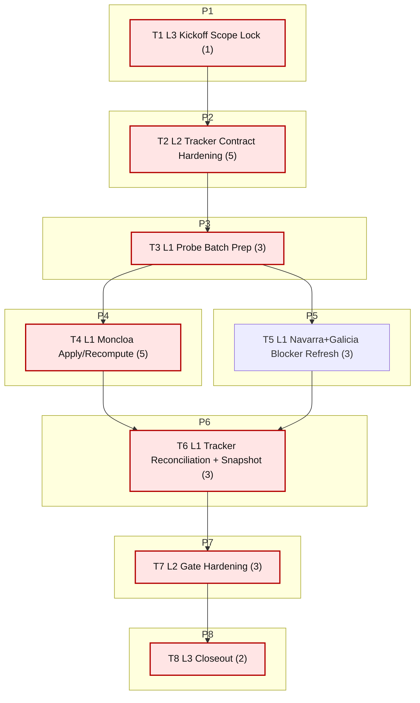

# Sprint AI-OPS-05 Prompt Pack

Repository root:
- `/Users/jesus/Library/CloudStorage/GoogleDrive-gsus123456@gmail.com/My Drive/CdC/Obsidian Vault/vota-con-la-chola`

Sprint scope (single bottleneck class):
- Operational truth reconciliation for source tracking and dashboard parity
- Focus rows/sources: `Accion ejecutiva (Consejo de Ministros)`, `Parlamento de Navarra`, `Parlamento de Galicia`, `moncloa_*`

Sprint objective:
- Close AI-OPS-04 carryover by reconciling tracker + SQL + dashboard status for Moncloa and blocked sources, then harden gates so this drift cannot silently recur.

Baseline snapshot (2026-02-16):
- `fk_violations = 0`
- `policy_events_total = 28` and `policy_events_moncloa = 28`
- Tracker row `Accion ejecutiva (Consejo de Ministros)` is still `TODO`
- Tracker counts: `DONE=29`, `PARTIAL=4`, `TODO=21`
- `just etl-tracker-status`: `mismatches=1` (`parlamento_navarra_parlamentarios_forales`)
- Moncloa ingest metrics: `moncloa_referencias max_net=0 max_any=20`, `moncloa_rss_referencias max_net=0 max_any=8`
- Analytics continuity guardrail: `topic_evidence_declared_with_signal=202/614 (32.90%)`, `topic_positions_total=137379`

Bottleneck class:
- `pipeline bottleneck`

Workload balance:
- total points: `25`
- `L1 = 14 pts (56.0%)`
- `L2 = 8 pts (32.0%)`
- `L3 = 3 pts (12.0%)`
- `L1 task share = 4/8 (50%)`

WIP limits:
- `L3 max 1`
- `L2 max 2`
- `L1 max 6`

1. Agent: L3 Orchestrator (1 pt)
- `depends_on: []`
- `parallel_group: P1`
- `model_lane: HI`
```text
goal:
Lock AI-OPS-05 scope and acceptance gates using live baseline evidence.

repository:
/Users/jesus/Library/CloudStorage/GoogleDrive-gsus123456@gmail.com/My Drive/CdC/Obsidian Vault/vota-con-la-chola

objective:
Freeze the exact PASS/FAIL gates for tracker reconciliation sprint before implementation work starts.

inputs:
- docs/roadmap.md
- docs/roadmap-tecnico.md
- docs/etl/e2e-scrape-load-tracker.md
- docs/etl/sprints/AI-OPS-04/closeout.md
- docs/gh-pages/explorer-sources/data/status.json
- sqlite3 etl/data/staging/politicos-es.db

tasks:
1) Run kickoff baseline commands:
- just etl-tracker-status
- sqlite3 etl/data/staging/politicos-es.db "SELECT COUNT(*) FROM pragma_foreign_key_check;"
- sqlite3 etl/data/staging/politicos-es.db "SELECT COUNT(*) FROM policy_events WHERE source_id LIKE 'moncloa_%';"
- rg -n "Accion ejecutiva \(Consejo de Ministros\)|Parlamento de Navarra|Parlamento de Galicia" docs/etl/e2e-scrape-load-tracker.md
2) Freeze AI-OPS-05 must-pass gates and dependency order.
3) Write kickoff artifact.

output_contract:
- docs/etl/sprints/AI-OPS-05/kickoff.md with baseline outputs, gates, and execution order.

acceptance_query:
- test -f docs/etl/sprints/AI-OPS-05/kickoff.md
- rg -n "mismatches|policy_events_moncloa|fk_violations|Gate" docs/etl/sprints/AI-OPS-05/kickoff.md

escalation_rule:
- escalate only if DB or tracker file is missing/unreadable.

depends_on:
- none

parallel_group:
- P1

artifact_path:
- docs/etl/sprints/AI-OPS-05/kickoff.md
```

2. Agent: L2 Specialist Builder (5 pts)
- `depends_on: [1]`
- `parallel_group: P2`
- `model_lane: HI`
```text
goal:
Implement tracker-source mapping and blocked-aware status semantics so tracker checks reflect current operational truth.

repository:
/Users/jesus/Library/CloudStorage/GoogleDrive-gsus123456@gmail.com/My Drive/CdC/Obsidian Vault/vota-con-la-chola

objective:
Remove false status drift by aligning e2e tracker checker + dashboard mapping with Moncloa rows and blocked-source behavior.

inputs:
- scripts/e2e_tracker_status.py
- scripts/graph_ui_server.py
- docs/etl/e2e-scrape-load-tracker.md
- docs/etl/sprints/AI-OPS-04/reports/moncloa-tracker-row-draft.md

tasks:
1) Extend tracker-source hints so `Accion ejecutiva (Consejo de Ministros)` maps to:
- moncloa_referencias
- moncloa_rss_referencias
2) Add blocked-aware status guard in tracker checker:
- when tracker row is explicitly blocked and latest loaded is zero, avoid auto-promoting to `DONE` based only on historical network max.
3) Keep status derivation deterministic and documented in code comments.
4) Add focused tests for:
- Moncloa tracker row mapping.
- Navarra blocked-row status behavior.
5) Write implementation report with before/after mismatch table.

output_contract:
- code updates in scripts/e2e_tracker_status.py and scripts/graph_ui_server.py
- tests under tests/ covering new mapping/status logic
- docs/etl/sprints/AI-OPS-05/reports/tracker-contract-hardening.md

acceptance_query:
- python3 -m unittest discover -s tests -p 'test*tracker*py'
- python3 scripts/e2e_tracker_status.py --db etl/data/staging/politicos-es.db --tracker docs/etl/e2e-scrape-load-tracker.md
- rg -n "moncloa|blocked|mismatch" docs/etl/sprints/AI-OPS-05/reports/tracker-contract-hardening.md

escalation_rule:
- if blocked-aware rule risks regressing DONE sources, escalate with a diff of affected source_ids before merge.

depends_on:
- 1

parallel_group:
- P2

artifact_path:
- docs/etl/sprints/AI-OPS-05/reports/tracker-contract-hardening.md
```

3. Agent: L1 Mechanical Executor (3 pts)
- `depends_on: [2]`
- `parallel_group: P3`
- `model_lane: FAST`
```text
goal:
Prepare deterministic probe matrix for Moncloa/Navarra/Galicia evidence refresh.

repository:
/Users/jesus/Library/CloudStorage/GoogleDrive-gsus123456@gmail.com/My Drive/CdC/Obsidian Vault/vota-con-la-chola

objective:
Create a reproducible command and artifact batch so throughput tasks run without ambiguity.

inputs:
- docs/etl/sprints/AI-OPS-04/reports/moncloa-ingest-matrix.md
- docs/etl/e2e-scrape-load-tracker.md
- etl/data/raw/manual/

tasks:
1) Create batch folder:
- docs/etl/sprints/AI-OPS-05/evidence/probe-matrix-2026-02-16/
2) Prepare exact command matrix for each source and mode:
- strict-network probe
- from-file replay
3) Pre-create evidence capture files for stdout/stderr and SQL snapshots.
4) Write batch prep report with source->command->artifact mapping.

output_contract:
- docs/etl/sprints/AI-OPS-05/reports/probe-batch-prep.md
- docs/etl/sprints/AI-OPS-05/evidence/probe-matrix-2026-02-16/*

acceptance_query:
- test -d docs/etl/sprints/AI-OPS-05/evidence/probe-matrix-2026-02-16
- rg -n "strict-network|from-file|moncloa|navarra|galicia" docs/etl/sprints/AI-OPS-05/reports/probe-batch-prep.md

escalation_rule:
- if no reproducible from-file asset exists for a source, record as explicit blocker and continue with remaining sources.

depends_on:
- 2

parallel_group:
- P3

artifact_path:
- docs/etl/sprints/AI-OPS-05/reports/probe-batch-prep.md
```

4. Agent: L1 Mechanical Executor (5 pts)
- `depends_on: [3]`
- `parallel_group: P4`
- `model_lane: FAST`
```text
goal:
Run Moncloa apply/recompute loop and refresh policy_events evidence.

repository:
/Users/jesus/Library/CloudStorage/GoogleDrive-gsus123456@gmail.com/My Drive/CdC/Obsidian Vault/vota-con-la-chola

objective:
Reconfirm Moncloa ingest reproducibility and ensure policy_events traceability remains complete after reconciliation work.

inputs:
- docs/etl/sprints/AI-OPS-05/reports/probe-batch-prep.md
- etl/data/raw/manual/moncloa_exec/
- scripts/ingestar_politicos_es.py
- justfile (`etl-backfill-policy-events-moncloa`)

tasks:
1) Run strict-network probes for:
- moncloa_referencias
- moncloa_rss_referencias
2) Run from-file replay commands for both Moncloa sources.
3) Run policy-events backfill:
- just etl-backfill-policy-events-moncloa
4) Capture before/after metrics:
- ingestion_runs rows for moncloa_*
- policy_events moncloa total + traceability fields coverage
5) Write apply/recompute report.

output_contract:
- docs/etl/sprints/AI-OPS-05/reports/moncloa-apply-recompute.md
- command logs in docs/etl/sprints/AI-OPS-05/evidence/probe-matrix-2026-02-16/

acceptance_query:
- sqlite3 etl/data/staging/politicos-es.db "SELECT source_id, records_loaded FROM ingestion_runs WHERE source_id LIKE 'moncloa_%' ORDER BY run_id DESC LIMIT 8;"
- sqlite3 etl/data/staging/politicos-es.db "SELECT COUNT(*) FROM policy_events WHERE source_id LIKE 'moncloa_%';"
- rg -n "strict-network|from-file|policy_events|traceability" docs/etl/sprints/AI-OPS-05/reports/moncloa-apply-recompute.md

escalation_rule:
- if policy_events_moncloa decreases vs baseline (28), escalate immediately with SQL diff evidence.

depends_on:
- 3

parallel_group:
- P4

artifact_path:
- docs/etl/sprints/AI-OPS-05/reports/moncloa-apply-recompute.md
```

5. Agent: L1 Mechanical Executor (3 pts)
- `depends_on: [3]`
- `parallel_group: P5`
- `model_lane: FAST`
```text
goal:
Refresh blocker evidence for Navarra and Galicia without forcing false DONE transitions.

repository:
/Users/jesus/Library/CloudStorage/GoogleDrive-gsus123456@gmail.com/My Drive/CdC/Obsidian Vault/vota-con-la-chola

objective:
Produce fresh, reproducible blocker evidence that supports PARTIAL status and avoids ambiguous mismatch interpretation.

inputs:
- docs/etl/e2e-scrape-load-tracker.md
- scripts/ingestar_politicos_es.py
- existing manual capture folders for navarra/galicia (if available)

tasks:
1) Run strict-network probes for:
- parlamento_navarra_parlamentarios_forales
- parlamento_galicia_deputados
2) Run from-file replay where local captures exist.
3) Capture per-source summary:
- runs_ok/total
- max_net, max_any, last_loaded
- current blocker signature (403/challenge/WAF)
4) Write blocker evidence report.

output_contract:
- docs/etl/sprints/AI-OPS-05/reports/navarra-galicia-blocker-refresh.md
- probe logs in docs/etl/sprints/AI-OPS-05/evidence/probe-matrix-2026-02-16/

acceptance_query:
- rg -n "navarra|galicia|strict-network|403|challenge|max_net|last_loaded" docs/etl/sprints/AI-OPS-05/reports/navarra-galicia-blocker-refresh.md

escalation_rule:
- if either source unexpectedly gets stable strict-network success, escalate to L2 to reassess tracker status transition criteria.

depends_on:
- 3

parallel_group:
- P5

artifact_path:
- docs/etl/sprints/AI-OPS-05/reports/navarra-galicia-blocker-refresh.md
```

6. Agent: L1 Mechanical Executor (3 pts)
- `depends_on: [4,5]`
- `parallel_group: P6`
- `model_lane: FAST`
```text
goal:
Apply tracker reconciliation edits and publish updated status snapshot evidence.

repository:
/Users/jesus/Library/CloudStorage/GoogleDrive-gsus123456@gmail.com/My Drive/CdC/Obsidian Vault/vota-con-la-chola

objective:
Close the docs-vs-sql truth gap by updating tracker rows with evidence-backed wording and validating status outputs.

inputs:
- docs/etl/sprints/AI-OPS-04/reports/moncloa-tracker-row-draft.md
- docs/etl/sprints/AI-OPS-05/reports/moncloa-apply-recompute.md
- docs/etl/sprints/AI-OPS-05/reports/navarra-galicia-blocker-refresh.md
- docs/etl/e2e-scrape-load-tracker.md
- scripts/export_explorer_sources_snapshot.py

tasks:
1) Update tracker row `Accion ejecutiva (Consejo de Ministros)` from `TODO` -> evidence-backed `PARTIAL`.
2) Refresh blocker text for Navarra/Galicia rows using new evidence (keep status truthful).
3) Re-export sources snapshot:
- python3 scripts/export_explorer_sources_snapshot.py --db etl/data/staging/politicos-es.db --out docs/gh-pages/explorer-sources/data/status.json
4) Run reconciliation checks:
- just etl-tracker-status
- python3 scripts/e2e_tracker_status.py --db etl/data/staging/politicos-es.db --tracker docs/etl/e2e-scrape-load-tracker.md --fail-on-mismatch
5) Write tracker reconciliation evidence report.

output_contract:
- updated docs/etl/e2e-scrape-load-tracker.md
- refreshed docs/gh-pages/explorer-sources/data/status.json
- docs/etl/sprints/AI-OPS-05/evidence/tracker-reconciliation.md

acceptance_query:
- rg -n "Accion ejecutiva \(Consejo de Ministros\).*PARTIAL" docs/etl/e2e-scrape-load-tracker.md
- python3 scripts/e2e_tracker_status.py --db etl/data/staging/politicos-es.db --tracker docs/etl/e2e-scrape-load-tracker.md --fail-on-mismatch
- jq '.summary.tracker' docs/gh-pages/explorer-sources/data/status.json

escalation_rule:
- if mismatch remains after edits, escalate with exact source_id list and per-source metrics table.

depends_on:
- 4
- 5

parallel_group:
- P6

artifact_path:
- docs/etl/sprints/AI-OPS-05/evidence/tracker-reconciliation.md
```

7. Agent: L2 Specialist Builder (3 pts)
- `depends_on: [6]`
- `parallel_group: P7`
- `model_lane: HI`
```text
goal:
Harden the default tracker gate so reconciliation drift fails fast.

repository:
/Users/jesus/Library/CloudStorage/GoogleDrive-gsus123456@gmail.com/My Drive/CdC/Obsidian Vault/vota-con-la-chola

objective:
Promote mismatch detection to standard operational gate once reconciliation is green.

inputs:
- justfile
- scripts/e2e_tracker_status.py
- docs/etl/sprints/AI-OPS-05/evidence/tracker-reconciliation.md

tasks:
1) Update `just etl-tracker-gate` to include mismatch failure mode (or add strict variant and wire docs to use it by default).
2) Keep backwards-compatible command docs in tracker file and sprint report.
3) Add/adjust tests if command behavior changed.
4) Write gate-hardening report with command outputs.

output_contract:
- updated justfile gate target(s)
- optional test updates
- docs/etl/sprints/AI-OPS-05/reports/tracker-gate-hardening.md

acceptance_query:
- rg -n "etl-tracker-gate|fail-on-mismatch" justfile
- just etl-tracker-gate
- rg -n "mismatch|gate" docs/etl/sprints/AI-OPS-05/reports/tracker-gate-hardening.md

escalation_rule:
- if strict gate breaks on unresolved upstream volatility, propose a scoped allowlist and require L3 approval before merge.

depends_on:
- 6

parallel_group:
- P7

artifact_path:
- docs/etl/sprints/AI-OPS-05/reports/tracker-gate-hardening.md
```

8. Agent: L3 Orchestrator (2 pts)
- `depends_on: [7]`
- `parallel_group: P8`
- `model_lane: HI`
```text
goal:
Run AI-OPS-05 closeout and issue PASS/FAIL decision.

repository:
/Users/jesus/Library/CloudStorage/GoogleDrive-gsus123456@gmail.com/My Drive/CdC/Obsidian Vault/vota-con-la-chola

objective:
Confirm all mandatory gates are green and publish explicit carryover only if a gate fails.

inputs:
- docs/etl/sprints/AI-OPS-05/kickoff.md
- docs/etl/sprints/AI-OPS-05/reports/*.md
- docs/etl/sprints/AI-OPS-05/evidence/*.md
- docs/etl/e2e-scrape-load-tracker.md
- docs/gh-pages/explorer-sources/data/status.json

tasks:
1) Evaluate gates:
- G1 data integrity: fk check = 0
- G2 queue health: topic_evidence_reviews_pending = 0 (no regression)
- G3 signal/coverage guard: declared_with_signal_pct not lower than kickoff baseline
- G4 explainability visibility: Moncloa tracker status appears in explorer-sources payload
- G5 tracker reconciliation: etl-tracker-status mismatches = 0
- G6 workload balance: L1 majority throughput evidence present
2) Decide PASS/FAIL.
3) Write closeout with evidence commands and carryover table (if needed).

output_contract:
- docs/etl/sprints/AI-OPS-05/closeout.md

acceptance_query:
- test -f docs/etl/sprints/AI-OPS-05/closeout.md
- rg -n "PASS|FAIL|G1|G2|G3|G4|G5|G6" docs/etl/sprints/AI-OPS-05/closeout.md

escalation_rule:
- if any gate fails, do not mark PASS; open carryover with owner, first command, and blocker evidence.

depends_on:
- 7

parallel_group:
- P8

artifact_path:
- docs/etl/sprints/AI-OPS-05/closeout.md
```

## Critical Path

Ordered critical path tasks:
1. T1 (1 pt)
2. T2 (5 pts)
3. T3 (3 pts)
4. T4 (5 pts)
5. T6 (3 pts)
6. T7 (3 pts)
7. T8 (2 pts)

Total critical-path points: **22**

## Parallel Plan

- `P1`: T1 starts immediately.
- `P2`: T2 starts after T1.
- `P3`: T3 starts after T2.
- `P4` and `P5` can start in parallel after T3:
  - `P4`: T4 (Moncloa apply/recompute)
  - `P5`: T5 (Navarra/Galicia blocker refresh)
- `P6`: T6 starts after T4 + T5.
- `P7`: T7 starts after T6.
- `P8`: T8 starts after T7.

What can start immediately:
- T1 only.

What starts after dependencies:
- T2..T8 per chain above; T4/T5 are the primary parallel window.

## Queue Waves

- `HI Wave 1`: T1 -> T2
- `FAST Wave 2`: T3 -> T4 + T5 -> T6
- `HI Wave 3`: T7 -> T8

Lane switches count:
- `2` (`HI -> FAST -> HI`)

Estimated tasks-per-switch ratio:
- `8 tasks / 2 switches = 4.0`

## Flow Diagram (Mermaid, vertical)



## Folder Layout

```text
docs/etl/sprints/AI-OPS-05/
├── sprint-ai-agents.md
├── kickoff.md
├── closeout.md
├── reports/
│   ├── tracker-contract-hardening.md
│   ├── probe-batch-prep.md
│   ├── moncloa-apply-recompute.md
│   ├── navarra-galicia-blocker-refresh.md
│   └── tracker-gate-hardening.md
├── evidence/
│   ├── probe-matrix-2026-02-16/
│   └── tracker-reconciliation.md
└── exports/
    └── .gitkeep
```
