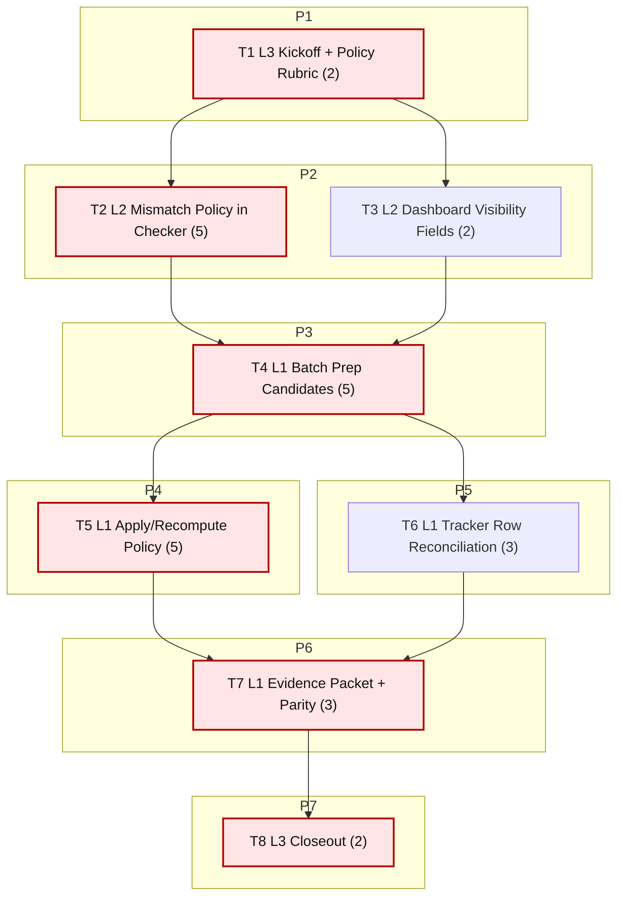

# Sprint AI-OPS-06 Prompt Pack

Repository root:
- `/Users/jesus/Library/CloudStorage/GoogleDrive-gsus123456@gmail.com/My Drive/CdC/Obsidian Vault/vota-con-la-chola`

Sprint scope (single bottleneck class):
- Tracker/SQL contract reconciliation and strict gate recovery
- Focus rows/sources: `moncloa_referencias`, `moncloa_rss_referencias`, `parlamento_navarra_parlamentarios_forales`, `parlamento_galicia_deputados`

Sprint objective:
- Turn strict tracker gate green (`mismatches=0`, `done_zero_real=0`) without hiding blocked-source reality, and close AI-OPS-05 carryover with explicit contract semantics.

Assessment baseline (2026-02-16, live):
- `just etl-tracker-status`: `mismatches=3`, `done_zero_real=0`, `tracker_sources=30`, `sources_in_db=32`
- Mismatch rows:
  - `moncloa_referencias` (`checklist=PARTIAL`, `sql=DONE`)
  - `moncloa_rss_referencias` (`checklist=PARTIAL`, `sql=DONE`)
  - `parlamento_navarra_parlamentarios_forales` (`checklist=PARTIAL`, `sql=DONE`)
- `just etl-tracker-gate`: failing (exit code 1) due mismatches
- Integrity remains green: `fk_violations=0`
- Action continuity remains green: `policy_events_moncloa=28`
- Queue continuity remains green: `topic_evidence_reviews_pending=0`, declared signal baseline `202/614`

Bottleneck class:
- `pipeline bottleneck`

Workload balance:
- total points: `27`
- `L1 = 16 pts (59.3%)`
- `L2 = 7 pts (25.9%)`
- `L3 = 4 pts (14.8%)`
- `L1 task share = 4/8 (50%)`

WIP limits:
- `L3 max 1`
- `L2 max 2`
- `L1 max 6`

1. Agent: L3 Orchestrator (2 pts)
- `depends_on: []`
- `parallel_group: P1`
- `model_lane: HI`
```text
goal:
Lock AI-OPS-06 scope and decision policy for mismatch handling before implementation.

repository:
/Users/jesus/Library/CloudStorage/GoogleDrive-gsus123456@gmail.com/My Drive/CdC/Obsidian Vault/vota-con-la-chola

objective:
Freeze PASS/FAIL gates and approve the mismatch policy path so L2/L1 tasks execute deterministically.

inputs:
- docs/roadmap.md
- docs/roadmap-tecnico.md
- docs/etl/e2e-scrape-load-tracker.md
- docs/etl/sprints/AI-OPS-05/closeout.md
- docs/etl/sprints/AI-OPS-05/reports/tracker-gate-hardening.md
- docs/gh-pages/explorer-sources/data/status.json

tasks:
1) Run baseline commands:
- just etl-tracker-status
- just etl-tracker-gate || true
- sqlite3 etl/data/staging/politicos-es.db "SELECT COUNT(*) AS fk_violations FROM pragma_foreign_key_check;"
2) Freeze decision rubric for mismatch handling:
- when to reconcile tracker row status,
- when to allow temporary waiver,
- expiry/owner requirements for waivers.
3) Write kickoff artifact.

output_contract:
- docs/etl/sprints/AI-OPS-06/kickoff.md with baseline outputs, decision rubric, and ordered gates.

acceptance_query:
- test -f docs/etl/sprints/AI-OPS-06/kickoff.md
- rg -n "mismatches|done_zero_real|decision rubric|Gate" docs/etl/sprints/AI-OPS-06/kickoff.md

escalation_rule:
- escalate only if baseline artifacts are missing/unreadable.

depends_on:
- none

parallel_group:
- P1

artifact_path:
- docs/etl/sprints/AI-OPS-06/kickoff.md
```

2. Agent: L2 Specialist Builder (5 pts)
- `depends_on: [1]`
- `parallel_group: P2`
- `model_lane: HI`
```text
goal:
Implement explicit mismatch-policy contract in tracker checker with strict auditability.

repository:
/Users/jesus/Library/CloudStorage/GoogleDrive-gsus123456@gmail.com/My Drive/CdC/Obsidian Vault/vota-con-la-chola

objective:
Support deterministic, expiring mismatch waivers (if approved) so strict gate fails only on unwaived mismatches.

inputs:
- scripts/e2e_tracker_status.py
- docs/etl/sprints/AI-OPS-05/reports/tracker-gate-hardening.md
- docs/etl/e2e-scrape-load-tracker.md

tasks:
1) Add mismatch-policy input contract (e.g. JSON under sprint evidence or repo-level config):
- source_id
- reason
- owner
- expires_on
2) Update checker output to distinguish:
- `MISMATCH`
- `WAIVED_MISMATCH`
3) Keep strict fail behavior for:
- unwaived mismatches
- expired waivers
- `DONE_ZERO_REAL`
4) Add focused tests for waiver parsing, expiry handling, and fail behavior.
5) Write implementation report with before/after gate behavior.

output_contract:
- updated scripts/e2e_tracker_status.py
- new/updated tests under tests/
- docs/etl/sprints/AI-OPS-06/reports/mismatch-policy-implementation.md

acceptance_query:
- python3 -m unittest discover -s tests -p 'test*tracker*py'
- python3 scripts/e2e_tracker_status.py --db etl/data/staging/politicos-es.db --tracker docs/etl/e2e-scrape-load-tracker.md
- rg -n "WAIVED_MISMATCH|expires_on|fail-on-mismatch" docs/etl/sprints/AI-OPS-06/reports/mismatch-policy-implementation.md

escalation_rule:
- if waiver model weakens `DONE_ZERO_REAL` enforcement, stop and escalate with failing test evidence.

depends_on:
- 1

parallel_group:
- P2

artifact_path:
- docs/etl/sprints/AI-OPS-06/reports/mismatch-policy-implementation.md
```

3. Agent: L2 Specialist Builder (2 pts)
- `depends_on: [1]`
- `parallel_group: P2`
- `model_lane: HI`
```text
goal:
Expose mismatch-policy visibility in explorer-sources payload for operational transparency.

repository:
/Users/jesus/Library/CloudStorage/GoogleDrive-gsus123456@gmail.com/My Drive/CdC/Obsidian Vault/vota-con-la-chola

objective:
Ensure waived vs unwaived mismatch state is visible in published status artifacts.

inputs:
- scripts/graph_ui_server.py
- scripts/export_explorer_sources_snapshot.py
- docs/gh-pages/explorer-sources/data/status.json

tasks:
1) Extend sources payload fields for tracker/sql reconciliation transparency:
- mismatch_state
- mismatch_waived (bool)
- waiver_expiry (if any)
2) Keep payload backward-compatible.
3) Add/update focused tests around payload fields.
4) Write report with payload diff sample.

output_contract:
- updated scripts/graph_ui_server.py (and tests if needed)
- docs/etl/sprints/AI-OPS-06/reports/mismatch-policy-dashboard-visibility.md

acceptance_query:
- python3 scripts/export_explorer_sources_snapshot.py --db etl/data/staging/politicos-es.db --out /tmp/aiops06-status.json
- jq '.sources[] | select(.source_id=="moncloa_referencias") | {source_id, tracker: .tracker.status, sql_status, mismatch_state, mismatch_waived, waiver_expiry}' /tmp/aiops06-status.json
- rg -n "mismatch_state|mismatch_waived|waiver_expiry" docs/etl/sprints/AI-OPS-06/reports/mismatch-policy-dashboard-visibility.md

escalation_rule:
- if payload changes break existing expected keys, add compatibility shim before merging.

depends_on:
- 1

parallel_group:
- P2

artifact_path:
- docs/etl/sprints/AI-OPS-06/reports/mismatch-policy-dashboard-visibility.md
```

4. Agent: L1 Mechanical Executor (5 pts)
- `depends_on: [2,3]`
- `parallel_group: P3`
- `model_lane: FAST`
```text
goal:
Batch-prep mismatch candidate matrix and waiver proposal packets from live evidence.

repository:
/Users/jesus/Library/CloudStorage/GoogleDrive-gsus123456@gmail.com/My Drive/CdC/Obsidian Vault/vota-con-la-chola

objective:
Create deterministic input packets so apply/reconcile work is repeatable and auditable.

inputs:
- just etl-tracker-status output
- docs/etl/e2e-scrape-load-tracker.md
- docs/etl/sprints/AI-OPS-05/evidence/tracker-reconciliation.md
- ingestion_runs/run_fetches from SQLite

tasks:
1) Build `mismatch_candidates.csv` with columns:
- source_id, checklist_status, sql_status, runs_ok_total, max_net, max_any, last_loaded, blocker_note
2) Build `waiver_candidates.csv` with proposal fields:
- source_id, reason, owner, expires_on, evidence_path
3) Attach supporting SQL extracts and command logs.
4) Write batch-prep report.

output_contract:
- docs/etl/sprints/AI-OPS-06/exports/mismatch_candidates.csv
- docs/etl/sprints/AI-OPS-06/exports/waiver_candidates.csv
- docs/etl/sprints/AI-OPS-06/reports/mismatch-batch-prep.md

acceptance_query:
- test -f docs/etl/sprints/AI-OPS-06/exports/mismatch_candidates.csv
- test -f docs/etl/sprints/AI-OPS-06/exports/waiver_candidates.csv
- rg -n "source_id,checklist_status,sql_status|expires_on|owner" docs/etl/sprints/AI-OPS-06/exports/*.csv

escalation_rule:
- if a mismatch source lacks reproducible evidence pointers, flag as unresolved and keep out of apply set.

depends_on:
- 2
- 3

parallel_group:
- P3

artifact_path:
- docs/etl/sprints/AI-OPS-06/reports/mismatch-batch-prep.md
```

5. Agent: L1 Mechanical Executor (5 pts)
- `depends_on: [4]`
- `parallel_group: P4`
- `model_lane: FAST`
```text
goal:
Apply/recompute mismatch policy and rerun strict gate matrix.

repository:
/Users/jesus/Library/CloudStorage/GoogleDrive-gsus123456@gmail.com/My Drive/CdC/Obsidian Vault/vota-con-la-chola

objective:
Execute approved reconciliation path and verify strict gate behavior across normal and mismatch-fail modes.

inputs:
- docs/etl/sprints/AI-OPS-06/exports/mismatch_candidates.csv
- docs/etl/sprints/AI-OPS-06/exports/waiver_candidates.csv
- implemented mismatch-policy contract from T2

tasks:
1) Materialize approved waiver file (if any) with expiry and owner.
2) Run checker matrix:
- baseline checker
- strict gate (`just etl-tracker-gate`)
- explicit mismatch fail path
- legacy gate (`just etl-tracker-gate-legacy`)
3) Capture before/after mismatch and done_zero_real counts.
4) Write apply/recompute report with exact command outputs.

output_contract:
- docs/etl/sprints/AI-OPS-06/evidence/mismatch-policy-applied.json (or equivalent policy file)
- docs/etl/sprints/AI-OPS-06/reports/mismatch-policy-apply-recompute.md
- command logs under docs/etl/sprints/AI-OPS-06/evidence/

acceptance_query:
- test -f docs/etl/sprints/AI-OPS-06/reports/mismatch-policy-apply-recompute.md
- rg -n "mismatches:|done_zero_real:|WAIVED_MISMATCH|FAIL" docs/etl/sprints/AI-OPS-06/reports/mismatch-policy-apply-recompute.md
- just etl-tracker-gate

escalation_rule:
- if strict gate still fails on unwaived mismatches, escalate with exact source_id list and supporting logs.

depends_on:
- 4

parallel_group:
- P4

artifact_path:
- docs/etl/sprints/AI-OPS-06/reports/mismatch-policy-apply-recompute.md
```

6. Agent: L1 Mechanical Executor (3 pts)
- `depends_on: [4]`
- `parallel_group: P5`
- `model_lane: FAST`
```text
goal:
Reconcile tracker row wording with applied policy and current evidence.

repository:
/Users/jesus/Library/CloudStorage/GoogleDrive-gsus123456@gmail.com/My Drive/CdC/Obsidian Vault/vota-con-la-chola

objective:
Keep tracker human truth aligned with policy outcome (no stale blocker text, explicit next command).

inputs:
- docs/etl/e2e-scrape-load-tracker.md
- docs/etl/sprints/AI-OPS-06/exports/mismatch_candidates.csv
- docs/etl/sprints/AI-OPS-06/reports/mismatch-policy-apply-recompute.md

tasks:
1) Update only affected rows:
- Accion ejecutiva (Consejo de Ministros)
- Parlamento de Navarra
- Parlamento de Galicia (if needed by evidence drift)
2) Ensure each row includes:
- done now
- current blocker (if any)
- one deterministic next command
3) Keep wording tied to evidence files.
4) Write tracker reconciliation report.

output_contract:
- updated docs/etl/e2e-scrape-load-tracker.md
- docs/etl/sprints/AI-OPS-06/evidence/tracker-row-reconciliation.md

acceptance_query:
- rg -n "Accion ejecutiva \(Consejo de Ministros\)|Parlamento de Navarra|Parlamento de Galicia" docs/etl/e2e-scrape-load-tracker.md
- rg -n "Siguiente comando" docs/etl/sprints/AI-OPS-06/evidence/tracker-row-reconciliation.md

escalation_rule:
- if row status cannot be justified from evidence, keep row unchanged and mark unresolved in report.

depends_on:
- 4

parallel_group:
- P5

artifact_path:
- docs/etl/sprints/AI-OPS-06/evidence/tracker-row-reconciliation.md
```

7. Agent: L1 Mechanical Executor (3 pts)
- `depends_on: [5,6]`
- `parallel_group: P6`
- `model_lane: FAST`
```text
goal:
Publish final reconciliation evidence packet and snapshot parity proof.

repository:
/Users/jesus/Library/CloudStorage/GoogleDrive-gsus123456@gmail.com/My Drive/CdC/Obsidian Vault/vota-con-la-chola

objective:
Produce one reproducible packet proving strict gate pass/fail outcome and dashboard parity.

inputs:
- docs/etl/sprints/AI-OPS-06/reports/mismatch-policy-apply-recompute.md
- docs/etl/sprints/AI-OPS-06/evidence/tracker-row-reconciliation.md
- scripts/export_explorer_sources_snapshot.py

tasks:
1) Refresh status snapshot export.
2) Validate parity for mismatch sources in JSON payload.
3) Build final evidence packet with:
- command list
- log paths
- final mismatch counts
- final gate exit codes
4) Write evidence summary.

output_contract:
- refreshed docs/gh-pages/explorer-sources/data/status.json
- docs/etl/sprints/AI-OPS-06/evidence/reconciliation-evidence-packet.md

acceptance_query:
- python3 scripts/export_explorer_sources_snapshot.py --db etl/data/staging/politicos-es.db --out docs/gh-pages/explorer-sources/data/status.json
- jq '.summary.sql,.summary.tracker' docs/gh-pages/explorer-sources/data/status.json
- rg -n "final mismatches|gate exit code|parity" docs/etl/sprints/AI-OPS-06/evidence/reconciliation-evidence-packet.md

escalation_rule:
- if export parity diverges from checker output, escalate with field-level mismatch table.

depends_on:
- 5
- 6

parallel_group:
- P6

artifact_path:
- docs/etl/sprints/AI-OPS-06/evidence/reconciliation-evidence-packet.md
```

8. Agent: L3 Orchestrator (2 pts)
- `depends_on: [7]`
- `parallel_group: P7`
- `model_lane: HI`
```text
goal:
Run AI-OPS-06 closeout and issue PASS/FAIL with explicit carryover.

repository:
/Users/jesus/Library/CloudStorage/GoogleDrive-gsus123456@gmail.com/My Drive/CdC/Obsidian Vault/vota-con-la-chola

objective:
Close the contract loop: strict gate behavior is explicit, auditable, and stable.

inputs:
- docs/etl/sprints/AI-OPS-06/kickoff.md
- docs/etl/sprints/AI-OPS-06/reports/*.md
- docs/etl/sprints/AI-OPS-06/evidence/*.md
- docs/etl/e2e-scrape-load-tracker.md
- docs/gh-pages/explorer-sources/data/status.json

tasks:
1) Evaluate gates:
- G1 `fk_violations=0`
- G2 `topic_evidence_reviews_pending=0`
- G3 strict gate result documented and policy-consistent
- G4 unwaived mismatches = 0
- G5 tracker row wording reconciled with evidence
- G6 L1 majority throughput evidence present
2) Decide PASS/FAIL.
3) Write closeout with evidence commands and carryover table (if needed).

output_contract:
- docs/etl/sprints/AI-OPS-06/closeout.md

acceptance_query:
- test -f docs/etl/sprints/AI-OPS-06/closeout.md
- rg -n "PASS|FAIL|G1|G2|G3|G4|G5|G6" docs/etl/sprints/AI-OPS-06/closeout.md

escalation_rule:
- if any gate fails, do not mark PASS; open carryover with owner + first command + blocker evidence.

depends_on:
- 7

parallel_group:
- P7

artifact_path:
- docs/etl/sprints/AI-OPS-06/closeout.md
```

## Critical Path

Ordered critical path tasks:
1. T1 (2 pts)
2. T2 (5 pts)
3. T4 (5 pts)
4. T5 (5 pts)
5. T7 (3 pts)
6. T8 (2 pts)

Total critical-path points: **22**

## Parallel Plan

- `P1`: T1 starts immediately.
- `P2`: T2 and T3 start after T1 (parallel HI setup).
- `P3`: T4 starts after T2 + T3.
- `P4` and `P5` start after T4:
  - `P4`: T5 (policy apply/recompute)
  - `P5`: T6 (tracker row reconciliation)
- `P6`: T7 starts after T5 + T6.
- `P7`: T8 starts after T7.

Immediate start:
- T1 only.

After dependency release:
- T2/T3 (parallel), then T5/T6 (parallel).

## Queue Waves

- `HI Wave 1`: T1 -> T2 + T3
- `FAST Wave 2`: T4 -> T5 + T6 -> T7
- `HI Wave 3`: T8

Lane switches count:
- `2` (`HI -> FAST -> HI`)

Estimated tasks-per-switch ratio:
- `8 tasks / 2 switches = 4.0`

## Flow Diagram (Mermaid, vertical)



## Folder Layout

```text
docs/etl/sprints/AI-OPS-06/
├── sprint-ai-agents.md
├── kickoff.md
├── closeout.md
├── reports/
│   ├── mismatch-policy-implementation.md
│   ├── mismatch-policy-dashboard-visibility.md
│   ├── mismatch-batch-prep.md
│   └── mismatch-policy-apply-recompute.md
├── evidence/
│   ├── mismatch-policy-applied.json
│   ├── tracker-row-reconciliation.md
│   └── reconciliation-evidence-packet.md
└── exports/
    ├── .gitkeep
    ├── mismatch_candidates.csv
    └── waiver_candidates.csv
```
