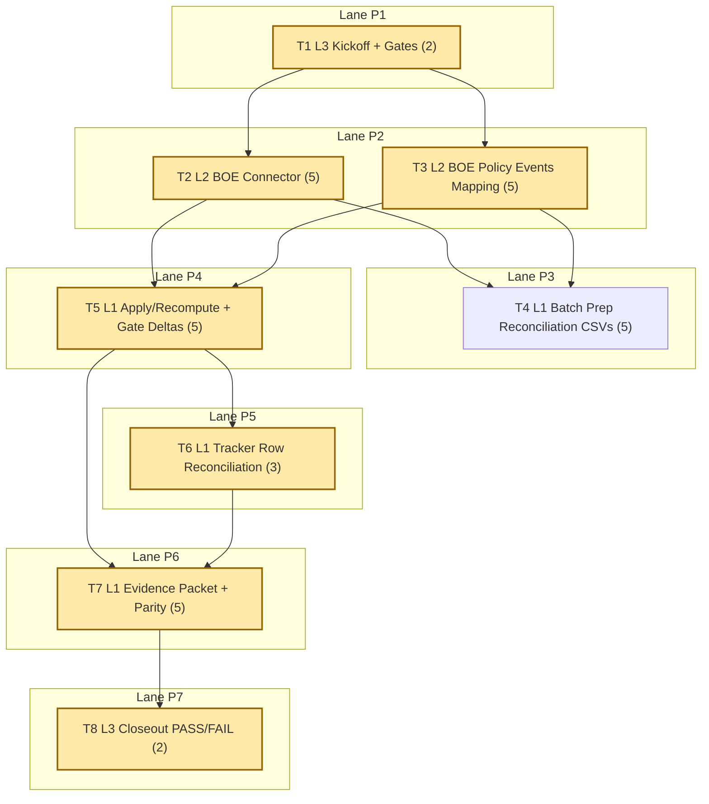

# Sprint AI-OPS-07 Prompt Pack

Repository root:
- `/Users/jesus/Library/CloudStorage/GoogleDrive-gsus123456@gmail.com/My Drive/CdC/Obsidian Vault/vota-con-la-chola`

Sprint scope (single bottleneck class):
- Source bottleneck on executive action validation: Moncloa references are operational but still PARTIAL in tracker pending legal corroboration and waiver burn-down.
- Focus sources/rows: `moncloa_referencias`, `moncloa_rss_referencias`, `parlamento_navarra_parlamentarios_forales`, tracker rows `Accion ejecutiva (Consejo de Ministros)` and `Marco legal electoral`.

Sprint objective:
- Add the minimum BOE legal slice required for Moncloa dual-entry validation, reduce waiver debt before expiry, and leave strict mismatch behavior auditable and reproducible.

Assessment baseline (2026-02-16, live):
- `just etl-tracker-status`:
  - `tracker_sources=30`
  - `sources_in_db=32`
  - `mismatches=3`
  - `waived_mismatches=0`
  - `done_zero_real=0`
- Policy-aware check (`--waivers docs/etl/sprints/AI-OPS-06/evidence/mismatch-policy-applied.json --as-of-date 2026-02-16 --fail-on-mismatch --fail-on-done-zero-real`):
  - `mismatches=0`
  - `waived_mismatches=3`
  - `waivers_active=3`
  - `waivers_expired=0`
- Data integrity and queue:
  - `fk_violations=0`
  - `topic_evidence_reviews_pending=0`
- Current executive coverage:
  - `policy_events_moncloa=28`
  - BOE legal source rows currently absent in `sources` (`source_id/name LIKE '%boe%' => 0 rows`).

Bottleneck class:
- `source bottleneck`

Workload balance:
- total points: `32`
- `L1 = 18 pts (56.25%)`
- `L2 = 10 pts (31.25%)`
- `L3 = 4 pts (12.50%)`
- `L1 task share = 4/8 (50%)`

WIP limits:
- `L3 max 1`
- `L2 max 2`
- `L1 max 6`

1. Agent: L3 Orchestrator (2 pts)
- `depends_on: []`
- `parallel_group: P1`
- `model_lane: HI`
```text
goal:
Lock AI-OPS-07 baseline and gates for Moncloa-BOE dual-entry validation plus waiver burn-down.

repository:
/Users/jesus/Library/CloudStorage/GoogleDrive-gsus123456@gmail.com/My Drive/CdC/Obsidian Vault/vota-con-la-chola

objective:
Freeze PASS/FAIL conditions and execution order so L2/L1 can run deterministically with no gate ambiguity.

inputs:
- docs/roadmap.md
- docs/roadmap-tecnico.md
- docs/etl/e2e-scrape-load-tracker.md
- docs/etl/sprints/AI-OPS-06/closeout.md
- docs/gh-pages/explorer-sources/data/status.json
- sqlite3 etl/data/staging/politicos-es.db

tasks:
1) Run kickoff baseline commands:
- just etl-tracker-status
- just etl-tracker-gate || true
- python3 scripts/e2e_tracker_status.py --db etl/data/staging/politicos-es.db --tracker docs/etl/e2e-scrape-load-tracker.md --waivers docs/etl/sprints/AI-OPS-06/evidence/mismatch-policy-applied.json --as-of-date 2026-02-16 --fail-on-mismatch --fail-on-done-zero-real
- sqlite3 etl/data/staging/politicos-es.db "SELECT COUNT(*) AS fk_violations FROM pragma_foreign_key_check;"
- sqlite3 etl/data/staging/politicos-es.db "SELECT COUNT(*) AS topic_evidence_reviews_pending FROM topic_evidence_reviews WHERE lower(status)='pending';"
- sqlite3 etl/data/staging/politicos-es.db "SELECT COUNT(*) AS policy_events_moncloa FROM policy_events WHERE source_id LIKE 'moncloa_%';"
- sqlite3 etl/data/staging/politicos-es.db "SELECT source_id, name, is_active FROM sources WHERE lower(source_id) LIKE '%boe%' OR lower(name) LIKE '%boe%' OR lower(name) LIKE '%bolet%';"
2) Freeze must-pass gates and dependency order.
3) Write kickoff artifact.

output_contract:
- docs/etl/sprints/AI-OPS-07/kickoff.md with exact command outputs, gates, and ordered sequence.

acceptance_query:
- test -f docs/etl/sprints/AI-OPS-07/kickoff.md
- rg -n "fk_violations|topic_evidence_reviews_pending|policy_events_moncloa|boe|Gate" docs/etl/sprints/AI-OPS-07/kickoff.md

escalation_rule:
- escalate only if DB/tracker artifacts are missing or unreadable.

depends_on:
- none

parallel_group:
- P1

artifact_path:
- docs/etl/sprints/AI-OPS-07/kickoff.md
```

2. Agent: L2 Specialist Builder (5 pts)
- `depends_on: [1]`
- `parallel_group: P2`
- `model_lane: HI`
```text
goal:
Implement minimal BOE legal ingest connector for electoral/legal baseline with traceability and idempotence.

repository:
/Users/jesus/Library/CloudStorage/GoogleDrive-gsus123456@gmail.com/My Drive/CdC/Obsidian Vault/vota-con-la-chola

objective:
Create a reproducible BOE ingest slice that can be used as official corroboration input for Moncloa executive references.

inputs:
- etl/politicos_es/config.py
- etl/politicos_es/connectors/
- scripts/ingestar_politicos_es.py
- docs/roadmap-tecnico.md

tasks:
1) Add BOE source config entries (minimum legal slice required for sprint objective).
2) Implement connector parser(s) with deterministic `source_record_id`.
3) Wire ingest path so BOE runs persist to:
- source_records
- raw_fetches/run_fetches
- ingestion_runs
4) Add sample-based tests for parser stability and idempotence.
5) Write implementation report with commands/results.

output_contract:
- code updates under `etl/politicos_es/config.py`, `etl/politicos_es/connectors/`, and ingest wiring
- tests under `tests/` for BOE connector behavior
- docs/etl/sprints/AI-OPS-07/reports/boe-connector-implementation.md

acceptance_query:
- python3 -m unittest tests.test_samples_e2e
- sqlite3 etl/data/staging/politicos-es.db "SELECT source_id, records_loaded FROM ingestion_runs WHERE source_id LIKE 'boe_%' ORDER BY run_id DESC LIMIT 10;"
- rg -n "boe_|source_record_id|idempot" docs/etl/sprints/AI-OPS-07/reports/boe-connector-implementation.md

escalation_rule:
- if BOE upstream contract drifts, keep ingest non-fatal and emit explicit failure reason + payload signature in report.

depends_on:
- 1

parallel_group:
- P2

artifact_path:
- docs/etl/sprints/AI-OPS-07/reports/boe-connector-implementation.md
```

3. Agent: L2 Specialist Builder (5 pts)
- `depends_on: [1]`
- `parallel_group: P2`
- `model_lane: HI`
```text
goal:
Map BOE legal records into `policy_events` and expose minimal Moncloa-BOE corroboration hooks.

repository:
/Users/jesus/Library/CloudStorage/GoogleDrive-gsus123456@gmail.com/My Drive/CdC/Obsidian Vault/vota-con-la-chola

objective:
Ensure BOE legal events are queryable in the same action model and can be cross-checked against Moncloa references without breaking traceability.

inputs:
- source_records generated by BOE ingest
- sqlite tables: policy_instruments, policy_events
- etl/load/sqlite_schema.sql
- existing Moncloa policy_events outputs

tasks:
1) Seed/ensure BOE policy instrument code(s) for legal/electoral documents.
2) Implement BOE -> policy_events mapping/backfill command with idempotent upsert.
3) Preserve required traceability fields (`source_id`, `source_url`, `source_record_pk`, `raw_payload`, snapshot date).
4) Add focused tests for:
- required traceability fields
- idempotent re-run behavior
5) Write mapping report with before/after counts and limitations.

output_contract:
- code + tests for BOE policy_events mapping
- docs/etl/sprints/AI-OPS-07/reports/boe-policy-events-mapping.md

acceptance_query:
- sqlite3 etl/data/staging/politicos-es.db "SELECT COUNT(*) FROM policy_events WHERE source_id LIKE 'boe_%';"
- sqlite3 etl/data/staging/politicos-es.db "SELECT COUNT(*) FROM policy_events WHERE source_id LIKE 'boe_%' AND source_url IS NOT NULL AND trim(source_url)<>'';"
- python3 -m unittest discover -s tests -p 'test*boe*py'

escalation_rule:
- if BOE dates are ambiguous, keep `event_date` NULL, set `published_date`, and document the deterministic rule.

depends_on:
- 1

parallel_group:
- P2

artifact_path:
- docs/etl/sprints/AI-OPS-07/reports/boe-policy-events-mapping.md
```

4. Agent: L1 Mechanical Executor (5 pts)
- `depends_on: [2,3]`
- `parallel_group: P3`
- `model_lane: FAST`
```text
goal:
Batch-prep deterministic Moncloa-BOE reconciliation candidates and waiver burn-down candidates.

repository:
/Users/jesus/Library/CloudStorage/GoogleDrive-gsus123456@gmail.com/My Drive/CdC/Obsidian Vault/vota-con-la-chola

objective:
Produce reproducible candidate files so reconciliation decisions are evidence-backed and repeatable.

inputs:
- policy_events rows for `moncloa_%` and `boe_%`
- docs/etl/e2e-scrape-load-tracker.md
- docs/etl/sprints/AI-OPS-06/evidence/mismatch-policy-applied.json
- just etl-tracker-status output

tasks:
1) Build `moncloa_boe_reconciliation_candidates.csv` with columns:
- moncloa_source_id, moncloa_event_id, moncloa_date, moncloa_title, boe_event_id, boe_date, boe_title, match_rule, match_confidence
2) Build `waiver_burndown_candidates.csv` with columns:
- source_id, checklist_status, sql_status, waiver_expires_on, recommendation, owner, evidence_path
3) Attach command logs and SQL extracts used to generate both files.
4) Write batch-prep report.

output_contract:
- docs/etl/sprints/AI-OPS-07/exports/moncloa_boe_reconciliation_candidates.csv
- docs/etl/sprints/AI-OPS-07/exports/waiver_burndown_candidates.csv
- docs/etl/sprints/AI-OPS-07/reports/dual-entry-batch-prep.md

acceptance_query:
- test -f docs/etl/sprints/AI-OPS-07/exports/moncloa_boe_reconciliation_candidates.csv
- test -f docs/etl/sprints/AI-OPS-07/exports/waiver_burndown_candidates.csv
- rg -n "moncloa_event_id|boe_event_id|waiver_expires_on|recommendation" docs/etl/sprints/AI-OPS-07/exports/*.csv

escalation_rule:
- if candidate generation cannot find reproducible evidence for a row, mark recommendation `UNRESOLVED` and keep it out of apply set.

depends_on:
- 2
- 3

parallel_group:
- P3

artifact_path:
- docs/etl/sprints/AI-OPS-07/reports/dual-entry-batch-prep.md
```

5. Agent: L1 Mechanical Executor (5 pts)
- `depends_on: [2,3]`
- `parallel_group: P4`
- `model_lane: FAST`
```text
goal:
Run apply/recompute cycle for BOE+Moncloa and capture waiver-aware vs strict gate deltas.

repository:
/Users/jesus/Library/CloudStorage/GoogleDrive-gsus123456@gmail.com/My Drive/CdC/Obsidian Vault/vota-con-la-chola

objective:
Materialize fresh metrics and gate outputs after BOE integration so reconciliation decisions are based on current operational truth.

inputs:
- implemented BOE connector + BOE policy_events mapping
- docs/etl/sprints/AI-OPS-07/exports/moncloa_boe_reconciliation_candidates.csv
- docs/etl/sprints/AI-OPS-06/evidence/mismatch-policy-applied.json

tasks:
1) Run deterministic apply/recompute command set:
- BOE ingest
- BOE->policy_events backfill
- Moncloa ingest replay (strict-network and fallback if needed)
- explorer-sources snapshot refresh
2) Re-run both checker modes:
- strict unwaived path
- waiver-aware explicit path
3) Capture before/after counts:
- mismatches
- waived_mismatches
- waivers_active
- policy_events_moncloa
- policy_events_boe
4) Write apply/recompute report with exact commands and outputs.

output_contract:
- docs/etl/sprints/AI-OPS-07/reports/dual-entry-apply-recompute.md
- command logs under docs/etl/sprints/AI-OPS-07/evidence/

acceptance_query:
- test -f docs/etl/sprints/AI-OPS-07/reports/dual-entry-apply-recompute.md
- rg -n "mismatches:|waived_mismatches:|policy_events_moncloa|policy_events_boe|EXIT_CODE" docs/etl/sprints/AI-OPS-07/reports/dual-entry-apply-recompute.md
- python3 scripts/e2e_tracker_status.py --db etl/data/staging/politicos-es.db --tracker docs/etl/e2e-scrape-load-tracker.md --fail-on-mismatch --fail-on-done-zero-real || true

escalation_rule:
- if strict gate still fails on unwaived mismatches, escalate with exact source_ids, waiver status, and first remediation command per source.

depends_on:
- 2
- 3

parallel_group:
- P4

artifact_path:
- docs/etl/sprints/AI-OPS-07/reports/dual-entry-apply-recompute.md
```

6. Agent: L1 Mechanical Executor (3 pts)
- `depends_on: [5]`
- `parallel_group: P5`
- `model_lane: FAST`
```text
goal:
Reconcile tracker wording for executive/legal rows using fresh BOE+Moncloa evidence.

repository:
/Users/jesus/Library/CloudStorage/GoogleDrive-gsus123456@gmail.com/My Drive/CdC/Obsidian Vault/vota-con-la-chola

objective:
Keep tracker semantics aligned with reproducible evidence and mismatch policy (one blocker + one next command when PARTIAL).

inputs:
- docs/etl/e2e-scrape-load-tracker.md
- docs/etl/sprints/AI-OPS-07/reports/dual-entry-apply-recompute.md
- docs/etl/sprints/AI-OPS-07/exports/waiver_burndown_candidates.csv

tasks:
1) Update row text for:
- Accion ejecutiva (Consejo de Ministros)
- Marco legal electoral
- Parlamento de Navarra and Parlamento de Galicia only if evidence changed
2) For each PARTIAL row, keep:
- done now
- single blocker
- one deterministic next command
3) If row can move to DONE, reference exact evidence command/output.
4) Write reconciliation evidence note.

output_contract:
- updated docs/etl/e2e-scrape-load-tracker.md
- docs/etl/sprints/AI-OPS-07/evidence/tracker-row-reconciliation.md

acceptance_query:
- rg -n "Accion ejecutiva \(Consejo de Ministros\)|Marco legal electoral|Parlamento de Navarra|Parlamento de Galicia" docs/etl/e2e-scrape-load-tracker.md
- rg -n "Done now|Blocker|Siguiente comando" docs/etl/sprints/AI-OPS-07/evidence/tracker-row-reconciliation.md

escalation_rule:
- if evidence is insufficient to justify a status change, keep row PARTIAL and mark unresolved in the evidence note.

depends_on:
- 5

parallel_group:
- P5

artifact_path:
- docs/etl/sprints/AI-OPS-07/evidence/tracker-row-reconciliation.md
```

7. Agent: L1 Mechanical Executor (5 pts)
- `depends_on: [5,6]`
- `parallel_group: P6`
- `model_lane: FAST`
```text
goal:
Publish final evidence packet: dashboard parity + waiver governance + gate matrix.

repository:
/Users/jesus/Library/CloudStorage/GoogleDrive-gsus123456@gmail.com/My Drive/CdC/Obsidian Vault/vota-con-la-chola

objective:
Provide one reproducible packet proving whether AI-OPS-07 gate conditions are met.

inputs:
- docs/gh-pages/explorer-sources/data/status.json
- docs/etl/sprints/AI-OPS-07/reports/dual-entry-apply-recompute.md
- docs/etl/sprints/AI-OPS-07/evidence/tracker-row-reconciliation.md
- docs/etl/sprints/AI-OPS-06/evidence/mismatch-policy-applied.json

tasks:
1) Refresh explorer-sources snapshot.
2) Verify payload parity for audited fields:
- tracker.status
- sql_status
- mismatch_state
- mismatch_waived
- waiver_expiry
3) Run waiver expiry audit for sprint horizon and list any upcoming expirations.
4) Build final evidence packet with command list, log paths, parity matrix, and gate-ready metrics.

output_contract:
- refreshed docs/gh-pages/explorer-sources/data/status.json
- docs/etl/sprints/AI-OPS-07/evidence/reconciliation-evidence-packet.md
- logs under docs/etl/sprints/AI-OPS-07/evidence/

acceptance_query:
- python3 scripts/export_explorer_sources_snapshot.py --db etl/data/staging/politicos-es.db --out docs/gh-pages/explorer-sources/data/status.json
- jq '.summary.sql,.summary.tracker' docs/gh-pages/explorer-sources/data/status.json
- rg -n "mismatch_state|mismatch_waived|waiver_expiry|expires_on|gate exit" docs/etl/sprints/AI-OPS-07/evidence/reconciliation-evidence-packet.md

escalation_rule:
- if payload parity diverges from checker outputs, escalate with field-level mismatch table and exact source_ids.

depends_on:
- 5
- 6

parallel_group:
- P6

artifact_path:
- docs/etl/sprints/AI-OPS-07/evidence/reconciliation-evidence-packet.md
```

8. Agent: L3 Orchestrator (2 pts)
- `depends_on: [7]`
- `parallel_group: P7`
- `model_lane: HI`
```text
goal:
Run AI-OPS-07 closeout and issue PASS/FAIL with explicit carryover.

repository:
/Users/jesus/Library/CloudStorage/GoogleDrive-gsus123456@gmail.com/My Drive/CdC/Obsidian Vault/vota-con-la-chola

objective:
Close the sprint with project-level framing, strict auditability, and carryover only when a gate is red.

inputs:
- docs/etl/sprints/AI-OPS-07/kickoff.md
- docs/etl/sprints/AI-OPS-07/reports/*.md
- docs/etl/sprints/AI-OPS-07/evidence/*.md
- docs/etl/e2e-scrape-load-tracker.md
- docs/gh-pages/explorer-sources/data/status.json

tasks:
1) Evaluate gates:
- G1 data integrity: `fk_violations=0`
- G2 queue health: `topic_evidence_reviews_pending=0`
- G3 BOE integration: `policy_events_boe > 0` with traceability fields populated
- G4 dual-entry progress: Moncloa corroboration evidence exists and `unwaived mismatches=0`
- G5 waiver governance: no expired waivers; active waivers not increased vs kickoff; Moncloa waiver count reduced to 0
- G6 workload balance: L1 majority throughput evidence present
2) Decide PASS/FAIL.
3) Write closeout file with evidence commands and carryover table (if needed).

output_contract:
- docs/etl/sprints/AI-OPS-07/closeout.md

acceptance_query:
- test -f docs/etl/sprints/AI-OPS-07/closeout.md
- rg -n "PASS|FAIL|G1|G2|G3|G4|G5|G6" docs/etl/sprints/AI-OPS-07/closeout.md

escalation_rule:
- if any gate fails, do not mark PASS; open carryover with owner, blocker evidence, and first command.

depends_on:
- 7

parallel_group:
- P7

artifact_path:
- docs/etl/sprints/AI-OPS-07/closeout.md
```

## Critical Path
1. `T1` Lock kickoff baseline and gates (`2 pts`)
2. `T2` Implement BOE connector slice (`5 pts`)
3. `T3` Map BOE to `policy_events` (`5 pts`)
4. `T5` Apply/recompute and gate delta capture (`5 pts`)
5. `T6` Reconcile tracker wording (`3 pts`)
6. `T7` Build final evidence packet and parity checks (`5 pts`)
7. `T8` Closeout PASS/FAIL (`2 pts`)

Total critical-path points: `27`

## Parallel Plan
- `P1`: `T1` (can start immediately)
- `P2`: `T2`, `T3` (start after `T1`; can run in parallel under L2 WIP=2)
- `P3`: `T4` (start after `T2` + `T3`)
- `P4`: `T5` (start after `T2` + `T3`; independent of `T4`)
- `P5`: `T6` (start after `T5`)
- `P6`: `T7` (start after `T5` + `T6`)
- `P7`: `T8` (start after `T7`)

Start-immediately set:
- `T1`

Post-dependency starts:
- `T2` + `T3` after kickoff
- `T4` + `T5` after BOE implementation/mapping
- `T6` -> `T7` -> `T8` in close sequence

## Queue Waves
- `Wave 1 (HI)`: `T1 -> T2 -> T3`
- `Wave 2 (FAST)`: `T4 -> T5 -> T6 -> T7`
- `Wave 3 (HI)`: `T8`

Lane switches count:
- `2` (`HI -> FAST -> HI`)

Estimated tasks-per-switch ratio:
- `8 / 2 = 4.0`

## Flow Diagram (Mermaid, vertical)


## Folder Layout
```text
docs/etl/sprints/AI-OPS-07/
├── sprint-ai-agents.md
├── kickoff.md
├── closeout.md
├── reports/
│   ├── boe-connector-implementation.md
│   ├── boe-policy-events-mapping.md
│   ├── dual-entry-batch-prep.md
│   └── dual-entry-apply-recompute.md
├── evidence/
│   ├── tracker-row-reconciliation.md
│   ├── reconciliation-evidence-packet.md
│   └── *.log
└── exports/
    ├── moncloa_boe_reconciliation_candidates.csv
    └── waiver_burndown_candidates.csv
```
