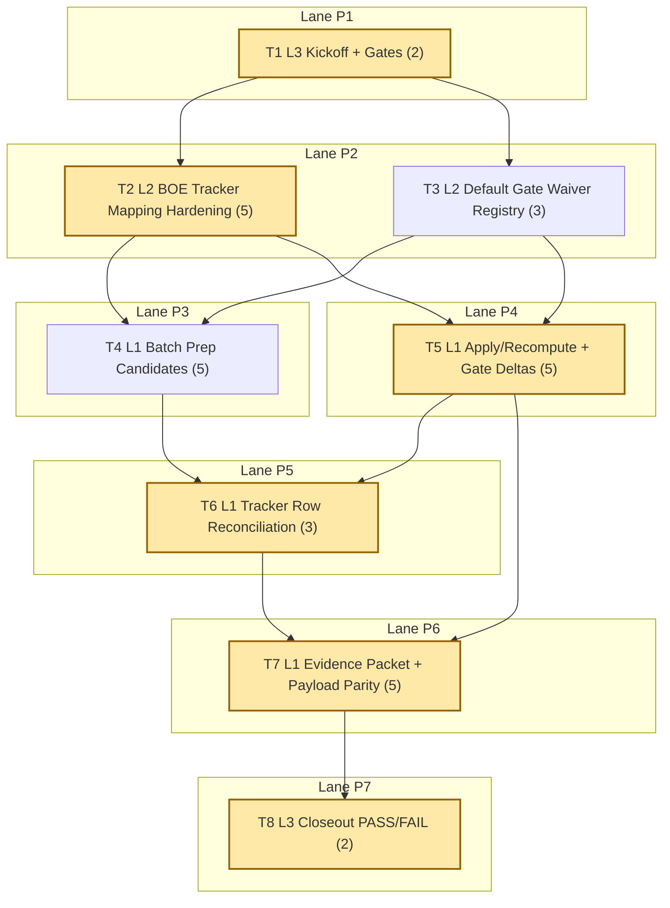

# Sprint AI-OPS-08 Prompt Pack

Repository root:
- `REPO_ROOT/vota-con-la-chola`

Sprint scope (single bottleneck class):
- Pipeline bottleneck on tracker/governance reconciliation: core Moncloa-BOE sources are loaded in SQL, but operational gates still drift because `boe_api_legal` is untracked in checklist mapping and Navarra remains waiver-dependent.

Sprint objective:
- Close tracker contract drift for Moncloa-BOE legal/executive rows and burn down remaining waiver debt so strict policy-aware gating is deterministic and auditable.

Assessment baseline (2026-02-16, live):
- `just etl-tracker-status`:
  - `tracker_sources=27`
  - `sources_in_db=33`
  - `mismatches=1`
  - `waived_mismatches=0`
  - `waivers_active=0`
  - `waivers_expired=0`
  - `done_zero_real=0`
- `just etl-tracker-gate || true`:
  - exits with `FAIL: checklist/sql mismatches detected`
  - `mismatches=1`
- Policy-aware strict check (`--waivers docs/etl/sprints/AI-OPS-07/evidence/mismatch-policy-applied.json --as-of-date 2026-02-16 --fail-on-mismatch --fail-on-done-zero-real`):
  - `mismatches=0`
  - `waived_mismatches=1`
  - `waivers_active=1`
  - `waivers_expired=0`
  - `done_zero_real=0`
- Data integrity and queue:
  - `fk_violations=0`
  - `topic_evidence_reviews_pending=0`
- Coverage continuity:
  - `policy_events_moncloa=28`
  - `policy_events_boe=298`
- Published payload (`docs/gh-pages/explorer-sources/data/status.json`):
  - `mismatch_counts={'MATCH':26,'MISMATCH':1,'UNTRACKED':6}`
  - `boe_api_legal` currently shows `mismatch_state=UNTRACKED`

Bottleneck class:
- `pipeline bottleneck`

Workload balance:
- total points: `30`
- `L1 = 18 pts (60.00%)`
- `L2 = 8 pts (26.67%)`
- `L3 = 4 pts (13.33%)`
- `L1 task share = 4/8 (50%)`

WIP limits:
- `L3 max 1`
- `L2 max 2`
- `L1 max 6`

1. Agent: L3 Orchestrator (2 pts)
- `depends_on: []`
- `parallel_group: P1`
- `model_lane: HI`
```text
goal:
Lock AI-OPS-08 baseline and must-pass gates for tracker-contract reconciliation and waiver burn-down.

repository:
REPO_ROOT/vota-con-la-chola

objective:
Freeze PASS/FAIL conditions and execution order so L2/L1 can execute without gate ambiguity.

inputs:
- docs/roadmap.md
- docs/roadmap-tecnico.md
- docs/etl/e2e-scrape-load-tracker.md
- docs/etl/sprints/AI-OPS-07/closeout.md
- docs/gh-pages/explorer-sources/data/status.json
- sqlite3 etl/data/staging/politicos-es.db

tasks:
1) Run kickoff baseline commands:
- just etl-tracker-status
- just etl-tracker-gate || true
- python3 scripts/e2e_tracker_status.py --db etl/data/staging/politicos-es.db --tracker docs/etl/e2e-scrape-load-tracker.md --waivers docs/etl/sprints/AI-OPS-07/evidence/mismatch-policy-applied.json --as-of-date 2026-02-16 --fail-on-mismatch --fail-on-done-zero-real
- sqlite3 etl/data/staging/politicos-es.db "SELECT COUNT(*) AS fk_violations FROM pragma_foreign_key_check;"
- sqlite3 etl/data/staging/politicos-es.db "SELECT COUNT(*) AS topic_evidence_reviews_pending FROM topic_evidence_reviews WHERE lower(status)='pending';"
- sqlite3 etl/data/staging/politicos-es.db "SELECT COUNT(*) AS policy_events_moncloa FROM policy_events WHERE source_id LIKE 'moncloa_%';"
- sqlite3 etl/data/staging/politicos-es.db "SELECT COUNT(*) AS policy_events_boe FROM policy_events WHERE source_id LIKE 'boe_%';"
- python3 - <<'PY' ... payload summary for moncloa/boe/navarra mismatch_state ... PY
2) Lock must-pass gates and dependency order.
3) Write kickoff artifact with exact outputs.

output_contract:
- docs/etl/sprints/AI-OPS-08/kickoff.md

acceptance_query:
- test -f docs/etl/sprints/AI-OPS-08/kickoff.md
- rg -n "fk_violations|topic_evidence_reviews_pending|policy_events_moncloa|policy_events_boe|mismatches|Gate" docs/etl/sprints/AI-OPS-08/kickoff.md

escalation_rule:
- escalate only if DB, tracker, or status snapshot artifacts are missing/unreadable.

depends_on:
- none

parallel_group:
- P1

artifact_path:
- docs/etl/sprints/AI-OPS-08/kickoff.md
```

2. Agent: L2 Specialist Builder (5 pts)
- `depends_on: [1]`
- `parallel_group: P2`
- `model_lane: HI`
```text
goal:
Implement tracker-source mapping hardening so BOE legal status is reconciled (not UNTRACKED) in checker and explorer payload.

repository:
REPO_ROOT/vota-con-la-chola

objective:
Remove BOE tracker drift by mapping `Marco legal electoral` deterministically to `boe_api_legal` in the reconciliation path.

inputs:
- scripts/e2e_tracker_status.py
- scripts/graph_ui_server.py
- docs/etl/e2e-scrape-load-tracker.md
- docs/gh-pages/explorer-sources/data/status.json

tasks:
1) Extend tracker hint mapping so `Marco legal electoral` resolves to:
- boe_api_legal
2) Ensure BOE row status propagates to explorer-sources payload fields:
- tracker.status
- sql_status
- mismatch_state
- mismatch_waived
- waiver_expiry
3) Keep behavior deterministic with concise code comments where mapping precedence matters.
4) Add focused tests for:
- tracker mapping for BOE row
- payload field visibility after mapping
5) Write implementation report with before/after mismatch snapshot.

output_contract:
- code updates in scripts/e2e_tracker_status.py and scripts/graph_ui_server.py
- tests under tests/ covering BOE tracker mapping behavior
- docs/etl/sprints/AI-OPS-08/reports/boe-tracker-mapping-hardening.md

acceptance_query:
- python3 -m unittest discover -s tests -p 'test*tracker*py'
- python3 -m unittest discover -s tests -p 'test*graph*tracker*py'
- python3 scripts/e2e_tracker_status.py --db etl/data/staging/politicos-es.db --tracker docs/etl/e2e-scrape-load-tracker.md | rg -n "boe_api_legal|tracker_sources|mismatches"
- rg -n "boe_api_legal|UNTRACKED|mismatch_state" docs/etl/sprints/AI-OPS-08/reports/boe-tracker-mapping-hardening.md

escalation_rule:
- if BOE mapping introduces regressions on existing Moncloa rows, stop and escalate with affected source_ids diff.

depends_on:
- 1

parallel_group:
- P2

artifact_path:
- docs/etl/sprints/AI-OPS-08/reports/boe-tracker-mapping-hardening.md
```

3. Agent: L2 Specialist Builder (3 pts)
- `depends_on: [1]`
- `parallel_group: P2`
- `model_lane: HI`
```text
goal:
Harden default tracker gate ergonomics with a canonical waiver registry path while preserving strict fail semantics.

repository:
REPO_ROOT/vota-con-la-chola

objective:
Keep gate usage deterministic in daily operations: strict gate fails only on unwaived mismatches, expired waivers, or DONE_ZERO_REAL.

inputs:
- justfile
- scripts/e2e_tracker_status.py
- docs/etl/sprints/AI-OPS-07/evidence/mismatch-policy-applied.json
- docs/etl/e2e-scrape-load-tracker.md

tasks:
1) Introduce/standardize a canonical waiver registry file path for operations:
- docs/etl/mismatch-waivers.json
2) Update `just etl-tracker-gate` (or strict default alias) to consume waiver registry deterministically.
3) Preserve backward compatibility:
- keep legacy gate path available (`etl-tracker-gate-legacy`)
- keep docs explicit about strict vs legacy behavior
4) Add or adjust focused tests if command semantics changed.
5) Write gate-hardening report with before/after command outputs.

output_contract:
- updated justfile gate target(s)
- waiver registry file at docs/etl/mismatch-waivers.json (if needed)
- optional tests updated
- docs/etl/sprints/AI-OPS-08/reports/tracker-gate-policy-default.md

acceptance_query:
- rg -n "etl-tracker-gate|etl-tracker-gate-legacy|mismatch-waivers.json|fail-on-mismatch" justfile
- just etl-tracker-gate || true
- rg -n "waiver|expired|DONE_ZERO_REAL|mismatch" docs/etl/sprints/AI-OPS-08/reports/tracker-gate-policy-default.md

escalation_rule:
- if default gate behavior risks masking unwaived mismatches, stop and escalate with failing command evidence.

depends_on:
- 1

parallel_group:
- P2

artifact_path:
- docs/etl/sprints/AI-OPS-08/reports/tracker-gate-policy-default.md
```

4. Agent: L1 Mechanical Executor (5 pts)
- `depends_on: [2,3]`
- `parallel_group: P3`
- `model_lane: FAST`
```text
goal:
Prepare deterministic waiver burn-down and tracker-contract candidate batches.

repository:
REPO_ROOT/vota-con-la-chola

objective:
Generate reproducible candidate artifacts so status/waiver changes are evidence-backed and auditable.

inputs:
- just etl-tracker-status
- python3 scripts/e2e_tracker_status.py ... (strict and waiver-aware)
- docs/etl/e2e-scrape-load-tracker.md
- docs/etl/mismatch-waivers.json (or sprint waiver file)

tasks:
1) Build `waiver_burndown_candidates.csv` with columns:
- source_id, checklist_status, sql_status, mismatch_state, waiver_owner, waiver_expires_on, recommendation
2) Build `tracker_contract_candidates.csv` with columns:
- tracker_row, mapped_source_id, tracker_status, sql_status, expected_status, evidence_command, note
3) Capture exact command logs used for both exports.
4) Write batch-prep report summarizing candidate counts and unresolved rows.

output_contract:
- docs/etl/sprints/AI-OPS-08/exports/waiver_burndown_candidates.csv
- docs/etl/sprints/AI-OPS-08/exports/tracker_contract_candidates.csv
- docs/etl/sprints/AI-OPS-08/reports/waiver-burndown-batch-prep.md
- logs under docs/etl/sprints/AI-OPS-08/evidence/

acceptance_query:
- test -f docs/etl/sprints/AI-OPS-08/exports/waiver_burndown_candidates.csv
- test -f docs/etl/sprints/AI-OPS-08/exports/tracker_contract_candidates.csv
- rg -n "waiver_expires_on|recommendation|mapped_source_id|expected_status" docs/etl/sprints/AI-OPS-08/exports/*.csv

escalation_rule:
- if any candidate row lacks reproducible evidence command output, mark it `UNRESOLVED` and exclude from apply set.

depends_on:
- 2
- 3

parallel_group:
- P3

artifact_path:
- docs/etl/sprints/AI-OPS-08/reports/waiver-burndown-batch-prep.md
```

5. Agent: L1 Mechanical Executor (5 pts)
- `depends_on: [2,3]`
- `parallel_group: P4`
- `model_lane: FAST`
```text
goal:
Run apply/recompute cycle for BOE tracker reconciliation and Navarra waiver burn-down attempt.

repository:
REPO_ROOT/vota-con-la-chola

objective:
Refresh operational truth with reproducible commands and capture strict vs waiver-aware gate deltas.

inputs:
- updated mapping/gate code from T2-T3
- docs/etl/sprints/AI-OPS-08/exports/*.csv
- docs/etl/e2e-scrape-load-tracker.md

tasks:
1) Run deterministic command set:
- strict-network probe for `parlamento_navarra_parlamentarios_forales`
- strict-network probe for `parlamento_galicia_deputados`
- `boe_api_legal` ingest replay + BOE policy_events backfill if needed
- refresh explorer-sources snapshot
2) Run checker in both modes:
- strict default gate
- policy-aware gate with waiver registry
3) Record before/after metrics:
- mismatches, waived_mismatches, waivers_active, waivers_expired, done_zero_real
- policy_events_moncloa, policy_events_boe
4) Write apply/recompute report with exact commands and outputs.

output_contract:
- docs/etl/sprints/AI-OPS-08/reports/waiver-burndown-apply-recompute.md
- command logs under docs/etl/sprints/AI-OPS-08/evidence/

acceptance_query:
- test -f docs/etl/sprints/AI-OPS-08/reports/waiver-burndown-apply-recompute.md
- rg -n "mismatches:|waived_mismatches:|waivers_active:|waivers_expired:|done_zero_real:|policy_events_boe|policy_events_moncloa" docs/etl/sprints/AI-OPS-08/reports/waiver-burndown-apply-recompute.md
- just etl-tracker-gate || true

escalation_rule:
- if Navarra remains unresolved and requires waiver extension, include owner, new expiry, and blocker evidence before any waiver renewal.

depends_on:
- 2
- 3

parallel_group:
- P4

artifact_path:
- docs/etl/sprints/AI-OPS-08/reports/waiver-burndown-apply-recompute.md
```

6. Agent: L1 Mechanical Executor (3 pts)
- `depends_on: [4,5]`
- `parallel_group: P5`
- `model_lane: FAST`
```text
goal:
Reconcile tracker row text to current evidence for legal/executive and blocked-source rows.

repository:
REPO_ROOT/vota-con-la-chola

objective:
Ensure tracker wording reflects operational truth with explicit blocker + next command semantics.

inputs:
- docs/etl/e2e-scrape-load-tracker.md
- docs/etl/sprints/AI-OPS-08/reports/waiver-burndown-apply-recompute.md
- docs/etl/sprints/AI-OPS-08/exports/tracker_contract_candidates.csv

tasks:
1) Update row text for:
- Marco legal electoral
- Accion ejecutiva (Consejo de Ministros) only if evidence changed
- Parlamento de Navarra
- Parlamento de Galicia
2) Mark `DONE` only with reproducible evidence commands/outputs.
3) For each remaining `PARTIAL`, keep exactly:
- done now
- single blocker
- one deterministic next command
4) Write reconciliation evidence note.

output_contract:
- updated docs/etl/e2e-scrape-load-tracker.md
- docs/etl/sprints/AI-OPS-08/evidence/tracker-row-reconciliation.md

acceptance_query:
- rg -n "Accion ejecutiva \(Consejo de Ministros\)|Marco legal electoral|Parlamento de Navarra|Parlamento de Galicia" docs/etl/e2e-scrape-load-tracker.md
- rg -n "Done now|Blocker|Siguiente comando" docs/etl/sprints/AI-OPS-08/evidence/tracker-row-reconciliation.md

escalation_rule:
- if evidence is insufficient for status promotion, keep row PARTIAL and record blocker evidence explicitly.

depends_on:
- 4
- 5

parallel_group:
- P5

artifact_path:
- docs/etl/sprints/AI-OPS-08/evidence/tracker-row-reconciliation.md
```

7. Agent: L1 Mechanical Executor (5 pts)
- `depends_on: [5,6]`
- `parallel_group: P6`
- `model_lane: FAST`
```text
goal:
Publish final reconciliation evidence packet and dashboard parity for mismatch-policy transparency.

repository:
REPO_ROOT/vota-con-la-chola

objective:
Provide one gate-ready evidence packet proving tracker/sql/payload reconciliation state for closeout.

inputs:
- docs/gh-pages/explorer-sources/data/status.json
- docs/etl/sprints/AI-OPS-08/reports/waiver-burndown-apply-recompute.md
- docs/etl/sprints/AI-OPS-08/evidence/tracker-row-reconciliation.md
- waiver registry file used in sprint

tasks:
1) Refresh explorer-sources snapshot artifact.
2) Verify payload parity for audited fields:
- tracker.status
- sql_status
- mismatch_state
- mismatch_waived
- waiver_expiry
3) Build mismatch matrix for key sources:
- moncloa_referencias
- moncloa_rss_referencias
- boe_api_legal
- parlamento_navarra_parlamentarios_forales
4) Write final evidence packet with command list, logs, and gate-ready summary.

output_contract:
- refreshed docs/gh-pages/explorer-sources/data/status.json
- docs/etl/sprints/AI-OPS-08/evidence/reconciliation-evidence-packet.md
- docs/etl/sprints/AI-OPS-08/exports/mismatch_matrix.csv

acceptance_query:
- python3 scripts/export_explorer_sources_snapshot.py --db etl/data/staging/politicos-es.db --out docs/gh-pages/explorer-sources/data/status.json
- jq '.sources[] | select(.source_id=="boe_api_legal" or .source_id=="parlamento_navarra_parlamentarios_forales" or .source_id=="moncloa_referencias" or .source_id=="moncloa_rss_referencias") | {source_id, tracker: .tracker.status, sql_status, mismatch_state, mismatch_waived, waiver_expiry}' docs/gh-pages/explorer-sources/data/status.json
- rg -n "mismatch_state|mismatch_waived|waiver_expiry|mismatch matrix|gate" docs/etl/sprints/AI-OPS-08/evidence/reconciliation-evidence-packet.md

escalation_rule:
- if payload parity differs from checker output, escalate with field-level diff and source_ids before closeout.

depends_on:
- 5
- 6

parallel_group:
- P6

artifact_path:
- docs/etl/sprints/AI-OPS-08/evidence/reconciliation-evidence-packet.md
```

8. Agent: L3 Orchestrator (2 pts)
- `depends_on: [7]`
- `parallel_group: P7`
- `model_lane: HI`
```text
goal:
Run AI-OPS-08 closeout and issue PASS/FAIL with explicit carryover.

repository:
REPO_ROOT/vota-con-la-chola

objective:
Close reconciliation sprint with project-level framing and deterministic carryover only when a gate is red.

inputs:
- docs/etl/sprints/AI-OPS-08/kickoff.md
- docs/etl/sprints/AI-OPS-08/reports/*.md
- docs/etl/sprints/AI-OPS-08/evidence/*.md
- docs/etl/e2e-scrape-load-tracker.md
- docs/gh-pages/explorer-sources/data/status.json

tasks:
1) Evaluate gates:
- G1 data integrity: `fk_violations=0`
- G2 queue health: `topic_evidence_reviews_pending=0`
- G3 tracker-contract alignment: `boe_api_legal` is not `UNTRACKED` and Moncloa rows remain `MATCH`
- G4 strict-policy behavior: unwaived `mismatches=0`, `waivers_expired=0`, `done_zero_real=0`
- G5 waiver burn-down: active waivers not increased vs kickoff and Navarra waiver reduced to `0`
- G6 workload balance: L1 majority throughput evidence present
2) Decide PASS/FAIL.
3) Write closeout with evidence commands and carryover table (if needed).

output_contract:
- docs/etl/sprints/AI-OPS-08/closeout.md

acceptance_query:
- test -f docs/etl/sprints/AI-OPS-08/closeout.md
- rg -n "PASS|FAIL|G1|G2|G3|G4|G5|G6" docs/etl/sprints/AI-OPS-08/closeout.md

escalation_rule:
- if any gate fails, do not mark PASS; open carryover with owner, blocker evidence, and first command.

depends_on:
- 7

parallel_group:
- P7

artifact_path:
- docs/etl/sprints/AI-OPS-08/closeout.md
```

## Critical Path
1. `T1` Lock kickoff baseline and gates (`2 pts`)
2. `T2` Harden BOE tracker mapping (`5 pts`)
3. `T5` Apply/recompute + strict vs waiver-aware deltas (`5 pts`)
4. `T6` Reconcile tracker row wording (`3 pts`)
5. `T7` Publish final evidence packet + payload parity (`5 pts`)
6. `T8` Closeout PASS/FAIL (`2 pts`)

Total critical-path points: `22`

## Parallel Plan
- `P1`: `T1` (can start immediately)
- `P2`: `T2`, `T3` (start after `T1`; run in parallel under L2 WIP=2)
- `P3`: `T4` (start after `T2` + `T3`)
- `P4`: `T5` (start after `T2` + `T3`; independent of `T4`)
- `P5`: `T6` (start after `T4` + `T5`)
- `P6`: `T7` (start after `T5` + `T6`)
- `P7`: `T8` (start after `T7`)

Start-immediately set:
- `T1`

Post-dependency starts:
- `T2` + `T3` after kickoff
- `T4` + `T5` after implementation hardening
- `T6` -> `T7` -> `T8` closeout chain

## Queue Waves
- `Wave 1 (HI)`: `T1 -> T2 -> T3`
- `Wave 2 (FAST)`: `T4 -> T5 -> T6 -> T7`
- `Wave 3 (HI)`: `T8`

Lane switches count:
- `2` (`HI -> FAST -> HI`)

Estimated tasks-per-switch ratio:
- `8 / 2 = 4.0`

## Flow Diagram (Mermaid, vertical)


## Folder Layout
```text
docs/etl/sprints/AI-OPS-08/
├── sprint-ai-agents.md
├── kickoff.md
├── closeout.md
├── reports/
│   ├── boe-tracker-mapping-hardening.md
│   ├── tracker-gate-policy-default.md
│   ├── waiver-burndown-batch-prep.md
│   └── waiver-burndown-apply-recompute.md
├── evidence/
│   ├── tracker-row-reconciliation.md
│   ├── reconciliation-evidence-packet.md
│   └── *.log
└── exports/
    ├── waiver_burndown_candidates.csv
    ├── tracker_contract_candidates.csv
    └── mismatch_matrix.csv
```
