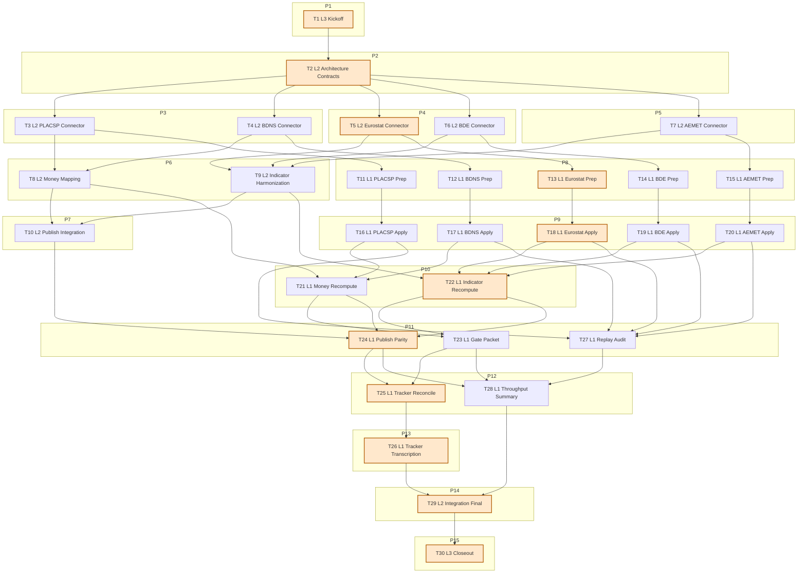

# Sprint AI-OPS-09 Prompt Pack

Repository root:
- `REPO_ROOT/vota-con-la-chola`

Scale metadata:
- `scale_mode`: `LONG_10X`
- `baseline_reference`: `docs/etl/sprints/AI-OPS-06/sprint-ai-agents.md`, `docs/etl/sprints/AI-OPS-07/sprint-ai-agents.md`, `docs/etl/sprints/AI-OPS-08/sprint-ai-agents.md`
- `baseline_points`: `30` (recent average of `27`, `32`, `30`)
- `target_points`: `300`
- `planned_points`: `300`
- `baseline_task_count`: `8`
- `target_task_count`: `80`
- `planned_task_count`: `30`
- `horizon_weeks`: `8`
- `scale_shortfall`: `Task-count shortfall (30 vs 80) is intentional to keep prompts self-contained and preserve <=2 lane switches; each L1 packet expands into multiple deterministic command-level substeps.`

Sprint scope (single bottleneck class):
- `source bottleneck`: tracker still has `TODO` concentration in money/outcomes sources and `analytics.impact` remains empty (`indicator_series_total=0`, `indicator_points_total=0`, `causal_estimates_total=0`).

Sprint objective:
- Build an impact-ready ingestion spine for national money/outcomes by implementing reproducible connectors and deterministic runbooks for `PLACSP`, `BDNS/SNPSAP`, `Eurostat`, `Banco de Espana`, and `AEMET`, then publish tracker-aligned evidence and artifacts.

Assessment baseline (2026-02-17, live):
- `just etl-tracker-status` and strict gate (`just etl-tracker-gate`) are green:
  - `tracker_sources=28`
  - `sources_in_db=33`
  - `mismatches=0`
  - `waived_mismatches=0`
  - `waivers_active=0`
  - `waivers_expired=0`
  - `done_zero_real=0`
- DB integrity and queue:
  - `fk_violations=0`
  - `topic_evidence_reviews_pending=0`
- Action baseline:
  - `policy_events_total=326`
  - `policy_events_moncloa=28`
  - `policy_events_boe=298`
- Explorer status baseline (`docs/gh-pages/explorer-sources/data/status.json`):
  - `summary.tracker.items_total=46`
  - `summary.tracker.done=27`
  - `summary.tracker.partial=3`
  - `summary.tracker.todo=16`
  - `summary.tracker.unmapped=20`
  - `analytics.impact.indicator_series_total=0`
  - `analytics.impact.indicator_points_total=0`

Bottleneck class:
- `source bottleneck`

Workload balance:
- total points: `300`
- `L1 = 174 pts (58.00%)`
- `L2 = 110 pts (36.67%)`
- `L3 = 16 pts (5.33%)`
- `L1 task share = 18/30 (60.00%)`

WIP limits:
- `L3 max 1`
- `L2 max 2`
- `L1 max 6`

1. Agent: L3 Orchestrator (8 pts)
- `depends_on: []`
- `parallel_group: P1`
- `model_lane: HI`
```text
goal:
Lock scope, gates, and sequencing for AI-OPS-09 LONG_10X execution.

repository:
REPO_ROOT/vota-con-la-chola

objective:
Freeze a deterministic acceptance contract for money/outcomes source expansion before implementation starts.

inputs:
- docs/roadmap.md
- docs/roadmap-tecnico.md
- docs/etl/e2e-scrape-load-tracker.md
- docs/gh-pages/explorer-sources/data/status.json
- docs/etl/sprints/AI-OPS-08/closeout.md
- sqlite3 etl/data/staging/politicos-es.db

tasks:
1) Capture kickoff metrics from tracker, strict gate, integrity, and impact baseline counts.
2) Confirm target rows in tracker for this sprint (PLACSP, BDNS, Eurostat, Banco de Espana, AEMET).
3) Freeze must-pass gates and escalation rules for blocked upstream contracts.
4) Write kickoff artifact with command outputs and queue order.

output_contract:
- docs/etl/sprints/AI-OPS-09/kickoff.md

acceptance_query:
- test -f docs/etl/sprints/AI-OPS-09/kickoff.md
- rg -n "mismatches|done_zero_real|indicator_series_total|indicator_points_total|Gate" docs/etl/sprints/AI-OPS-09/kickoff.md

escalation_rule:
- Escalate only if baseline artifacts are missing or tracker/DB state cannot be read reproducibly.

depends_on:
- none

parallel_group:
- P1

artifact_path:
- docs/etl/sprints/AI-OPS-09/kickoff.md
```

2. Agent: L2 Specialist Builder (13 pts)
- `depends_on: [1]`
- `parallel_group: P2`
- `model_lane: HI`
```text
goal:
Define the schema and source-contract foundation for the five new source families.

repository:
REPO_ROOT/vota-con-la-chola

objective:
Create additive schema/source definitions and command contracts that make downstream L1 execution deterministic.

inputs:
- etl/load/sqlite_schema.sql
- etl/politicos_es/config.py
- scripts/ingestar_politicos_es.py
- scripts/e2e_tracker_status.py
- docs/etl/e2e-scrape-load-tracker.md

tasks:
1) Add/confirm additive tables/columns/indexes for money/outcomes records (no destructive migrations).
2) Register source configs with deterministic fallback sample paths and strict-network thresholds.
3) Add explicit source_id naming contracts and tracker-hint compatibility where needed.
4) Add runbook command stubs in docs/report so L1 can execute without ambiguity.

output_contract:
- code updates in etl/load/sqlite_schema.sql
- code updates in etl/politicos_es/config.py
- docs/etl/sprints/AI-OPS-09/reports/architecture-contracts.md

acceptance_query:
- rg -n "placsp|bdns|eurostat|bde|aemet" etl/politicos_es/config.py etl/load/sqlite_schema.sql
- python3 scripts/ingestar_politicos_es.py --help | head -n 40
- rg -n "source_id|strict-network|fallback" docs/etl/sprints/AI-OPS-09/reports/architecture-contracts.md

escalation_rule:
- If schema changes require dropping or rewriting existing tables, stop and escalate.

depends_on:
- 1

parallel_group:
- P2

artifact_path:
- docs/etl/sprints/AI-OPS-09/reports/architecture-contracts.md
```

3. Agent: L2 Specialist Builder (13 pts)
- `depends_on: [2]`
- `parallel_group: P3`
- `model_lane: HI`
```text
goal:
Implement PLACSP connector slice for reproducible contracting ingest.

repository:
REPO_ROOT/vota-con-la-chola

objective:
Ship a deterministic PLACSP minimal ingest path with traceable source_record ids and sample-backed tests.

inputs:
- etl/politicos_es/connectors/
- etl/politicos_es/config.py
- scripts/ingestar_politicos_es.py
- tests/test_samples_e2e.py

tasks:
1) Add connector module for PLACSP feed extraction.
2) Normalize key contracting fields (expediente, organo, cpv, amount, publication date) while preserving raw payload.
3) Ensure source_record_id stability and idempotent upserts.
4) Add sample fixture and focused tests.
5) Write implementation report.

output_contract:
- etl/politicos_es/connectors/placsp_*.py
- tests/test_*placsp*.py
- docs/etl/sprints/AI-OPS-09/reports/placsp-connector-implementation.md

acceptance_query:
- python3 -m unittest discover -s tests -p 'test*placsp*py'
- python3 -m unittest tests.test_samples_e2e
- rg -n "source_record_id|idempot|strict" docs/etl/sprints/AI-OPS-09/reports/placsp-connector-implementation.md

escalation_rule:
- If upstream PLACSP contract is unstable, keep ingest non-fatal and log signature + fallback behavior.

depends_on:
- 2

parallel_group:
- P3

artifact_path:
- docs/etl/sprints/AI-OPS-09/reports/placsp-connector-implementation.md
```

4. Agent: L2 Specialist Builder (13 pts)
- `depends_on: [2]`
- `parallel_group: P3`
- `model_lane: HI`
```text
goal:
Implement BDNS/SNPSAP connector slice for reproducible subsidy ingest.

repository:
REPO_ROOT/vota-con-la-chola

objective:
Ship deterministic BDNS ingest with stable ids and traceable amount/beneficiary fields (when present).

inputs:
- etl/politicos_es/connectors/
- etl/politicos_es/config.py
- scripts/ingestar_politicos_es.py
- tests/

tasks:
1) Add connector module for BDNS API/feed acquisition.
2) Parse canonical subsidy fields and preserve raw payload + source_url.
3) Implement idempotent upsert by `(source_id, source_record_id)`.
4) Add sample fixture + tests for parser stability.
5) Write implementation report.

output_contract:
- etl/politicos_es/connectors/bdns_*.py
- tests/test_*bdns*py
- docs/etl/sprints/AI-OPS-09/reports/bdns-connector-implementation.md

acceptance_query:
- python3 -m unittest discover -s tests -p 'test*bdns*py'
- python3 -m unittest tests.test_samples_e2e
- rg -n "beneficiario|importe|source_record_id" docs/etl/sprints/AI-OPS-09/reports/bdns-connector-implementation.md

escalation_rule:
- If beneficiary identity is unstable, keep nullable normalized fields and document the deterministic fallback.

depends_on:
- 2

parallel_group:
- P3

artifact_path:
- docs/etl/sprints/AI-OPS-09/reports/bdns-connector-implementation.md
```

5. Agent: L2 Specialist Builder (13 pts)
- `depends_on: [2]`
- `parallel_group: P4`
- `model_lane: HI`
```text
goal:
Implement Eurostat connector slice for outcomes indicators.

repository:
REPO_ROOT/vota-con-la-chola

objective:
Create deterministic Eurostat ingestion for a curated indicator manifest with versioned metadata.

inputs:
- etl/politicos_es/connectors/
- scripts/ingestar_politicos_es.py
- docs/roadmap-tecnico.md
- tests/

tasks:
1) Add connector and parser for Eurostat API/SDMX or JSON endpoint chosen in contract.
2) Normalize dimensions/codes and units into canonical indicator structures.
3) Preserve source metadata and codelist references for traceability.
4) Add stable samples and tests.
5) Write implementation report.

output_contract:
- etl/politicos_es/connectors/eurostat_*.py
- tests/test_*eurostat*py
- docs/etl/sprints/AI-OPS-09/reports/eurostat-connector-implementation.md

acceptance_query:
- python3 -m unittest discover -s tests -p 'test*eurostat*py'
- python3 -m unittest tests.test_samples_e2e
- rg -n "dimension|unit|series" docs/etl/sprints/AI-OPS-09/reports/eurostat-connector-implementation.md

escalation_rule:
- If dataset contract drifts, capture drift evidence and keep connector failure isolated by source_id.

depends_on:
- 2

parallel_group:
- P4

artifact_path:
- docs/etl/sprints/AI-OPS-09/reports/eurostat-connector-implementation.md
```

6. Agent: L2 Specialist Builder (8 pts)
- `depends_on: [2]`
- `parallel_group: P4`
- `model_lane: HI`
```text
goal:
Implement Banco de Espana indicator connector slice.

repository:
REPO_ROOT/vota-con-la-chola

objective:
Provide deterministic series ingest for curated Banco de Espana confounder indicators.

inputs:
- etl/politicos_es/connectors/
- scripts/ingestar_politicos_es.py
- tests/

tasks:
1) Add connector module for BDE series API.
2) Normalize code, value, frequency, and units into canonical tables.
3) Add idempotent load path and sample tests.
4) Write implementation report.

output_contract:
- etl/politicos_es/connectors/bde_*.py
- tests/test_*bde*py
- docs/etl/sprints/AI-OPS-09/reports/bde-connector-implementation.md

acceptance_query:
- python3 -m unittest discover -s tests -p 'test*bde*py'
- rg -n "frequency|unit|series" docs/etl/sprints/AI-OPS-09/reports/bde-connector-implementation.md

escalation_rule:
- If BDE endpoint requires non-reproducible auth/cookies, stop and document blocker explicitly.

depends_on:
- 2

parallel_group:
- P4

artifact_path:
- docs/etl/sprints/AI-OPS-09/reports/bde-connector-implementation.md
```

7. Agent: L2 Specialist Builder (8 pts)
- `depends_on: [2]`
- `parallel_group: P5`
- `model_lane: HI`
```text
goal:
Implement AEMET indicator connector slice.

repository:
REPO_ROOT/vota-con-la-chola

objective:
Create deterministic ingest for selected AEMET confounder series and station metadata.

inputs:
- etl/politicos_es/connectors/
- scripts/ingestar_politicos_es.py
- tests/

tasks:
1) Add AEMET connector for station/time-series endpoints.
2) Normalize station metadata and values with source traceability.
3) Keep optional token handling explicit and documented.
4) Add sample-based tests and report.

output_contract:
- etl/politicos_es/connectors/aemet_*.py
- tests/test_*aemet*py
- docs/etl/sprints/AI-OPS-09/reports/aemet-connector-implementation.md

acceptance_query:
- python3 -m unittest discover -s tests -p 'test*aemet*py'
- rg -n "station|token|traceability" docs/etl/sprints/AI-OPS-09/reports/aemet-connector-implementation.md

escalation_rule:
- If token/quota blocks reproducibility, document explicit fallback and keep row status honest in tracker.

depends_on:
- 2

parallel_group:
- P5

artifact_path:
- docs/etl/sprints/AI-OPS-09/reports/aemet-connector-implementation.md
```

8. Agent: L2 Specialist Builder (13 pts)
- `depends_on: [3,4]`
- `parallel_group: P6`
- `model_lane: HI`
```text
goal:
Implement mapping/backfill from PLACSP + BDNS records into canonical action events.

repository:
REPO_ROOT/vota-con-la-chola

objective:
Expose money-public action rows in `policy_events` with reproducible, traceable mappings.

inputs:
- source_records for placsp/bdns source_ids
- etl/load/sqlite_schema.sql
- scripts/ingestar_politicos_es.py
- existing policy_events mapping logic

tasks:
1) Add mapping rules for contracting/subsidy records to policy events.
2) Preserve required traceability fields (source_id, source_url, source_record_pk, snapshot_date).
3) Add idempotent backfill command(s).
4) Add focused mapping tests and report.

output_contract:
- mapping code for money -> policy_events
- tests/test_*policy*money*py
- docs/etl/sprints/AI-OPS-09/reports/money-policy-events-mapping.md

acceptance_query:
- python3 -m unittest discover -s tests -p 'test*policy*money*py'
- sqlite3 etl/data/staging/politicos-es.db "SELECT COUNT(*) FROM policy_events WHERE source_id IN ('placsp_contratacion','bdns_subvenciones');"
- rg -n "source_record_pk|source_url|idempot" docs/etl/sprints/AI-OPS-09/reports/money-policy-events-mapping.md

escalation_rule:
- If mapping confidence is ambiguous, emit `no_signal`/NULL fields rather than inventing semantics.

depends_on:
- 3
- 4

parallel_group:
- P6

artifact_path:
- docs/etl/sprints/AI-OPS-09/reports/money-policy-events-mapping.md
```

9. Agent: L2 Specialist Builder (13 pts)
- `depends_on: [5,6,7]`
- `parallel_group: P6`
- `model_lane: HI`
```text
goal:
Implement harmonization/backfill path for outcome/confounder indicators.

repository:
REPO_ROOT/vota-con-la-chola

objective:
Load Eurostat/BDE/AEMET series into canonical indicator tables with deterministic versioning.

inputs:
- connector outputs for eurostat/bde/aemet
- etl/load/sqlite_schema.sql
- scripts/ingestar_politicos_es.py
- tests/

tasks:
1) Add harmonization logic for indicator series metadata and points.
2) Add idempotent recompute command(s) for indicator tables.
3) Preserve provenance fields and source granularity.
4) Add tests and implementation report.

output_contract:
- code for indicator harmonization/backfill
- tests/test_*indicator*backfill*py
- docs/etl/sprints/AI-OPS-09/reports/indicator-harmonization-backfill.md

acceptance_query:
- python3 -m unittest discover -s tests -p 'test*indicator*backfill*py'
- sqlite3 etl/data/staging/politicos-es.db "SELECT COUNT(*) FROM indicator_series;"
- sqlite3 etl/data/staging/politicos-es.db "SELECT COUNT(*) FROM indicator_points;"
- rg -n "provenance|snapshot|idempot" docs/etl/sprints/AI-OPS-09/reports/indicator-harmonization-backfill.md

escalation_rule:
- If source frequencies cannot be reconciled safely, keep separate series variants and document mapping limits.

depends_on:
- 5
- 6
- 7

parallel_group:
- P6

artifact_path:
- docs/etl/sprints/AI-OPS-09/reports/indicator-harmonization-backfill.md
```

10. Agent: L2 Specialist Builder (8 pts)
- `depends_on: [8,9]`
- `parallel_group: P7`
- `model_lane: HI`
```text
goal:
Integrate new source families into publish/tracker visibility and regression checks.

repository:
REPO_ROOT/vota-con-la-chola

objective:
Ensure new sources are visible and auditable in status payloads, tracker reconciliation, and tests.

inputs:
- scripts/graph_ui_server.py
- scripts/export_explorer_sources_snapshot.py
- scripts/e2e_tracker_status.py
- tests/

tasks:
1) Extend payload and tracker mapping coverage for new source_ids.
2) Add/adjust tests for mismatch-state visibility and source summaries.
3) Keep backward-compatible JSON shape.
4) Write integration report.

output_contract:
- code updates in scripts/graph_ui_server.py and/or scripts/e2e_tracker_status.py
- tests/test_*tracker*py and tests/test_*graph*py (focused updates)
- docs/etl/sprints/AI-OPS-09/reports/publish-tracker-integration.md

acceptance_query:
- python3 -m unittest discover -s tests -p 'test*tracker*py'
- python3 -m unittest discover -s tests -p 'test*graph*py'
- rg -n "placsp|bdns|eurostat|bde|aemet" docs/etl/sprints/AI-OPS-09/reports/publish-tracker-integration.md

escalation_rule:
- If payload compatibility breaks existing keys, add shim and rerun tests before handoff.

depends_on:
- 8
- 9

parallel_group:
- P7

artifact_path:
- docs/etl/sprints/AI-OPS-09/reports/publish-tracker-integration.md
```

11. Agent: L1 Mechanical Executor (8 pts)
- `depends_on: [3]`
- `parallel_group: P8`
- `model_lane: FAST`
```text
goal:
Prepare deterministic PLACSP ingest batch inputs and command matrix.

repository:
REPO_ROOT/vota-con-la-chola

objective:
Generate reproducible PLACSP prep artifacts for strict-network, fallback, and replay execution.

inputs:
- connector contract from T3
- etl/data/raw/samples/
- scripts/ingestar_politicos_es.py

tasks:
1) Build batch matrix with strict-network + from-file + replay command rows.
2) Build sample manifest and checksum list.
3) Write prep report and place command logs placeholder paths.

output_contract:
- docs/etl/sprints/AI-OPS-09/exports/placsp_ingest_matrix.csv
- docs/etl/sprints/AI-OPS-09/evidence/placsp_sample_manifest.tsv
- docs/etl/sprints/AI-OPS-09/reports/placsp-batch-prep.md

acceptance_query:
- test -f docs/etl/sprints/AI-OPS-09/exports/placsp_ingest_matrix.csv
- rg -n "strict-network|from-file|replay" docs/etl/sprints/AI-OPS-09/exports/placsp_ingest_matrix.csv

escalation_rule:
- If sample files are missing, mark `BLOCKED_MISSING_SAMPLE` and escalate without fabricating payloads.

depends_on:
- 3

parallel_group:
- P8

artifact_path:
- docs/etl/sprints/AI-OPS-09/reports/placsp-batch-prep.md
```

12. Agent: L1 Mechanical Executor (8 pts)
- `depends_on: [4]`
- `parallel_group: P8`
- `model_lane: FAST`
```text
goal:
Prepare deterministic BDNS ingest batch inputs and command matrix.

repository:
REPO_ROOT/vota-con-la-chola

objective:
Generate reproducible BDNS prep artifacts for strict-network, fallback, and replay execution.

inputs:
- connector contract from T4
- etl/data/raw/samples/
- scripts/ingestar_politicos_es.py

tasks:
1) Build batch command matrix for BDNS runs.
2) Build sample manifest and field-level header checks.
3) Write prep report with blocker handling rules.

output_contract:
- docs/etl/sprints/AI-OPS-09/exports/bdns_ingest_matrix.csv
- docs/etl/sprints/AI-OPS-09/evidence/bdns_sample_manifest.tsv
- docs/etl/sprints/AI-OPS-09/reports/bdns-batch-prep.md

acceptance_query:
- test -f docs/etl/sprints/AI-OPS-09/exports/bdns_ingest_matrix.csv
- rg -n "strict-network|from-file|replay" docs/etl/sprints/AI-OPS-09/exports/bdns_ingest_matrix.csv

escalation_rule:
- If upstream auth/contract changes invalidate requests, record exact HTTP evidence and stop apply phase.

depends_on:
- 4

parallel_group:
- P8

artifact_path:
- docs/etl/sprints/AI-OPS-09/reports/bdns-batch-prep.md
```

13. Agent: L1 Mechanical Executor (11 pts)
- `depends_on: [5]`
- `parallel_group: P8`
- `model_lane: FAST`
```text
goal:
Prepare Eurostat indicator manifest and execution matrix.

repository:
REPO_ROOT/vota-con-la-chola

objective:
Lock deterministic series list and command set for ingest/replay.

inputs:
- connector contract from T5
- docs/roadmap-tecnico.md
- scripts/ingestar_politicos_es.py

tasks:
1) Build curated Eurostat series manifest (id, dataset, dimensions, frequency).
2) Build ingest/replay matrix for each manifest row.
3) Write prep report with schema/header validation outcomes.

output_contract:
- docs/etl/sprints/AI-OPS-09/exports/eurostat_series_manifest.csv
- docs/etl/sprints/AI-OPS-09/exports/eurostat_ingest_matrix.csv
- docs/etl/sprints/AI-OPS-09/reports/eurostat-batch-prep.md

acceptance_query:
- test -f docs/etl/sprints/AI-OPS-09/exports/eurostat_series_manifest.csv
- rg -n "dataset|series|frequency" docs/etl/sprints/AI-OPS-09/exports/eurostat_series_manifest.csv

escalation_rule:
- If series definitions are ambiguous, keep them out of apply set and flag `UNRESOLVED_SERIES`.

depends_on:
- 5

parallel_group:
- P8

artifact_path:
- docs/etl/sprints/AI-OPS-09/reports/eurostat-batch-prep.md
```

14. Agent: L1 Mechanical Executor (8 pts)
- `depends_on: [6]`
- `parallel_group: P8`
- `model_lane: FAST`
```text
goal:
Prepare Banco de Espana series manifest and run matrix.

repository:
REPO_ROOT/vota-con-la-chola

objective:
Create reproducible BDE execution inputs for apply/replay stages.

inputs:
- connector contract from T6
- scripts/ingestar_politicos_es.py

tasks:
1) Build BDE series manifest.
2) Build run matrix for strict-network and replay.
3) Write prep report with validation checks.

output_contract:
- docs/etl/sprints/AI-OPS-09/exports/bde_series_manifest.csv
- docs/etl/sprints/AI-OPS-09/exports/bde_ingest_matrix.csv
- docs/etl/sprints/AI-OPS-09/reports/bde-batch-prep.md

acceptance_query:
- test -f docs/etl/sprints/AI-OPS-09/exports/bde_series_manifest.csv
- rg -n "series|unit|frequency" docs/etl/sprints/AI-OPS-09/exports/bde_series_manifest.csv

escalation_rule:
- If a series lacks stable metadata, remove it from run matrix and mark as blocked.

depends_on:
- 6

parallel_group:
- P8

artifact_path:
- docs/etl/sprints/AI-OPS-09/reports/bde-batch-prep.md
```

15. Agent: L1 Mechanical Executor (8 pts)
- `depends_on: [7]`
- `parallel_group: P8`
- `model_lane: FAST`
```text
goal:
Prepare AEMET station/series manifest and run matrix.

repository:
REPO_ROOT/vota-con-la-chola

objective:
Create deterministic AEMET batch inputs with explicit token/quota handling notes.

inputs:
- connector contract from T7
- scripts/ingestar_politicos_es.py

tasks:
1) Build station manifest and selected series list.
2) Build run matrix for ingest/replay.
3) Write prep report and quota/blocking handling instructions.

output_contract:
- docs/etl/sprints/AI-OPS-09/exports/aemet_station_manifest.csv
- docs/etl/sprints/AI-OPS-09/exports/aemet_ingest_matrix.csv
- docs/etl/sprints/AI-OPS-09/reports/aemet-batch-prep.md

acceptance_query:
- test -f docs/etl/sprints/AI-OPS-09/exports/aemet_station_manifest.csv
- rg -n "station|series|token" docs/etl/sprints/AI-OPS-09/reports/aemet-batch-prep.md

escalation_rule:
- If quota/token blocks run reproducibility, preserve evidence and stop before partial writes.

depends_on:
- 7

parallel_group:
- P8

artifact_path:
- docs/etl/sprints/AI-OPS-09/reports/aemet-batch-prep.md
```

16. Agent: L1 Mechanical Executor (13 pts)
- `depends_on: [11]`
- `parallel_group: P9`
- `model_lane: FAST`
```text
goal:
Execute PLACSP apply/replay runs and capture idempotence evidence.

repository:
REPO_ROOT/vota-con-la-chola

objective:
Produce non-zero PLACSP ingestion evidence and deterministic replay parity.

inputs:
- docs/etl/sprints/AI-OPS-09/exports/placsp_ingest_matrix.csv
- scripts/ingestar_politicos_es.py
- sqlite3 etl/data/staging/politicos-es.db

tasks:
1) Run strict-network and fallback matrix rows in defined order.
2) Run replay pass and compare loaded counts.
3) Save stdout/stderr logs and SQL snapshots.
4) Write apply report.

output_contract:
- docs/etl/sprints/AI-OPS-09/evidence/placsp-apply-logs/
- docs/etl/sprints/AI-OPS-09/evidence/placsp-apply-sql/
- docs/etl/sprints/AI-OPS-09/reports/placsp-apply-recompute.md

acceptance_query:
- rg -n "records_loaded|source_id|replay" docs/etl/sprints/AI-OPS-09/reports/placsp-apply-recompute.md
- test -d docs/etl/sprints/AI-OPS-09/evidence/placsp-apply-logs

escalation_rule:
- If strict-network returns anti-bot payloads, keep row PARTIAL and preserve evidence URLs/status codes.

depends_on:
- 11

parallel_group:
- P9

artifact_path:
- docs/etl/sprints/AI-OPS-09/reports/placsp-apply-recompute.md
```

17. Agent: L1 Mechanical Executor (13 pts)
- `depends_on: [12]`
- `parallel_group: P9`
- `model_lane: FAST`
```text
goal:
Execute BDNS apply/replay runs and capture idempotence evidence.

repository:
REPO_ROOT/vota-con-la-chola

objective:
Produce non-zero BDNS ingestion evidence with deterministic replay parity.

inputs:
- docs/etl/sprints/AI-OPS-09/exports/bdns_ingest_matrix.csv
- scripts/ingestar_politicos_es.py
- sqlite3 etl/data/staging/politicos-es.db

tasks:
1) Run matrix rows in deterministic order.
2) Execute replay checks and compare loaded counters.
3) Persist logs + SQL snapshots.
4) Write apply report.

output_contract:
- docs/etl/sprints/AI-OPS-09/evidence/bdns-apply-logs/
- docs/etl/sprints/AI-OPS-09/evidence/bdns-apply-sql/
- docs/etl/sprints/AI-OPS-09/reports/bdns-apply-recompute.md

acceptance_query:
- rg -n "records_loaded|source_id|replay" docs/etl/sprints/AI-OPS-09/reports/bdns-apply-recompute.md
- test -d docs/etl/sprints/AI-OPS-09/evidence/bdns-apply-logs

escalation_rule:
- If contract/auth fails, stop retries, capture exact error signatures, and escalate with blocker evidence.

depends_on:
- 12

parallel_group:
- P9

artifact_path:
- docs/etl/sprints/AI-OPS-09/reports/bdns-apply-recompute.md
```

18. Agent: L1 Mechanical Executor (13 pts)
- `depends_on: [13]`
- `parallel_group: P9`
- `model_lane: FAST`
```text
goal:
Execute Eurostat apply/replay runs across approved series manifest.

repository:
REPO_ROOT/vota-con-la-chola

objective:
Populate indicator raw loads for Eurostat with reproducible per-series evidence.

inputs:
- docs/etl/sprints/AI-OPS-09/exports/eurostat_ingest_matrix.csv
- docs/etl/sprints/AI-OPS-09/exports/eurostat_series_manifest.csv
- scripts/ingestar_politicos_es.py

tasks:
1) Execute ingest matrix for all approved series.
2) Run replay pass and capture per-series parity checks.
3) Persist logs, SQL extracts, and unresolved series list.
4) Write apply report.

output_contract:
- docs/etl/sprints/AI-OPS-09/evidence/eurostat-apply-logs/
- docs/etl/sprints/AI-OPS-09/evidence/eurostat-apply-sql/
- docs/etl/sprints/AI-OPS-09/reports/eurostat-apply-recompute.md

acceptance_query:
- rg -n "series_id|records_loaded|replay" docs/etl/sprints/AI-OPS-09/reports/eurostat-apply-recompute.md
- test -d docs/etl/sprints/AI-OPS-09/evidence/eurostat-apply-logs

escalation_rule:
- If a series repeatedly fails contract checks, quarantine that series with explicit reason and continue others.

depends_on:
- 13

parallel_group:
- P9

artifact_path:
- docs/etl/sprints/AI-OPS-09/reports/eurostat-apply-recompute.md
```

19. Agent: L1 Mechanical Executor (8 pts)
- `depends_on: [14]`
- `parallel_group: P9`
- `model_lane: FAST`
```text
goal:
Execute Banco de Espana apply/replay runs.

repository:
REPO_ROOT/vota-con-la-chola

objective:
Populate BDE indicator raw loads with reproducible replay checks.

inputs:
- docs/etl/sprints/AI-OPS-09/exports/bde_ingest_matrix.csv
- scripts/ingestar_politicos_es.py

tasks:
1) Run BDE ingest matrix.
2) Replay and compare loaded counts.
3) Save logs/SQL snapshots.
4) Write apply report.

output_contract:
- docs/etl/sprints/AI-OPS-09/evidence/bde-apply-logs/
- docs/etl/sprints/AI-OPS-09/evidence/bde-apply-sql/
- docs/etl/sprints/AI-OPS-09/reports/bde-apply-recompute.md

acceptance_query:
- rg -n "records_loaded|replay" docs/etl/sprints/AI-OPS-09/reports/bde-apply-recompute.md
- test -d docs/etl/sprints/AI-OPS-09/evidence/bde-apply-logs

escalation_rule:
- If an endpoint is blocked, mark source row PARTIAL with evidence; do not mark DONE.

depends_on:
- 14

parallel_group:
- P9

artifact_path:
- docs/etl/sprints/AI-OPS-09/reports/bde-apply-recompute.md
```

20. Agent: L1 Mechanical Executor (8 pts)
- `depends_on: [15]`
- `parallel_group: P9`
- `model_lane: FAST`
```text
goal:
Execute AEMET apply/replay runs.

repository:
REPO_ROOT/vota-con-la-chola

objective:
Populate AEMET indicator raw loads with deterministic replay evidence.

inputs:
- docs/etl/sprints/AI-OPS-09/exports/aemet_ingest_matrix.csv
- scripts/ingestar_politicos_es.py

tasks:
1) Run AEMET ingest matrix.
2) Execute replay and compare counts.
3) Save logs/SQL evidence.
4) Write apply report.

output_contract:
- docs/etl/sprints/AI-OPS-09/evidence/aemet-apply-logs/
- docs/etl/sprints/AI-OPS-09/evidence/aemet-apply-sql/
- docs/etl/sprints/AI-OPS-09/reports/aemet-apply-recompute.md

acceptance_query:
- rg -n "records_loaded|replay|station" docs/etl/sprints/AI-OPS-09/reports/aemet-apply-recompute.md
- test -d docs/etl/sprints/AI-OPS-09/evidence/aemet-apply-logs

escalation_rule:
- If token/quota prevents completion, keep partial evidence and escalate with exact failure counts.

depends_on:
- 15

parallel_group:
- P9

artifact_path:
- docs/etl/sprints/AI-OPS-09/reports/aemet-apply-recompute.md
```

21. Agent: L1 Mechanical Executor (13 pts)
- `depends_on: [8,16,17]`
- `parallel_group: P10`
- `model_lane: FAST`
```text
goal:
Run money-domain policy_events recompute from newly ingested PLACSP/BDNS data.

repository:
REPO_ROOT/vota-con-la-chola

objective:
Materialize non-zero, traceable money-domain policy events.

inputs:
- mapping logic from T8
- apply outputs from T16 and T17
- sqlite3 etl/data/staging/politicos-es.db

tasks:
1) Execute policy-events backfill/recompute for money source_ids.
2) Capture before/after counts and traceability checks.
3) Save SQL artifacts and write report.

output_contract:
- docs/etl/sprints/AI-OPS-09/evidence/money-policy-events-sql/
- docs/etl/sprints/AI-OPS-09/reports/money-policy-events-recompute.md

acceptance_query:
- sqlite3 etl/data/staging/politicos-es.db "SELECT source_id, COUNT(*) FROM policy_events WHERE source_id IN ('placsp_contratacion','bdns_subvenciones') GROUP BY source_id;"
- rg -n "before|after|source_record_pk|source_url" docs/etl/sprints/AI-OPS-09/reports/money-policy-events-recompute.md

escalation_rule:
- If mapping emits low-confidence semantics, keep rows but flag uncertainty/no_signal explicitly.

depends_on:
- 8
- 16
- 17

parallel_group:
- P10

artifact_path:
- docs/etl/sprints/AI-OPS-09/reports/money-policy-events-recompute.md
```

22. Agent: L1 Mechanical Executor (13 pts)
- `depends_on: [9,18,19,20]`
- `parallel_group: P10`
- `model_lane: FAST`
```text
goal:
Run indicator harmonization recompute from Eurostat/BDE/AEMET ingests.

repository:
REPO_ROOT/vota-con-la-chola

objective:
Populate non-zero canonical indicator tables with source-level traceability.

inputs:
- harmonization logic from T9
- apply outputs from T18, T19, T20
- sqlite3 etl/data/staging/politicos-es.db

tasks:
1) Run indicator-series and indicator-points recompute pipeline.
2) Capture before/after row counts and null-rate checks.
3) Save SQL outputs and write report.

output_contract:
- docs/etl/sprints/AI-OPS-09/evidence/indicator-recompute-sql/
- docs/etl/sprints/AI-OPS-09/reports/indicator-points-recompute.md

acceptance_query:
- sqlite3 etl/data/staging/politicos-es.db "SELECT COUNT(*) FROM indicator_series;"
- sqlite3 etl/data/staging/politicos-es.db "SELECT COUNT(*) FROM indicator_points;"
- rg -n "before|after|source_id|frequency" docs/etl/sprints/AI-OPS-09/reports/indicator-points-recompute.md

escalation_rule:
- If harmonization mixes incompatible units silently, stop and escalate with offending series ids.

depends_on:
- 9
- 18
- 19
- 20

parallel_group:
- P10

artifact_path:
- docs/etl/sprints/AI-OPS-09/reports/indicator-points-recompute.md
```

23. Agent: L1 Mechanical Executor (10 pts)
- `depends_on: [21,22]`
- `parallel_group: P11`
- `model_lane: FAST`
```text
goal:
Build gate/integrity evidence packet after money+indicator recomputes.

repository:
REPO_ROOT/vota-con-la-chola

objective:
Prove post-apply integrity and queue health with deterministic command evidence.

inputs:
- outputs from T21 and T22
- just etl-tracker-status
- just etl-tracker-gate
- sqlite3 integrity queries

tasks:
1) Run strict gate and status snapshots.
2) Run foreign key and review queue checks.
3) Record policy_events and indicator totals after recompute.
4) Write evidence packet.

output_contract:
- docs/etl/sprints/AI-OPS-09/evidence/gate-integrity-packet.md

acceptance_query:
- test -f docs/etl/sprints/AI-OPS-09/evidence/gate-integrity-packet.md
- rg -n "mismatches|done_zero_real|foreign_key_violations|topic_evidence_reviews_pending|indicator_series|indicator_points" docs/etl/sprints/AI-OPS-09/evidence/gate-integrity-packet.md

escalation_rule:
- If strict gate fails unexpectedly, halt tracker status edits and escalate with command output.

depends_on:
- 21
- 22

parallel_group:
- P11

artifact_path:
- docs/etl/sprints/AI-OPS-09/evidence/gate-integrity-packet.md
```

24. Agent: L1 Mechanical Executor (10 pts)
- `depends_on: [10,21,22]`
- `parallel_group: P11`
- `model_lane: FAST`
```text
goal:
Refresh publish artifacts and verify explorer-sources parity for new source families.

repository:
REPO_ROOT/vota-con-la-chola

objective:
Confirm published status payload reflects tracker/sql truth for new connectors and non-zero impact counts.

inputs:
- integration code from T10
- recompute outputs from T21 and T22
- scripts/export_explorer_sources_snapshot.py
- docs/gh-pages/explorer-sources/data/status.json

tasks:
1) Export fresh sources snapshot payload.
2) Run parity checks vs SQL/tracker for new source_ids.
3) Capture payload snippets for analytics.impact and summary.tracker.
4) Write publish parity report.

output_contract:
- docs/etl/sprints/AI-OPS-09/evidence/status-post-apply.json
- docs/etl/sprints/AI-OPS-09/reports/publish-parity-check.md

acceptance_query:
- test -f docs/etl/sprints/AI-OPS-09/evidence/status-post-apply.json
- rg -n "placsp|bdns|eurostat|bde|aemet|indicator_series_total|indicator_points_total" docs/etl/sprints/AI-OPS-09/reports/publish-parity-check.md

escalation_rule:
- If payload and SQL diverge, stop doc reconciliation and escalate with field-level diff.

depends_on:
- 10
- 21
- 22

parallel_group:
- P11

artifact_path:
- docs/etl/sprints/AI-OPS-09/reports/publish-parity-check.md
```

25. Agent: L1 Mechanical Executor (8 pts)
- `depends_on: [23,24]`
- `parallel_group: P12`
- `model_lane: FAST`
```text
goal:
Draft tracker-row reconciliation recommendations from post-apply evidence.

repository:
REPO_ROOT/vota-con-la-chola

objective:
Generate deterministic candidate status transitions (`TODO/PARTIAL/DONE`) backed by command evidence.

inputs:
- docs/etl/e2e-scrape-load-tracker.md
- docs/etl/sprints/AI-OPS-09/evidence/gate-integrity-packet.md
- docs/etl/sprints/AI-OPS-09/reports/publish-parity-check.md

tasks:
1) Build row-by-row reconciliation matrix for affected tracker entries.
2) Include evidence command/file pointers and blocker notes.
3) Write reconciliation artifact.

output_contract:
- docs/etl/sprints/AI-OPS-09/exports/tracker_reconciliation_candidates.csv
- docs/etl/sprints/AI-OPS-09/evidence/tracker-row-reconciliation.md

acceptance_query:
- test -f docs/etl/sprints/AI-OPS-09/exports/tracker_reconciliation_candidates.csv
- rg -n "expected_status|evidence_path|blocker_note" docs/etl/sprints/AI-OPS-09/exports/tracker_reconciliation_candidates.csv

escalation_rule:
- If evidence is insufficient for a row, mark `UNRESOLVED` and do not propose DONE.

depends_on:
- 23
- 24

parallel_group:
- P12

artifact_path:
- docs/etl/sprints/AI-OPS-09/evidence/tracker-row-reconciliation.md
```

26. Agent: L1 Mechanical Executor (5 pts)
- `depends_on: [25]`
- `parallel_group: P13`
- `model_lane: FAST`
```text
goal:
Prepare direct-transcription tracker/doc patch set from approved reconciliation candidates.

repository:
REPO_ROOT/vota-con-la-chola

objective:
Create a deterministic patch proposal that updates tracker text only from evidence-backed rows.

inputs:
- docs/etl/e2e-scrape-load-tracker.md
- docs/etl/sprints/AI-OPS-09/exports/tracker_reconciliation_candidates.csv

tasks:
1) Produce a patch draft (or row-level edit plan) for eligible tracker rows.
2) Keep blocker rows unchanged and explicitly annotated.
3) Write transcription report with changed-row summary.

output_contract:
- docs/etl/sprints/AI-OPS-09/reports/tracker-doc-transcription.md
- docs/etl/sprints/AI-OPS-09/exports/tracker_row_patch_plan.tsv

acceptance_query:
- test -f docs/etl/sprints/AI-OPS-09/exports/tracker_row_patch_plan.tsv
- rg -n "row|before|after|evidence" docs/etl/sprints/AI-OPS-09/reports/tracker-doc-transcription.md

escalation_rule:
- If a candidate row lacks explicit evidence pointers, omit it from patch plan.

depends_on:
- 25

parallel_group:
- P13

artifact_path:
- docs/etl/sprints/AI-OPS-09/reports/tracker-doc-transcription.md
```

27. Agent: L1 Mechanical Executor (5 pts)
- `depends_on: [16,17,18,19,20]`
- `parallel_group: P11`
- `model_lane: FAST`
```text
goal:
Run duplicate/replay/schema audits across all new source apply outputs.

repository:
REPO_ROOT/vota-con-la-chola

objective:
Validate deterministic replay behavior and schema/header consistency for all new source families.

inputs:
- apply artifacts from T16-T20
- sqlite3 etl/data/staging/politicos-es.db
- export manifests from T11-T15

tasks:
1) Execute duplicate checks by `(source_id, source_record_id)`.
2) Execute replay parity checks against first-run counts.
3) Execute header/schema checks for exported CSV artifacts.
4) Write audit report.

output_contract:
- docs/etl/sprints/AI-OPS-09/evidence/replay-duplicate-audit.md

acceptance_query:
- test -f docs/etl/sprints/AI-OPS-09/evidence/replay-duplicate-audit.md
- rg -n "duplicate|replay|schema|header" docs/etl/sprints/AI-OPS-09/evidence/replay-duplicate-audit.md

escalation_rule:
- If duplicate keys are found, stop tracker-state promotion until root-cause is resolved.

depends_on:
- 16
- 17
- 18
- 19
- 20

parallel_group:
- P11

artifact_path:
- docs/etl/sprints/AI-OPS-09/evidence/replay-duplicate-audit.md
```

28. Agent: L1 Mechanical Executor (12 pts)
- `depends_on: [23,24,27]`
- `parallel_group: P12`
- `model_lane: FAST`
```text
goal:
Build consolidated throughput and blocker summary for HI closeout.

repository:
REPO_ROOT/vota-con-la-chola

objective:
Synthesize execution metrics, blocker evidence, and unresolved items in one deterministic handoff packet.

inputs:
- docs/etl/sprints/AI-OPS-09/evidence/gate-integrity-packet.md
- docs/etl/sprints/AI-OPS-09/reports/publish-parity-check.md
- docs/etl/sprints/AI-OPS-09/evidence/replay-duplicate-audit.md

tasks:
1) Summarize records_loaded and replay parity across five source families.
2) Summarize post-apply tracker and impact metrics.
3) Classify blockers by root cause (contract, auth, WAF, data quality).
4) Write synthesis report for HI closeout decisions.

output_contract:
- docs/etl/sprints/AI-OPS-09/reports/throughput-blockers-summary.md

acceptance_query:
- test -f docs/etl/sprints/AI-OPS-09/reports/throughput-blockers-summary.md
- rg -n "records_loaded|blocker|root_cause|indicator_series_total|indicator_points_total" docs/etl/sprints/AI-OPS-09/reports/throughput-blockers-summary.md

escalation_rule:
- If blocker classification is ambiguous, keep category `unknown` with direct evidence links.

depends_on:
- 23
- 24
- 27

parallel_group:
- P12

artifact_path:
- docs/etl/sprints/AI-OPS-09/reports/throughput-blockers-summary.md
```

29. Agent: L2 Specialist Builder (8 pts)
- `depends_on: [26,28]`
- `parallel_group: P14`
- `model_lane: HI`
```text
goal:
Integrate approved reconciliation/doc updates and resolve any L1 surfaced defects.

repository:
REPO_ROOT/vota-con-la-chola

objective:
Produce a clean pre-closeout state: tracker/docs aligned with evidence and no unresolved high-severity regressions.

inputs:
- docs/etl/sprints/AI-OPS-09/reports/tracker-doc-transcription.md
- docs/etl/sprints/AI-OPS-09/reports/throughput-blockers-summary.md
- docs/etl/e2e-scrape-load-tracker.md
- relevant code/tests if fixes are required

tasks:
1) Apply evidence-backed tracker/documentation updates.
2) Implement minimal fixes for high-severity issues found in L1 audits.
3) Re-run focused tests/checks touched by fixes.
4) Write final integration/reconciliation report.

output_contract:
- docs/etl/e2e-scrape-load-tracker.md (updated where justified)
- docs/etl/sprints/AI-OPS-09/reports/integration-reconciliation-final.md

acceptance_query:
- rg -n "PLACSP|BDNS|Eurostat|Banco de Espana|AEMET" docs/etl/e2e-scrape-load-tracker.md
- rg -n "applied|deferred|blocked" docs/etl/sprints/AI-OPS-09/reports/integration-reconciliation-final.md

escalation_rule:
- If a proposed tracker update cannot be evidenced, keep previous status and log rationale.

depends_on:
- 26
- 28

parallel_group:
- P14

artifact_path:
- docs/etl/sprints/AI-OPS-09/reports/integration-reconciliation-final.md
```

30. Agent: L3 Orchestrator (8 pts)
- `depends_on: [29]`
- `parallel_group: P15`
- `model_lane: HI`
```text
goal:
Run final PASS/FAIL closeout for AI-OPS-09 and publish decision with evidence.

repository:
REPO_ROOT/vota-con-la-chola

objective:
Decide sprint outcome against must-pass gates and leave next-sprint trigger explicitly documented.

inputs:
- docs/etl/sprints/AI-OPS-09/kickoff.md
- docs/etl/sprints/AI-OPS-09/reports/integration-reconciliation-final.md
- docs/etl/sprints/AI-OPS-09/evidence/gate-integrity-packet.md
- docs/etl/sprints/AI-OPS-09/reports/throughput-blockers-summary.md

tasks:
1) Evaluate all gates (integrity, queue, coverage, explainability, tracker reconciliation, workload balance).
2) Mark each gate PASS/FAIL with evidence pointers.
3) Publish closeout verdict and explicit next-sprint trigger conditions.

output_contract:
- docs/etl/sprints/AI-OPS-09/closeout.md

acceptance_query:
- test -f docs/etl/sprints/AI-OPS-09/closeout.md
- rg -n "PASS|FAIL|next sprint trigger|Gate" docs/etl/sprints/AI-OPS-09/closeout.md

escalation_rule:
- If any must-pass gate fails, mark sprint FAIL and list exact unblock conditions.

depends_on:
- 29

parallel_group:
- P15

artifact_path:
- docs/etl/sprints/AI-OPS-09/closeout.md
```

## Critical Path

1. `T1` -> `T2` -> `T5` -> `T13` -> `T18` -> `T22` -> `T24` -> `T25` -> `T26` -> `T29` -> `T30`
2. Critical-path points total: `110`

## Parallel Plan

- `P1` (starts immediately): `T1`
- `P2` (after `T1`): `T2`
- `P3` (after `T2`): `T3`, `T4`
- `P4` (after `T2`): `T5`, `T6`
- `P5` (after `T2`): `T7`
- `P6` (after `T3,T4,T5,T6,T7` as defined per task): `T8`, `T9`
- `P7` (after `T8,T9`): `T10`
- `P8` (after connector implementations): `T11`, `T12`, `T13`, `T14`, `T15`
- `P9` (after corresponding prep tasks): `T16`, `T17`, `T18`, `T19`, `T20`
- `P10` (after mapping/harmonization + applies): `T21`, `T22`
- `P11` (after recomputes and apply audits): `T23`, `T24`, `T27`
- `P12` (after evidence packets): `T25`, `T28`
- `P13` (after `T25`): `T26`
- `P14` (after `T26,T28`): `T29`
- `P15` (after `T29`): `T30`

Immediate-start note:
- Only `T1` starts at time zero. All other groups have explicit dependencies and remain blocked until their prerequisites are complete.

## Queue Waves

- `HI Wave 1`: `T1-T10` (scope lock, schema/contracts, connector/mapping/harmonization integration)
- `FAST Wave`: `T11-T28` (batch prep, apply/recompute, evidence, reconciliation throughput)
- `HI Wave 2`: `T29-T30` (integration arbitration and final acceptance)

- Lane switches: `2` (`HI -> FAST -> HI`)
- Estimated tasks-per-switch ratio: `15.0`

## Flow Diagram (Mermaid, vertical)



## Folder Layout

```text
docs/etl/sprints/AI-OPS-09/
  sprint-ai-agents.md
  kickoff.md
  closeout.md
  reports/
    architecture-contracts.md
    placsp-connector-implementation.md
    bdns-connector-implementation.md
    eurostat-connector-implementation.md
    bde-connector-implementation.md
    aemet-connector-implementation.md
    money-policy-events-mapping.md
    indicator-harmonization-backfill.md
    publish-tracker-integration.md
    ...
  evidence/
    gate-integrity-packet.md
    tracker-row-reconciliation.md
    replay-duplicate-audit.md
    ...
  exports/
    placsp_ingest_matrix.csv
    bdns_ingest_matrix.csv
    eurostat_series_manifest.csv
    tracker_reconciliation_candidates.csv
    ...
```

## Scale Audit

- Points: baseline `30` -> target `300` -> planned `300`
- Task count: baseline `8` -> target `80` -> planned `30`
- Horizon: `8 weeks`
- 10x-scale intent: `PASS (points/horizon)`, `PARTIAL (task-count shortfall justified in scale_shortfall)`
