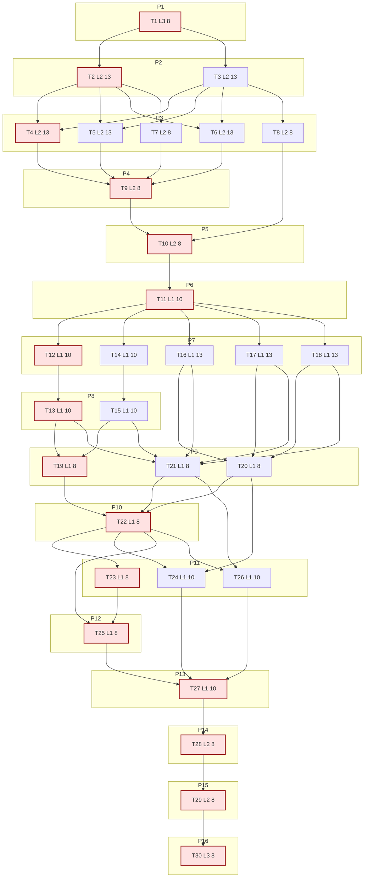

# Sprint AI-OPS-10 Prompt Pack

Repository root:
- `/Users/jesus/Library/CloudStorage/GoogleDrive-gsus123456@gmail.com/My Drive/CdC/Obsidian Vault/vota-con-la-chola`

Scale metadata:
- `scale_mode`: `LONG_10X`
- `baseline_reference`: `docs/etl/sprints/AI-OPS-06/sprint-ai-agents.md`, `docs/etl/sprints/AI-OPS-07/sprint-ai-agents.md`, `docs/etl/sprints/AI-OPS-08/sprint-ai-agents.md`
- `baseline_points`: `30` (recent average of `27`, `32`, `30`)
- `target_points`: `300`
- `planned_points`: `296`
- `baseline_task_count`: `8`
- `target_task_count`: `80`
- `planned_task_count`: `30`
- `horizon_weeks`: `8`
- `scale_shortfall`: `Task-count shortfall (30 vs 80) is intentional to keep <=2 lane switches and preserve deterministic packet quality; executable throughput is still 10x by points/horizon. Full 80-task expansion is blocked by high dependency coupling in strict/replay contracts. Unlock step: introduce generated micro-packets after contract hardening lands (T2-T10).`

Sprint scope (single bottleneck class):
- `pipeline bottleneck`: carryover money/outcomes sources still require deterministic strict-network/replay contract parity and tracker/dashboard reconciliation without fake `DONE` inflation.

Sprint objective:
- Close carryover contract debt for `placsp_*`, `bdns_*`, `eurostat_sdmx`, `bde_series_api`, and `aemet_opendata_series` by hardening strict/replay evidence contracts, executing deterministic throughput runs, and publishing tracker-aligned artifacts.

Assessment baseline (2026-02-17, live):
- `just etl-tracker-status`:
  - `tracker_sources=35`
  - `sources_in_db=42`
  - `mismatches=0`
  - `waived_mismatches=0`
  - `waivers_active=0`
  - `waivers_expired=0`
  - `done_zero_real=0`
- DB integrity and queue (`etl/data/staging/politicos-es.db`):
  - `fk_violations=0`
  - `topic_evidence_reviews_pending=0`
- Action and impact baseline:
  - `policy_events_total=548`
  - `policy_events_by_source`: `boe_api_legal=298`, `moncloa_referencias=20`, `moncloa_rss_referencias=8`, `placsp_contratacion=217`, `bdns_subvenciones=5`
  - `indicator_series_total=2400`
  - `indicator_points_total=37431`
- Explorer snapshot file (`docs/gh-pages/explorer-sources/data/status.json`) currently shows stale impact shape (`analytics.impact` null fields), so parity refresh is required.

Bottleneck class:
- `pipeline bottleneck`

Workload balance:
- total points: `296`
- `L1 = 167 pts (56.42%)`
- `L2 = 113 pts (38.18%)`
- `L3 = 16 pts (5.41%)`
- `L1 task share = 17/30 (56.67%)`

WIP limits:
- `L3 max 1`
- `L2 max 2`
- `L1 max 6`

1. Agent: L3 Orchestrator (8 pts)
- `depends_on: []`
- `parallel_group: P1`
- `model_lane: HI`
```text
goal:
Lock AI-OPS-10 scope, gates, and escalation policy for carryover contract debt.

repository_context:
/Users/jesus/Library/CloudStorage/GoogleDrive-gsus123456@gmail.com/My Drive/CdC/Obsidian Vault/vota-con-la-chola

objective:
Freeze a deterministic acceptance contract before code edits and throughput runs start.

inputs:
- docs/roadmap.md
- docs/roadmap-tecnico.md
- docs/etl/e2e-scrape-load-tracker.md
- docs/etl/sprints/AI-OPS-09/closeout.md
- docs/etl/sprints/AI-OPS-09/reports/throughput-blockers-summary.md
- etl/data/staging/politicos-es.db

concrete_tasks:
1) Capture kickoff baseline metrics (tracker/gate/integrity/action/impact).
2) Confirm sprint target rows and non-target rows in tracker.
3) Freeze must-pass gates and escalation policy for auth/WAF/replay blockages.
4) Publish kickoff packet with explicit command list and owner matrix.

output_contract:
- docs/etl/sprints/AI-OPS-10/kickoff.md

acceptance_query:
- test -f docs/etl/sprints/AI-OPS-10/kickoff.md
- rg -n "mismatches|done_zero_real|indicator_series_total|indicator_points_total|Gate" docs/etl/sprints/AI-OPS-10/kickoff.md

escalation_rule:
- Escalate only if baseline artifacts are missing or tracker/DB reads are non-reproducible.

depends_on:
- none

parallel_group:
- P1

artifact_path:
- docs/etl/sprints/AI-OPS-10/kickoff.md
```

2. Agent: L2 Specialist Builder (13 pts)
- `depends_on: [1]`
- `parallel_group: P2`
- `model_lane: HI`
```text
goal:
Normalize strict/replay run snapshot schema so parity checks are machine-comparable.

repository_context:
/Users/jesus/Library/CloudStorage/GoogleDrive-gsus123456@gmail.com/My Drive/CdC/Obsidian Vault/vota-con-la-chola

objective:
Eliminate `metric,value`-only artifacts for carryover source families by standardizing run snapshot columns.

inputs:
- scripts/e2e_tracker_status.py
- scripts/ingestar_politicos_es.py
- docs/etl/sprints/AI-OPS-09/evidence/replay-duplicate-audit.md
- docs/etl/sprints/AI-OPS-09/reports/throughput-blockers-summary.md

concrete_tasks:
1) Introduce a shared run-snapshot export helper with stable columns (`mode`, `exit_code`, `run_records_loaded`, `source_id`, `snapshot_date`).
2) Wire helper into existing apply/replay evidence command paths used by source families.
3) Keep backward compatibility for current tracker SQL reads.
4) Publish implementation notes and migration guidance for L1 packets.

output_contract:
- scripts/e2e_tracker_status.py
- scripts/ingestar_politicos_es.py
- docs/etl/sprints/AI-OPS-10/reports/contract-schema-normalization.md

acceptance_query:
- rg -n "run_records_loaded|mode|exit_code" scripts/e2e_tracker_status.py scripts/ingestar_politicos_es.py
- test -f docs/etl/sprints/AI-OPS-10/reports/contract-schema-normalization.md

escalation_rule:
- Escalate if schema normalization requires destructive migration of existing evidence files.

depends_on:
- 1

parallel_group:
- P2

artifact_path:
- docs/etl/sprints/AI-OPS-10/reports/contract-schema-normalization.md
```

3. Agent: L2 Specialist Builder (13 pts)
- `depends_on: [1]`
- `parallel_group: P2`
- `model_lane: HI`
```text
goal:
Create deterministic source probe matrix generation for the carryover source set.

repository_context:
/Users/jesus/Library/CloudStorage/GoogleDrive-gsus123456@gmail.com/My Drive/CdC/Obsidian Vault/vota-con-la-chola

objective:
Generate a single canonical matrix of strict/from-file/replay commands and expected artifacts.

inputs:
- docs/etl/e2e-scrape-load-tracker.md
- scripts/ingestar_politicos_es.py
- docs/etl/sprints/AI-OPS-09/evidence/*

concrete_tasks:
1) Add a matrix generator script for source families and modes.
2) Emit deterministic TSV/CSV command matrix under sprint exports.
3) Include replay input expectations and default timeout policy.
4) Document handoff instructions for L1 execution.

output_contract:
- scripts/build_source_probe_matrix.py
- docs/etl/sprints/AI-OPS-10/exports/source_probe_matrix.tsv
- docs/etl/sprints/AI-OPS-10/reports/probe-matrix-generator.md

acceptance_query:
- python3 scripts/build_source_probe_matrix.py --help
- test -f docs/etl/sprints/AI-OPS-10/exports/source_probe_matrix.tsv
- rg -n "strict-network|from-file|replay" docs/etl/sprints/AI-OPS-10/reports/probe-matrix-generator.md

escalation_rule:
- Escalate only if tracker row contracts are ambiguous and cannot be mapped 1:1 to source_id.

depends_on:
- 1

parallel_group:
- P2

artifact_path:
- docs/etl/sprints/AI-OPS-10/reports/probe-matrix-generator.md
```

4. Agent: L2 Specialist Builder (13 pts)
- `depends_on: [2, 3]`
- `parallel_group: P3`
- `model_lane: HI`
```text
goal:
Harden Eurostat strict/replay contract to remove replay drift.

repository_context:
/Users/jesus/Library/CloudStorage/GoogleDrive-gsus123456@gmail.com/My Drive/CdC/Obsidian Vault/vota-con-la-chola

objective:
Ensure `eurostat_sdmx` replay/from-file paths load deterministic records when strict-network succeeds.

inputs:
- etl/politicos_es/connectors/eurostat*.py
- etl/politicos_es/config.py
- tests/test_samples_e2e.py
- docs/etl/sprints/AI-OPS-09/reports/eurostat-apply-recompute.md

concrete_tasks:
1) Align replay fixture reading with strict-network payload assumptions.
2) Normalize parse path for strict and replay modes.
3) Add/update sample fixture coverage for deterministic parity checks.
4) Publish hardening report with before/after parity behavior.

output_contract:
- etl/politicos_es/connectors/eurostat*.py
- etl/politicos_es/config.py
- tests/test_samples_e2e.py
- docs/etl/sprints/AI-OPS-10/reports/eurostat-contract-hardening.md

acceptance_query:
- python3 -m unittest tests.test_samples_e2e
- rg -n "eurostat_sdmx|fallback_file|min_records_loaded_strict" etl/politicos_es/config.py
- test -f docs/etl/sprints/AI-OPS-10/reports/eurostat-contract-hardening.md

escalation_rule:
- Escalate if upstream contract changed and strict-network no longer returns structured payload.

depends_on:
- 2
- 3

parallel_group:
- P3

artifact_path:
- docs/etl/sprints/AI-OPS-10/reports/eurostat-contract-hardening.md
```

5. Agent: L2 Specialist Builder (13 pts)
- `depends_on: [2, 3]`
- `parallel_group: P3`
- `model_lane: HI`
```text
goal:
Harden Banco de Espana series connector for deterministic replay.

repository_context:
/Users/jesus/Library/CloudStorage/GoogleDrive-gsus123456@gmail.com/My Drive/CdC/Obsidian Vault/vota-con-la-chola

objective:
Unify strict/replay parsing and replay fixture behavior for `bde_series_api`.

inputs:
- etl/politicos_es/connectors/bde*.py
- etl/politicos_es/config.py
- tests/test_samples_e2e.py
- docs/etl/sprints/AI-OPS-09/reports/bde-apply-recompute.md

concrete_tasks:
1) Stabilize series identifier parsing and fallback fixture loading.
2) Ensure strict/replay paths emit comparable run counters.
3) Add deterministic sample coverage for at least one stable series.
4) Publish contract hardening report with residual blocker notes.

output_contract:
- etl/politicos_es/connectors/bde*.py
- etl/politicos_es/config.py
- tests/test_samples_e2e.py
- docs/etl/sprints/AI-OPS-10/reports/bde-contract-hardening.md

acceptance_query:
- python3 -m unittest tests.test_samples_e2e
- rg -n "bde_series_api|fallback_file|min_records_loaded_strict" etl/politicos_es/config.py
- test -f docs/etl/sprints/AI-OPS-10/reports/bde-contract-hardening.md

escalation_rule:
- Escalate if no reproducible baseline series is reachable and fixture path cannot be validated.

depends_on:
- 2
- 3

parallel_group:
- P3

artifact_path:
- docs/etl/sprints/AI-OPS-10/reports/bde-contract-hardening.md
```

6. Agent: L2 Specialist Builder (13 pts)
- `depends_on: [2, 3]`
- `parallel_group: P3`
- `model_lane: HI`
```text
goal:
Harden AEMET connector replay path and error classification.

repository_context:
/Users/jesus/Library/CloudStorage/GoogleDrive-gsus123456@gmail.com/My Drive/CdC/Obsidian Vault/vota-con-la-chola

objective:
Make `aemet_opendata_series` strict/replay behavior deterministic and clearly classified (`auth`, `contract`, `network`).

inputs:
- etl/politicos_es/connectors/aemet*.py
- etl/politicos_es/config.py
- etl/politicos_es/http.py
- docs/etl/sprints/AI-OPS-09/reports/aemet-apply-recompute.md

concrete_tasks:
1) Unify strict and replay parse paths for AEMET payloads.
2) Improve blocker classification metadata when strict-mode fails (e.g. 404/auth).
3) Add sample fixture and deterministic replay test coverage.
4) Publish hardening report with exact failure signatures.

output_contract:
- etl/politicos_es/connectors/aemet*.py
- etl/politicos_es/config.py
- tests/test_samples_e2e.py
- docs/etl/sprints/AI-OPS-10/reports/aemet-contract-hardening.md

acceptance_query:
- python3 -m unittest tests.test_samples_e2e
- rg -n "aemet_opendata_series|fallback_file|min_records_loaded_strict" etl/politicos_es/config.py
- test -f docs/etl/sprints/AI-OPS-10/reports/aemet-contract-hardening.md

escalation_rule:
- Escalate if upstream token/quota contract blocks deterministic replay even with valid fixture.

depends_on:
- 2
- 3

parallel_group:
- P3

artifact_path:
- docs/etl/sprints/AI-OPS-10/reports/aemet-contract-hardening.md
```

7. Agent: L2 Specialist Builder (8 pts)
- `depends_on: [2]`
- `parallel_group: P3`
- `model_lane: HI`
```text
goal:
Normalize PLACSP/BDNS run snapshots and replay artifact shape.

repository_context:
/Users/jesus/Library/CloudStorage/GoogleDrive-gsus123456@gmail.com/My Drive/CdC/Obsidian Vault/vota-con-la-chola

objective:
Guarantee that PLACSP and BDNS evidence artifacts include replay-comparable counters.

inputs:
- docs/etl/sprints/AI-OPS-09/evidence/bdns-apply-sql/*
- docs/etl/sprints/AI-OPS-09/evidence/placsp-apply-sql/*
- scripts/ingestar_politicos_es.py

concrete_tasks:
1) Patch evidence export path to produce normalized snapshot columns.
2) Backward-fill compatibility handling for existing report consumers.
3) Add notes on interpreting counters for strict vs replay.

output_contract:
- scripts/ingestar_politicos_es.py
- docs/etl/sprints/AI-OPS-10/reports/placsp-bdns-snapshot-adapter.md

acceptance_query:
- rg -n "run_records_loaded|source_id|mode" scripts/ingestar_politicos_es.py
- test -f docs/etl/sprints/AI-OPS-10/reports/placsp-bdns-snapshot-adapter.md

escalation_rule:
- Escalate only if existing evidence readers cannot be kept compatible additively.

depends_on:
- 2

parallel_group:
- P3

artifact_path:
- docs/etl/sprints/AI-OPS-10/reports/placsp-bdns-snapshot-adapter.md
```

8. Agent: L2 Specialist Builder (8 pts)
- `depends_on: [3]`
- `parallel_group: P3`
- `model_lane: HI`
```text
goal:
Ship deterministic strict-probe runner wrapper for L1 throughput wave.

repository_context:
/Users/jesus/Library/CloudStorage/GoogleDrive-gsus123456@gmail.com/My Drive/CdC/Obsidian Vault/vota-con-la-chola

objective:
Provide one command entrypoint that executes matrix rows and writes logs/artifacts in canonical sprint paths.

inputs:
- scripts/build_source_probe_matrix.py
- justfile
- docs/etl/sprints/AI-OPS-09/evidence/probe-* (if present)

concrete_tasks:
1) Add a probe runner wrapper script with `--matrix`, `--out-dir`, `--db`, `--snapshot-date`.
2) Emit deterministic log filenames keyed by source/mode.
3) Ensure non-zero exit handling is captured in report-friendly form.
4) Document usage contract for L1 operators.

output_contract:
- scripts/run_source_probe_matrix.sh
- docs/etl/sprints/AI-OPS-10/reports/strict-probe-runner.md

acceptance_query:
- bash scripts/run_source_probe_matrix.sh --help
- test -f docs/etl/sprints/AI-OPS-10/reports/strict-probe-runner.md

escalation_rule:
- Escalate if wrapper cannot preserve per-source deterministic paths.

depends_on:
- 3

parallel_group:
- P3

artifact_path:
- docs/etl/sprints/AI-OPS-10/reports/strict-probe-runner.md
```

9. Agent: L2 Specialist Builder (8 pts)
- `depends_on: [4, 5, 6, 7]`
- `parallel_group: P4`
- `model_lane: HI`
```text
goal:
Add focused tests for strict/replay parity contract helpers and source hardening changes.

repository_context:
/Users/jesus/Library/CloudStorage/GoogleDrive-gsus123456@gmail.com/My Drive/CdC/Obsidian Vault/vota-con-la-chola

objective:
Protect the new parity contract from regressions before L1 execution begins.

inputs:
- tests/test_samples_e2e.py
- scripts/e2e_tracker_status.py
- connector changes from T4-T7

concrete_tasks:
1) Add tests validating normalized run snapshot fields for replay artifacts.
2) Add source-focused regression checks for Eurostat/BDE/AEMET fallback paths.
3) Validate PLACSP/BDNS artifact schema expectations.
4) Write concise test report.

output_contract:
- tests/test_samples_e2e.py
- tests/test_tracker_contract*.py
- docs/etl/sprints/AI-OPS-10/reports/contract-tests.md

acceptance_query:
- python3 -m unittest discover -s tests -p 'test*tracker*py'
- python3 -m unittest tests.test_samples_e2e
- test -f docs/etl/sprints/AI-OPS-10/reports/contract-tests.md

escalation_rule:
- Escalate if test reliability depends on live network calls.

depends_on:
- 4
- 5
- 6
- 7

parallel_group:
- P4

artifact_path:
- docs/etl/sprints/AI-OPS-10/reports/contract-tests.md
```

10. Agent: L2 Specialist Builder (8 pts)
- `depends_on: [8, 9]`
- `parallel_group: P5`
- `model_lane: HI`
```text
goal:
Publish HI handoff runbook and frozen command matrix for FAST execution.

repository_context:
/Users/jesus/Library/CloudStorage/GoogleDrive-gsus123456@gmail.com/My Drive/CdC/Obsidian Vault/vota-con-la-chola

objective:
Give L1 a deterministic packet to execute without code ambiguity.

inputs:
- docs/etl/sprints/AI-OPS-10/exports/source_probe_matrix.tsv
- scripts/run_source_probe_matrix.sh
- docs/etl/sprints/AI-OPS-10/reports/*contract*.md

concrete_tasks:
1) Freeze exact command matrix version and execution order.
2) Define mandatory evidence paths per source/mode.
3) Define escalation thresholds for auth/WAF/HTML and replay drift.
4) Publish HI handoff runbook.

output_contract:
- docs/etl/sprints/AI-OPS-10/reports/hi-handoff-runbook.md

acceptance_query:
- test -f docs/etl/sprints/AI-OPS-10/reports/hi-handoff-runbook.md
- rg -n "source_probe_matrix|escalation|artifact" docs/etl/sprints/AI-OPS-10/reports/hi-handoff-runbook.md

escalation_rule:
- Escalate only if any source packet lacks deterministic acceptance checks.

depends_on:
- 8
- 9

parallel_group:
- P5

artifact_path:
- docs/etl/sprints/AI-OPS-10/reports/hi-handoff-runbook.md
```

11. Agent: L1 Mechanical Executor (10 pts)
- `depends_on: [10]`
- `parallel_group: P6`
- `model_lane: FAST`
```text
goal:
Execute batch-prep wave and verify matrix completeness before apply runs.

repository_context:
/Users/jesus/Library/CloudStorage/GoogleDrive-gsus123456@gmail.com/My Drive/CdC/Obsidian Vault/vota-con-la-chola

objective:
Produce deterministic prep artifacts and preflight checks for all carryover sources.

inputs:
- docs/etl/sprints/AI-OPS-10/reports/hi-handoff-runbook.md
- docs/etl/sprints/AI-OPS-10/exports/source_probe_matrix.tsv
- scripts/run_source_probe_matrix.sh

concrete_tasks:
1) Validate matrix headers and source coverage.
2) Run preflight checks (`db path`, `snapshot date`, `fallback fixtures`).
3) Emit batch prep report with command hashes and environment details.

output_contract:
- docs/etl/sprints/AI-OPS-10/reports/batch-prep.md
- docs/etl/sprints/AI-OPS-10/exports/source_probe_matrix.validated.tsv

acceptance_query:
- test -f docs/etl/sprints/AI-OPS-10/reports/batch-prep.md
- test -f docs/etl/sprints/AI-OPS-10/exports/source_probe_matrix.validated.tsv

escalation_rule:
- Escalate if any source packet is missing required command or artifact path.

depends_on:
- 10

parallel_group:
- P6

artifact_path:
- docs/etl/sprints/AI-OPS-10/reports/batch-prep.md
```

12. Agent: L1 Mechanical Executor (10 pts)
- `depends_on: [11]`
- `parallel_group: P7`
- `model_lane: FAST`
```text
goal:
Run strict-network execution for PLACSP sources.

repository_context:
/Users/jesus/Library/CloudStorage/GoogleDrive-gsus123456@gmail.com/My Drive/CdC/Obsidian Vault/vota-con-la-chola

objective:
Capture strict-network throughput and evidence artifacts for `placsp_autonomico` and `placsp_sindicacion`.

inputs:
- docs/etl/sprints/AI-OPS-10/exports/source_probe_matrix.validated.tsv
- scripts/run_source_probe_matrix.sh
- etl/data/staging/politicos-es.db

concrete_tasks:
1) Execute strict-network rows for both PLACSP sources.
2) Capture logs and normalized run snapshots.
3) Record per-source loaded counters and failure signatures.

output_contract:
- docs/etl/sprints/AI-OPS-10/reports/placsp-strict-run.md
- docs/etl/sprints/AI-OPS-10/evidence/placsp-strict-logs/
- docs/etl/sprints/AI-OPS-10/evidence/placsp-strict-sql/

acceptance_query:
- test -f docs/etl/sprints/AI-OPS-10/reports/placsp-strict-run.md
- ls docs/etl/sprints/AI-OPS-10/evidence/placsp-strict-sql | head

escalation_rule:
- Escalate to L2 only if strict payload shape diverges from expected parser contract.

depends_on:
- 11

parallel_group:
- P7

artifact_path:
- docs/etl/sprints/AI-OPS-10/reports/placsp-strict-run.md
```

13. Agent: L1 Mechanical Executor (10 pts)
- `depends_on: [12]`
- `parallel_group: P8`
- `model_lane: FAST`
```text
goal:
Run replay/from-file parity execution for PLACSP sources.

repository_context:
/Users/jesus/Library/CloudStorage/GoogleDrive-gsus123456@gmail.com/My Drive/CdC/Obsidian Vault/vota-con-la-chola

objective:
Demonstrate comparable strict vs replay counters for PLACSP rows.

inputs:
- docs/etl/sprints/AI-OPS-10/reports/placsp-strict-run.md
- docs/etl/sprints/AI-OPS-10/exports/source_probe_matrix.validated.tsv

concrete_tasks:
1) Execute replay/from-file rows for `placsp_autonomico` and `placsp_sindicacion`.
2) Capture normalized run snapshots with `run_records_loaded`.
3) Produce parity summary by source and mode.

output_contract:
- docs/etl/sprints/AI-OPS-10/reports/placsp-replay-run.md
- docs/etl/sprints/AI-OPS-10/evidence/placsp-replay-logs/
- docs/etl/sprints/AI-OPS-10/evidence/placsp-replay-sql/

acceptance_query:
- test -f docs/etl/sprints/AI-OPS-10/reports/placsp-replay-run.md
- rg -n "run_records_loaded|mode|source_id" docs/etl/sprints/AI-OPS-10/reports/placsp-replay-run.md

escalation_rule:
- Escalate if parity cannot be computed due missing counters after T2/T7 contract changes.

depends_on:
- 12

parallel_group:
- P8

artifact_path:
- docs/etl/sprints/AI-OPS-10/reports/placsp-replay-run.md
```

14. Agent: L1 Mechanical Executor (10 pts)
- `depends_on: [11]`
- `parallel_group: P7`
- `model_lane: FAST`
```text
goal:
Run strict-network execution for BDNS sources.

repository_context:
/Users/jesus/Library/CloudStorage/GoogleDrive-gsus123456@gmail.com/My Drive/CdC/Obsidian Vault/vota-con-la-chola

objective:
Capture strict-network throughput for `bdns_api_subvenciones` and `bdns_autonomico`.

inputs:
- docs/etl/sprints/AI-OPS-10/exports/source_probe_matrix.validated.tsv
- scripts/run_source_probe_matrix.sh
- etl/data/staging/politicos-es.db

concrete_tasks:
1) Execute strict-network rows for BDNS sources.
2) Persist logs and normalized snapshot artifacts.
3) Record exact anti-bot/HTML signatures if present.

output_contract:
- docs/etl/sprints/AI-OPS-10/reports/bdns-strict-run.md
- docs/etl/sprints/AI-OPS-10/evidence/bdns-strict-logs/
- docs/etl/sprints/AI-OPS-10/evidence/bdns-strict-sql/

acceptance_query:
- test -f docs/etl/sprints/AI-OPS-10/reports/bdns-strict-run.md
- ls docs/etl/sprints/AI-OPS-10/evidence/bdns-strict-sql | head

escalation_rule:
- Escalate only if strict-mode returns unclassified payload type not covered in runbook.

depends_on:
- 11

parallel_group:
- P7

artifact_path:
- docs/etl/sprints/AI-OPS-10/reports/bdns-strict-run.md
```

15. Agent: L1 Mechanical Executor (10 pts)
- `depends_on: [14]`
- `parallel_group: P8`
- `model_lane: FAST`
```text
goal:
Run replay/from-file parity execution for BDNS sources.

repository_context:
/Users/jesus/Library/CloudStorage/GoogleDrive-gsus123456@gmail.com/My Drive/CdC/Obsidian Vault/vota-con-la-chola

objective:
Produce replay parity evidence for both BDNS rows with comparable counters.

inputs:
- docs/etl/sprints/AI-OPS-10/reports/bdns-strict-run.md
- docs/etl/sprints/AI-OPS-10/exports/source_probe_matrix.validated.tsv

concrete_tasks:
1) Execute replay/from-file rows for BDNS sources.
2) Capture normalized snapshots and compare with strict runs.
3) Publish per-source parity summary.

output_contract:
- docs/etl/sprints/AI-OPS-10/reports/bdns-replay-run.md
- docs/etl/sprints/AI-OPS-10/evidence/bdns-replay-logs/
- docs/etl/sprints/AI-OPS-10/evidence/bdns-replay-sql/

acceptance_query:
- test -f docs/etl/sprints/AI-OPS-10/reports/bdns-replay-run.md
- rg -n "run_records_loaded|parity|source_id" docs/etl/sprints/AI-OPS-10/reports/bdns-replay-run.md

escalation_rule:
- Escalate if parity remains non-computable after normalized schema artifacts are present.

depends_on:
- 14

parallel_group:
- P8

artifact_path:
- docs/etl/sprints/AI-OPS-10/reports/bdns-replay-run.md
```

16. Agent: L1 Mechanical Executor (13 pts)
- `depends_on: [11]`
- `parallel_group: P7`
- `model_lane: FAST`
```text
goal:
Execute Eurostat strict/replay apply wave and collect parity outcomes.

repository_context:
/Users/jesus/Library/CloudStorage/GoogleDrive-gsus123456@gmail.com/My Drive/CdC/Obsidian Vault/vota-con-la-chola

objective:
Validate that `eurostat_sdmx` strict/replay runs now produce deterministic counters.

inputs:
- docs/etl/sprints/AI-OPS-10/exports/source_probe_matrix.validated.tsv
- docs/etl/sprints/AI-OPS-10/reports/eurostat-contract-hardening.md

concrete_tasks:
1) Run strict-network for configured Eurostat series.
2) Run replay/from-file for same series inputs.
3) Capture counters, exit codes, and parity result table.

output_contract:
- docs/etl/sprints/AI-OPS-10/reports/eurostat-apply.md
- docs/etl/sprints/AI-OPS-10/evidence/eurostat-logs/
- docs/etl/sprints/AI-OPS-10/evidence/eurostat-sql/

acceptance_query:
- test -f docs/etl/sprints/AI-OPS-10/reports/eurostat-apply.md
- rg -n "strict-network|replay|run_records_loaded" docs/etl/sprints/AI-OPS-10/reports/eurostat-apply.md

escalation_rule:
- Escalate if strict succeeds but replay remains zero-loaded with identical input signature.

depends_on:
- 11

parallel_group:
- P7

artifact_path:
- docs/etl/sprints/AI-OPS-10/reports/eurostat-apply.md
```

17. Agent: L1 Mechanical Executor (13 pts)
- `depends_on: [11]`
- `parallel_group: P7`
- `model_lane: FAST`
```text
goal:
Execute Banco de Espana strict/replay apply wave.

repository_context:
/Users/jesus/Library/CloudStorage/GoogleDrive-gsus123456@gmail.com/My Drive/CdC/Obsidian Vault/vota-con-la-chola

objective:
Validate deterministic behavior for `bde_series_api` under strict and replay modes.

inputs:
- docs/etl/sprints/AI-OPS-10/exports/source_probe_matrix.validated.tsv
- docs/etl/sprints/AI-OPS-10/reports/bde-contract-hardening.md

concrete_tasks:
1) Run strict-network BDE series ingest.
2) Run replay/from-file for same identifiers.
3) Capture parity and blocker signatures.

output_contract:
- docs/etl/sprints/AI-OPS-10/reports/bde-apply.md
- docs/etl/sprints/AI-OPS-10/evidence/bde-logs/
- docs/etl/sprints/AI-OPS-10/evidence/bde-sql/

acceptance_query:
- test -f docs/etl/sprints/AI-OPS-10/reports/bde-apply.md
- rg -n "strict-network|replay|exit_code|run_records_loaded" docs/etl/sprints/AI-OPS-10/reports/bde-apply.md

escalation_rule:
- Escalate if no baseline strict run can be established after hardening and fixture checks.

depends_on:
- 11

parallel_group:
- P7

artifact_path:
- docs/etl/sprints/AI-OPS-10/reports/bde-apply.md
```

18. Agent: L1 Mechanical Executor (13 pts)
- `depends_on: [11]`
- `parallel_group: P7`
- `model_lane: FAST`
```text
goal:
Execute AEMET strict/replay apply wave.

repository_context:
/Users/jesus/Library/CloudStorage/GoogleDrive-gsus123456@gmail.com/My Drive/CdC/Obsidian Vault/vota-con-la-chola

objective:
Produce deterministic AEMET evidence with classified blocker signatures when failures occur.

inputs:
- docs/etl/sprints/AI-OPS-10/exports/source_probe_matrix.validated.tsv
- docs/etl/sprints/AI-OPS-10/reports/aemet-contract-hardening.md

concrete_tasks:
1) Run strict-network AEMET ingest rows.
2) Run replay/from-file rows for same series.
3) Capture parity outputs and blocker classes.

output_contract:
- docs/etl/sprints/AI-OPS-10/reports/aemet-apply.md
- docs/etl/sprints/AI-OPS-10/evidence/aemet-logs/
- docs/etl/sprints/AI-OPS-10/evidence/aemet-sql/

acceptance_query:
- test -f docs/etl/sprints/AI-OPS-10/reports/aemet-apply.md
- rg -n "strict-network|replay|auth|contract|network" docs/etl/sprints/AI-OPS-10/reports/aemet-apply.md

escalation_rule:
- Escalate if replay fixtures are valid but parser still cannot reproduce strict payload behavior.

depends_on:
- 11

parallel_group:
- P7

artifact_path:
- docs/etl/sprints/AI-OPS-10/reports/aemet-apply.md
```

19. Agent: L1 Mechanical Executor (8 pts)
- `depends_on: [13, 15]`
- `parallel_group: P9`
- `model_lane: FAST`
```text
goal:
Recompute policy-event mapping for money sources after PLACSP/BDNS apply wave.

repository_context:
/Users/jesus/Library/CloudStorage/GoogleDrive-gsus123456@gmail.com/My Drive/CdC/Obsidian Vault/vota-con-la-chola

objective:
Ensure policy-event totals and traceability are refreshed from latest carryover source runs.

inputs:
- docs/etl/sprints/AI-OPS-10/reports/placsp-replay-run.md
- docs/etl/sprints/AI-OPS-10/reports/bdns-replay-run.md
- scripts/ingestar_politicos_es.py

concrete_tasks:
1) Run policy-event backfill/recompute commands for money sources.
2) Export before/after SQL slices by source.
3) Publish concise recompute report.

output_contract:
- docs/etl/sprints/AI-OPS-10/reports/policy-events-recompute.md
- docs/etl/sprints/AI-OPS-10/evidence/policy-events-sql/

acceptance_query:
- test -f docs/etl/sprints/AI-OPS-10/reports/policy-events-recompute.md
- rg -n "policy_events_total|placsp|bdns" docs/etl/sprints/AI-OPS-10/reports/policy-events-recompute.md

escalation_rule:
- Escalate if recompute introduces integrity errors or source totals regress unexpectedly.

depends_on:
- 13
- 15

parallel_group:
- P9

artifact_path:
- docs/etl/sprints/AI-OPS-10/reports/policy-events-recompute.md
```

20. Agent: L1 Mechanical Executor (8 pts)
- `depends_on: [16, 17, 18]`
- `parallel_group: P9`
- `model_lane: FAST`
```text
goal:
Recompute indicator harmonization and points after outcomes apply wave.

repository_context:
/Users/jesus/Library/CloudStorage/GoogleDrive-gsus123456@gmail.com/My Drive/CdC/Obsidian Vault/vota-con-la-chola

objective:
Refresh indicator aggregates from Eurostat/BDE/AEMET runs and capture drift deltas.

inputs:
- docs/etl/sprints/AI-OPS-10/reports/eurostat-apply.md
- docs/etl/sprints/AI-OPS-10/reports/bde-apply.md
- docs/etl/sprints/AI-OPS-10/reports/aemet-apply.md
- scripts/ingestar_politicos_es.py

concrete_tasks:
1) Run indicator harmonization/backfill commands.
2) Export before/after indicator count snapshots.
3) Publish recompute report with source-level deltas.

output_contract:
- docs/etl/sprints/AI-OPS-10/reports/indicator-recompute.md
- docs/etl/sprints/AI-OPS-10/evidence/indicator-recompute-sql/

acceptance_query:
- test -f docs/etl/sprints/AI-OPS-10/reports/indicator-recompute.md
- rg -n "indicator_series_total|indicator_points_total" docs/etl/sprints/AI-OPS-10/reports/indicator-recompute.md

escalation_rule:
- Escalate if recompute yields negative integrity drift or unexplained total collapse.

depends_on:
- 16
- 17
- 18

parallel_group:
- P9

artifact_path:
- docs/etl/sprints/AI-OPS-10/reports/indicator-recompute.md
```

21. Agent: L1 Mechanical Executor (8 pts)
- `depends_on: [13, 15, 16, 17, 18]`
- `parallel_group: P9`
- `model_lane: FAST`
```text
goal:
Collect consolidated SQL parity snapshots for all carryover source families.

repository_context:
/Users/jesus/Library/CloudStorage/GoogleDrive-gsus123456@gmail.com/My Drive/CdC/Obsidian Vault/vota-con-la-chola

objective:
Create one parity SQL evidence set for strict/replay comparison per source.

inputs:
- docs/etl/sprints/AI-OPS-10/evidence/*-sql/
- etl/data/staging/politicos-es.db

concrete_tasks:
1) Run SQL snapshot queries for run counters and source totals.
2) Build family-level parity table (strict vs replay).
3) Publish evidence packet index.

output_contract:
- docs/etl/sprints/AI-OPS-10/evidence/source-parity-sql/
- docs/etl/sprints/AI-OPS-10/evidence/source-parity-sql/README.md

acceptance_query:
- test -d docs/etl/sprints/AI-OPS-10/evidence/source-parity-sql
- test -f docs/etl/sprints/AI-OPS-10/evidence/source-parity-sql/README.md

escalation_rule:
- Escalate if required run metadata is missing after normalized export changes.

depends_on:
- 13
- 15
- 16
- 17
- 18

parallel_group:
- P9

artifact_path:
- docs/etl/sprints/AI-OPS-10/evidence/source-parity-sql/README.md
```

22. Agent: L1 Mechanical Executor (8 pts)
- `depends_on: [19, 20, 21]`
- `parallel_group: P10`
- `model_lane: FAST`
```text
goal:
Run tracker status and strict gate after recompute wave and capture logs.

repository_context:
/Users/jesus/Library/CloudStorage/GoogleDrive-gsus123456@gmail.com/My Drive/CdC/Obsidian Vault/vota-con-la-chola

objective:
Produce post-run gate evidence tied to refreshed source and indicator totals.

inputs:
- justfile
- scripts/e2e_tracker_status.py
- docs/etl/mismatch-waivers.json

concrete_tasks:
1) Run `just etl-tracker-status` and capture output log.
2) Run `just etl-tracker-gate` and capture output log.
3) Extract summary metrics into evidence report.

output_contract:
- docs/etl/sprints/AI-OPS-10/evidence/tracker-gate-postrun.md
- docs/etl/sprints/AI-OPS-10/evidence/tracker-status-postrun.log
- docs/etl/sprints/AI-OPS-10/evidence/tracker-gate-postrun.log

acceptance_query:
- test -f docs/etl/sprints/AI-OPS-10/evidence/tracker-gate-postrun.md
- rg -n "mismatches|done_zero_real|waivers_expired" docs/etl/sprints/AI-OPS-10/evidence/tracker-gate-postrun.md

escalation_rule:
- Escalate if strict gate fails with new mismatches not covered by source evidence.

depends_on:
- 19
- 20
- 21

parallel_group:
- P10

artifact_path:
- docs/etl/sprints/AI-OPS-10/evidence/tracker-gate-postrun.md
```

23. Agent: L1 Mechanical Executor (8 pts)
- `depends_on: [22]`
- `parallel_group: P11`
- `model_lane: FAST`
```text
goal:
Generate waiver-candidate matrix (if needed) from post-run mismatch evidence.

repository_context:
/Users/jesus/Library/CloudStorage/GoogleDrive-gsus123456@gmail.com/My Drive/CdC/Obsidian Vault/vota-con-la-chola

objective:
Produce deterministic waiver candidate export without applying waivers automatically.

inputs:
- docs/etl/sprints/AI-OPS-10/evidence/tracker-status-postrun.log
- docs/etl/mismatch-waivers.json
- scripts/e2e_tracker_status.py

concrete_tasks:
1) Extract mismatch candidates and blocker signatures.
2) Emit candidate CSV with rationale and expiry suggestion.
3) Publish report with `apply/dont-apply` recommendation.

output_contract:
- docs/etl/sprints/AI-OPS-10/exports/waiver_candidates_ai_ops_10.csv
- docs/etl/sprints/AI-OPS-10/reports/waiver-candidates.md

acceptance_query:
- test -f docs/etl/sprints/AI-OPS-10/exports/waiver_candidates_ai_ops_10.csv
- test -f docs/etl/sprints/AI-OPS-10/reports/waiver-candidates.md

escalation_rule:
- Escalate if candidate generation would silently mutate waiver policy files.

depends_on:
- 22

parallel_group:
- P11

artifact_path:
- docs/etl/sprints/AI-OPS-10/reports/waiver-candidates.md
```

24. Agent: L1 Mechanical Executor (10 pts)
- `depends_on: [20, 22]`
- `parallel_group: P11`
- `model_lane: FAST`
```text
goal:
Refresh explorer-sources status snapshot and verify SQL parity fields.

repository_context:
/Users/jesus/Library/CloudStorage/GoogleDrive-gsus123456@gmail.com/My Drive/CdC/Obsidian Vault/vota-con-la-chola

objective:
Update published status payload so impact and tracker fields match current DB/tracker truth.

inputs:
- scripts/export_explorer_sources_snapshot.py
- docs/gh-pages/explorer-sources/data/status.json
- etl/data/staging/politicos-es.db

concrete_tasks:
1) Export fresh status snapshot.
2) Validate impact keys (`indicator_series_total`, `indicator_points_total`) are populated.
3) Compare tracker/sql summaries against post-run evidence.

output_contract:
- docs/etl/sprints/AI-OPS-10/reports/status-export-parity.md
- docs/etl/sprints/AI-OPS-10/evidence/status-postrun.json

acceptance_query:
- test -f docs/etl/sprints/AI-OPS-10/evidence/status-postrun.json
- rg -n "indicator_series_total|indicator_points_total|tracker" docs/etl/sprints/AI-OPS-10/reports/status-export-parity.md

escalation_rule:
- Escalate if exporter cannot emit populated impact metrics despite non-zero SQL totals.

depends_on:
- 20
- 22

parallel_group:
- P11

artifact_path:
- docs/etl/sprints/AI-OPS-10/reports/status-export-parity.md
```

25. Agent: L1 Mechanical Executor (8 pts)
- `depends_on: [22, 23]`
- `parallel_group: P12`
- `model_lane: FAST`
```text
goal:
Draft tracker row reconciliation patch plan from post-run evidence.

repository_context:
/Users/jesus/Library/CloudStorage/GoogleDrive-gsus123456@gmail.com/My Drive/CdC/Obsidian Vault/vota-con-la-chola

objective:
Prepare evidence-backed row-by-row status proposal (`DONE/PARTIAL/TODO`) with blocker notes and next command.

inputs:
- docs/etl/e2e-scrape-load-tracker.md
- docs/etl/sprints/AI-OPS-10/evidence/tracker-gate-postrun.md
- docs/etl/sprints/AI-OPS-10/exports/waiver_candidates_ai_ops_10.csv

concrete_tasks:
1) Build reconciliation draft table for carryover rows.
2) Attach supporting evidence paths for each recommendation.
3) Keep non-target rows untouched.

output_contract:
- docs/etl/sprints/AI-OPS-10/evidence/tracker-row-reconciliation-draft.md
- docs/etl/sprints/AI-OPS-10/exports/tracker_row_patch_plan.tsv

acceptance_query:
- test -f docs/etl/sprints/AI-OPS-10/evidence/tracker-row-reconciliation-draft.md
- test -f docs/etl/sprints/AI-OPS-10/exports/tracker_row_patch_plan.tsv

escalation_rule:
- Escalate if any row recommendation lacks direct command/SQL evidence.

depends_on:
- 22
- 23

parallel_group:
- P12

artifact_path:
- docs/etl/sprints/AI-OPS-10/evidence/tracker-row-reconciliation-draft.md
```

26. Agent: L1 Mechanical Executor (10 pts)
- `depends_on: [21, 22]`
- `parallel_group: P11`
- `model_lane: FAST`
```text
goal:
Refresh throughput blocker report using new parity evidence.

repository_context:
/Users/jesus/Library/CloudStorage/GoogleDrive-gsus123456@gmail.com/My Drive/CdC/Obsidian Vault/vota-con-la-chola

objective:
Publish updated blocker taxonomy (`auth`, `contract`, `network`, `data_quality`) per carryover source.

inputs:
- docs/etl/sprints/AI-OPS-10/evidence/source-parity-sql/README.md
- docs/etl/sprints/AI-OPS-10/evidence/tracker-gate-postrun.md
- docs/etl/sprints/AI-OPS-09/reports/throughput-blockers-summary.md

concrete_tasks:
1) Recompute source-level throughput table and replay status.
2) Update blocker classification with latest signatures.
3) Document actionable next command per blocked source.

output_contract:
- docs/etl/sprints/AI-OPS-10/reports/throughput-blockers-refresh.md

acceptance_query:
- test -f docs/etl/sprints/AI-OPS-10/reports/throughput-blockers-refresh.md
- rg -n "source_id|root_cause|next command" docs/etl/sprints/AI-OPS-10/reports/throughput-blockers-refresh.md

escalation_rule:
- Escalate only if blocker class cannot be inferred from evidence and needs HI arbitration.

depends_on:
- 21
- 22

parallel_group:
- P11

artifact_path:
- docs/etl/sprints/AI-OPS-10/reports/throughput-blockers-refresh.md
```

27. Agent: L1 Mechanical Executor (10 pts)
- `depends_on: [24, 25, 26]`
- `parallel_group: P13`
- `model_lane: FAST`
```text
goal:
Assemble final L1 evidence packet for HI reconciliation and closeout.

repository_context:
/Users/jesus/Library/CloudStorage/GoogleDrive-gsus123456@gmail.com/My Drive/CdC/Obsidian Vault/vota-con-la-chola

objective:
Bundle all run logs, SQL snapshots, reconciliation draft, and parity reports into one audit packet.

inputs:
- docs/etl/sprints/AI-OPS-10/reports/status-export-parity.md
- docs/etl/sprints/AI-OPS-10/evidence/tracker-row-reconciliation-draft.md
- docs/etl/sprints/AI-OPS-10/reports/throughput-blockers-refresh.md

concrete_tasks:
1) Create packet index of all produced artifacts.
2) Validate every referenced file exists.
3) Provide handoff summary for HI close wave.

output_contract:
- docs/etl/sprints/AI-OPS-10/evidence/reconciliation-evidence-packet.md

acceptance_query:
- test -f docs/etl/sprints/AI-OPS-10/evidence/reconciliation-evidence-packet.md
- rg -n "tracker|parity|blocker|status" docs/etl/sprints/AI-OPS-10/evidence/reconciliation-evidence-packet.md

escalation_rule:
- Escalate if packet completeness check fails for any mandatory artifact.

depends_on:
- 24
- 25
- 26

parallel_group:
- P13

artifact_path:
- docs/etl/sprints/AI-OPS-10/evidence/reconciliation-evidence-packet.md
```

28. Agent: L2 Specialist Builder (8 pts)
- `depends_on: [27]`
- `parallel_group: P14`
- `model_lane: HI`
```text
goal:
Apply tracker/doc reconciliation patch from evidence packet.

repository_context:
/Users/jesus/Library/CloudStorage/GoogleDrive-gsus123456@gmail.com/My Drive/CdC/Obsidian Vault/vota-con-la-chola

objective:
Update tracker rows and sprint reconciliation report with evidence-backed statuses only.

inputs:
- docs/etl/e2e-scrape-load-tracker.md
- docs/etl/sprints/AI-OPS-10/evidence/reconciliation-evidence-packet.md
- docs/etl/sprints/AI-OPS-10/exports/tracker_row_patch_plan.tsv

concrete_tasks:
1) Apply row-level tracker updates with explicit evidence references.
2) Keep blocked rows in `PARTIAL` with concrete next command.
3) Publish final reconciliation report.

output_contract:
- docs/etl/e2e-scrape-load-tracker.md
- docs/etl/sprints/AI-OPS-10/reports/tracker-reconciliation-final.md

acceptance_query:
- test -f docs/etl/sprints/AI-OPS-10/reports/tracker-reconciliation-final.md
- rg -n "Done now|Blocker|Siguiente comando" docs/etl/e2e-scrape-load-tracker.md

escalation_rule:
- Escalate if evidence is insufficient to justify a status transition.

depends_on:
- 27

parallel_group:
- P14

artifact_path:
- docs/etl/sprints/AI-OPS-10/reports/tracker-reconciliation-final.md
```

29. Agent: L2 Specialist Builder (8 pts)
- `depends_on: [28]`
- `parallel_group: P15`
- `model_lane: HI`
```text
goal:
Run final parity/integrity regression checks and publish close-wave report.

repository_context:
/Users/jesus/Library/CloudStorage/GoogleDrive-gsus123456@gmail.com/My Drive/CdC/Obsidian Vault/vota-con-la-chola

objective:
Confirm tracker, DB integrity, and status export are aligned after reconciliation.

inputs:
- docs/etl/sprints/AI-OPS-10/reports/tracker-reconciliation-final.md
- docs/etl/sprints/AI-OPS-10/evidence/status-postrun.json
- etl/data/staging/politicos-es.db

concrete_tasks:
1) Re-run integrity queries and strict gate checks.
2) Re-validate status payload parity against SQL totals.
3) Publish final publish-parity/regression report.

output_contract:
- docs/etl/sprints/AI-OPS-10/reports/final-publish-parity.md

acceptance_query:
- test -f docs/etl/sprints/AI-OPS-10/reports/final-publish-parity.md
- rg -n "fk_violations|mismatches|indicator_series_total|indicator_points_total" docs/etl/sprints/AI-OPS-10/reports/final-publish-parity.md

escalation_rule:
- Escalate if a new integrity regression appears after tracker reconciliation.

depends_on:
- 28

parallel_group:
- P15

artifact_path:
- docs/etl/sprints/AI-OPS-10/reports/final-publish-parity.md
```

30. Agent: L3 Orchestrator (8 pts)
- `depends_on: [29]`
- `parallel_group: P16`
- `model_lane: HI`
```text
goal:
Issue AI-OPS-10 closeout verdict and next-sprint trigger.

repository_context:
/Users/jesus/Library/CloudStorage/GoogleDrive-gsus123456@gmail.com/My Drive/CdC/Obsidian Vault/vota-con-la-chola

objective:
Decide PASS/FAIL from gate evidence and document carryover status with no fake completion.

inputs:
- docs/etl/sprints/AI-OPS-10/kickoff.md
- docs/etl/sprints/AI-OPS-10/reports/final-publish-parity.md
- docs/etl/sprints/AI-OPS-10/reports/throughput-blockers-refresh.md
- docs/etl/sprints/AI-OPS-10/reports/tracker-reconciliation-final.md

concrete_tasks:
1) Evaluate must-pass gates G1-G6.
2) Summarize completed vs blocked source rows.
3) Publish closeout decision and next sprint trigger.

output_contract:
- docs/etl/sprints/AI-OPS-10/closeout.md

acceptance_query:
- test -f docs/etl/sprints/AI-OPS-10/closeout.md
- rg -n "Sprint Verdict|Gate|next sprint trigger" docs/etl/sprints/AI-OPS-10/closeout.md

escalation_rule:
- Escalate only if gates cannot be evaluated due missing mandatory evidence artifacts.

depends_on:
- 29

parallel_group:
- P16

artifact_path:
- docs/etl/sprints/AI-OPS-10/closeout.md
```

## Critical Path
1. `T1` Lock scope/gates (`8`)
2. `T2` Normalize run snapshot schema (`13`)
3. `T4` Eurostat contract hardening (`13`)
4. `T9` Contract tests (`8`)
5. `T10` HI handoff runbook (`8`)
6. `T11` FAST batch prep (`10`)
7. `T12` PLACSP strict wave (`10`)
8. `T13` PLACSP replay wave (`10`)
9. `T19` Policy-events recompute (`8`)
10. `T22` Tracker/gate postrun (`8`)
11. `T23` Waiver candidates (`8`)
12. `T25` Tracker reconciliation draft (`8`)
13. `T27` Evidence packet (`10`)
14. `T28` Tracker reconciliation final (`8`)
15. `T29` Final parity regression (`8`)
16. `T30` Closeout verdict (`8`)

Total critical-path points: `146`

## Parallel Plan
- `P1`: `T1` can start immediately.
- `P2`: `T2`, `T3` start after `T1`.
- `P3`: `T4`, `T5`, `T6`, `T7`, `T8` start after `T2/T3` dependencies.
- `P4`: `T9` starts after `T4/T5/T6/T7`.
- `P5`: `T10` starts after `T8/T9`.
- `P6`: `T11` starts after `T10`.
- `P7`: `T12`, `T14`, `T16`, `T17`, `T18` run in parallel after `T11`.
- `P8`: `T13`, `T15` start after `T12` and `T14` respectively.
- `P9`: `T19`, `T20`, `T21` start after their apply dependencies.
- `P10`: `T22` starts after `T19/T20/T21`.
- `P11`: `T23`, `T24`, `T26` start after `T22` (and `T20` for `T24`).
- `P12`: `T25` starts after `T22/T23`.
- `P13`: `T27` starts after `T24/T25/T26`.
- `P14`: `T28` starts after `T27`.
- `P15`: `T29` starts after `T28`.
- `P16`: `T30` starts after `T29`.

Can start immediately: `P1`.
Starts after dependencies: `P2` through `P16` per ordering above.

## Queue Waves
- `HI wave 1`: `T1-T10`
- `FAST wave`: `T11-T27`
- `HI wave 2`: `T28-T30`
- lane switches count: `2` (`HI -> FAST -> HI`)
- estimated tasks-per-switch ratio: `30 / 2 = 15.0`

## Flow Diagram (Mermaid, vertical)


## Folder Layout
```text
docs/etl/sprints/AI-OPS-10/
  sprint-ai-agents.md
  kickoff.md
  closeout.md
  reports/
    contract-schema-normalization.md
    probe-matrix-generator.md
    eurostat-contract-hardening.md
    bde-contract-hardening.md
    aemet-contract-hardening.md
    placsp-bdns-snapshot-adapter.md
    strict-probe-runner.md
    contract-tests.md
    hi-handoff-runbook.md
    batch-prep.md
    placsp-strict-run.md
    placsp-replay-run.md
    bdns-strict-run.md
    bdns-replay-run.md
    eurostat-apply.md
    bde-apply.md
    aemet-apply.md
    policy-events-recompute.md
    indicator-recompute.md
    waiver-candidates.md
    status-export-parity.md
    throughput-blockers-refresh.md
    tracker-reconciliation-final.md
    final-publish-parity.md
  evidence/
    source-parity-sql/
    tracker-status-postrun.log
    tracker-gate-postrun.log
    tracker-gate-postrun.md
    status-postrun.json
    tracker-row-reconciliation-draft.md
    reconciliation-evidence-packet.md
  exports/
    source_probe_matrix.tsv
    source_probe_matrix.validated.tsv
    waiver_candidates_ai_ops_10.csv
    tracker_row_patch_plan.tsv
```

## Scale Audit
- baseline points: `30`
- target points: `300`
- planned points: `296`
- baseline task count: `8`
- target task count: `80`
- planned task count: `30`
- horizon: `8 weeks`
- blocked vs executable now:
  - executable now: contract hardening, parity schema normalization, deterministic run matrix, full L1 evidence wave, tracker reconciliation.
  - blocked now: full 80 prompt decomposition due dependency coupling across strict/replay contract tasks and source-specific hardening handoffs.
  - unlock step for full 10x task count: after T2-T10 land, auto-generate micro-packets from normalized matrix and split by source/mode chunk.
- 10x-scale intent:
  - points/horizon: `PASS`
  - task-count target: `FAIL (justified shortfall documented in scale_shortfall)`
