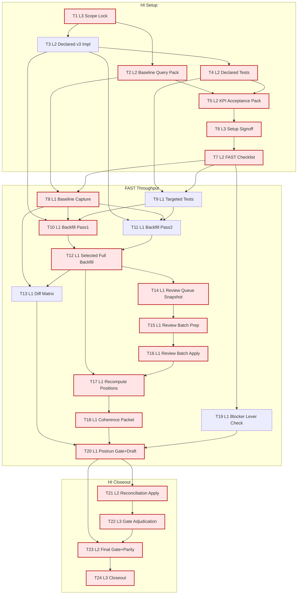

# AI-OPS-16 Sprint Prompt Pack

## Scale Metadata
- `scale_mode`: `LONG_10X`
- `baseline_reference`: `docs/etl/sprints/AI-OPS-15/sprint-ai-agents.md` (points not explicit; inferred baseline proxy used)
- `baseline_points`: `13`
- `target_points`: `130`
- `planned_points`: `125`
- `target_task_count`: `24`
- `planned_task_count`: `24`
- `horizon_weeks`: `6`

## Baseline Snapshot
- Tracker mix: `DONE=34`, `PARTIAL=4`, `TODO=9`
- Declared signal (`congreso_intervenciones`): `202/614` (`0.32899`)
- Review queue: `topic_evidence_reviews_pending=0` (total `524`)
- Coherence snapshot (`as_of_date=2026-02-16`): `overlap=82`, `explicit=58`, `coherent=33`, `incoherent=25`
- Carryover blocker sources: `parlamento_galicia_deputados`, `parlamento_navarra_parlamentarios_forales`, `bde_series_api`, `aemet_opendata_series`

## Sprint Objective
- Increase declared-position signal quality/coverage for `congreso_intervenciones` with reproducible evidence, while preserving strict gate/parity and enforcing anti-loop blocker handling (`no_new_lever` policy).

## Bottleneck Class
- Primary: `signal bottleneck`
- Secondary: `source bottleneck` (external blockers kept in bounded lane)

## WIP Limits
- `L3`: max `1`
- `L2`: max `2`
- `L1`: max `6`

## Prompt Pack

1. Agent: L3 Orchestrator
- `depends_on`: `[]`
- `parallel_group`: `P1`
- `model_lane`: `HI`
- `points`: `5`
```text
Repository path/context:
- /Users/jesus/Library/CloudStorage/GoogleDrive-gsus123456@gmail.com/My Drive/CdC/Obsidian Vault/vota-con-la-chola

Objective:
- Lock AI-OPS-16 scope, must-pass gates, and anti-loop policy boundaries.

Concrete tasks:
- Define single sprint objective and in-scope entities.
- Confirm primary lane (declared signal) and secondary lane (external blockers).
- Declare G1-G6 acceptance gates and escalation rules.

Output contract:
- docs/etl/sprints/AI-OPS-16/kickoff.md
- docs/etl/sprints/AI-OPS-16/reports/scope-lock.md

Acceptance checks:
- test -f docs/etl/sprints/AI-OPS-16/kickoff.md
- rg -n "Scope Lock|Must-pass gates|Execution policy" docs/etl/sprints/AI-OPS-16/kickoff.md

Task packet:
goal: Scope lock and gate contract.
inputs: docs/roadmap.md; docs/roadmap-tecnico.md; docs/etl/e2e-scrape-load-tracker.md; docs/etl/sprints/AI-OPS-15/closeout.md
output_contract: kickoff + scope-lock docs with explicit G1-G6.
acceptance_query: rg checks for gate/policy headers in kickoff and scope-lock docs.
escalation_rule: Escalate if objective requires non-reproducible data policy change.
depends_on: []
parallel_group: P1
artifact_path: docs/etl/sprints/AI-OPS-16/reports/scope-lock.md
```

2. Agent: L2 Specialist Builder
- `depends_on`: `[1]`
- `parallel_group`: `P2`
- `model_lane`: `HI`
- `points`: `5`
```text
Repository path/context:
- /Users/jesus/Library/CloudStorage/GoogleDrive-gsus123456@gmail.com/My Drive/CdC/Obsidian Vault/vota-con-la-chola

Objective:
- Produce the baseline SQL/CLI query pack for declared-signal and queue KPIs.

Concrete tasks:
- Define reproducible SQL for declared_total, declared_with_signal, declared_with_signal_pct.
- Define queue/quality SQL and tracker status command variants.
- Include command snippets for artifact capture.

Output contract:
- docs/etl/sprints/AI-OPS-16/reports/query-pack-baseline.md

Acceptance checks:
- test -f docs/etl/sprints/AI-OPS-16/reports/query-pack-baseline.md
- rg -n "declared_with_signal_pct|topic_evidence_reviews_pending|e2e_tracker_status" docs/etl/sprints/AI-OPS-16/reports/query-pack-baseline.md

Task packet:
goal: Baseline KPI query scaffolding.
inputs: etl/data/staging/politicos-es.db; docs/etl/e2e-scrape-load-tracker.md
output_contract: baseline query pack with runnable commands.
acceptance_query: rg for required KPI/query keywords.
escalation_rule: Escalate if DB schema lacks required fields.
depends_on: [1]
parallel_group: P2
artifact_path: docs/etl/sprints/AI-OPS-16/reports/query-pack-baseline.md
```

3. Agent: L2 Specialist Builder
- `depends_on`: `[1]`
- `parallel_group`: `P3`
- `model_lane`: `HI`
- `points`: `8`
```text
Repository path/context:
- /Users/jesus/Library/CloudStorage/GoogleDrive-gsus123456@gmail.com/My Drive/CdC/Obsidian Vault/vota-con-la-chola

Objective:
- Implement declared-stance signal improvements (v3 rules) with explicit confidence policy.

Concrete tasks:
- Update declared stance extraction logic in etl/parlamentario_es/declared_stance.py.
- Preserve conservative defaults and traceable reasons.
- Document changed regex/rule rationale and expected behavior.

Output contract:
- etl/parlamentario_es/declared_stance.py
- docs/etl/sprints/AI-OPS-16/reports/declared-stance-v3-design.md

Acceptance checks:
- rg -n "_infer_declared_stance_detail|reason" etl/parlamentario_es/declared_stance.py
- test -f docs/etl/sprints/AI-OPS-16/reports/declared-stance-v3-design.md

Task packet:
goal: Improve declared signal extraction while preserving explainability.
inputs: etl/parlamentario_es/declared_stance.py; docs/roadmap-tecnico.md
output_contract: updated extraction logic + design note.
acceptance_query: source diff contains v3 rule updates and design note exists.
escalation_rule: Escalate if rule changes imply policy/arbitration ambiguity.
depends_on: [1]
parallel_group: P3
artifact_path: docs/etl/sprints/AI-OPS-16/reports/declared-stance-v3-design.md
```

4. Agent: L2 Specialist Builder
- `depends_on`: `[3]`
- `parallel_group`: `P4`
- `model_lane`: `HI`
- `points`: `5`
```text
Repository path/context:
- /Users/jesus/Library/CloudStorage/GoogleDrive-gsus123456@gmail.com/My Drive/CdC/Obsidian Vault/vota-con-la-chola

Objective:
- Add/refresh deterministic tests for declared stance and review queue interactions.

Concrete tasks:
- Update or add focused tests for declared stance inference and review record behavior.
- Keep tests sample-driven and deterministic.

Output contract:
- tests/ (targeted declared stance/review tests)
- docs/etl/sprints/AI-OPS-16/reports/declared-stance-v3-tests.md

Acceptance checks:
- rg -n "declared|review" tests
- test -f docs/etl/sprints/AI-OPS-16/reports/declared-stance-v3-tests.md

Task packet:
goal: Protect v3 logic with deterministic tests.
inputs: tests; etl/parlamentario_es/declared_stance.py
output_contract: test updates + test plan note.
acceptance_query: targeted test references exist and plan note exists.
escalation_rule: Escalate if tests require fixture changes outside declared pipeline.
depends_on: [3]
parallel_group: P4
artifact_path: docs/etl/sprints/AI-OPS-16/reports/declared-stance-v3-tests.md
```

5. Agent: L2 Specialist Builder
- `depends_on`: `[2,4]`
- `parallel_group`: `P5`
- `model_lane`: `HI`
- `points`: `5`
```text
Repository path/context:
- /Users/jesus/Library/CloudStorage/GoogleDrive-gsus123456@gmail.com/My Drive/CdC/Obsidian Vault/vota-con-la-chola

Objective:
- Build acceptance KPI pack for signal delta, coherence, and parity checks.

Concrete tasks:
- Define pass thresholds and fail-fast checks for declared signal and strict gate.
- Include parity keys from status payload and SQL.

Output contract:
- docs/etl/sprints/AI-OPS-16/reports/kpi-acceptance-pack.md

Acceptance checks:
- rg -n "declared_with_signal_pct|strict gate|overall_match" docs/etl/sprints/AI-OPS-16/reports/kpi-acceptance-pack.md

Task packet:
goal: Deterministic acceptance contract for FAST wave.
inputs: query-pack-baseline; tracker gate policy; status payload keys
output_contract: acceptance pack with thresholds + commands.
acceptance_query: required KPI terms and command blocks present.
escalation_rule: Escalate if KPI target conflicts with anti-loop policy or data integrity gates.
depends_on: [2,4]
parallel_group: P5
artifact_path: docs/etl/sprints/AI-OPS-16/reports/kpi-acceptance-pack.md
```

6. Agent: L3 Orchestrator
- `depends_on`: `[5]`
- `parallel_group`: `P6`
- `model_lane`: `HI`
- `points`: `3`
```text
Repository path/context:
- /Users/jesus/Library/CloudStorage/GoogleDrive-gsus123456@gmail.com/My Drive/CdC/Obsidian Vault/vota-con-la-chola

Objective:
- Approve setup wave readiness and lock execution order.

Concrete tasks:
- Validate setup artifacts completeness.
- Freeze gating and escalation policies for FAST wave.

Output contract:
- docs/etl/sprints/AI-OPS-16/reports/setup-wave-signoff.md

Acceptance checks:
- test -f docs/etl/sprints/AI-OPS-16/reports/setup-wave-signoff.md
- rg -n "GO|NO-GO|gates|lane" docs/etl/sprints/AI-OPS-16/reports/setup-wave-signoff.md

Task packet:
goal: Setup wave sign-off.
inputs: reports from tasks 1-5
output_contract: signed setup readiness note.
acceptance_query: signoff note includes GO/NO-GO and lane plan.
escalation_rule: Escalate on missing setup artifacts.
depends_on: [5]
parallel_group: P6
artifact_path: docs/etl/sprints/AI-OPS-16/reports/setup-wave-signoff.md
```

7. Agent: L2 Specialist Builder
- `depends_on`: `[6]`
- `parallel_group`: `P7`
- `model_lane`: `HI`
- `points`: `3`
```text
Repository path/context:
- /Users/jesus/Library/CloudStorage/GoogleDrive-gsus123456@gmail.com/My Drive/CdC/Obsidian Vault/vota-con-la-chola

Objective:
- Create deterministic FAST-wave execution checklist for L1 operators.

Concrete tasks:
- Sequence commands and expected outputs for tasks 8-20.
- Include no-op handling when review queue is empty.

Output contract:
- docs/etl/sprints/AI-OPS-16/reports/fast-wave-checklist.md

Acceptance checks:
- rg -n "Task 8|Task 20|no-op" docs/etl/sprints/AI-OPS-16/reports/fast-wave-checklist.md

Task packet:
goal: Operational checklist for FAST wave.
inputs: setup signoff; acceptance pack
output_contract: runnable checklist with expected artifacts.
acceptance_query: checklist enumerates tasks 8-20 and no-op path.
escalation_rule: Escalate if any task lacks deterministic acceptance.
depends_on: [6]
parallel_group: P7
artifact_path: docs/etl/sprints/AI-OPS-16/reports/fast-wave-checklist.md
```

8. Agent: L1 Mechanical Executor
- `depends_on`: `[2,7]`
- `parallel_group`: `P8`
- `model_lane`: `FAST`
- `points`: `5`
```text
Repository path/context:
- /Users/jesus/Library/CloudStorage/GoogleDrive-gsus123456@gmail.com/My Drive/CdC/Obsidian Vault/vota-con-la-chola

Objective:
- Capture baseline declared KPIs and tracker status before changes.

Concrete tasks:
- Run baseline SQL/CLI from query pack.
- Persist logs and normalized CSV metrics.

Output contract:
- docs/etl/sprints/AI-OPS-16/evidence/declared-baseline.log
- docs/etl/sprints/AI-OPS-16/exports/declared_kpi_baseline.csv

Acceptance checks:
- test -f docs/etl/sprints/AI-OPS-16/evidence/declared-baseline.log
- test -f docs/etl/sprints/AI-OPS-16/exports/declared_kpi_baseline.csv

Task packet:
goal: Baseline evidence capture.
inputs: query-pack-baseline; fast-wave-checklist
output_contract: baseline log + KPI csv.
acceptance_query: files exist and include declared_total/declared_with_signal_pct.
escalation_rule: Escalate if baseline extraction fails or returns empty metrics.
depends_on: [2,7]
parallel_group: P8
artifact_path: docs/etl/sprints/AI-OPS-16/exports/declared_kpi_baseline.csv
```

9. Agent: L1 Mechanical Executor
- `depends_on`: `[4,7]`
- `parallel_group`: `P9`
- `model_lane`: `FAST`
- `points`: `3`
```text
Repository path/context:
- /Users/jesus/Library/CloudStorage/GoogleDrive-gsus123456@gmail.com/My Drive/CdC/Obsidian Vault/vota-con-la-chola

Objective:
- Run targeted tests for declared-stance v3 changes.

Concrete tasks:
- Execute focused test subset and capture logs.

Output contract:
- docs/etl/sprints/AI-OPS-16/evidence/declared-tests.log

Acceptance checks:
- test -f docs/etl/sprints/AI-OPS-16/evidence/declared-tests.log
- rg -n "passed|failed" docs/etl/sprints/AI-OPS-16/evidence/declared-tests.log

Task packet:
goal: Confirm v3 tests pass before backfill.
inputs: updated tests; fast-wave-checklist
output_contract: test run log.
acceptance_query: log shows deterministic pass/fail results.
escalation_rule: Escalate immediately on failing tests.
depends_on: [4,7]
parallel_group: P9
artifact_path: docs/etl/sprints/AI-OPS-16/evidence/declared-tests.log
```

10. Agent: L1 Mechanical Executor
- `depends_on`: `[3,8,9]`
- `parallel_group`: `P10`
- `model_lane`: `FAST`
- `points`: `8`
```text
Repository path/context:
- /Users/jesus/Library/CloudStorage/GoogleDrive-gsus123456@gmail.com/My Drive/CdC/Obsidian Vault/vota-con-la-chola

Objective:
- Execute declared stance backfill pass 1 (control threshold).

Concrete tasks:
- Run backfill-declared-stance with baseline threshold.
- Capture JSON/log output and KPI snapshot.

Output contract:
- docs/etl/sprints/AI-OPS-16/evidence/declared_backfill_pass1.log
- docs/etl/sprints/AI-OPS-16/exports/declared_pass1_metrics.csv

Acceptance checks:
- test -f docs/etl/sprints/AI-OPS-16/evidence/declared_backfill_pass1.log
- test -f docs/etl/sprints/AI-OPS-16/exports/declared_pass1_metrics.csv

Task packet:
goal: Control backfill pass.
inputs: declared_stance v3 code; baseline artifacts
output_contract: pass1 run log + metrics csv.
acceptance_query: run exit 0 and metrics captured.
escalation_rule: Escalate on runtime/schema errors.
depends_on: [3,8,9]
parallel_group: P10
artifact_path: docs/etl/sprints/AI-OPS-16/exports/declared_pass1_metrics.csv
```

11. Agent: L1 Mechanical Executor
- `depends_on`: `[3,8,9]`
- `parallel_group`: `P11`
- `model_lane`: `FAST`
- `points`: `8`
```text
Repository path/context:
- /Users/jesus/Library/CloudStorage/GoogleDrive-gsus123456@gmail.com/My Drive/CdC/Obsidian Vault/vota-con-la-chola

Objective:
- Execute declared stance backfill pass 2 (candidate threshold).

Concrete tasks:
- Run backfill-declared-stance with candidate threshold from runbook.
- Capture JSON/log output and KPI snapshot.

Output contract:
- docs/etl/sprints/AI-OPS-16/evidence/declared_backfill_pass2.log
- docs/etl/sprints/AI-OPS-16/exports/declared_pass2_metrics.csv

Acceptance checks:
- test -f docs/etl/sprints/AI-OPS-16/evidence/declared_backfill_pass2.log
- test -f docs/etl/sprints/AI-OPS-16/exports/declared_pass2_metrics.csv

Task packet:
goal: Candidate backfill pass.
inputs: declared_stance v3 code; baseline artifacts
output_contract: pass2 run log + metrics csv.
acceptance_query: run exit 0 and metrics captured.
escalation_rule: Escalate on runtime/schema errors.
depends_on: [3,8,9]
parallel_group: P11
artifact_path: docs/etl/sprints/AI-OPS-16/exports/declared_pass2_metrics.csv
```

12. Agent: L1 Mechanical Executor
- `depends_on`: `[10,11]`
- `parallel_group`: `P12`
- `model_lane`: `FAST`
- `points`: `8`
```text
Repository path/context:
- /Users/jesus/Library/CloudStorage/GoogleDrive-gsus123456@gmail.com/My Drive/CdC/Obsidian Vault/vota-con-la-chola

Objective:
- Apply deterministic threshold selection policy and run selected full backfill.

Concrete tasks:
- Compare pass1 vs pass2 against acceptance policy.
- Execute selected full backfill and capture result.

Output contract:
- docs/etl/sprints/AI-OPS-16/evidence/declared_backfill_selected.log
- docs/etl/sprints/AI-OPS-16/exports/declared_selected_metrics.csv

Acceptance checks:
- test -f docs/etl/sprints/AI-OPS-16/evidence/declared_backfill_selected.log
- test -f docs/etl/sprints/AI-OPS-16/exports/declared_selected_metrics.csv

Task packet:
goal: Policy-driven selection + full apply.
inputs: pass1 metrics; pass2 metrics; acceptance pack
output_contract: selected run log + metrics csv.
acceptance_query: selection rationale recorded and run succeeded.
escalation_rule: Escalate if both passes fail acceptance or run fails.
depends_on: [10,11]
parallel_group: P12
artifact_path: docs/etl/sprints/AI-OPS-16/exports/declared_selected_metrics.csv
```

13. Agent: L1 Mechanical Executor
- `depends_on`: `[8,12]`
- `parallel_group`: `P13`
- `model_lane`: `FAST`
- `points`: `5`
```text
Repository path/context:
- /Users/jesus/Library/CloudStorage/GoogleDrive-gsus123456@gmail.com/My Drive/CdC/Obsidian Vault/vota-con-la-chola

Objective:
- Produce baseline vs selected diff matrix for declared signal KPIs.

Concrete tasks:
- Compare baseline and selected metrics.
- Export delta matrix in CSV.

Output contract:
- docs/etl/sprints/AI-OPS-16/exports/declared_diff_matrix.csv

Acceptance checks:
- test -f docs/etl/sprints/AI-OPS-16/exports/declared_diff_matrix.csv
- rg -n "declared_with_signal|declared_with_signal_pct" docs/etl/sprints/AI-OPS-16/exports/declared_diff_matrix.csv

Task packet:
goal: KPI delta matrix.
inputs: declared_kpi_baseline.csv; declared_selected_metrics.csv
output_contract: diff matrix csv.
acceptance_query: delta rows present for required KPIs.
escalation_rule: Escalate if metric keys mismatch or diff cannot be computed.
depends_on: [8,12]
parallel_group: P13
artifact_path: docs/etl/sprints/AI-OPS-16/exports/declared_diff_matrix.csv
```

14. Agent: L1 Mechanical Executor
- `depends_on`: `[12]`
- `parallel_group`: `P14`
- `model_lane`: `FAST`
- `points`: `5`
```text
Repository path/context:
- /Users/jesus/Library/CloudStorage/GoogleDrive-gsus123456@gmail.com/My Drive/CdC/Obsidian Vault/vota-con-la-chola

Objective:
- Snapshot review queue after selected backfill.

Concrete tasks:
- Export queue totals and pending-by-reason breakdown.

Output contract:
- docs/etl/sprints/AI-OPS-16/evidence/review_queue_snapshot.log
- docs/etl/sprints/AI-OPS-16/exports/review_queue_snapshot.csv

Acceptance checks:
- test -f docs/etl/sprints/AI-OPS-16/evidence/review_queue_snapshot.log
- test -f docs/etl/sprints/AI-OPS-16/exports/review_queue_snapshot.csv

Task packet:
goal: Post-backfill queue visibility.
inputs: DB after selected backfill.
output_contract: queue log + csv.
acceptance_query: queue totals and pending_by_reason rows present.
escalation_rule: Escalate if queue export fails.
depends_on: [12]
parallel_group: P14
artifact_path: docs/etl/sprints/AI-OPS-16/exports/review_queue_snapshot.csv
```

15. Agent: L1 Mechanical Executor
- `depends_on`: `[14]`
- `parallel_group`: `P15`
- `model_lane`: `FAST`
- `points`: `3`
```text
Repository path/context:
- /Users/jesus/Library/CloudStorage/GoogleDrive-gsus123456@gmail.com/My Drive/CdC/Obsidian Vault/vota-con-la-chola

Objective:
- Prepare review batch input (or no-op evidence if pending=0).

Concrete tasks:
- Build `review_batch_a_input.csv` from pending queue by deterministic filters.
- If pending queue is zero, emit explicit no-op note.

Output contract:
- docs/etl/sprints/AI-OPS-16/exports/review_batch_a_input.csv
- docs/etl/sprints/AI-OPS-16/evidence/review_batch_a_prep.log

Acceptance checks:
- test -f docs/etl/sprints/AI-OPS-16/evidence/review_batch_a_prep.log
- test -f docs/etl/sprints/AI-OPS-16/exports/review_batch_a_input.csv

Task packet:
goal: Deterministic review batch prep with no-op path.
inputs: review_queue_snapshot.csv; review runbook
output_contract: batch input csv + prep log.
acceptance_query: file exists and row_count documented.
escalation_rule: Escalate only if queue parsing fails.
depends_on: [14]
parallel_group: P15
artifact_path: docs/etl/sprints/AI-OPS-16/evidence/review_batch_a_prep.log
```

16. Agent: L1 Mechanical Executor
- `depends_on`: `[15]`
- `parallel_group`: `P16`
- `model_lane`: `FAST`
- `points`: `5`
```text
Repository path/context:
- /Users/jesus/Library/CloudStorage/GoogleDrive-gsus123456@gmail.com/My Drive/CdC/Obsidian Vault/vota-con-la-chola

Objective:
- Apply review decisions batch A (or explicit no-op if batch empty).

Concrete tasks:
- Execute review-decision apply path with reproducible options.
- Capture apply/recompute output and status.

Output contract:
- docs/etl/sprints/AI-OPS-16/evidence/review_batch_a_apply.log

Acceptance checks:
- test -f docs/etl/sprints/AI-OPS-16/evidence/review_batch_a_apply.log
- rg -n "resolved|ignored|no-op" docs/etl/sprints/AI-OPS-16/evidence/review_batch_a_apply.log

Task packet:
goal: Apply deterministic review decisions or no-op.
inputs: review_batch_a_input.csv; review-decision command contract
output_contract: apply log.
acceptance_query: apply outcome clearly logged.
escalation_rule: Escalate on apply command error.
depends_on: [15]
parallel_group: P16
artifact_path: docs/etl/sprints/AI-OPS-16/evidence/review_batch_a_apply.log
```

17. Agent: L1 Mechanical Executor
- `depends_on`: `[12,16]`
- `parallel_group`: `P17`
- `model_lane`: `FAST`
- `points`: `8`
```text
Repository path/context:
- /Users/jesus/Library/CloudStorage/GoogleDrive-gsus123456@gmail.com/My Drive/CdC/Obsidian Vault/vota-con-la-chola

Objective:
- Recompute positions/coherence artifacts after declared and review updates.

Concrete tasks:
- Run required recomputes for declared + combined positions.
- Keep `as_of_date` deterministic and capture logs.

Output contract:
- docs/etl/sprints/AI-OPS-16/evidence/recompute_positions.log
- docs/etl/sprints/AI-OPS-16/exports/topic_positions_post_declared.csv

Acceptance checks:
- test -f docs/etl/sprints/AI-OPS-16/evidence/recompute_positions.log
- test -f docs/etl/sprints/AI-OPS-16/exports/topic_positions_post_declared.csv

Task packet:
goal: Recompute analytical outputs after updates.
inputs: selected backfill output; review apply output
output_contract: recompute log + post positions csv.
acceptance_query: recompute exits 0 and output csv exists.
escalation_rule: Escalate on recompute failure.
depends_on: [12,16]
parallel_group: P17
artifact_path: docs/etl/sprints/AI-OPS-16/evidence/recompute_positions.log
```

18. Agent: L1 Mechanical Executor
- `depends_on`: `[17]`
- `parallel_group`: `P18`
- `model_lane`: `FAST`
- `points`: `5`
```text
Repository path/context:
- /Users/jesus/Library/CloudStorage/GoogleDrive-gsus123456@gmail.com/My Drive/CdC/Obsidian Vault/vota-con-la-chola

Objective:
- Export post-run coherence and declared-signal packet.

Concrete tasks:
- Capture coherence summary and evidence counts.
- Export post KPI csvs for declared/coherence gates.

Output contract:
- docs/etl/sprints/AI-OPS-16/evidence/coherence_post.log
- docs/etl/sprints/AI-OPS-16/exports/coherence_post.csv

Acceptance checks:
- test -f docs/etl/sprints/AI-OPS-16/evidence/coherence_post.log
- test -f docs/etl/sprints/AI-OPS-16/exports/coherence_post.csv

Task packet:
goal: Post-run coherence packet for gate adjudication.
inputs: recompute outputs; kpi acceptance pack
output_contract: coherence log + csv.
acceptance_query: overlap/explicit/coherent/incoherent metrics present.
escalation_rule: Escalate if coherence payload extraction fails.
depends_on: [17]
parallel_group: P18
artifact_path: docs/etl/sprints/AI-OPS-16/exports/coherence_post.csv
```

19. Agent: L1 Mechanical Executor
- `depends_on`: `[7]`
- `parallel_group`: `P19`
- `model_lane`: `FAST`
- `points`: `3`
```text
Repository path/context:
- /Users/jesus/Library/CloudStorage/GoogleDrive-gsus123456@gmail.com/My Drive/CdC/Obsidian Vault/vota-con-la-chola

Objective:
- Run blocker lever checks and refresh no-new-lever matrix without blind retries.

Concrete tasks:
- Check AEMET key, BDE DNS, and policy approvals for Galicia/Navarra.
- Export matrix with `no_new_lever` decisions when applicable.

Output contract:
- docs/etl/sprints/AI-OPS-16/evidence/blocker-lever-check.log
- docs/etl/sprints/AI-OPS-16/exports/unblock_feasibility_matrix.csv

Acceptance checks:
- test -f docs/etl/sprints/AI-OPS-16/evidence/blocker-lever-check.log
- test -f docs/etl/sprints/AI-OPS-16/exports/unblock_feasibility_matrix.csv

Task packet:
goal: Policy-compliant blocker-lane refresh.
inputs: tracker blocker rows; anti-loop policy
output_contract: lever check log + matrix csv.
acceptance_query: log includes strict_probes_executed and no_new_lever_count.
escalation_rule: Escalate only if a new lever is detected and unblock execution cannot be scheduled.
depends_on: [7]
parallel_group: P19
artifact_path: docs/etl/sprints/AI-OPS-16/evidence/blocker-lever-check.log
```

20. Agent: L1 Mechanical Executor
- `depends_on`: `[13,18,19]`
- `parallel_group`: `P20`
- `model_lane`: `FAST`
- `points`: `5`
```text
Repository path/context:
- /Users/jesus/Library/CloudStorage/GoogleDrive-gsus123456@gmail.com/My Drive/CdC/Obsidian Vault/vota-con-la-chola

Objective:
- Run strict gate + postrun parity and draft tracker/doc reconciliation packet.

Concrete tasks:
- Run status checker + strict gate.
- Export status snapshot and parity summary.
- Draft reconciliation note from produced evidence.

Output contract:
- docs/etl/sprints/AI-OPS-16/evidence/tracker-gate-postrun.log
- docs/etl/sprints/AI-OPS-16/evidence/status-postrun.json
- docs/etl/sprints/AI-OPS-16/evidence/status-parity-postrun.txt
- docs/etl/sprints/AI-OPS-16/reports/reconciliation-draft.md

Acceptance checks:
- test -f docs/etl/sprints/AI-OPS-16/evidence/tracker-gate-postrun.log
- test -f docs/etl/sprints/AI-OPS-16/evidence/status-postrun.json
- test -f docs/etl/sprints/AI-OPS-16/reports/reconciliation-draft.md

Task packet:
goal: Consolidate postrun gates/parity and draft reconciliation.
inputs: diff matrix; coherence packet; blocker lever log
output_contract: postrun gate/parity artifacts + reconciliation draft.
acceptance_query: files exist and include key gate counters.
escalation_rule: Escalate if strict gate fails or parity mismatches remain unresolved.
depends_on: [13,18,19]
parallel_group: P20
artifact_path: docs/etl/sprints/AI-OPS-16/reports/reconciliation-draft.md
```

21. Agent: L2 Specialist Builder
- `depends_on`: `[20]`
- `parallel_group`: `P21`
- `model_lane`: `HI`
- `points`: `5`
```text
Repository path/context:
- /Users/jesus/Library/CloudStorage/GoogleDrive-gsus123456@gmail.com/My Drive/CdC/Obsidian Vault/vota-con-la-chola

Objective:
- Convert reconciliation draft into policy-aligned apply report.

Concrete tasks:
- Validate evidence links and gate claims.
- Prepare tracker/doc update patch plan.

Output contract:
- docs/etl/sprints/AI-OPS-16/reports/reconciliation-apply.md

Acceptance checks:
- test -f docs/etl/sprints/AI-OPS-16/reports/reconciliation-apply.md
- rg -n "decision|delta|evidence" docs/etl/sprints/AI-OPS-16/reports/reconciliation-apply.md

Task packet:
goal: High-quality reconciliation apply report.
inputs: reconciliation-draft; postrun gate/parity artifacts
output_contract: reconciliation-apply report.
acceptance_query: report includes explicit decision and evidence references.
escalation_rule: Escalate if evidence does not support reconciliation claims.
depends_on: [20]
parallel_group: P21
artifact_path: docs/etl/sprints/AI-OPS-16/reports/reconciliation-apply.md
```

22. Agent: L3 Orchestrator
- `depends_on`: `[21]`
- `parallel_group`: `P22`
- `model_lane`: `HI`
- `points`: `5`
```text
Repository path/context:
- /Users/jesus/Library/CloudStorage/GoogleDrive-gsus123456@gmail.com/My Drive/CdC/Obsidian Vault/vota-con-la-chola

Objective:
- Adjudicate gate outcomes and decide sprint verdict prerequisites.

Concrete tasks:
- Evaluate G1-G6 against evidence.
- Record PASS/FAIL rationale per gate.

Output contract:
- docs/etl/sprints/AI-OPS-16/reports/gate-adjudication.md

Acceptance checks:
- test -f docs/etl/sprints/AI-OPS-16/reports/gate-adjudication.md
- rg -n "G1|G2|G3|G4|G5|G6" docs/etl/sprints/AI-OPS-16/reports/gate-adjudication.md

Task packet:
goal: Formal gate adjudication.
inputs: reconciliation-apply; gate/parity evidence
output_contract: gate adjudication report.
acceptance_query: report contains explicit pass/fail for all gates.
escalation_rule: Escalate if required gates cannot be evaluated.
depends_on: [21]
parallel_group: P22
artifact_path: docs/etl/sprints/AI-OPS-16/reports/gate-adjudication.md
```

23. Agent: L2 Specialist Builder
- `depends_on`: `[20,22]`
- `parallel_group`: `P23`
- `model_lane`: `HI`
- `points`: `5`
```text
Repository path/context:
- /Users/jesus/Library/CloudStorage/GoogleDrive-gsus123456@gmail.com/My Drive/CdC/Obsidian Vault/vota-con-la-chola

Objective:
- Publish final gate+parity synthesis with baseline-to-final deltas.

Concrete tasks:
- Compile final metrics, parity verdict, and blocker-lane policy outcome.
- Ensure references to all final artifacts.

Output contract:
- docs/etl/sprints/AI-OPS-16/reports/final-gate-parity.md

Acceptance checks:
- test -f docs/etl/sprints/AI-OPS-16/reports/final-gate-parity.md
- rg -n "Final metrics|parity|Baseline -> final delta" docs/etl/sprints/AI-OPS-16/reports/final-gate-parity.md

Task packet:
goal: Final gate+parity synthesis.
inputs: gate-adjudication; postrun artifacts; baseline exports
output_contract: final-gate-parity report.
acceptance_query: report contains final gate status and deltas.
escalation_rule: Escalate if parity discrepancies remain unexplained.
depends_on: [20,22]
parallel_group: P23
artifact_path: docs/etl/sprints/AI-OPS-16/reports/final-gate-parity.md
```

24. Agent: L3 Orchestrator
- `depends_on`: `[23]`
- `parallel_group`: `P24`
- `model_lane`: `HI`
- `points`: `5`
```text
Repository path/context:
- /Users/jesus/Library/CloudStorage/GoogleDrive-gsus123456@gmail.com/My Drive/CdC/Obsidian Vault/vota-con-la-chola

Objective:
- Finalize closeout decision and next sprint trigger.

Concrete tasks:
- Write closeout PASS/FAIL with gate table and objective delta.
- Define AI-OPS-18 trigger conditions.

Output contract:
- docs/etl/sprints/AI-OPS-16/closeout.md

Acceptance checks:
- test -f docs/etl/sprints/AI-OPS-16/closeout.md
- rg -n "Sprint Verdict|Gate Evaluation|next sprint trigger" docs/etl/sprints/AI-OPS-16/closeout.md

Task packet:
goal: Sprint closeout and transition trigger.
inputs: final-gate-parity report; gate adjudication
output_contract: closeout doc with verdict and next trigger.
acceptance_query: closeout includes verdict, gates, and next sprint trigger.
escalation_rule: Escalate if verdict cannot be supported by evidence.
depends_on: [23]
parallel_group: P24
artifact_path: docs/etl/sprints/AI-OPS-16/closeout.md
```

## Critical Path
1. `T1`
2. `T2`
3. `T4`
4. `T5`
5. `T6`
6. `T7`
7. `T8`
8. `T10`
9. `T12`
10. `T14`
11. `T15`
12. `T16`
13. `T17`
14. `T18`
15. `T20`
16. `T21`
17. `T22`
18. `T23`
19. `T24`

Total critical-path points:
- `106`

## Parallel Plan
- `P1-P7` (HI setup): scope/gates, query packs, implementation/tests, runbook signoff.
- `P8-P18` (FAST delivery): baseline capture, dual backfill passes, selected apply, review loop, recompute, coherence packet.
- `P19` (FAST blocker lane): lever check matrix only (`no_new_lever` policy).
- `P20` (FAST convergence): strict gate + parity + reconciliation draft.
- `P21-P24` (HI closeout): reconciliation apply, gate adjudication, final parity, closeout.

What can start immediately:
- `T1`.

What starts after dependencies:
- all other tasks follow dependency contract above.

## Queue Waves
- `HI wave 1`: `T1-T7`
- `FAST wave`: `T8-T20`
- `HI wave 2`: `T21-T24`

Lane switches:
- `2` (`HI -> FAST -> HI`)

Estimated tasks-per-switch ratio:
- `24 / 2 = 12.0`

## Flow Diagram (Mermaid, vertical)


## Folder Layout
```text
docs/etl/sprints/AI-OPS-16/
  sprint-ai-agents.md
  kickoff.md
  closeout.md
  reports/
    scope-lock.md
    query-pack-baseline.md
    declared-stance-v3-design.md
    declared-stance-v3-tests.md
    kpi-acceptance-pack.md
    setup-wave-signoff.md
    fast-wave-checklist.md
    reconciliation-draft.md
    reconciliation-apply.md
    gate-adjudication.md
    final-gate-parity.md
  evidence/
    declared-baseline.log
    declared-tests.log
    declared_backfill_pass1.log
    declared_backfill_pass2.log
    declared_backfill_selected.log
    review_queue_snapshot.log
    review_batch_a_prep.log
    review_batch_a_apply.log
    recompute_positions.log
    coherence_post.log
    blocker-lever-check.log
    tracker-gate-postrun.log
    status-postrun.json
    status-parity-postrun.txt
  exports/
    declared_kpi_baseline.csv
    declared_pass1_metrics.csv
    declared_pass2_metrics.csv
    declared_selected_metrics.csv
    declared_diff_matrix.csv
    review_queue_snapshot.csv
    review_batch_a_input.csv
    topic_positions_post_declared.csv
    coherence_post.csv
    unblock_feasibility_matrix.csv
```

## Scale Audit
- Baseline points (proxy): `13`
- Target points (`~10x`): `130`
- Planned points: `125`
- Baseline task count (recent sprint): `7`
- Target task count (LONG_10X constrained band): `24`
- Planned task count: `24`
- Horizon: `6 weeks`
- L1 task share: `13/24` (`54.17%`)
- L1 points share: `71/125` (`56.8%`)
- Scale intent verdict: `PASS`
