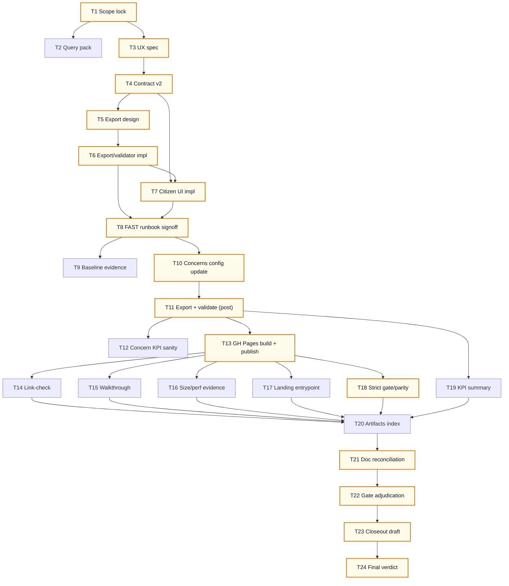

# AI-OPS-17 Sprint Prompt Pack

## Scale Metadata
- `scale_mode`: `LONG_10X`
- `baseline_reference`: `docs/etl/sprints/AI-OPS-18/sprint-ai-agents.md`
- `baseline_points`: `131`
- `target_points`: `130`
- `planned_points`: `131`
- `target_task_count`: `24`
- `planned_task_count`: `24`
- `horizon_weeks`: `6`

## Baseline Snapshot (2026-02-17)
- Citizen snapshot (current):
  - `docs/gh-pages/citizen/data/citizen.json`
  - validator summary (example): bytes=`1665040`, `topic_set_id=1`, `as_of_date=2026-02-16`, `computed_method=combined`, `topics=200`, `parties=16`, `party_topic_positions=3200`
  - programas stances present (example): `support=4`, `oppose=1`, `no_signal=187`
- Current citizen UX:
  - Flow: concern -> items (topics) -> party compare (per topic)
  - Programas ("Programa") is visible per party for the selected concern.
  - Gap: no concern-level party summary (user must click many items to answer "what did each party do about X?")
- Data already available:
  - `topic_positions` methods exist for `topic_set_id=1` (`votes`, `combined`, some `declared`)
  - `programas_partidos` produces `topic_evidence` (`declared:programa`) and positions for a programas topic_set (per election_cycle).

## Sprint Objective (Citizen UI/UX v2, leverage existing data)
Ship a citizen-first UI iteration that answers the top question fast:
- "Que hizo cada partido sobre esta preocupacion?" (hechos, con cobertura)
- "Que promete en su programa sobre esta preocupacion?" (programa)
- always with audit links (Explorer/Temas) and bounded static artifacts (GH Pages).

Non-goals (explicit):
- no new upstream connectors
- no heavy backend; keep GH Pages static
- no black-box ranking

## Bottleneck Class
- Primary: `product bottleneck` (we have data; citizen cannot quickly form an evidence-backed view)
- Secondary: `presentation bottleneck` (concerns/tags and summaries need better UX and bounded artifacts)

## Lane Packing Plan
- `HI` setup wave: Tasks `1-8`
- `FAST` throughput wave: Tasks `9-20`
- `HI` closeout wave: Tasks `21-24`
- Lane switches: `2` (`HI -> FAST -> HI`)

## Workload Balance
- Points split: `L1=74 (56.49%)`, `L2=46 (35.11%)`, `L3=11 (8.40%)`
- Task split: `L1=12/24 (50.00%)`, `L2=9/24 (37.50%)`, `L3=3/24 (12.50%)`

## Must-Pass Gates
- `G1 Visible UX`: citizen page supports concern-level party summary (no topic selected) and party drill-down to top items.
- `G2 Audit drill-down`: every stance card and summary view has at least one concrete audit link (Temas/Explorer SQL).
- `G3 Honesty`: method labels are accurate; `no_signal/unclear` are rendered explicitly; coverage rules are visible.
- `G4 Static budget`: citizen artifacts remain bounded (target `<= 5MB` each) and load on mobile without obvious jank.
- `G5 Reproducibility`: citizen export(s) deterministic from (`--db`, `--as-of-date`, config) with validator + tests.
- `G6 Strict gate/parity`: strict tracker gate stays green; status parity remains `overall_match=true`.

## Prompt Pack

1. Agent: L3 Orchestrator
- `depends_on`: `[]`
- `parallel_group`: `P1`
- `model_lane`: `HI`
- `points`: `5`
```text
Repository path/context:
- REPO_ROOT/vota-con-la-chola

Objective:
- Lock AI-OPS-17 scope and must-pass gates for citizen UI/UX v2 (data-first, static, evidence-first).

Concrete tasks:
- Define 2-3 citizen journeys (max) and the UX truth we promise.
- Clarify what "hechos" means in this sprint (votes vs combined) and how it is labeled in UI.
- Freeze gates G1-G6 with PASS/FAIL criteria and evidence requirements.
- Define explicit out-of-scope items to prevent scope creep.

Output contract:
- docs/etl/sprints/AI-OPS-17/reports/scope-lock.md

Acceptance checks:
- test -f docs/etl/sprints/AI-OPS-17/reports/scope-lock.md
- rg -n "User journeys|Scope|Non-goals|Must-pass gates|PASS/FAIL" docs/etl/sprints/AI-OPS-17/reports/scope-lock.md

Task packet:
goal: Scope lock and gate contract for AI-OPS-17.
inputs: docs/roadmap.md; docs/roadmap-tecnico.md; docs/etl/sprints/AI-OPS-17/closeout.md; docs/etl/sprints/AI-OPS-18/closeout.md; docs/etl/sprints/AI-OPS-19/closeout.md; ui/citizen/index.html
output_contract: scope-lock report with journeys + gate table + non-goals.
acceptance_query: grep for journeys + gates headers.
escalation_rule: Escalate if MVP implies non-static backend.
depends_on: []
parallel_group: P1
artifact_path: docs/etl/sprints/AI-OPS-17/reports/scope-lock.md
```

2. Agent: L2 Specialist Builder
- `depends_on`: `[1]`
- `parallel_group`: `P2`
- `model_lane`: `HI`
- `points`: `3`
```text
Repository path/context:
- REPO_ROOT/vota-con-la-chola

Objective:
- Produce a baseline/query pack for citizen app iteration (data + UX) that L1 can execute deterministically.

Concrete tasks:
- Write a short query/command pack:
  - citizen snapshot validator summary command(s)
  - topic_positions computed_method distribution for the chosen scope
  - programs lane coverage (programas_partidos signal totals)
  - strict gate + status parity commands
- Include exact output paths under AI-OPS-17 evidence/exports.

Output contract:
- docs/etl/sprints/AI-OPS-17/reports/query-pack-baseline.md

Acceptance checks:
- test -f docs/etl/sprints/AI-OPS-17/reports/query-pack-baseline.md
- rg -n "validate_citizen_snapshot|topic_positions|computed_method|programas_partidos|e2e_tracker_status|overall_match" docs/etl/sprints/AI-OPS-17/reports/query-pack-baseline.md

Task packet:
goal: Deterministic command/query pack for baseline + postrun evidence.
inputs: etl/data/staging/politicos-es.db; scripts/validate_citizen_snapshot.py; scripts/e2e_tracker_status.py; scripts/export_explorer_sources_snapshot.py
output_contract: runnable commands + expected output paths.
acceptance_query: query pack includes copy/paste runnable blocks.
escalation_rule: Escalate if required tables/columns are missing.
depends_on: [1]
parallel_group: P2
artifact_path: docs/etl/sprints/AI-OPS-17/reports/query-pack-baseline.md
```

3. Agent: L2 Specialist Builder
- `depends_on`: `[1]`
- `parallel_group`: `P3`
- `model_lane`: `HI`
- `points`: `8`
```text
Repository path/context:
- REPO_ROOT/vota-con-la-chola

Objective:
- Specify the citizen UX v2 (concern-first) flows, components, and copy.

Concrete tasks:
- Define the new primary flow:
  - select concern -> see party summary (hechos + programa) -> drill down to top items -> audit.
- Define UI states:
  - no concern selected (default selection behavior)
  - concern selected, no topic selected (show summary)
  - topic selected (existing compare view)
  - party-focused drill-down (top items for that concern)
- Define how we display "dice vs hace" without lying:
  - method naming (votes/combined/declared) and default choice
  - coverage thresholds and when we show unclear/no_signal
- Provide explicit UI acceptance checklist for L1 smoke testing (desktop + mobile).

Output contract:
- docs/etl/sprints/AI-OPS-17/reports/citizen-ux-v2-spec.md

Acceptance checks:
- test -f docs/etl/sprints/AI-OPS-17/reports/citizen-ux-v2-spec.md
- rg -n "Flow|States|Hechos|Programa|Audit links|Acceptance checklist" docs/etl/sprints/AI-OPS-17/reports/citizen-ux-v2-spec.md

Task packet:
goal: UX spec usable for implementation and QA evidence capture.
inputs: ui/citizen/index.html; docs/etl/sprints/AI-OPS-18/reports/citizen-data-contract.md; docs/etl/sprints/AI-OPS-19/reports/citizen-programas-ui.md
output_contract: spec with flows + UI checklist.
acceptance_query: spec includes the new concern-level summary behavior.
escalation_rule: Escalate if spec requires shipping raw evidence blobs to client.
depends_on: [1]
parallel_group: P3
artifact_path: docs/etl/sprints/AI-OPS-17/reports/citizen-ux-v2-spec.md
```

4. Agent: L2 Specialist Builder
- `depends_on`: `[3]`
- `parallel_group`: `P4`
- `model_lane`: `HI`
- `points`: `3`
```text
Repository path/context:
- REPO_ROOT/vota-con-la-chola

Objective:
- Define/extend the citizen snapshot contract to support concern-level summaries and/or method clarity.

Concrete tasks:
- Propose a minimal additive contract extension (do not break the current UI):
  - optional: topic -> concern_ids mapping in JSON (server-side tagging)
  - optional: party_concern_positions[] summary grid (concern_id x party_id) for "hechos"
  - optional: method metadata (what method is used; available variants if we ship >1 file)
- Update docs:
  - add v2 section to the canonical contract doc (keep it as the single source of truth)
  - keep sprint-local report for this sprint referencing the canonical doc.

Output contract:
- docs/etl/sprints/AI-OPS-17/reports/citizen-data-contract-v2.md
- (update) docs/etl/sprints/AI-OPS-18/reports/citizen-data-contract.md

Acceptance checks:
- test -f docs/etl/sprints/AI-OPS-17/reports/citizen-data-contract-v2.md
- rg -n "party_concern|topic_concerns|backward compatible|optional" docs/etl/sprints/AI-OPS-17/reports/citizen-data-contract-v2.md

Task packet:
goal: Contract extension enabling concern-level UX without inflating payloads.
inputs: scripts/export_citizen_snapshot.py; scripts/validate_citizen_snapshot.py; ui/citizen/index.html
output_contract: sprint-local v2 contract + canonical doc updated.
acceptance_query: canonical doc documents new optional keys and constraints.
escalation_rule: Escalate if contract requires huge payloads or breaking changes.
depends_on: [3]
parallel_group: P4
artifact_path: docs/etl/sprints/AI-OPS-17/reports/citizen-data-contract-v2.md
```

5. Agent: L2 Specialist Builder
- `depends_on`: `[4]`
- `parallel_group`: `P5`
- `model_lane`: `HI`
- `points`: `5`
```text
Repository path/context:
- REPO_ROOT/vota-con-la-chola

Objective:
- Design the export strategy for concern-first UX while keeping artifacts bounded and deterministic.

Concrete tasks:
- Decide one of:
  - A) keep single `citizen.json` but add optional summary grids, or
  - B) publish multiple bounded JSONs (`citizen_votes.json`, `citizen_combined.json`) with a UI toggle.
- Ensure we use `--max-items-per-concern` meaningfully:
  - if we do server-side tagging, select topics by concern (union) to avoid "some concerns empty" bias.
- Define deterministic ordering rules for any new arrays/grids.
- Define the minimal KPI exports needed to judge impact (coverage by concern, stance mix, size).

Output contract:
- docs/etl/sprints/AI-OPS-17/reports/citizen-export-v2-design.md

Acceptance checks:
- test -f docs/etl/sprints/AI-OPS-17/reports/citizen-export-v2-design.md
- rg -n "max-items-per-concern|bounded|deterministic|ordering|citizen_votes|citizen_combined|KPI" docs/etl/sprints/AI-OPS-17/reports/citizen-export-v2-design.md

Task packet:
goal: Export design that directly enables the UX spec and gates.
inputs: docs/etl/sprints/AI-OPS-17/reports/citizen-ux-v2-spec.md; scripts/export_citizen_snapshot.py; justfile
output_contract: design doc with explicit choice (A or B) + ordering rules + KPI plan.
acceptance_query: design includes exact output file names and build wiring plan.
escalation_rule: Escalate if design exceeds 5MB static budget without mitigation.
depends_on: [4]
parallel_group: P5
artifact_path: docs/etl/sprints/AI-OPS-17/reports/citizen-export-v2-design.md
```

6. Agent: L2 Specialist Builder
- `depends_on`: `[5]`
- `parallel_group`: `P6`
- `model_lane`: `HI`
- `points`: `8`
```text
Repository path/context:
- REPO_ROOT/vota-con-la-chola

Objective:
- Implement export/validation changes required by AI-OPS-17 (contract v2) with tests.

Concrete tasks:
- Update `scripts/export_citizen_snapshot.py`:
  - implement `--max-items-per-concern` (currently a no-op) if we adopt server-side selection
  - add optional contract keys (per task 4) needed for concern summaries/method clarity
  - keep deterministic output ordering and bounded payload size
- Update `scripts/validate_citizen_snapshot.py` to validate new optional keys if present.
- Add/extend deterministic tests for exporter + validator.
- Update `just explorer-gh-pages-build` wiring if we ship multiple citizen JSONs.

Output contract:
- scripts/export_citizen_snapshot.py
- scripts/validate_citizen_snapshot.py
- tests/test_export_citizen_snapshot.py (new or updated)
- docs/etl/sprints/AI-OPS-17/reports/citizen-export-v2-impl.md

Acceptance checks:
- python3 scripts/export_citizen_snapshot.py --help
- python3 scripts/validate_citizen_snapshot.py --help
- rg -n "max-items-per-concern|party_concern|topic_concerns|methods_available" scripts/export_citizen_snapshot.py || true
- pytest -q

Task packet:
goal: Enable concern-level UX with bounded deterministic artifacts and validator coverage.
inputs: docs/etl/sprints/AI-OPS-17/reports/citizen-export-v2-design.md; ui/citizen/concerns_v1.json; etl/data/staging/politicos-es.db
output_contract: exporter/validator/test changes + short impl report.
acceptance_query: tests pass and validator accepts generated artifacts.
escalation_rule: Escalate if export balloons beyond static budget.
depends_on: [5]
parallel_group: P6
artifact_path: docs/etl/sprints/AI-OPS-17/reports/citizen-export-v2-impl.md
```

7. Agent: L2 Specialist Builder
- `depends_on`: `[4,6]`
- `parallel_group`: `P7`
- `model_lane`: `HI`
- `points`: `8`
```text
Repository path/context:
- REPO_ROOT/vota-con-la-chola

Objective:
- Implement citizen UI/UX v2 in the static page.

Concrete tasks:
- Update `ui/citizen/index.html` to add:
  - concern-level party summary view (shown when concern selected but no topic selected)
  - party drill-down list: top items for the concern (sorted by stakes/confidence/coverage)
  - clear labeling of "Hechos" method used (votes/combined) and what "Programa" means
  - preserve existing per-topic compare view (do not regress)
- Keep it static (no new build tooling).
- Ensure mobile layout remains usable.

Output contract:
- ui/citizen/index.html
- docs/etl/sprints/AI-OPS-17/reports/citizen-ui-v2.md

Acceptance checks:
- test -f ui/citizen/index.html
- rg -n "concern-level|resumen|party drill|Programa" docs/etl/sprints/AI-OPS-17/reports/citizen-ui-v2.md || true

Task packet:
goal: Citizen UI/UX v2 shipped as static HTML.
inputs: docs/etl/sprints/AI-OPS-17/reports/citizen-ux-v2-spec.md; docs/gh-pages/citizen/data/citizen.json (or new exports)
output_contract: updated UI + short report of new flows.
acceptance_query: UI can render concern summary without selecting a topic.
escalation_rule: Escalate if required data is missing from the exported contract.
depends_on: [4,6]
parallel_group: P7
artifact_path: docs/etl/sprints/AI-OPS-17/reports/citizen-ui-v2.md
```

8. Agent: L3 Orchestrator
- `depends_on`: `[6,7]`
- `parallel_group`: `P8`
- `model_lane`: `HI`
- `points`: `3`
```text
Repository path/context:
- REPO_ROOT/vota-con-la-chola

Objective:
- Approve readiness for FAST wave execution and lock the evidence runbook.

Concrete tasks:
- Review tasks 6-7 outputs for contract/UX alignment and static budget risk.
- Write a FAST runbook for L1: exact commands + expected artifact paths.
- Confirm the must-pass gates are measurable with the runbook outputs.

Output contract:
- docs/etl/sprints/AI-OPS-17/reports/fast-runbook.md

Acceptance checks:
- test -f docs/etl/sprints/AI-OPS-17/reports/fast-runbook.md
- rg -n "Commands|Expected outputs|max-bytes|link check|publish" docs/etl/sprints/AI-OPS-17/reports/fast-runbook.md

Task packet:
goal: FAST wave readiness and deterministic runbook.
inputs: tasks 6-7 outputs; docs/etl/sprints/AI-OPS-17/reports/query-pack-baseline.md
output_contract: runbook with copy/paste commands and paths.
acceptance_query: runbook includes build + validation + publish steps.
escalation_rule: Escalate if gates cannot be evidenced deterministically.
depends_on: [6,7]
parallel_group: P8
artifact_path: docs/etl/sprints/AI-OPS-17/reports/fast-runbook.md
```

9. Agent: L1 Mechanical Executor
- `depends_on`: `[8]`
- `parallel_group`: `P9`
- `model_lane`: `FAST`
- `points`: `5`
```text
Repository path/context:
- REPO_ROOT/vota-con-la-chola

Objective:
- Capture baseline evidence packet (pre/post is acceptable as long as it is explicit) for citizen artifacts and method coverage.

Concrete tasks:
- Execute the baseline commands from:
  - docs/etl/sprints/AI-OPS-17/reports/query-pack-baseline.md
- Save outputs under:
  - docs/etl/sprints/AI-OPS-17/evidence/

Output contract:
- docs/etl/sprints/AI-OPS-17/evidence/baseline_citizen_validate.json
- docs/etl/sprints/AI-OPS-17/evidence/baseline_topic_positions_methods.csv
- docs/etl/sprints/AI-OPS-17/evidence/baseline_programas_meta.json

Acceptance checks:
- test -f docs/etl/sprints/AI-OPS-17/evidence/baseline_citizen_validate.json
- test -f docs/etl/sprints/AI-OPS-17/evidence/baseline_topic_positions_methods.csv

Task packet:
goal: Baseline evidence capture (citizen + methods + programas coverage).
inputs: query pack; etl/data/staging/politicos-es.db; docs/gh-pages/citizen/data/citizen.json (if available)
output_contract: baseline evidence files under AI-OPS-17.
acceptance_query: evidence files exist and are non-empty.
escalation_rule: Escalate if baseline commands fail or files cannot be produced.
depends_on: [8]
parallel_group: P9
artifact_path: docs/etl/sprints/AI-OPS-17/evidence/baseline_citizen_validate.json
```

10. Agent: L1 Mechanical Executor
- `depends_on`: `[3,8]`
- `parallel_group`: `P10`
- `model_lane`: `FAST`
- `points`: `5`
```text
Repository path/context:
- REPO_ROOT/vota-con-la-chola

Objective:
- Apply the concern keywords/config updates exactly as specified in the UX spec (mechanical edit) and capture a before/after count diff.

Concrete tasks:
- Update ui/citizen/concerns_v1.json keywords list per:
  - docs/etl/sprints/AI-OPS-17/reports/citizen-ux-v2-spec.md
- Run a deterministic count summary (topics per concern) and save diff evidence.

Output contract:
- ui/citizen/concerns_v1.json
- docs/etl/sprints/AI-OPS-17/evidence/concerns_v1_diff.txt

Acceptance checks:
- test -f ui/citizen/concerns_v1.json
- test -f docs/etl/sprints/AI-OPS-17/evidence/concerns_v1_diff.txt

Task packet:
goal: Keep concern taxonomy aligned with UX, with evidence of impact on counts.
inputs: docs/etl/sprints/AI-OPS-17/reports/citizen-ux-v2-spec.md; ui/citizen/concerns_v1.json; scripts/export_citizen_snapshot.py (if it prints per-concern counts)
output_contract: updated config + diff evidence file.
acceptance_query: diff file shows counts for each concern before/after.
escalation_rule: Escalate if spec does not include an explicit keyword list.
depends_on: [3,8]
parallel_group: P10
artifact_path: docs/etl/sprints/AI-OPS-17/evidence/concerns_v1_diff.txt
```

11. Agent: L1 Mechanical Executor
- `depends_on`: `[10]`
- `parallel_group`: `P11`
- `model_lane`: `FAST`
- `points`: `8`
```text
Repository path/context:
- REPO_ROOT/vota-con-la-chola

Objective:
- Generate post-change citizen artifact(s) with validation and size budgeting.

Concrete tasks:
- Run the exporter(s) per runbook:
  - scripts/export_citizen_snapshot.py ...
- Run validator(s) per runbook:
  - scripts/validate_citizen_snapshot.py ...
- Save outputs:
  - validation JSON summaries
  - KPI CSV exports (stance mix, concern coverage, etc.)
  - record exact bytes for each JSON

Output contract:
- docs/etl/sprints/AI-OPS-17/evidence/citizen_validate_post.json
- docs/etl/sprints/AI-OPS-17/evidence/citizen_json_sizes_post.txt
- docs/etl/sprints/AI-OPS-17/exports/citizen_kpis_post.csv

Acceptance checks:
- test -f docs/etl/sprints/AI-OPS-17/evidence/citizen_validate_post.json
- test -f docs/etl/sprints/AI-OPS-17/exports/citizen_kpis_post.csv
- rg -n \"bytes\" docs/etl/sprints/AI-OPS-17/evidence/citizen_validate_post.json

Task packet:
goal: Produce validated bounded static citizen artifacts after implementation.
inputs: docs/etl/sprints/AI-OPS-17/reports/fast-runbook.md; etl/data/staging/politicos-es.db
output_contract: validated JSON artifact(s) + size evidence + KPI CSV.
acceptance_query: validator passes and bytes <= 5MB budget (or explicit waiver with evidence).
escalation_rule: Escalate if validator fails or artifacts exceed budget.
depends_on: [10]
parallel_group: P11
artifact_path: docs/etl/sprints/AI-OPS-17/evidence/citizen_validate_post.json
```

12. Agent: L1 Mechanical Executor
- `depends_on`: `[11]`
- `parallel_group`: `P12`
- `model_lane`: `FAST`
- `points`: `5`
```text
Repository path/context:
- REPO_ROOT/vota-con-la-chola

Objective:
- Run sanity checks for the new concern-level summaries (no misleading empties, obvious regressions, or broken grids).

Concrete tasks:
- Produce a compact CSV report:
  - concerns_total, parties_total
  - for each concern: items_total, % items high-stakes, stance mix by party (aggregate)
  - count of concerns with zero items (should be 0 unless explicitly allowed)
- Save under exports/ with clear headers.

Output contract:
- docs/etl/sprints/AI-OPS-17/exports/concern_summary_kpis_post.csv

Acceptance checks:
- test -f docs/etl/sprints/AI-OPS-17/exports/concern_summary_kpis_post.csv
- head -n 3 docs/etl/sprints/AI-OPS-17/exports/concern_summary_kpis_post.csv

Task packet:
goal: Guardrail report for concern-level UX correctness.
inputs: post-change citizen JSON artifact(s); concerns config
output_contract: CSV sanity report.
acceptance_query: report has non-empty counts and no surprising zeros without explanation.
escalation_rule: Escalate if many concerns have zero items or stance grids look empty.
depends_on: [11]
parallel_group: P12
artifact_path: docs/etl/sprints/AI-OPS-17/exports/concern_summary_kpis_post.csv
```

13. Agent: L1 Mechanical Executor
- `depends_on`: `[11]`
- `parallel_group`: `P13`
- `model_lane`: `FAST`
- `points`: `13`
```text
Repository path/context:
- REPO_ROOT/vota-con-la-chola

Objective:
- Build and publish GH Pages artifacts (including citizen UI + data) and capture reproducible evidence logs.

Concrete tasks:
- Run:
  - just explorer-gh-pages-build
  - just explorer-gh-pages-publish
- Capture logs (stdout/stderr) into evidence files.
- Confirm:
  - docs/gh-pages/citizen/index.html exists
  - docs/gh-pages/citizen/data/* exists (citizen JSON(s), concerns config)

Output contract:
- docs/etl/sprints/AI-OPS-17/evidence/gh-pages-build.log
- docs/etl/sprints/AI-OPS-17/evidence/gh-pages-publish.log

Acceptance checks:
- test -f docs/etl/sprints/AI-OPS-17/evidence/gh-pages-build.log
- test -f docs/etl/sprints/AI-OPS-17/evidence/gh-pages-publish.log

Task packet:
goal: Produce and publish static site artifacts with evidence logs.
inputs: justfile; etl/data/staging/politicos-es.db; ui/citizen/index.html; ui/citizen/concerns_v1.json
output_contract: build + publish logs under AI-OPS-17 evidence.
acceptance_query: publish command exits 0 and writes logs.
escalation_rule: Escalate if build/publish fails or outputs are missing.
depends_on: [11]
parallel_group: P13
artifact_path: docs/etl/sprints/AI-OPS-17/evidence/gh-pages-publish.log
```

14. Agent: L1 Mechanical Executor
- `depends_on`: `[13]`
- `parallel_group`: `P14`
- `model_lane`: `FAST`
- `points`: `8`
```text
Repository path/context:
- REPO_ROOT/vota-con-la-chola

Objective:
- Verify that all audit links referenced by citizen artifacts resolve to existing GH Pages targets (link-check gate).

Concrete tasks:
- Run a deterministic link scan over the published JSON artifact(s):
  - scan all fields under `links.*` for relative paths
  - resolve against docs/gh-pages
  - check that targets exist (dir index.html or file)
- Produce a report with:
  - total links scanned
  - unique targets
  - broken targets list (must be empty for PASS)

Output contract:
- docs/etl/sprints/AI-OPS-17/reports/link-check.md

Acceptance checks:
- test -f docs/etl/sprints/AI-OPS-17/reports/link-check.md
- rg -n "Verdict: PASS" docs/etl/sprints/AI-OPS-17/reports/link-check.md

Task packet:
goal: Evidence-backed audit link resolution check.
inputs: docs/gh-pages/citizen/data/*.json; docs/gh-pages/*
output_contract: link-check report with PASS/FAIL and counts.
acceptance_query: broken_targets=0.
escalation_rule: Escalate if broken targets exist and cannot be fixed quickly.
depends_on: [13]
parallel_group: P14
artifact_path: docs/etl/sprints/AI-OPS-17/reports/link-check.md
```

15. Agent: L1 Mechanical Executor
- `depends_on`: `[13]`
- `parallel_group`: `P15`
- `model_lane`: `FAST`
- `points`: `5`
```text
Repository path/context:
- REPO_ROOT/vota-con-la-chola

Objective:
- Produce a citizen walkthrough (QA) proving the new UX flows work with audit drill-down.

Concrete tasks:
- Write a short walkthrough covering:
  - choose concern -> see party summary
  - drill down to a party's top items
  - open at least one audit link (Temas/Explorer)
  - verify "Programa" lane appears (if available)
- Save as markdown under reports/ with concrete URLs and screenshots references (optional).

Output contract:
- docs/etl/sprints/AI-OPS-17/reports/citizen-walkthrough.md

Acceptance checks:
- test -f docs/etl/sprints/AI-OPS-17/reports/citizen-walkthrough.md
- rg -n "concern|party|audit|Programa" docs/etl/sprints/AI-OPS-17/reports/citizen-walkthrough.md

Task packet:
goal: Human-readable QA evidence for citizen UX.
inputs: docs/gh-pages/citizen/index.html; docs/gh-pages/citizen/data/*.json
output_contract: walkthrough report proving flows.
acceptance_query: includes at least 1 concern summary + 1 audit link click proof.
escalation_rule: Escalate if UX is confusing or cannot reach audit links.
depends_on: [13]
parallel_group: P15
artifact_path: docs/etl/sprints/AI-OPS-17/reports/citizen-walkthrough.md
```

16. Agent: L1 Mechanical Executor
- `depends_on`: `[13]`
- `parallel_group`: `P16`
- `model_lane`: `FAST`
- `points`: `5`
```text
Repository path/context:
- REPO_ROOT/vota-con-la-chola

Objective:
- Capture static budget and UX evidence (size/perf) for the citizen artifacts.

Concrete tasks:
- Record JSON byte sizes (and gzip sizes if easy) for citizen artifact(s).
- Capture a small screenshot set (desktop + mobile widths) for the new concern summary view.
- Save a short evidence note summarizing:
  - size vs budget
  - any obvious mobile/layout issues observed

Output contract:
- docs/etl/sprints/AI-OPS-17/evidence/citizen-json-size.txt
- docs/etl/sprints/AI-OPS-17/evidence/citizen-ux-screenshots/ (folder, optional)

Acceptance checks:
- test -f docs/etl/sprints/AI-OPS-17/evidence/citizen-json-size.txt

Task packet:
goal: Static budget evidence for gate G4.
inputs: docs/gh-pages/citizen/data/*.json; ui/citizen/index.html
output_contract: size evidence + (optional) screenshots folder.
acceptance_query: sizes are recorded and within budget or explained.
escalation_rule: Escalate if artifacts exceed budget or mobile is broken.
depends_on: [13]
parallel_group: P16
artifact_path: docs/etl/sprints/AI-OPS-17/evidence/citizen-json-size.txt
```

17. Agent: L1 Mechanical Executor
- `depends_on`: `[13]`
- `parallel_group`: `P17`
- `model_lane`: `FAST`
- `points`: `5`
```text
Repository path/context:
- REPO_ROOT/vota-con-la-chola

Objective:
- Prove that the citizen app is discoverable from the GH Pages landing (visible product gate).

Concrete tasks:
- Verify the landing (docs/gh-pages/index.html) includes an entry/link to /citizen.
- Save the exact matching line(s) or a small excerpt as evidence.

Output contract:
- docs/etl/sprints/AI-OPS-17/evidence/landing-link.txt

Acceptance checks:
- test -f docs/etl/sprints/AI-OPS-17/evidence/landing-link.txt
- rg -n "citizen" docs/etl/sprints/AI-OPS-17/evidence/landing-link.txt

Task packet:
goal: Evidence that citizen app is linked from landing.
inputs: docs/gh-pages/index.html
output_contract: text evidence showing the link exists.
acceptance_query: contains /citizen link.
escalation_rule: Escalate if landing lacks citizen entrypoint.
depends_on: [13]
parallel_group: P17
artifact_path: docs/etl/sprints/AI-OPS-17/evidence/landing-link.txt
```

18. Agent: L1 Mechanical Executor
- `depends_on`: `[13]`
- `parallel_group`: `P18`
- `model_lane`: `FAST`
- `points`: `5`
```text
Repository path/context:
- REPO_ROOT/vota-con-la-chola

Objective:
- Re-run strict tracker gate + status parity to ensure no regression.

Concrete tasks:
- Run strict tracker gate:
  - python3 scripts/e2e_tracker_status.py ... --fail-on-mismatch --fail-on-done-zero-real
- Run status export + parity (if used by standard runbook).
- Save exit codes and key summaries.

Output contract:
- docs/etl/sprints/AI-OPS-17/evidence/tracker-gate-postrun.exit
- docs/etl/sprints/AI-OPS-17/evidence/status-parity-postrun.txt

Acceptance checks:
- test -f docs/etl/sprints/AI-OPS-17/evidence/tracker-gate-postrun.exit
- rg -n "0" docs/etl/sprints/AI-OPS-17/evidence/tracker-gate-postrun.exit

Task packet:
goal: Preserve strict gate/parity invariants for the sprint.
inputs: docs/etl/e2e-scrape-load-tracker.md; docs/etl/mismatch-waivers.json; etl/data/staging/politicos-es.db
output_contract: strict gate + parity evidence files.
acceptance_query: strict gate exit 0 and overall_match=true.
escalation_rule: Escalate if strict gate fails or parity mismatches appear.
depends_on: [13]
parallel_group: P18
artifact_path: docs/etl/sprints/AI-OPS-17/evidence/tracker-gate-postrun.exit
```

19. Agent: L1 Mechanical Executor
- `depends_on`: `[11,13]`
- `parallel_group`: `P19`
- `model_lane`: `FAST`
- `points`: `5`
```text
Repository path/context:
- REPO_ROOT/vota-con-la-chola

Objective:
- Generate a compact KPI summary report for AI-OPS-17 closeout (what changed, in numbers).

Concrete tasks:
- Using exports from tasks 11-12, write a short KPI summary markdown:
  - sizes
  - stance mix
  - concern coverage (items per concern)
  - programas coverage signal counts
- Link to the relevant CSV/JSON artifacts.

Output contract:
- docs/etl/sprints/AI-OPS-17/reports/citizen-kpi-summary.md

Acceptance checks:
- test -f docs/etl/sprints/AI-OPS-17/reports/citizen-kpi-summary.md
- rg -n "bytes|stances|concern|programa" docs/etl/sprints/AI-OPS-17/reports/citizen-kpi-summary.md

Task packet:
goal: KPI summary for closeout and roadmap truth.
inputs: docs/etl/sprints/AI-OPS-17/exports/*.csv; docs/etl/sprints/AI-OPS-17/evidence/*.json
output_contract: short KPI summary with links.
acceptance_query: includes at least 4 KPI bullets with file references.
escalation_rule: Escalate if KPIs look regressed or inconsistent.
depends_on: [11,13]
parallel_group: P19
artifact_path: docs/etl/sprints/AI-OPS-17/reports/citizen-kpi-summary.md
```

20. Agent: L1 Mechanical Executor
- `depends_on`: `[14,15,16,17,18,19]`
- `parallel_group`: `P20`
- `model_lane`: `FAST`
- `points`: `5`
```text
Repository path/context:
- REPO_ROOT/vota-con-la-chola

Objective:
- Create an artifacts index for AI-OPS-17 to make progress visible and reviewable in one glance.

Concrete tasks:
- List every produced artifact with path + 1-line description:
  - reports/
  - evidence/
  - exports/
- Include a "known gaps" section (if any) with explicit next command.

Output contract:
- docs/etl/sprints/AI-OPS-17/reports/artifacts-index.md

Acceptance checks:
- test -f docs/etl/sprints/AI-OPS-17/reports/artifacts-index.md
- rg -n "reports/|evidence/|exports/|known gaps" docs/etl/sprints/AI-OPS-17/reports/artifacts-index.md

Task packet:
goal: One-page index for sprint outputs (anti-loop visibility).
inputs: AI-OPS-17 folder tree.
output_contract: artifacts index markdown.
acceptance_query: includes at least 10 artifact entries and known gaps if any.
escalation_rule: Escalate if artifacts are missing or cannot be summarized.
depends_on: [14,15,16,17,18,19]
parallel_group: P20
artifact_path: docs/etl/sprints/AI-OPS-17/reports/artifacts-index.md
```

21. Agent: L2 Specialist Builder
- `depends_on`: `[19,20]`
- `parallel_group`: `P21`
- `model_lane`: `HI`
- `points`: `5`
```text
Repository path/context:
- REPO_ROOT/vota-con-la-chola

Objective:
- Reconcile docs/roadmap truth with what shipped (no duplicate roadmaps; link, do not copy).

Concrete tasks:
- Update:
  - docs/roadmap-tecnico.md (near-term execution) to reflect citizen app as an operational surface and what AI-OPS-17 adds.
  - docs/etl/sprints/README.md status/objective text if needed.
  - docs/etl/sprint-ai-agents.md pointer if active sprint changes.
- Write a sprint-local reconciliation note linking to evidence and KPIs.

Output contract:
- docs/etl/sprints/AI-OPS-17/reports/doc-reconciliation.md
- (optional edits) docs/roadmap-tecnico.md; docs/etl/sprints/README.md; docs/etl/sprint-ai-agents.md

Acceptance checks:
- test -f docs/etl/sprints/AI-OPS-17/reports/doc-reconciliation.md
- rg -n "roadmap-tecnico|sprints/README|evidence|KPI" docs/etl/sprints/AI-OPS-17/reports/doc-reconciliation.md

Task packet:
goal: Ensure roadmap/docs reflect shipped progress without duplication.
inputs: docs/etl/sprints/AI-OPS-17/reports/citizen-kpi-summary.md; docs/etl/sprints/AI-OPS-17/reports/artifacts-index.md
output_contract: reconciliation note + minimal doc edits.
acceptance_query: edits are link-first and evidence-backed.
escalation_rule: Escalate if edits risk duplicating roadmaps or misrepresenting status.
depends_on: [19,20]
parallel_group: P21
artifact_path: docs/etl/sprints/AI-OPS-17/reports/doc-reconciliation.md
```

22. Agent: L2 Specialist Builder
- `depends_on`: `[21]`
- `parallel_group`: `P22`
- `model_lane`: `HI`
- `points`: `3`
```text
Repository path/context:
- REPO_ROOT/vota-con-la-chola

Objective:
- Produce the gate adjudication worksheet (G1-G6) with explicit evidence references.

Concrete tasks:
- For each gate:
  - verdict PASS/FAIL
  - cite exact artifacts (paths) produced by FAST wave
  - note any waivers (should be rare; must include justification)
- Keep it short and operational.

Output contract:
- docs/etl/sprints/AI-OPS-17/reports/gate-adjudication.md

Acceptance checks:
- test -f docs/etl/sprints/AI-OPS-17/reports/gate-adjudication.md
- rg -n "G1|G2|G3|G4|G5|G6|PASS|FAIL" docs/etl/sprints/AI-OPS-17/reports/gate-adjudication.md

Task packet:
goal: Evidence-backed gate adjudication for sprint closeout.
inputs: AI-OPS-17 artifacts index + evidence files.
output_contract: gate adjudication markdown.
acceptance_query: every gate has a verdict and at least 1 evidence link.
escalation_rule: Escalate if a must-pass gate cannot be evaluated.
depends_on: [21]
parallel_group: P22
artifact_path: docs/etl/sprints/AI-OPS-17/reports/gate-adjudication.md
```

23. Agent: L2 Specialist Builder
- `depends_on`: `[22]`
- `parallel_group`: `P23`
- `model_lane`: `HI`
- `points`: `3`
```text
Repository path/context:
- REPO_ROOT/vota-con-la-chola

Objective:
- Draft the AI-OPS-17 closeout with clear verdict rationale and reproducibility commands.

Concrete tasks:
- Fill docs/etl/sprints/AI-OPS-17/closeout.md with:
  - objective recap
  - what shipped (user-visible)
  - gate table (reference gate adjudication)
  - key KPIs (reference KPI summary)
  - how to reproduce (commands)
  - next sprint trigger (ordered)
- Mark it as DRAFT for L3 review.

Output contract:
- docs/etl/sprints/AI-OPS-17/closeout.md

Acceptance checks:
- test -f docs/etl/sprints/AI-OPS-17/closeout.md
- rg -n "Status:|Objective|What Shipped|Gates|How To Reproduce|Next Sprint Trigger" docs/etl/sprints/AI-OPS-17/closeout.md

Task packet:
goal: Closeout draft ready for final verdict.
inputs: gate adjudication + KPI summary + artifacts index.
output_contract: closeout draft markdown.
acceptance_query: includes explicit reproduction commands and evidence references.
escalation_rule: Escalate if closeout cannot justify verdict from artifacts.
depends_on: [22]
parallel_group: P23
artifact_path: docs/etl/sprints/AI-OPS-17/closeout.md
```

24. Agent: L3 Orchestrator
- `depends_on`: `[23]`
- `parallel_group`: `P24`
- `model_lane`: `HI`
- `points`: `3`
```text
Repository path/context:
- REPO_ROOT/vota-con-la-chola

Objective:
- Issue final PASS/FAIL verdict and lock carryover policy (anti-loop).

Concrete tasks:
- Review closeout draft for evidence integrity and honesty.
- Finalize PASS/FAIL and any waivers.
- Update sprint index status if needed:
  - docs/etl/sprints/README.md
  - docs/etl/sprint-ai-agents.md pointer (if moving to next sprint)

Output contract:
- docs/etl/sprints/AI-OPS-17/closeout.md

Acceptance checks:
- rg -n "Status: PASS|Status: FAIL" docs/etl/sprints/AI-OPS-17/closeout.md

Task packet:
goal: Final sprint arbitration and closure.
inputs: closeout draft + gate adjudication.
output_contract: final signed closeout verdict.
acceptance_query: verdict and triggers are explicit and evidence-backed.
escalation_rule: Escalate if verdict cannot be supported by artifacts.
depends_on: [23]
parallel_group: P24
artifact_path: docs/etl/sprints/AI-OPS-17/closeout.md
```

## Critical Path
1. `T1 -> T3 -> T4 -> T5 -> T6 -> T7 -> T8 -> T10 -> T11 -> T13 -> T18 -> T21 -> T22 -> T23 -> T24`
2. Critical-path points (approx): `5+8+3+5+8+8+3+5+8+13+5+5+3+3+3 = 82`

## Parallel Plan
- `P1`: T1
- `P2/P3`: after T1, run T2 and T3 in parallel
- `P4..P8`: mostly sequential (contract -> export design -> impl -> UI -> signoff)
- `FAST`: after T8, tasks can be executed with WIP<=6, but default runnable order is sequential for reproducibility

## Queue Waves
- `HI`: `1,2,3,4,5,6,7,8`
- `FAST`: `9,10,11,12,13,14,15,16,17,18,19,20`
- `HI`: `21,22,23,24`
- Lane switches: `2`
- Tasks per switch ratio: `24/2 = 12`

## Flow Diagram (Mermaid, vertical)


## Folder Layout
```text
docs/etl/sprints/AI-OPS-17/
  sprint-ai-agents.md
  kickoff.md
  closeout.md
  reports/
    scope-lock.md
    query-pack-baseline.md
    citizen-ux-v2-spec.md
    citizen-data-contract-v2.md
    citizen-export-v2-design.md
    citizen-export-v2-impl.md
    citizen-ui-v2.md
    fast-runbook.md
    link-check.md
    citizen-walkthrough.md
    citizen-kpi-summary.md
    artifacts-index.md
    doc-reconciliation.md
    gate-adjudication.md
  evidence/
    baseline_citizen_validate.json
    baseline_topic_positions_methods.csv
    baseline_programas_meta.json
    concerns_v1_diff.txt
    citizen_validate_post.json
    citizen_json_sizes_post.txt
    gh-pages-build.log
    gh-pages-publish.log
    citizen-json-size.txt
    citizen-ux-screenshots/
    landing-link.txt
    tracker-gate-postrun.exit
    status-parity-postrun.txt
  exports/
    citizen_kpis_post.csv
    concern_summary_kpis_post.csv
```

## Scale Audit
- Baseline points: `131`
- Target points: `130`
- Planned points: `131`
- Baseline task count: `24`
- Target task count: `24`
- Planned task count: `24`
- Horizon: `6 weeks`
- 10x-scale intent: `PASS` (planned ~= target and matches recent LONG_10X baseline)
