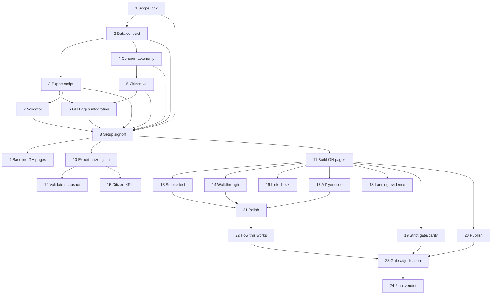

# AI-OPS-17 Sprint Prompt Pack

## Scale Metadata
- `scale_mode`: `LONG_10X`
- `baseline_reference`: `docs/etl/sprints/AI-OPS-16/sprint-ai-agents.md` (LONG_10X pattern)
- `baseline_points`: `125`
- `target_points`: `130`
- `planned_points`: `131`
- `target_task_count`: `24`
- `planned_task_count`: `24`
- `horizon_weeks`: `6`

## Baseline Snapshot (2026-02-17)
- GH Pages today: explorers landing + schema-first tools (`/explorer-temas`, `/explorer-votaciones`, `/explorer-politico`, `/explorer-sources`, `/graph`).
- Data available (national):
  - Congreso mandates: `350` active (`institution_id=7`).
  - Topic set: `topic_set_id=1` (Congreso leg 15).
  - Topics in set: `200` total, `60` flagged `is_high_stakes=1`.
  - Positions present for Congreso at `as_of_date=2026-02-16` for `votes` and `combined`.
- Declared signal (interventions): `204/614` (`0.332248`), review queue pending `0`.

## Sprint Objective (Citizen-first)
- Ship a citizen-first webapp (static GH Pages) that turns the existing data into answers people care about:
  - pick a concern (vivienda, empleo, sanidad, etc.)
  - see the most relevant/high-salience items (today: initiative-level "topics")
  - compare party stances (derived from member positions) with clear coverage/uncertainty
  - drill down to evidence via existing explorers (no black box)

Non-goals (explicit):
- no new upstream connectors
- no backfills that change core ETL behavior
- no "alignment ranking" pretending to read user values

## Bottleneck Class
- Primary: `product bottleneck` (we have data; citizens can't use it)
- Secondary: `presentation bottleneck` (initiative-level topics need citizen-friendly grouping)

## Lane Packing Plan
- `HI` setup wave: Tasks `1-8`
- `FAST` throughput wave: Tasks `9-20`
- `HI` closeout wave: Tasks `21-24`
- Lane switches: `2` (`HI -> FAST -> HI`)

## Workload Balance
- Points split: `L1=74 (56.49%)`, `L2=46 (35.11%)`, `L3=11 (8.40%)`
- Task split: `L1=12/24 (50.00%)`, `L2=9/24 (37.50%)`, `L3=3/24 (12.50%)`

## Must-Pass Gates
- `G1 Visible product`: a citizen-first page exists under GH Pages and is linked from the landing.
- `G2 Evidence drill-down`: every stance card links to a concrete explorer drill-down (topic/person/evidence).
- `G3 Honesty`: unknown/no-signal is rendered as unknown (not silently imputed).
- `G4 Size/perf`: exported citizen snapshot JSON(s) are bounded (documented sizes; no multi-100MB blobs).
- `G5 Strict gate/parity`: strict tracker gate stays green and status parity remains `overall_match=true`.
- `G6 Reproducibility`: citizen snapshot export is deterministic from a given `--db` + `--as-of-date`.

## Prompt Pack

1. Agent: L3 Orchestrator
- `depends_on`: `[]`
- `parallel_group`: `P1`
- `model_lane`: `HI`
- `points`: `5`
```text
Repository path/context:
- REPO_ROOT/vota-con-la-chola

Objective:
- Lock the citizen-first product scope, user journeys, and must-pass gates.

Concrete tasks:
- Define the primary citizen journeys (3 flows max) and what the MVP answers.
- Define what "concern" means given current initiative-level topics.
- Freeze gate contract G1-G6 and define PASS/FAIL criteria.

Output contract:
- docs/etl/sprints/AI-OPS-17/reports/scope-lock.md

Acceptance checks:
- test -f docs/etl/sprints/AI-OPS-17/reports/scope-lock.md
- rg -n "User journeys|MVP|Must-pass gates|PASS/FAIL" docs/etl/sprints/AI-OPS-17/reports/scope-lock.md

Task packet:
goal: Scope lock and gate contract.
inputs: docs/roadmap.md; docs/roadmap-tecnico.md; docs/etl/e2e-scrape-load-tracker.md; docs/gh-pages/index.html
output_contract: scope-lock report with flows + gate table.
acceptance_query: grep for journey + gates headers.
escalation_rule: Escalate if MVP implies building a server (not static GH pages).
depends_on: []
parallel_group: P1
artifact_path: docs/etl/sprints/AI-OPS-17/reports/scope-lock.md
```

2. Agent: L2 Specialist Builder
- `depends_on`: `[1]`
- `parallel_group`: `P2`
- `model_lane`: `HI`
- `points`: `5`
```text
Repository path/context:
- REPO_ROOT/vota-con-la-chola

Objective:
- Define the citizen snapshot data contract and the minimal pages/components.

Concrete tasks:
- Specify the JSON schema for the citizen app: meta, topics, parties, party_positions, and drill-down links.
- Decide which scope we ship first (default: Congreso / topic_set_id=1 / as_of=max).
- Write the contract as a short spec.

Output contract:
- docs/etl/sprints/AI-OPS-17/reports/citizen-data-contract.md

Acceptance checks:
- test -f docs/etl/sprints/AI-OPS-17/reports/citizen-data-contract.md
- rg -n "schema|topic_set_id=1|as_of_date|party_positions|drill" docs/etl/sprints/AI-OPS-17/reports/citizen-data-contract.md

Task packet:
goal: Stable data contract for the static citizen app.
inputs: SQLite schema (etl/load/sqlite_schema.sql); existing GH pages explorers.
output_contract: contract doc with example JSON snippet.
acceptance_query: contract includes required top-level keys and constraints.
escalation_rule: Escalate if contract requires shipping full raw evidence tables to GH pages.
depends_on: [1]
parallel_group: P2
artifact_path: docs/etl/sprints/AI-OPS-17/reports/citizen-data-contract.md
```

3. Agent: L2 Specialist Builder
- `depends_on`: `[2]`
- `parallel_group`: `P3`
- `model_lane`: `HI`
- `points`: `8`
```text
Repository path/context:
- REPO_ROOT/vota-con-la-chola

Objective:
- Implement a deterministic export script for the citizen snapshot.

Concrete tasks:
- Add `scripts/export_citizen_snapshot.py`.
- Export (bounded) JSON for:
  - topic_set_id=1 topics (include stakes_rank + is_high_stakes)
  - parties present in active Congreso mandates
  - aggregated party stance per topic (from latest topic_positions by as_of_date + computed_method=votes/combined)
  - drill-down URLs pointing to existing explorers (`/explorer-temas` and `/explorer`)
- Include `--db`, `--out`, `--topic-set-id`, `--as-of-date` args.

Output contract:
- scripts/export_citizen_snapshot.py
- docs/etl/sprints/AI-OPS-17/reports/citizen-export-design.md

Acceptance checks:
- test -f scripts/export_citizen_snapshot.py
- python3 scripts/export_citizen_snapshot.py --help

Task packet:
goal: Create the data artifact the webapp consumes.
inputs: etl/data/staging/politicos-es.db; docs/etl/sprints/AI-OPS-17/reports/citizen-data-contract.md
output_contract: export script + design note.
acceptance_query: running the script produces JSON with the contract keys.
escalation_rule: Escalate if export requires multi-minute runtime or huge memory.
depends_on: [2]
parallel_group: P3
artifact_path: scripts/export_citizen_snapshot.py
```

4. Agent: L2 Specialist Builder
- `depends_on`: `[2]`
- `parallel_group`: `P4`
- `model_lane`: `HI`
- `points`: `5`
```text
Repository path/context:
- REPO_ROOT/vota-con-la-chola

Objective:
- Define citizen-friendly concern groupings over the existing initiative-level topics.

Concrete tasks:
- Create a deterministic concern taxonomy v1 (keyword/tag rules, not ML): vivienda, empleo, sanidad, educacion, coste_vida, seguridad_justicia, corrupcion, clima_campo, transporte, inmigracion (10-14 total).
- Implement tagging logic either in export script or as a small JSON config consumed by export/UI.
- Document limitations: this is a navigational aid, not a substantive classifier.

Output contract:
- docs/etl/sprints/AI-OPS-17/reports/concern-taxonomy-v1.md
- ui/citizen/concerns_v1.json

Acceptance checks:
- test -f ui/citizen/concerns_v1.json
- test -f docs/etl/sprints/AI-OPS-17/reports/concern-taxonomy-v1.md

Task packet:
goal: Make the data navigable by citizen concerns.
inputs: topics labels for topic_set_id=1; citizen data contract.
output_contract: concern taxonomy config + report.
acceptance_query: config includes ids/labels and keyword rules.
escalation_rule: Escalate if taxonomy requires subjective political arbitration beyond keyword tagging.
depends_on: [2]
parallel_group: P4
artifact_path: ui/citizen/concerns_v1.json
```

5. Agent: L2 Specialist Builder
- `depends_on`: `[2,4]`
- `parallel_group`: `P5`
- `model_lane`: `HI`
- `points`: `8`
```text
Repository path/context:
- REPO_ROOT/vota-con-la-chola

Objective:
- Implement the citizen-first GH Pages webapp UI (static, no backend).

Concrete tasks:
- Create `ui/citizen/index.html` (single-file app is OK) with:
  - concern picker
  - topic list per concern (high-stakes first)
  - party comparison panel with stance + coverage + confidence
  - drill-down links to explorers
  - explicit "no signal" UX
- Design constraints:
  - mobile-first
  - accessible contrast
  - copy that speaks to citizens (not engineers)

Output contract:
- ui/citizen/index.html
- docs/etl/sprints/AI-OPS-17/reports/citizen-ui-design.md

Acceptance checks:
- test -f ui/citizen/index.html
- rg -n "concern|evidence|no_signal|explorer-temas" ui/citizen/index.html

Task packet:
goal: A citizen-facing UI that consumes the exported snapshot.
inputs: concerns_v1.json; citizen snapshot JSON; GH Pages structure under docs/gh-pages.
output_contract: citizen UI + design note.
acceptance_query: UI loads JSON via fetch and renders at least one concern end-to-end.
escalation_rule: Escalate if UI requires a bundler/server to run.
depends_on: [2,4]
parallel_group: P5
artifact_path: ui/citizen/index.html
```

6. Agent: L2 Specialist Builder
- `depends_on`: `[3,5]`
- `parallel_group`: `P6`
- `model_lane`: `HI`
- `points`: `5`
```text
Repository path/context:
- REPO_ROOT/vota-con-la-chola

Objective:
- Wire the citizen app + export into the existing GH Pages build pipeline.

Concrete tasks:
- Update `justfile` recipe `explorer-gh-pages-build` to:
  - create `docs/gh-pages/citizen/` + `data/`
  - copy `ui/citizen/index.html` to GH pages
  - copy `ui/citizen/concerns_v1.json` to GH pages data
  - run `scripts/export_citizen_snapshot.py` to produce `docs/gh-pages/citizen/data/citizen.json`
- Update landing navigation so citizens can find the app.

Output contract:
- justfile
- docs/etl/sprints/AI-OPS-17/reports/gh-pages-integration.md

Acceptance checks:
- rg -n "citizen" justfile
- test -f docs/etl/sprints/AI-OPS-17/reports/gh-pages-integration.md

Task packet:
goal: One-command reproducible build of the citizen app.
inputs: existing explorer-gh-pages-build; export script; UI files.
output_contract: updated justfile + integration report.
acceptance_query: `just explorer-gh-pages-build` produces citizen files.
escalation_rule: Escalate if build step breaks existing explorers.
depends_on: [3,5]
parallel_group: P6
artifact_path: docs/etl/sprints/AI-OPS-17/reports/gh-pages-integration.md
```

7. Agent: L2 Specialist Builder
- `depends_on`: `[3]`
- `parallel_group`: `P7`
- `model_lane`: `HI`
- `points`: `5`
```text
Repository path/context:
- REPO_ROOT/vota-con-la-chola

Objective:
- Add a deterministic validator for the citizen snapshot and a size guardrail.

Concrete tasks:
- Add `scripts/validate_citizen_snapshot.py` that:
  - validates required keys/types
  - checks file size thresholds
  - prints a compact KPI summary (topics, parties, positions counts)
- (Optional) add a minimal unit test if it fits the repo.

Output contract:
- scripts/validate_citizen_snapshot.py
- docs/etl/sprints/AI-OPS-17/reports/citizen-validator.md

Acceptance checks:
- test -f scripts/validate_citizen_snapshot.py
- python3 scripts/validate_citizen_snapshot.py --help

Task packet:
goal: Prevent accidental giant/unusable exports.
inputs: citizen.json output.
output_contract: validator script + report.
acceptance_query: validator exits 0 on valid snapshot and reports KPIs.
escalation_rule: Escalate if contract cannot be validated without brittle heuristics.
depends_on: [3]
parallel_group: P7
artifact_path: scripts/validate_citizen_snapshot.py
```

8. Agent: L3 Orchestrator
- `depends_on`: `[1,2,3,4,5,6,7]`
- `parallel_group`: `P8`
- `model_lane`: `HI`
- `points`: `3`
```text
Repository path/context:
- REPO_ROOT/vota-con-la-chola

Objective:
- Setup wave signoff: confirm we can run FAST lane deterministically.

Concrete tasks:
- Verify the existence of required files and that the lane plan is runnable.
- Freeze acceptance gates and stop conditions.

Output contract:
- docs/etl/sprints/AI-OPS-17/reports/setup-wave-signoff.md

Acceptance checks:
- test -f docs/etl/sprints/AI-OPS-17/reports/setup-wave-signoff.md
- rg -n "GO|NO-GO|gates|FAST" docs/etl/sprints/AI-OPS-17/reports/setup-wave-signoff.md

Task packet:
goal: Setup readiness signoff.
inputs: tasks 1-7 outputs.
output_contract: GO/NO-GO signoff.
acceptance_query: signoff includes a runnable command list.
escalation_rule: Escalate if any setup artifact is missing.
depends_on: [1,2,3,4,5,6,7]
parallel_group: P8
artifact_path: docs/etl/sprints/AI-OPS-17/reports/setup-wave-signoff.md
```

9. Agent: L1 Mechanical Executor
- `depends_on`: `[8]`
- `parallel_group`: `P9`
- `model_lane`: `FAST`
- `points`: `1`
```text
Repository path/context:
- REPO_ROOT/vota-con-la-chola

Objective:
- Capture baseline GH Pages build outputs (pre-citizen) for comparison.

Concrete tasks:
- Run `just explorer-gh-pages-build` using the canonical DB and snapshot date.
- Record file tree and sizes under docs/gh-pages.

Output contract:
- docs/etl/sprints/AI-OPS-17/evidence/gh-pages-baseline-tree.txt
- docs/etl/sprints/AI-OPS-17/evidence/gh-pages-baseline-sizes.txt

Acceptance checks:
- test -f docs/etl/sprints/AI-OPS-17/evidence/gh-pages-baseline-tree.txt
- test -f docs/etl/sprints/AI-OPS-17/evidence/gh-pages-baseline-sizes.txt

Task packet:
goal: Baseline evidence for visible progress.
inputs: justfile explorer-gh-pages-build.
output_contract: baseline tree + size evidence.
acceptance_query: files exist and are non-empty.
escalation_rule: Escalate if baseline build fails.
depends_on: [8]
parallel_group: P9
artifact_path: docs/etl/sprints/AI-OPS-17/evidence/gh-pages-baseline-tree.txt
```

10. Agent: L1 Mechanical Executor
- `depends_on`: `[8]`
- `parallel_group`: `P10`
- `model_lane`: `FAST`
- `points`: `5`
```text
Repository path/context:
- REPO_ROOT/vota-con-la-chola

Objective:
- Generate the citizen snapshot JSON and capture export evidence.

Concrete tasks:
- Run `python3 scripts/export_citizen_snapshot.py ...` to write into:
  - docs/gh-pages/citizen/data/citizen.json
  - docs/etl/sprints/AI-OPS-17/evidence/citizen-export.log
- Capture file size and a KPI summary.

Output contract:
- docs/etl/sprints/AI-OPS-17/evidence/citizen-export.log
- docs/etl/sprints/AI-OPS-17/evidence/citizen-json-size.txt

Acceptance checks:
- test -f docs/gh-pages/citizen/data/citizen.json
- test -f docs/etl/sprints/AI-OPS-17/evidence/citizen-export.log

Task packet:
goal: Produce the data file the UI consumes.
inputs: scripts/export_citizen_snapshot.py; DB.
output_contract: citizen.json + log + size evidence.
acceptance_query: JSON exists and is valid JSON.
escalation_rule: Escalate if JSON is empty or huge.
depends_on: [8]
parallel_group: P10
artifact_path: docs/gh-pages/citizen/data/citizen.json
```

11. Agent: L1 Mechanical Executor
- `depends_on`: `[8]`
- `parallel_group`: `P11`
- `model_lane`: `FAST`
- `points`: `5`
```text
Repository path/context:
- REPO_ROOT/vota-con-la-chola

Objective:
- Build GH Pages outputs including the citizen app and capture build evidence.

Concrete tasks:
- Run `just explorer-gh-pages-build`.
- Verify citizen files exist under docs/gh-pages/citizen.
- Record build log output.

Output contract:
- docs/etl/sprints/AI-OPS-17/evidence/gh-pages-build-citizen.log

Acceptance checks:
- test -f docs/etl/sprints/AI-OPS-17/evidence/gh-pages-build-citizen.log
- test -f docs/gh-pages/citizen/index.html

Task packet:
goal: Ensure one-command build creates the app.
inputs: justfile; ui/citizen; export scripts.
output_contract: build log.
acceptance_query: citizen index + citizen.json exist.
escalation_rule: Escalate if build breaks explorers.
depends_on: [8]
parallel_group: P11
artifact_path: docs/etl/sprints/AI-OPS-17/evidence/gh-pages-build-citizen.log
```

12. Agent: L1 Mechanical Executor
- `depends_on`: `[10]`
- `parallel_group`: `P12`
- `model_lane`: `FAST`
- `points`: `5`
```text
Repository path/context:
- REPO_ROOT/vota-con-la-chola

Objective:
- Validate the citizen snapshot contract + size guardrails.

Concrete tasks:
- Run `python3 scripts/validate_citizen_snapshot.py --path docs/gh-pages/citizen/data/citizen.json`.
- Save validator output.

Output contract:
- docs/etl/sprints/AI-OPS-17/evidence/citizen-validate.txt

Acceptance checks:
- test -f docs/etl/sprints/AI-OPS-17/evidence/citizen-validate.txt
- rg -n "OK|topics|parties" docs/etl/sprints/AI-OPS-17/evidence/citizen-validate.txt

Task packet:
goal: Contract validation.
inputs: citizen.json; validator script.
output_contract: validator output text.
acceptance_query: validator exit 0 and KPIs printed.
escalation_rule: Escalate if validator fails.
depends_on: [10]
parallel_group: P12
artifact_path: docs/etl/sprints/AI-OPS-17/evidence/citizen-validate.txt
```

13. Agent: L1 Mechanical Executor
- `depends_on`: `[11]`
- `parallel_group`: `P13`
- `model_lane`: `FAST`
- `points`: `5`
```text
Repository path/context:
- REPO_ROOT/vota-con-la-chola

Objective:
- Local smoke test: citizen app renders and links are not broken.

Concrete tasks:
- Serve docs/gh-pages locally (python http.server).
- Fetch the citizen page and the JSON via curl.
- Record a short smoke report (what loaded, what failed).

Output contract:
- docs/etl/sprints/AI-OPS-17/reports/smoke-test.md

Acceptance checks:
- test -f docs/etl/sprints/AI-OPS-17/reports/smoke-test.md
- rg -n "PASS|FAIL|loaded" docs/etl/sprints/AI-OPS-17/reports/smoke-test.md

Task packet:
goal: Basic runnable proof.
inputs: docs/gh-pages/citizen/index.html; citizen.json.
output_contract: smoke-test report.
acceptance_query: report includes at least one rendered concern and one drill-down link.
escalation_rule: Escalate if app fails to load JSON due to CORS/path issues.
depends_on: [11]
parallel_group: P13
artifact_path: docs/etl/sprints/AI-OPS-17/reports/smoke-test.md
```

14. Agent: L1 Mechanical Executor
- `depends_on`: `[11]`
- `parallel_group`: `P14`
- `model_lane`: `FAST`
- `points`: `8`
```text
Repository path/context:
- REPO_ROOT/vota-con-la-chola

Objective:
- Create a citizen walkthrough evidence packet (3 concerns).

Concrete tasks:
- For 3 concerns (e.g. vivienda, empleo, sanidad):
  - list the top 5 items shown
  - list party stance summaries
  - include one drill-down URL per item
- Keep it purely mechanical from app outputs.

Output contract:
- docs/etl/sprints/AI-OPS-17/reports/citizen-walkthrough.md

Acceptance checks:
- test -f docs/etl/sprints/AI-OPS-17/reports/citizen-walkthrough.md
- rg -n "vivienda|empleo|sanidad" docs/etl/sprints/AI-OPS-17/reports/citizen-walkthrough.md

Task packet:
goal: Visible, auditable demonstration.
inputs: citizen app outputs.
output_contract: walkthrough report.
acceptance_query: each concern section includes items + stance + drill-down links.
escalation_rule: Escalate if app cannot surface any items for a common concern.
depends_on: [11]
parallel_group: P14
artifact_path: docs/etl/sprints/AI-OPS-17/reports/citizen-walkthrough.md
```

15. Agent: L1 Mechanical Executor
- `depends_on`: `[10,11]`
- `parallel_group`: `P15`
- `model_lane`: `FAST`
- `points`: `8`
```text
Repository path/context:
- REPO_ROOT/vota-con-la-chola

Objective:
- Export citizen KPIs (counts + coverage) to keep us honest.

Concrete tasks:
- From citizen.json compute:
  - number of topics
  - number of high-stakes topics
  - number of parties
  - number of party_positions rows
  - number of topics per concern tag
- Save as CSV.

Output contract:
- docs/etl/sprints/AI-OPS-17/exports/citizen_kpis.csv

Acceptance checks:
- test -f docs/etl/sprints/AI-OPS-17/exports/citizen_kpis.csv

Task packet:
goal: Quantify what the citizen app actually covers.
inputs: citizen.json.
output_contract: kpi csv.
acceptance_query: csv exists and has non-zero totals.
escalation_rule: Escalate if coverage is near-zero.
depends_on: [10,11]
parallel_group: P15
artifact_path: docs/etl/sprints/AI-OPS-17/exports/citizen_kpis.csv
```

16. Agent: L1 Mechanical Executor
- `depends_on`: `[11]`
- `parallel_group`: `P16`
- `model_lane`: `FAST`
- `points`: `5`
```text
Repository path/context:
- REPO_ROOT/vota-con-la-chola

Objective:
- Check that drill-down links resolve to existing explorers.

Concrete tasks:
- Parse citizen.json for drill-down URLs.
- Verify referenced target paths exist under docs/gh-pages.
- Save a link-check report listing broken links (if any).

Output contract:
- docs/etl/sprints/AI-OPS-17/reports/link-check.md

Acceptance checks:
- test -f docs/etl/sprints/AI-OPS-17/reports/link-check.md

Task packet:
goal: Guarantee evidence drill-down is real.
inputs: citizen.json; docs/gh-pages tree.
output_contract: link-check report.
acceptance_query: broken_link_count=0 (or explicitly listed).
escalation_rule: Escalate if drill-down links are systematically broken.
depends_on: [11]
parallel_group: P16
artifact_path: docs/etl/sprints/AI-OPS-17/reports/link-check.md
```

17. Agent: L1 Mechanical Executor
- `depends_on`: `[11]`
- `parallel_group`: `P17`
- `model_lane`: `FAST`
- `points`: `8`
```text
Repository path/context:
- REPO_ROOT/vota-con-la-chola

Objective:
- Accessibility + mobile sanity checklist (manual, deterministic checklist output).

Concrete tasks:
- Run through the page at two viewports (mobile + desktop) and fill a checklist:
  - no horizontal scroll
  - keyboard focus visible
  - headings structure exists
  - contrast is acceptable for primary interactions
- Save results with PASS/FAIL per item.

Output contract:
- docs/etl/sprints/AI-OPS-17/reports/a11y-mobile-checklist.md

Acceptance checks:
- test -f docs/etl/sprints/AI-OPS-17/reports/a11y-mobile-checklist.md

Task packet:
goal: Citizen usability guardrails.
inputs: citizen page.
output_contract: checklist report.
acceptance_query: checklist includes viewport notes and PASS/FAIL.
escalation_rule: Escalate if core flow is unusable on mobile.
depends_on: [11]
parallel_group: P17
artifact_path: docs/etl/sprints/AI-OPS-17/reports/a11y-mobile-checklist.md
```

18. Agent: L1 Mechanical Executor
- `depends_on`: `[11]`
- `parallel_group`: `P18`
- `model_lane`: `FAST`
- `points`: `8`
```text
Repository path/context:
- REPO_ROOT/vota-con-la-chola

Objective:
- Landing integration evidence: citizens can discover the app.

Concrete tasks:
- Verify the GH pages landing links to the citizen app.
- Save an excerpt of the landing HTML showing the link.

Output contract:
- docs/etl/sprints/AI-OPS-17/evidence/landing-link.txt

Acceptance checks:
- test -f docs/etl/sprints/AI-OPS-17/evidence/landing-link.txt

Task packet:
goal: Ensure discoverability.
inputs: docs/gh-pages/index.html.
output_contract: landing link evidence.
acceptance_query: file contains href to /citizen/.
escalation_rule: Escalate if landing cannot be adjusted without breaking explorers.
depends_on: [11]
parallel_group: P18
artifact_path: docs/etl/sprints/AI-OPS-17/evidence/landing-link.txt
```

19. Agent: L1 Mechanical Executor
- `depends_on`: `[11,12,15,16]`
- `parallel_group`: `P19`
- `model_lane`: `FAST`
- `points`: `8`
```text
Repository path/context:
- REPO_ROOT/vota-con-la-chola

Objective:
- Run strict tracker gate + status parity after UI export/build.

Concrete tasks:
- Run strict gate (`just etl-tracker-gate` or equivalent) and record exit.
- Export status snapshot and parity check against published status JSON.

Output contract:
- docs/etl/sprints/AI-OPS-17/evidence/tracker-gate-postrun.log
- docs/etl/sprints/AI-OPS-17/evidence/tracker-gate-postrun.exit
- docs/etl/sprints/AI-OPS-17/evidence/status-postrun.json
- docs/etl/sprints/AI-OPS-17/evidence/status-parity-postrun.txt

Acceptance checks:
- test -f docs/etl/sprints/AI-OPS-17/evidence/tracker-gate-postrun.exit
- rg -n "overall_match=true" docs/etl/sprints/AI-OPS-17/evidence/status-parity-postrun.txt

Task packet:
goal: Prove we did not regress core ops truth.
inputs: DB; tracker; mismatch waivers.
output_contract: strict gate + parity artifacts.
acceptance_query: strict gate exit 0 and parity overall_match true.
escalation_rule: Escalate immediately on mismatch or parity failure.
depends_on: [11,12,15,16]
parallel_group: P19
artifact_path: docs/etl/sprints/AI-OPS-17/evidence/tracker-gate-postrun.exit
```

20. Agent: L1 Mechanical Executor
- `depends_on`: `[11]`
- `parallel_group`: `P20`
- `model_lane`: `FAST`
- `points`: `8`
```text
Repository path/context:
- REPO_ROOT/vota-con-la-chola

Objective:
- Publish the updated GH Pages site (citizen app included) using the canonical publish workflow.

Concrete tasks:
- Run `just explorer-gh-pages-publish`.
- Capture the publish output and the resulting URL/branch state.

Output contract:
- docs/etl/sprints/AI-OPS-17/evidence/gh-pages-publish.log

Acceptance checks:
- test -f docs/etl/sprints/AI-OPS-17/evidence/gh-pages-publish.log

Task packet:
goal: Make the citizen app visible on GH Pages.
inputs: explorer-gh-pages-publish.
output_contract: publish log.
acceptance_query: log shows push to gh-pages branch succeeded.
escalation_rule: Escalate if publish would overwrite unrelated gh-pages content.
depends_on: [11]
parallel_group: P20
artifact_path: docs/etl/sprints/AI-OPS-17/evidence/gh-pages-publish.log
```

21. Agent: L2 Specialist Builder
- `depends_on`: `[13,14,15,16,17,18]`
- `parallel_group`: `P21`
- `model_lane`: `HI`
- `points`: `5`
```text
Repository path/context:
- REPO_ROOT/vota-con-la-chola

Objective:
- Fix any issues found in FAST wave evidence (polish pass), without expanding scope.

Concrete tasks:
- Apply minimal UI/UX fixes for the biggest citizen friction points.
- Adjust export/validator only if needed to meet gates.

Output contract:
- ui/citizen/index.html (updated if needed)
- docs/etl/sprints/AI-OPS-17/reports/polish-notes.md

Acceptance checks:
- test -f docs/etl/sprints/AI-OPS-17/reports/polish-notes.md

Task packet:
goal: Close UX gaps surfaced by deterministic checks.
inputs: FAST wave reports.
output_contract: small fixes + polish note.
acceptance_query: fixes map directly to reported failures.
escalation_rule: Escalate if meeting gates requires significant redesign.
depends_on: [13,14,15,16,17,18]
parallel_group: P21
artifact_path: docs/etl/sprints/AI-OPS-17/reports/polish-notes.md
```

22. Agent: L2 Specialist Builder
- `depends_on`: `[21]`
- `parallel_group`: `P22`
- `model_lane`: `HI`
- `points`: `3`
```text
Repository path/context:
- REPO_ROOT/vota-con-la-chola

Objective:
- Add a citizen-facing "How this works" section (short, honest, link-heavy).

Concrete tasks:
- Explain:
  - what data is used (votes + interventions)
  - what is computed (positions from evidence)
  - what we do NOT claim
- Link to explorers for audit.

Output contract:
- docs/etl/sprints/AI-OPS-17/reports/how-this-works.md

Acceptance checks:
- test -f docs/etl/sprints/AI-OPS-17/reports/how-this-works.md

Task packet:
goal: Trust-building without overclaiming.
inputs: UI and export design.
output_contract: short methodology note.
acceptance_query: note includes limitations and audit links.
escalation_rule: Escalate if copy implies causal claims.
depends_on: [21]
parallel_group: P22
artifact_path: docs/etl/sprints/AI-OPS-17/reports/how-this-works.md
```

23. Agent: L2 Specialist Builder
- `depends_on`: `[19,20,22]`
- `parallel_group`: `P23`
- `model_lane`: `HI`
- `points`: `2`
```text
Repository path/context:
- REPO_ROOT/vota-con-la-chola

Objective:
- Assemble gate adjudication packet + closeout draft.

Concrete tasks:
- Fill a gate-by-gate table for G1-G6 with evidence links.
- Draft closeout with objective delta and next sprint trigger.

Output contract:
- docs/etl/sprints/AI-OPS-17/reports/gate-adjudication.md
- docs/etl/sprints/AI-OPS-17/closeout.md

Acceptance checks:
- test -f docs/etl/sprints/AI-OPS-17/reports/gate-adjudication.md
- rg -n "G1|G6" docs/etl/sprints/AI-OPS-17/reports/gate-adjudication.md

Task packet:
goal: Decision packet for L3.
inputs: FAST artifacts + scope-lock.
output_contract: adjudication report + closeout draft.
acceptance_query: every gate references an artifact path.
escalation_rule: Escalate if any gate cannot be justified.
depends_on: [19,20,22]
parallel_group: P23
artifact_path: docs/etl/sprints/AI-OPS-17/reports/gate-adjudication.md
```

24. Agent: L3 Orchestrator
- `depends_on`: `[23]`
- `parallel_group`: `P24`
- `model_lane`: `HI`
- `points`: `3`
```text
Repository path/context:
- REPO_ROOT/vota-con-la-chola

Objective:
- Final PASS/FAIL verdict.

Concrete tasks:
- Validate G1-G6 adjudication.
- Finalize closeout verdict and next-sprint trigger.

Output contract:
- docs/etl/sprints/AI-OPS-17/closeout.md

Acceptance checks:
- rg -n "Sprint Verdict|PASS|FAIL" docs/etl/sprints/AI-OPS-17/closeout.md

Task packet:
goal: Final arbitration.
inputs: gate-adjudication.
output_contract: final closeout verdict.
acceptance_query: verdict is evidence-backed and scope-consistent.
escalation_rule: Escalate if verdict cannot be supported.
depends_on: [23]
parallel_group: P24
artifact_path: docs/etl/sprints/AI-OPS-17/closeout.md
```

## Vertical Flow Diagram



## Runnable Queue Order
- `HI`: `1,2,3,4,5,6,7,8`
- `FAST`: `9,10,11,12,13,14,15,16,17,18,19,20`
- `HI`: `21,22,23,24`
