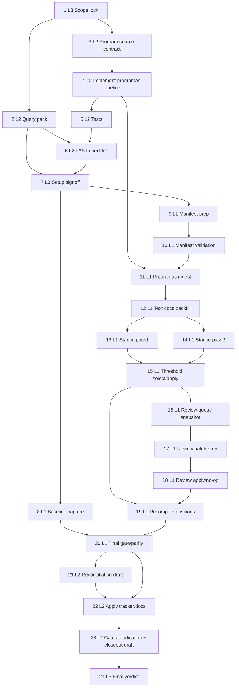

# AI-OPS-18 Sprint Prompt Pack

## Scale Metadata
- `scale_mode`: `LONG_10X`
- `baseline_reference`: `docs/etl/sprints/AI-OPS-15/sprint-ai-agents.md` (points not explicit; inferred baseline proxy)
- `baseline_points`: `13`
- `target_points`: `130`
- `planned_points`: `131`
- `target_task_count`: `24`
- `planned_task_count`: `24`
- `horizon_weeks`: `8`

## Baseline Snapshot
- Tracker mix (`2026-02-17`): `DONE=34`, `PARTIAL=4`, `TODO=9`
- Carryover blockers (strict-network): `parlamento_galicia_deputados`, `parlamento_navarra_parlamentarios_forales`, `bde_series_api`, `aemet_opendata_series`
- Declared signal (`congreso_intervenciones`): `204/614` (`0.332248`)
- Global review queue: `topic_evidence_reviews_total=531`, `pending=0`
- Program lane baseline (`source_id=programas_partidos`):
  - `programas_declared_total=0`
  - `programas_text_documents_total=0`
  - `programas_review_pending=0`
- Tracker focus line: `docs/etl/e2e-scrape-load-tracker.md:74` (`Posiciones declaradas (programas)` currently `TODO`)

## Sprint Objective
- Deliver the first reproducible `programas_partidos` pipeline slice (`ingest -> text_documents -> declared stance -> topic_positions -> evidence visibility`) and move tracker line `74` out of `TODO` with strict gate/parity preserved.

## Bottleneck Class
- Primary: `product bottleneck` (missing source-to-product slice for party programs)
- Secondary: `signal bottleneck` (declared stance extraction/review for new source)

## Lane Packing Plan
- `HI` setup wave: Tasks `1-7`
- `FAST` throughput wave: Tasks `8-20`
- `HI` closeout wave: Tasks `21-24`
- Lane switches: `2` (`HI -> FAST -> HI`)

## Workload Balance
- Points split: `L1=74 (56.49%)`, `L2=46 (35.11%)`, `L3=11 (8.40%)`
- Task split: `L1=13/24 (54.17%)`, `L2=8/24 (33.33%)`, `L3=3/24 (12.50%)`
- L1 throughput obligations satisfied:
  - batch prep: Task `17`
  - apply/recompute: Tasks `18-19`
  - evidence/tracker reconciliation support: Task `20`

## Must-Pass Gates
- `G1 Integrity`: `PRAGMA foreign_key_check` returns zero rows.
- `G2 Queue health`: pending reviews for `programas_partidos` are controlled (`pending_ratio <= 0.35`) and globally non-explosive.
- `G3 Visible progress`: tracker line `74` must move from `TODO` to evidence-backed `PARTIAL` or `DONE`.
- `G4 Signal floor`: `programas_declared_with_signal > 0` with explicit confidence/reason breakdown.
- `G5 Strict gate/parity`: strict tracker gate exit `0` and `overall_match=true` for status parity keys.
- `G6 Workload evidence`: FAST wave artifacts demonstrate L1 executed the majority of deterministic throughput.

## Prompt Pack

1. Agent: L3 Orchestrator
- `depends_on`: `[]`
- `parallel_group`: `P1`
- `model_lane`: `HI`
- `points`: `5`
```text
Repository path/context:
- /Users/jesus/Library/CloudStorage/GoogleDrive-gsus123456@gmail.com/My Drive/CdC/Obsidian Vault/vota-con-la-chola

Objective:
- Lock AI-OPS-18 scope, gate contract, and anti-loop policy for external blockers.

Concrete tasks:
- Define objective boundary to tracker line 74 (programas) plus strict gate/parity invariants.
- Confirm what qualifies as PARTIAL vs DONE for this sprint.
- Freeze escalation rules for blocked external connectors (no blind retries).

Output contract:
- docs/etl/sprints/AI-OPS-18/kickoff.md
- docs/etl/sprints/AI-OPS-18/reports/scope-lock.md

Acceptance checks:
- test -f docs/etl/sprints/AI-OPS-18/kickoff.md
- rg -n "Scope Lock|Must-pass gates|Escalation rules" docs/etl/sprints/AI-OPS-18/kickoff.md

Task packet:
goal: Scope lock and gate contract for the sprint.
inputs: docs/roadmap.md; docs/roadmap-tecnico.md; docs/etl/e2e-scrape-load-tracker.md; docs/etl/sprints/AI-OPS-16/closeout.md
output_contract: kickoff + scope-lock docs with explicit G1-G6 and no-loop policy.
acceptance_query: kickoff/scope-lock docs include objective boundary and gate table.
escalation_rule: Escalate if scope requires non-reproducible ingestion policy.
depends_on: []
parallel_group: P1
artifact_path: docs/etl/sprints/AI-OPS-18/reports/scope-lock.md
```

2. Agent: L2 Specialist Builder
- `depends_on`: `[1]`
- `parallel_group`: `P2`
- `model_lane`: `HI`
- `points`: `5`
```text
Repository path/context:
- /Users/jesus/Library/CloudStorage/GoogleDrive-gsus123456@gmail.com/My Drive/CdC/Obsidian Vault/vota-con-la-chola

Objective:
- Produce baseline SQL/CLI query pack for the new programas lane.

Concrete tasks:
- Define baseline metrics SQL for source_id=programas_partidos (declared total/signal/review/text docs).
- Define strict gate + status parity command pack.
- Define pass1/pass2 threshold comparison query snippets.

Output contract:
- docs/etl/sprints/AI-OPS-18/reports/query-pack-baseline.md

Acceptance checks:
- test -f docs/etl/sprints/AI-OPS-18/reports/query-pack-baseline.md
- rg -n "programas_declared_total|strict gate|overall_match" docs/etl/sprints/AI-OPS-18/reports/query-pack-baseline.md

Task packet:
goal: Baseline KPI and gate query scaffolding.
inputs: etl/data/staging/politicos-es.db; docs/etl/e2e-scrape-load-tracker.md; docs/etl/mismatch-waivers.json
output_contract: runnable query/command pack for setup and FAST wave.
acceptance_query: query pack includes SQL + shell blocks for baseline and postrun.
escalation_rule: Escalate if required tables/columns are missing.
depends_on: [1]
parallel_group: P2
artifact_path: docs/etl/sprints/AI-OPS-18/reports/query-pack-baseline.md
```

3. Agent: L2 Specialist Builder
- `depends_on`: `[1]`
- `parallel_group`: `P3`
- `model_lane`: `HI`
- `points`: `8`
```text
Repository path/context:
- /Users/jesus/Library/CloudStorage/GoogleDrive-gsus123456@gmail.com/My Drive/CdC/Obsidian Vault/vota-con-la-chola

Objective:
- Define the canonical source contract and manifest schema for party programs.

Concrete tasks:
- Add/confirm source_id contract: programas_partidos.
- Define deterministic manifest schema (party_id, party_name, election_cycle, source_url, format_hint, language, scope, snapshot_date).
- Define dedupe/identity key policy and strict-network behavior.

Output contract:
- docs/etl/sprints/AI-OPS-18/reports/programas-source-contract.md
- etl/data/raw/samples/programas_partidos_sample.csv

Acceptance checks:
- test -f docs/etl/sprints/AI-OPS-18/reports/programas-source-contract.md
- test -f etl/data/raw/samples/programas_partidos_sample.csv
- rg -n "source_id=programas_partidos|identity key|manifest" docs/etl/sprints/AI-OPS-18/reports/programas-source-contract.md

Task packet:
goal: Source and manifest contract for program ingestion.
inputs: docs/etl/e2e-scrape-load-tracker.md; etl/parlamentario_es/config.py; etl/load/sqlite_schema.sql
output_contract: source-contract report + deterministic sample manifest.
acceptance_query: contract defines schema, constraints, and strict behavior.
escalation_rule: Escalate if contract implies destructive schema changes.
depends_on: [1]
parallel_group: P3
artifact_path: docs/etl/sprints/AI-OPS-18/reports/programas-source-contract.md
```

4. Agent: L2 Specialist Builder
- `depends_on`: `[1,3]`
- `parallel_group`: `P4`
- `model_lane`: `HI`
- `points`: `8`
```text
Repository path/context:
- /Users/jesus/Library/CloudStorage/GoogleDrive-gsus123456@gmail.com/My Drive/CdC/Obsidian Vault/vota-con-la-chola

Objective:
- Implement the first reproducible programas ingestion + extraction pipeline slice.

Concrete tasks:
- Add source config + ingest routing for programas_partidos.
- Implement connector/parser module for manifest-driven fetch/parse (HTML/PDF text extraction fallback-safe).
- Persist source_records with traceability and generate declared topic_evidence stubs linked by source_record_pk.
- Add CLI surface for deterministic run (`ingest --source programas_partidos --from-file/--manifest`).

Output contract:
- etl/parlamentario_es/config.py
- etl/parlamentario_es/pipeline.py
- etl/parlamentario_es/cli.py
- etl/parlamentario_es/connectors/programas_partidos.py
- docs/etl/sprints/AI-OPS-18/reports/programas-pipeline-design.md

Acceptance checks:
- rg -n "programas_partidos" etl/parlamentario_es/config.py etl/parlamentario_es/pipeline.py etl/parlamentario_es/cli.py
- test -f etl/parlamentario_es/connectors/programas_partidos.py
- test -f docs/etl/sprints/AI-OPS-18/reports/programas-pipeline-design.md

Task packet:
goal: Build ingestable program source slice with traceable records.
inputs: task 3 contract; existing parl pipeline patterns; sqlite schema.
output_contract: code changes + design report + runnable CLI path.
acceptance_query: source can be invoked by CLI and writes source_records/topic_evidence rows.
escalation_rule: Escalate if parser requires non-deterministic browser automation.
depends_on: [1,3]
parallel_group: P4
artifact_path: docs/etl/sprints/AI-OPS-18/reports/programas-pipeline-design.md
```

5. Agent: L2 Specialist Builder
- `depends_on`: `[4]`
- `parallel_group`: `P5`
- `model_lane`: `HI`
- `points`: `5`
```text
Repository path/context:
- /Users/jesus/Library/CloudStorage/GoogleDrive-gsus123456@gmail.com/My Drive/CdC/Obsidian Vault/vota-con-la-chola

Objective:
- Add deterministic tests for programas ingestion and idempotence contracts.

Concrete tasks:
- Add tests for manifest validation, stable source_record_id generation, and idempotent upsert behavior.
- Add at least one sample-based E2E path for programas_partidos source.
- Document expected deterministic output counts from sample.

Output contract:
- tests/test_parl_programas_partidos.py
- docs/etl/sprints/AI-OPS-18/reports/programas-pipeline-tests.md

Acceptance checks:
- test -f tests/test_parl_programas_partidos.py
- test -f docs/etl/sprints/AI-OPS-18/reports/programas-pipeline-tests.md
- rg -n "programas_partidos|idempot" tests/test_parl_programas_partidos.py

Task packet:
goal: Protect new source behavior with deterministic tests.
inputs: task 4 code changes; etl/data/raw/samples/programas_partidos_sample.csv
output_contract: tests + test report with run command.
acceptance_query: targeted tests pass and assert idempotence.
escalation_rule: Escalate if tests require unrelated fixture rewrites.
depends_on: [4]
parallel_group: P5
artifact_path: docs/etl/sprints/AI-OPS-18/reports/programas-pipeline-tests.md
```

6. Agent: L2 Specialist Builder
- `depends_on`: `[2,5]`
- `parallel_group`: `P6`
- `model_lane`: `HI`
- `points`: `5`
```text
Repository path/context:
- /Users/jesus/Library/CloudStorage/GoogleDrive-gsus123456@gmail.com/My Drive/CdC/Obsidian Vault/vota-con-la-chola

Objective:
- Build deterministic FAST-wave execution checklist for tasks 8-20.

Concrete tasks:
- Sequence commands, expected files, and pass/fail conditions.
- Include explicit no-op branch when review input is not available.
- Include required env vars and snapshot date handling.

Output contract:
- docs/etl/sprints/AI-OPS-18/reports/fast-wave-checklist.md

Acceptance checks:
- test -f docs/etl/sprints/AI-OPS-18/reports/fast-wave-checklist.md
- rg -n "Task 8|Task 20|no-op|snapshot" docs/etl/sprints/AI-OPS-18/reports/fast-wave-checklist.md

Task packet:
goal: Operational runbook for FAST lane.
inputs: task 2 query pack; task 5 test report; kickoff gate contract.
output_contract: checklist with deterministic acceptance steps.
acceptance_query: checklist enumerates all FAST tasks and artifacts.
escalation_rule: Escalate if any FAST task lacks deterministic acceptance criteria.
depends_on: [2,5]
parallel_group: P6
artifact_path: docs/etl/sprints/AI-OPS-18/reports/fast-wave-checklist.md
```

7. Agent: L3 Orchestrator
- `depends_on`: `[2,5,6]`
- `parallel_group`: `P7`
- `model_lane`: `HI`
- `points`: `3`
```text
Repository path/context:
- /Users/jesus/Library/CloudStorage/GoogleDrive-gsus123456@gmail.com/My Drive/CdC/Obsidian Vault/vota-con-la-chola

Objective:
- Approve HI setup completion and lock FAST execution order.

Concrete tasks:
- Validate setup artifacts from tasks 1-6.
- Publish GO/NO-GO decision with blocker handling policy.

Output contract:
- docs/etl/sprints/AI-OPS-18/reports/setup-wave-signoff.md

Acceptance checks:
- test -f docs/etl/sprints/AI-OPS-18/reports/setup-wave-signoff.md
- rg -n "GO|NO-GO|lane order|blocker policy" docs/etl/sprints/AI-OPS-18/reports/setup-wave-signoff.md

Task packet:
goal: Setup wave signoff.
inputs: tasks 1-6 outputs.
output_contract: signed readiness note with lane lock.
acceptance_query: signoff includes GO/NO-GO and escalation path.
escalation_rule: Escalate if setup artifacts are incomplete.
depends_on: [2,5,6]
parallel_group: P7
artifact_path: docs/etl/sprints/AI-OPS-18/reports/setup-wave-signoff.md
```

8. Agent: L1 Mechanical Executor
- `depends_on`: `[2,6,7]`
- `parallel_group`: `P8`
- `model_lane`: `FAST`
- `points`: `5`
```text
Repository path/context:
- /Users/jesus/Library/CloudStorage/GoogleDrive-gsus123456@gmail.com/My Drive/CdC/Obsidian Vault/vota-con-la-chola

Objective:
- Capture baseline status and KPI packet before programas ingestion.

Concrete tasks:
- Run tracker status and strict gate baseline commands.
- Run baseline SQL for programas source metrics.
- Save logs and normalized CSVs.

Output contract:
- docs/etl/sprints/AI-OPS-18/evidence/tracker-status-baseline.log
- docs/etl/sprints/AI-OPS-18/evidence/baseline-gate.log
- docs/etl/sprints/AI-OPS-18/exports/programas_kpi_baseline.csv

Acceptance checks:
- test -f docs/etl/sprints/AI-OPS-18/evidence/tracker-status-baseline.log
- test -f docs/etl/sprints/AI-OPS-18/evidence/baseline-gate.log
- test -f docs/etl/sprints/AI-OPS-18/exports/programas_kpi_baseline.csv

Task packet:
goal: Baseline evidence capture.
inputs: task 2 query pack; task 6 checklist.
output_contract: baseline logs + KPI csv.
acceptance_query: baseline csv includes programas_declared_total/programas_text_documents_total.
escalation_rule: Escalate if strict gate baseline fails.
depends_on: [2,6,7]
parallel_group: P8
artifact_path: docs/etl/sprints/AI-OPS-18/exports/programas_kpi_baseline.csv
```

9. Agent: L1 Mechanical Executor
- `depends_on`: `[6,7]`
- `parallel_group`: `P9`
- `model_lane`: `FAST`
- `points`: `5`
```text
Repository path/context:
- /Users/jesus/Library/CloudStorage/GoogleDrive-gsus123456@gmail.com/My Drive/CdC/Obsidian Vault/vota-con-la-chola

Objective:
- Prepare first deterministic party-program manifest input batch.

Concrete tasks:
- Build/refresh manifest CSV from approved official program URLs.
- Ensure required columns and snapshot_date are present.
- Save manifest under sprint exports for traceability.

Output contract:
- docs/etl/sprints/AI-OPS-18/exports/program_manifest_input.csv

Acceptance checks:
- test -f docs/etl/sprints/AI-OPS-18/exports/program_manifest_input.csv
- python3 - <<'PY'
import csv
from pathlib import Path
p=Path('docs/etl/sprints/AI-OPS-18/exports/program_manifest_input.csv')
with p.open(encoding='utf-8') as f:
    h=next(csv.reader(f))
required={'party_name','source_url','snapshot_date','scope'}
print('ok' if required.issubset(set(h)) else 'missing')
PY

Task packet:
goal: Batch input preparation for programas ingestion.
inputs: task 3 manifest schema; approved source list.
output_contract: manifest csv with required fields.
acceptance_query: header/schema validation passes.
escalation_rule: Escalate if required official URLs are unavailable.
depends_on: [6,7]
parallel_group: P9
artifact_path: docs/etl/sprints/AI-OPS-18/exports/program_manifest_input.csv
```

10. Agent: L1 Mechanical Executor
- `depends_on`: `[9]`
- `parallel_group`: `P10`
- `model_lane`: `FAST`
- `points`: `5`
```text
Repository path/context:
- /Users/jesus/Library/CloudStorage/GoogleDrive-gsus123456@gmail.com/My Drive/CdC/Obsidian Vault/vota-con-la-chola

Objective:
- Validate manifest quality before any network fetch.

Concrete tasks:
- Run manifest validator command (duplicates, malformed URLs, missing fields).
- Capture validation log and error counts.
- Produce short validation report with remediation notes if needed.

Output contract:
- docs/etl/sprints/AI-OPS-18/evidence/program-manifest-validate.log
- docs/etl/sprints/AI-OPS-18/reports/program-manifest-validation.md

Acceptance checks:
- test -f docs/etl/sprints/AI-OPS-18/evidence/program-manifest-validate.log
- test -f docs/etl/sprints/AI-OPS-18/reports/program-manifest-validation.md
- rg -n "duplicates|malformed|missing|status" docs/etl/sprints/AI-OPS-18/reports/program-manifest-validation.md

Task packet:
goal: Manifest QA gate.
inputs: task 9 manifest; validator from task 4.
output_contract: validation log + report.
acceptance_query: report includes pass/fail summary and row counts.
escalation_rule: Escalate if critical schema errors remain unresolved.
depends_on: [9]
parallel_group: P10
artifact_path: docs/etl/sprints/AI-OPS-18/reports/program-manifest-validation.md
```

11. Agent: L1 Mechanical Executor
- `depends_on`: `[4,10]`
- `parallel_group`: `P11`
- `model_lane`: `FAST`
- `points`: `5`
```text
Repository path/context:
- /Users/jesus/Library/CloudStorage/GoogleDrive-gsus123456@gmail.com/My Drive/CdC/Obsidian Vault/vota-con-la-chola

Objective:
- Execute first programas ingestion run from manifest.

Concrete tasks:
- Run ingest command for source programas_partidos with strict-network and manifest input.
- Capture run log and emitted metrics.
- Export run summary (seen/loaded/errors).

Output contract:
- docs/etl/sprints/AI-OPS-18/evidence/programas_ingest.log
- docs/etl/sprints/AI-OPS-18/exports/programas_ingest_metrics.csv

Acceptance checks:
- test -f docs/etl/sprints/AI-OPS-18/evidence/programas_ingest.log
- test -f docs/etl/sprints/AI-OPS-18/exports/programas_ingest_metrics.csv
- rg -n "records_loaded|source_id=programas_partidos" docs/etl/sprints/AI-OPS-18/evidence/programas_ingest.log

Task packet:
goal: First reproducible ingest pass for programas source.
inputs: task 10 validated manifest; task 4 ingest implementation.
output_contract: ingest log + metrics csv.
acceptance_query: records_loaded > 0 or explicit blocker evidence documented.
escalation_rule: Escalate if ingest yields seen>0 and loaded=0 without explainable blocker.
depends_on: [4,10]
parallel_group: P11
artifact_path: docs/etl/sprints/AI-OPS-18/evidence/programas_ingest.log
```

12. Agent: L1 Mechanical Executor
- `depends_on`: `[11]`
- `parallel_group`: `P12`
- `model_lane`: `FAST`
- `points`: `5`
```text
Repository path/context:
- /Users/jesus/Library/CloudStorage/GoogleDrive-gsus123456@gmail.com/My Drive/CdC/Obsidian Vault/vota-con-la-chola

Objective:
- Materialize text_documents coverage for programas_partidos evidence.

Concrete tasks:
- Run backfill-text-documents for source programas_partidos.
- Capture log and text document metrics (total, excerpt coverage).

Output contract:
- docs/etl/sprints/AI-OPS-18/evidence/programas_textdocs_backfill.log
- docs/etl/sprints/AI-OPS-18/exports/programas_textdocs_metrics.csv

Acceptance checks:
- test -f docs/etl/sprints/AI-OPS-18/evidence/programas_textdocs_backfill.log
- test -f docs/etl/sprints/AI-OPS-18/exports/programas_textdocs_metrics.csv
- rg -n "text_documents_total|with_excerpt" docs/etl/sprints/AI-OPS-18/exports/programas_textdocs_metrics.csv

Task packet:
goal: Create textual evidence substrate for stance extraction.
inputs: task 11 source_records; existing backfill-text-documents CLI.
output_contract: textdoc backfill log + metrics.
acceptance_query: text_documents_total for programas_partidos is non-zero.
escalation_rule: Escalate if text extraction repeatedly fails on dominant format.
depends_on: [11]
parallel_group: P12
artifact_path: docs/etl/sprints/AI-OPS-18/exports/programas_textdocs_metrics.csv
```

13. Agent: L1 Mechanical Executor
- `depends_on`: `[2,4,12]`
- `parallel_group`: `P13`
- `model_lane`: `FAST`
- `points`: `5`
```text
Repository path/context:
- /Users/jesus/Library/CloudStorage/GoogleDrive-gsus123456@gmail.com/My Drive/CdC/Obsidian Vault/vota-con-la-chola

Objective:
- Run declared-stance pass1 (higher confidence threshold) for programas_partidos.

Concrete tasks:
- Execute backfill-declared-stance with pass1 threshold.
- Export pass1 metrics and reason breakdown.

Output contract:
- docs/etl/sprints/AI-OPS-18/evidence/programas_stance_pass1.log
- docs/etl/sprints/AI-OPS-18/exports/programas_stance_pass1_metrics.csv

Acceptance checks:
- test -f docs/etl/sprints/AI-OPS-18/evidence/programas_stance_pass1.log
- test -f docs/etl/sprints/AI-OPS-18/exports/programas_stance_pass1_metrics.csv
- rg -n "declared_with_signal|review_pending" docs/etl/sprints/AI-OPS-18/exports/programas_stance_pass1_metrics.csv

Task packet:
goal: Conservative declared-stance extraction baseline.
inputs: task 2 query pack; task 12 text documents.
output_contract: pass1 log + metrics.
acceptance_query: metrics include signal and review counts for programas_partidos.
escalation_rule: Escalate if command errors or metrics file is empty.
depends_on: [2,4,12]
parallel_group: P13
artifact_path: docs/etl/sprints/AI-OPS-18/exports/programas_stance_pass1_metrics.csv
```

14. Agent: L1 Mechanical Executor
- `depends_on`: `[2,4,12]`
- `parallel_group`: `P13`
- `model_lane`: `FAST`
- `points`: `5`
```text
Repository path/context:
- /Users/jesus/Library/CloudStorage/GoogleDrive-gsus123456@gmail.com/My Drive/CdC/Obsidian Vault/vota-con-la-chola

Objective:
- Run declared-stance pass2 (broader threshold) for programas_partidos.

Concrete tasks:
- Execute backfill-declared-stance with pass2 threshold.
- Export pass2 metrics and reason breakdown.

Output contract:
- docs/etl/sprints/AI-OPS-18/evidence/programas_stance_pass2.log
- docs/etl/sprints/AI-OPS-18/exports/programas_stance_pass2_metrics.csv

Acceptance checks:
- test -f docs/etl/sprints/AI-OPS-18/evidence/programas_stance_pass2.log
- test -f docs/etl/sprints/AI-OPS-18/exports/programas_stance_pass2_metrics.csv
- rg -n "declared_with_signal|review_pending" docs/etl/sprints/AI-OPS-18/exports/programas_stance_pass2_metrics.csv

Task packet:
goal: Broader extraction candidate for deterministic selection.
inputs: task 2 query pack; task 12 text documents.
output_contract: pass2 log + metrics.
acceptance_query: pass2 metrics generated successfully.
escalation_rule: Escalate if pass2 fails hard gates or outputs invalid counts.
depends_on: [2,4,12]
parallel_group: P13
artifact_path: docs/etl/sprints/AI-OPS-18/exports/programas_stance_pass2_metrics.csv
```

15. Agent: L1 Mechanical Executor
- `depends_on`: `[13,14]`
- `parallel_group`: `P14`
- `model_lane`: `FAST`
- `points`: `8`
```text
Repository path/context:
- /Users/jesus/Library/CloudStorage/GoogleDrive-gsus123456@gmail.com/My Drive/CdC/Obsidian Vault/vota-con-la-chola

Objective:
- Select deterministic threshold winner and apply selected stance state.

Concrete tasks:
- Compare pass1/pass2 with deterministic tie-break policy.
- Apply selected run if winner differs from last applied state.
- Export selected metrics and decision note.

Output contract:
- docs/etl/sprints/AI-OPS-18/reports/programas_threshold_selection.md
- docs/etl/sprints/AI-OPS-18/exports/programas_stance_selected_metrics.csv

Acceptance checks:
- test -f docs/etl/sprints/AI-OPS-18/reports/programas_threshold_selection.md
- test -f docs/etl/sprints/AI-OPS-18/exports/programas_stance_selected_metrics.csv
- rg -n "selected_threshold|tie-break|decision" docs/etl/sprints/AI-OPS-18/reports/programas_threshold_selection.md

Task packet:
goal: Deterministic selection and application of extraction threshold.
inputs: tasks 13-14 metrics.
output_contract: selection report + selected metrics csv.
acceptance_query: selected metrics meet non-regression and signal floor conditions.
escalation_rule: Escalate if neither candidate satisfies hard gates.
depends_on: [13,14]
parallel_group: P14
artifact_path: docs/etl/sprints/AI-OPS-18/reports/programas_threshold_selection.md
```

16. Agent: L1 Mechanical Executor
- `depends_on`: `[15]`
- `parallel_group`: `P15`
- `model_lane`: `FAST`
- `points`: `8`
```text
Repository path/context:
- /Users/jesus/Library/CloudStorage/GoogleDrive-gsus123456@gmail.com/My Drive/CdC/Obsidian Vault/vota-con-la-chola

Objective:
- Snapshot review queue state after threshold selection.

Concrete tasks:
- Export pending review rows for source programas_partidos.
- Export pending-by-reason metrics and pending ratio.
- Capture queue inspection log.

Output contract:
- docs/etl/sprints/AI-OPS-18/evidence/programas_review_queue.log
- docs/etl/sprints/AI-OPS-18/exports/programas_review_queue_snapshot.csv

Acceptance checks:
- test -f docs/etl/sprints/AI-OPS-18/evidence/programas_review_queue.log
- test -f docs/etl/sprints/AI-OPS-18/exports/programas_review_queue_snapshot.csv
- rg -n "review_reason|pending" docs/etl/sprints/AI-OPS-18/exports/programas_review_queue_snapshot.csv

Task packet:
goal: Queue observability for adjudication planning.
inputs: selected stance state from task 15.
output_contract: queue log + snapshot csv.
acceptance_query: snapshot includes status/reason/confidence columns.
escalation_rule: Escalate if queue query fails or snapshot is malformed.
depends_on: [15]
parallel_group: P15
artifact_path: docs/etl/sprints/AI-OPS-18/exports/programas_review_queue_snapshot.csv
```

17. Agent: L1 Mechanical Executor
- `depends_on`: `[16]`
- `parallel_group`: `P16`
- `model_lane`: `FAST`
- `points`: `5`
```text
Repository path/context:
- /Users/jesus/Library/CloudStorage/GoogleDrive-gsus123456@gmail.com/My Drive/CdC/Obsidian Vault/vota-con-la-chola

Objective:
- Prepare deterministic review batch A input for manual/adjudicated loop.

Concrete tasks:
- Build `programas_review_batch_a_input.csv` from pending queue with fixed ordering and cap.
- Include required fields for adjudication (`evidence_id`, `suggested_stance`, `suggested_confidence`, `excerpt`).
- Document prep counts and filters.

Output contract:
- docs/etl/sprints/AI-OPS-18/exports/programas_review_batch_a_input.csv
- docs/etl/sprints/AI-OPS-18/reports/programas_review_batch_prep.md

Acceptance checks:
- test -f docs/etl/sprints/AI-OPS-18/exports/programas_review_batch_a_input.csv
- test -f docs/etl/sprints/AI-OPS-18/reports/programas_review_batch_prep.md
- rg -n "batch_size|filter|ordering" docs/etl/sprints/AI-OPS-18/reports/programas_review_batch_prep.md

Task packet:
goal: Batch-prep artifact for human review throughput.
inputs: task 16 queue snapshot.
output_contract: batch input csv + prep report.
acceptance_query: csv headers/ordering deterministic and documented.
escalation_rule: Escalate if pending queue is empty but metrics indicate otherwise.
depends_on: [16]
parallel_group: P16
artifact_path: docs/etl/sprints/AI-OPS-18/exports/programas_review_batch_a_input.csv
```

18. Agent: L1 Mechanical Executor
- `depends_on`: `[17]`
- `parallel_group`: `P17`
- `model_lane`: `FAST`
- `points`: `5`
```text
Repository path/context:
- /Users/jesus/Library/CloudStorage/GoogleDrive-gsus123456@gmail.com/My Drive/CdC/Obsidian Vault/vota-con-la-chola

Objective:
- Apply adjudicated review decisions for batch A (or execute deterministic no-op path).

Concrete tasks:
- If adjudicated file exists, apply review decisions via CLI with recompute disabled in this step.
- If adjudicated file is missing, run no-op path and capture explicit carryover evidence.
- Export apply metrics.

Output contract:
- docs/etl/sprints/AI-OPS-18/evidence/programas_review_batch_apply.log
- docs/etl/sprints/AI-OPS-18/exports/programas_review_batch_apply_metrics.csv

Acceptance checks:
- test -f docs/etl/sprints/AI-OPS-18/evidence/programas_review_batch_apply.log
- test -f docs/etl/sprints/AI-OPS-18/exports/programas_review_batch_apply_metrics.csv
- rg -n "applied|resolved|ignored|no-op" docs/etl/sprints/AI-OPS-18/evidence/programas_review_batch_apply.log

Task packet:
goal: Review decision apply stage.
inputs: task 17 batch input; optional adjudicated decisions file.
output_contract: apply log + metrics csv.
acceptance_query: explicit applied/no-op status captured.
escalation_rule: Escalate if decision import format is invalid.
depends_on: [17]
parallel_group: P17
artifact_path: docs/etl/sprints/AI-OPS-18/evidence/programas_review_batch_apply.log
```

19. Agent: L1 Mechanical Executor
- `depends_on`: `[15,18]`
- `parallel_group`: `P18`
- `model_lane`: `FAST`
- `points`: `5`
```text
Repository path/context:
- /Users/jesus/Library/CloudStorage/GoogleDrive-gsus123456@gmail.com/My Drive/CdC/Obsidian Vault/vota-con-la-chola

Objective:
- Recompute declared and combined positions after selection/review apply.

Concrete tasks:
- Run backfill-declared-positions for source programas_partidos.
- Run backfill-combined-positions for aligned as_of_date.
- Export postrun topic/coherence metrics.

Output contract:
- docs/etl/sprints/AI-OPS-18/evidence/programas_positions_recompute.log
- docs/etl/sprints/AI-OPS-18/exports/programas_topic_positions_post.csv
- docs/etl/sprints/AI-OPS-18/exports/programas_coherence_post.csv

Acceptance checks:
- test -f docs/etl/sprints/AI-OPS-18/evidence/programas_positions_recompute.log
- test -f docs/etl/sprints/AI-OPS-18/exports/programas_topic_positions_post.csv
- test -f docs/etl/sprints/AI-OPS-18/exports/programas_coherence_post.csv

Task packet:
goal: Position recompute and coherence visibility.
inputs: selected stance state; review apply state.
output_contract: recompute log + postrun metrics csvs.
acceptance_query: postrun csvs include latest as_of_date and non-null counts.
escalation_rule: Escalate if recompute fails or produces empty snapshot unexpectedly.
depends_on: [15,18]
parallel_group: P18
artifact_path: docs/etl/sprints/AI-OPS-18/exports/programas_topic_positions_post.csv
```

20. Agent: L1 Mechanical Executor
- `depends_on`: `[8,19]`
- `parallel_group`: `P19`
- `model_lane`: `FAST`
- `points`: `8`
```text
Repository path/context:
- /Users/jesus/Library/CloudStorage/GoogleDrive-gsus123456@gmail.com/My Drive/CdC/Obsidian Vault/vota-con-la-chola

Objective:
- Run FAST-wave final gates and parity exports.

Concrete tasks:
- Execute strict tracker gate and capture exit code.
- Export status snapshot and parity comparison against published status.
- Build FAST-wave gate/parity report and summarize deltas vs baseline.

Output contract:
- docs/etl/sprints/AI-OPS-18/evidence/tracker-gate-postrun.log
- docs/etl/sprints/AI-OPS-18/evidence/tracker-gate-postrun.exit
- docs/etl/sprints/AI-OPS-18/evidence/status-postrun.json
- docs/etl/sprints/AI-OPS-18/evidence/status-parity-postrun.txt
- docs/etl/sprints/AI-OPS-18/reports/final-gate-parity.md

Acceptance checks:
- test -f docs/etl/sprints/AI-OPS-18/evidence/tracker-gate-postrun.exit
- test -f docs/etl/sprints/AI-OPS-18/evidence/status-postrun.json
- test -f docs/etl/sprints/AI-OPS-18/evidence/status-parity-postrun.txt
- rg -n "overall_match=true|mismatches=0|waivers_expired=0|done_zero_real=0" docs/etl/sprints/AI-OPS-18/reports/final-gate-parity.md

Task packet:
goal: FAST wave final gate + parity evidence.
inputs: baseline pack from task 8; postrun metrics from task 19.
output_contract: strict gate artifacts + parity report.
acceptance_query: gate exit 0 and overall_match true.
escalation_rule: Escalate immediately on strict gate or parity failure.
depends_on: [8,19]
parallel_group: P19
artifact_path: docs/etl/sprints/AI-OPS-18/reports/final-gate-parity.md
```

21. Agent: L2 Specialist Builder
- `depends_on`: `[20]`
- `parallel_group`: `P20`
- `model_lane`: `HI`
- `points`: `5`
```text
Repository path/context:
- /Users/jesus/Library/CloudStorage/GoogleDrive-gsus123456@gmail.com/My Drive/CdC/Obsidian Vault/vota-con-la-chola

Objective:
- Draft reconciliation decision for tracker line 74 using postrun evidence.

Concrete tasks:
- Compare baseline vs postrun metrics for programas lane.
- Decide whether line 74 qualifies for PARTIAL or DONE according to DoD.
- Produce explicit reconciliation draft with rationale.

Output contract:
- docs/etl/sprints/AI-OPS-18/reports/tracker-row74-reconciliation-draft.md

Acceptance checks:
- test -f docs/etl/sprints/AI-OPS-18/reports/tracker-row74-reconciliation-draft.md
- rg -n "line 74|TODO|PARTIAL|DONE|evidence" docs/etl/sprints/AI-OPS-18/reports/tracker-row74-reconciliation-draft.md

Task packet:
goal: Evidence-backed status decision draft for tracker line 74.
inputs: tasks 8 and 20 artifacts; tracker DoD rules.
output_contract: reconciliation draft with decision criteria table.
acceptance_query: draft maps each DoD criterion to evidence file.
escalation_rule: Escalate if evidence is insufficient to justify status change.
depends_on: [20]
parallel_group: P20
artifact_path: docs/etl/sprints/AI-OPS-18/reports/tracker-row74-reconciliation-draft.md
```

22. Agent: L2 Specialist Builder
- `depends_on`: `[20,21]`
- `parallel_group`: `P21`
- `model_lane`: `HI`
- `points`: `5`
```text
Repository path/context:
- /Users/jesus/Library/CloudStorage/GoogleDrive-gsus123456@gmail.com/My Drive/CdC/Obsidian Vault/vota-con-la-chola

Objective:
- Apply tracker/doc updates and capture exact diff rationale.

Concrete tasks:
- Update docs/etl/e2e-scrape-load-tracker.md line 74 status/notes based on approved reconciliation.
- Update sprint index pointer if needed for active sprint continuity.
- Record applied changes and linked evidence.

Output contract:
- docs/etl/e2e-scrape-load-tracker.md
- docs/etl/sprints/AI-OPS-18/reports/tracker-row74-apply.md

Acceptance checks:
- rg -n "Posiciones declaradas \(programas\)" docs/etl/e2e-scrape-load-tracker.md
- test -f docs/etl/sprints/AI-OPS-18/reports/tracker-row74-apply.md
- rg -n "before|after|evidence" docs/etl/sprints/AI-OPS-18/reports/tracker-row74-apply.md

Task packet:
goal: Apply approved tracker/documentation reconciliation.
inputs: task 21 decision draft; final evidence set.
output_contract: updated tracker row + apply report.
acceptance_query: tracker status and notes match reconciliation decision.
escalation_rule: Escalate if proposed update overstates evidence quality.
depends_on: [20,21]
parallel_group: P21
artifact_path: docs/etl/sprints/AI-OPS-18/reports/tracker-row74-apply.md
```

23. Agent: L2 Specialist Builder
- `depends_on`: `[20,22]`
- `parallel_group`: `P22`
- `model_lane`: `HI`
- `points`: `5`
```text
Repository path/context:
- /Users/jesus/Library/CloudStorage/GoogleDrive-gsus123456@gmail.com/My Drive/CdC/Obsidian Vault/vota-con-la-chola

Objective:
- Assemble final gate adjudication packet and closeout draft.

Concrete tasks:
- Compile gate-by-gate verdict matrix (G1-G6) with evidence links.
- Draft closeout with objective delta, carryover blockers, and next-sprint trigger options.
- Ensure anti-loop blocker policy outcome is explicit.

Output contract:
- docs/etl/sprints/AI-OPS-18/reports/gate-adjudication.md
- docs/etl/sprints/AI-OPS-18/closeout.md

Acceptance checks:
- test -f docs/etl/sprints/AI-OPS-18/reports/gate-adjudication.md
- test -f docs/etl/sprints/AI-OPS-18/closeout.md
- rg -n "Sprint Verdict|G1|G6|next sprint trigger|NO_ESCALATION" docs/etl/sprints/AI-OPS-18/closeout.md

Task packet:
goal: Prepare final decision packet for L3 signoff.
inputs: tasks 20-22 artifacts; kickoff gate contract.
output_contract: adjudication report + closeout draft.
acceptance_query: every gate has PASS/FAIL and source evidence.
escalation_rule: Escalate if any gate status cannot be justified with artifacts.
depends_on: [20,22]
parallel_group: P22
artifact_path: docs/etl/sprints/AI-OPS-18/reports/gate-adjudication.md
```

24. Agent: L3 Orchestrator
- `depends_on`: `[23]`
- `parallel_group`: `P23`
- `model_lane`: `HI`
- `points`: `3`
```text
Repository path/context:
- /Users/jesus/Library/CloudStorage/GoogleDrive-gsus123456@gmail.com/My Drive/CdC/Obsidian Vault/vota-con-la-chola

Objective:
- Issue final PASS/FAIL verdict and lock AI-OPS-18 carryover policy.

Concrete tasks:
- Validate gate adjudication and tracker reconciliation integrity.
- Finalize closeout verdict and escalation status.
- Publish next sprint trigger with explicit objective ordering.

Output contract:
- docs/etl/sprints/AI-OPS-18/closeout.md

Acceptance checks:
- test -f docs/etl/sprints/AI-OPS-18/closeout.md
- rg -n "Sprint Verdict|Gate Evaluation|next sprint trigger|NO_ESCALATION" docs/etl/sprints/AI-OPS-18/closeout.md

Task packet:
goal: Final sprint arbitration and closure.
inputs: task 23 closeout draft + gate adjudication.
output_contract: final signed closeout verdict.
acceptance_query: verdict and triggers are explicit and evidence-backed.
escalation_rule: Escalate if verdict cannot be supported by artifacts.
depends_on: [23]
parallel_group: P23
artifact_path: docs/etl/sprints/AI-OPS-18/closeout.md
```

## Vertical Flow Diagram



## Runnable Queue Order
- `HI`: `1,2,3,4,5,6,7`
- `FAST`: `8,9,10,11,12,13,14,15,16,17,18,19,20`
- `HI`: `21,22,23,24`

