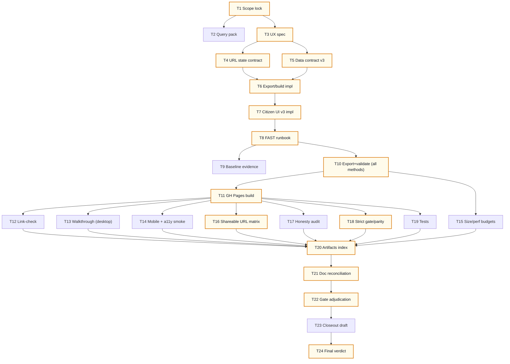

# AI-OPS-20 Sprint Prompt Pack

## Scale Metadata
- `scale_mode`: `LONG_10X`
- `baseline_reference`: `docs/etl/sprints/AI-OPS-17/sprint-ai-agents.md`
- `baseline_points`: `131`
- `target_points`: `130`
- `planned_points`: `131`
- `target_task_count`: `24`
- `planned_task_count`: `24`
- `horizon_weeks`: `6`

## Baseline Snapshot (2026-02-17)
- Citizen app today (static GH Pages):
  - Single concern selection via `?concern=<id>` and optional `?topic_id=<n>`.
  - Party focus exists but is **not shareable** (not encoded in URL).
  - No "multi-concern" view: citizens must switch concerns to synthesize a view.
- Data already available (no new connectors required):
  - Citizen snapshot: `docs/gh-pages/citizen/data/citizen.json` (bounded; current example: `~0.95MB`, `topics~111`, `parties=16`, `party_topic_positions~1776`).
  - Programas lane signal (declared): `party_concern_programas` present in snapshot (bounded table).
  - Snapshot `meta.methods_available` exists (for honest method labeling + future toggles).
- Constraints (non-negotiable):
  - Static-first (`/citizen` on GH Pages), bounded JSON artifacts (target `<= 5MB` each).
  - Evidence-first: every stance shown must link to an audit drill-down.
  - Honesty: render `unknown/no_signal/unclear` explicitly; do not silently impute.

## Sprint Objective (Citizen Dashboard v3)
Ship a citizen-first webapp iteration that feels like a product, not a demo:
- Pick and **save** multiple concerns (local-first, no server).
- Compare parties across your selected concerns in one view (transparent aggregation + coverage).
- Share a URL that restores state (concerns + party focus + method).
- Keep every claim auditable (Explorer drill-down links) and honest (coverage/unknown).

Non-goals (explicit):
- No new upstream connectors; no network scraping required for completion.
- No backend deployment beyond GH Pages.
- No opaque ranking/ML personalization; only transparent aggregation with explicit coverage.

## Bottleneck Class
- Primary: `product bottleneck` (onboarding + multi-concern synthesis + shareability).
- Secondary: `distribution/ops bottleneck` (stable URLs + multi-method bounded artifacts).

## Lane Packing Plan
- `HI` setup wave: Tasks `1-8`
- `FAST` throughput wave: Tasks `9-20`
- `HI` closeout wave: Tasks `21-24`
- Lane switches: `2` (`HI -> FAST -> HI`)

## Workload Balance
- Points split: `L1=74 (56.49%)`, `L2=46 (35.11%)`, `L3=11 (8.40%)`
- Task split: `L1=12/24 (50.00%)`, `L2=9/24 (37.50%)`, `L3=3/24 (12.50%)`
- L1 throughput obligations (required) covered in FAST wave:
  - batch prep/export: Task `10`
  - apply/build/run: Task `11`
  - evidence/reconciliation: Tasks `12,18,20`

## Must-Pass Gates
- `G1 Visible product delta`: multi-concern dashboard (>=2 concerns) + shareable URLs restore view state.
- `G2 Auditability`: every stance card and summary view includes at least one audit link; links resolve on GH Pages build.
- `G3 Honesty`: method labels are accurate; `no_signal/unclear` are explicit; coverage rules are visible.
- `G4 Static budgets`: each citizen artifact stays `<= 5MB`; manual mobile QA shows no obvious jank regressions.
- `G5 Reproducibility`: deterministic multi-method citizen artifacts + validator passes + tests updated.
- `G6 Strict gate/parity`: strict tracker gate exit `0` and status parity remains `overall_match=true`.

## Prompt Pack

1. Agent: L3 Orchestrator
- `depends_on`: `[]`
- `parallel_group`: `P1`
- `model_lane`: `HI`
- `points`: `5`
```text
Repository path/context:
- REPO_ROOT/vota-con-la-chola

Objective:
- Lock AI-OPS-20 scope + must-pass gates for Citizen Dashboard v3 (static, evidence-first).

Concrete tasks:
- Define 2-3 citizen journeys max (multi-concern, compare, share+audit) and what "DONE" means.
- Freeze gates G1-G6 with PASS/FAIL criteria and required evidence artifacts.
- Write explicit non-goals to prevent scope creep (no server, no new connectors, no black-box ranking).

Output contract:
- docs/etl/sprints/AI-OPS-20/reports/scope-lock.md

Acceptance checks:
- test -f docs/etl/sprints/AI-OPS-20/reports/scope-lock.md
- rg -n "User journeys|Scope|Non-goals|Must-pass gates|PASS/FAIL" docs/etl/sprints/AI-OPS-20/reports/scope-lock.md

Task packet:
goal: Scope lock and gate contract.
inputs: docs/roadmap.md; docs/roadmap-tecnico.md; AGENTS.md; ui/citizen/index.html; scripts/export_citizen_snapshot.py; justfile
output_contract: scope-lock report with journeys + gate table + non-goals.
acceptance_query: grep for journeys + gates headers.
escalation_rule: Escalate if MVP implies building a server or expanding scope to new connectors.
depends_on: []
parallel_group: P1
artifact_path: docs/etl/sprints/AI-OPS-20/reports/scope-lock.md
```

2. Agent: L2 Specialist Builder
- `depends_on`: `[1]`
- `parallel_group`: `P2`
- `model_lane`: `HI`
- `points`: `5`
```text
Repository path/context:
- REPO_ROOT/vota-con-la-chola

Objective:
- Produce a baseline + command/query pack for the citizen v3 sprint so L1 can execute deterministic evidence tasks.

Concrete tasks:
- Write runnable commands and expected outputs for:
  - Export + validate citizen snapshot(s) (single + multi-method if planned).
  - `just explorer-gh-pages-build` and key outputs under `docs/gh-pages/`.
  - Strict tracker gate and status parity export/check.
  - Quick sanity metrics for citizen snapshot (bytes, topics, parties, ptp, as_of_date, computed_method).
- Declare exact artifact paths under AI-OPS-20 evidence/exports.

Output contract:
- docs/etl/sprints/AI-OPS-20/reports/query-pack-baseline.md

Acceptance checks:
- test -f docs/etl/sprints/AI-OPS-20/reports/query-pack-baseline.md
- rg -n "export_citizen_snapshot|validate_citizen_snapshot|explorer-gh-pages-build|etl-tracker-gate|overall_match" docs/etl/sprints/AI-OPS-20/reports/query-pack-baseline.md

Task packet:
goal: Deterministic baseline command pack.
inputs: justfile; scripts/export_citizen_snapshot.py; scripts/validate_citizen_snapshot.py; scripts/export_explorer_sources_snapshot.py
output_contract: query-pack with commands, output paths, and pass criteria.
acceptance_query: query pack mentions all required commands and evidence paths.
escalation_rule: Escalate if build/export commands are not deterministic or require network.
depends_on: [1]
parallel_group: P2
artifact_path: docs/etl/sprints/AI-OPS-20/reports/query-pack-baseline.md
```

3. Agent: L2 Specialist Builder
- `depends_on`: `[1]`
- `parallel_group`: `P3`
- `model_lane`: `HI`
- `points`: `8`
```text
Repository path/context:
- REPO_ROOT/vota-con-la-chola

Objective:
- Write the Citizen Dashboard v3 UX spec (multi-concern, shareable, audit-first) grounded in current data constraints.

Concrete tasks:
- Define primary UI modes:
  - "My dashboard" (multi-concern synthesis).
  - "Concern drill-down" (existing per-concern + topic list).
  - "Party focus" (what this party did/promised about selected concerns).
- Specify what is shareable vs local-only state, and the URL semantics at a high level.
- Define copy rules for honesty/coverage (explicit unknown/no_signal).
- Keep implementation feasible in a single static HTML file (no build tooling required).

Output contract:
- docs/etl/sprints/AI-OPS-20/reports/citizen-ux-v3-spec.md

Acceptance checks:
- test -f docs/etl/sprints/AI-OPS-20/reports/citizen-ux-v3-spec.md
- rg -n "My dashboard|multi-concern|shareable URL|audit links|unknown|coverage" docs/etl/sprints/AI-OPS-20/reports/citizen-ux-v3-spec.md

Task packet:
goal: UX spec for a citizen-first static product iteration.
inputs: ui/citizen/index.html; docs/etl/sprints/AI-OPS-17/reports/citizen-ui-v2.md; docs/etl/sprints/AI-OPS-18/reports/scope-lock.md
output_contract: spec with UI modes, state model, and honesty rules.
acceptance_query: spec includes the three modes and shareability rules.
escalation_rule: Escalate if spec requires shipping raw evidence blobs to browser.
depends_on: [1]
parallel_group: P3
artifact_path: docs/etl/sprints/AI-OPS-20/reports/citizen-ux-v3-spec.md
```

4. Agent: L2 Specialist Builder
- `depends_on`: `[3]`
- `parallel_group`: `P4`
- `model_lane`: `HI`
- `points`: `3`
```text
Repository path/context:
- REPO_ROOT/vota-con-la-chola

Objective:
- Define a precise, backward-compatible URL state contract for citizen v3 (shareable links).

Concrete tasks:
- Specify query params and semantics, including:
  - selected concern ids (single + multi)
  - active concern / topic drill-down
  - party focus
  - method selection (votes/combined/declared)
  - citizen/concerns JSON paths (if still configurable)
- Define precedence and fallbacks (e.g., invalid ids, missing concerns, unknown method).
- Define "history push" rules to avoid noisy browser history.

Output contract:
- docs/etl/sprints/AI-OPS-20/reports/url-state-contract.md

Acceptance checks:
- test -f docs/etl/sprints/AI-OPS-20/reports/url-state-contract.md
- rg -n "Query params|party_id|method|multi|backward" docs/etl/sprints/AI-OPS-20/reports/url-state-contract.md

Task packet:
goal: Shareable URL contract.
inputs: ui/citizen/index.html (readUrlState/writeUrlState); docs/etl/sprints/AI-OPS-17/reports/citizen-walkthrough.md
output_contract: param table + examples.
acceptance_query: doc includes param table and at least 5 example URLs.
escalation_rule: Escalate if URL contract breaks existing links without compatibility mode.
depends_on: [3]
parallel_group: P4
artifact_path: docs/etl/sprints/AI-OPS-20/reports/url-state-contract.md
```

5. Agent: L2 Specialist Builder
- `depends_on`: `[3]`
- `parallel_group`: `P5`
- `model_lane`: `HI`
- `points`: `5`
```text
Repository path/context:
- REPO_ROOT/vota-con-la-chola

Objective:
- Define an additive citizen data contract v3 that supports method toggles + stable shareability without bloating artifacts.

Concrete tasks:
- Reference canonical v1 contract and list v3 changes as additive:
  - Multi-method artifacts naming and manifest contract (if chosen).
  - Optional summary tables (only if required for UX/perf).
- Define size/perf budgets and acceptance checks.

Output contract:
- docs/etl/sprints/AI-OPS-20/reports/citizen-data-contract-v3.md

Acceptance checks:
- test -f docs/etl/sprints/AI-OPS-20/reports/citizen-data-contract-v3.md
- rg -n "canonical|additive|manifest|methods|max_bytes" docs/etl/sprints/AI-OPS-20/reports/citizen-data-contract-v3.md

Task packet:
goal: Citizen data contract v3 (additive).
inputs: docs/etl/sprints/AI-OPS-18/reports/citizen-data-contract.md; docs/etl/sprints/AI-OPS-17/reports/citizen-data-contract-v2.md; scripts/export_citizen_snapshot.py
output_contract: contract doc describing artifacts and constraints.
acceptance_query: doc references canonical contract and defines v3 deltas.
escalation_rule: Escalate if proposed contract requires >5MB artifacts or shipping raw evidence.
depends_on: [3]
parallel_group: P5
artifact_path: docs/etl/sprints/AI-OPS-20/reports/citizen-data-contract-v3.md
```

6. Agent: L2 Specialist Builder
- `depends_on`: `[4,5]`
- `parallel_group`: `P6`
- `model_lane`: `HI`
- `points`: `8`
```text
Repository path/context:
- REPO_ROOT/vota-con-la-chola

Objective:
- Implement the export/build changes required by citizen data contract v3 (multi-method artifacts + reproducibility).

Concrete tasks:
- Update build pipeline so GH Pages can ship multiple citizen method variants (as separate bounded JSONs) plus a small manifest.
  - Update `justfile:explorer-gh-pages-build` to:
    - export `citizen.json` (combined), `citizen_votes.json`, `citizen_declared.json`,
    - validate each via `scripts/validate_citizen_snapshot.py`,
    - produce `citizen_manifest.json` (new script if needed) and keep `citizen.json` as default alias.
- Keep changes additive to existing citizen schema.
- Update/extend tests to cover new artifact/manifest contract.

Output contract:
- justfile (updated `explorer-gh-pages-build`)
- scripts/export_citizen_snapshot.py (if changed)
- scripts/validate_citizen_snapshot.py (if changed)
- tests/ (updated/added tests)
- docs/etl/sprints/AI-OPS-20/reports/citizen-export-v3-design.md

Acceptance checks:
- just etl-test
- just explorer-gh-pages-build
- test -f docs/gh-pages/citizen/data/citizen.json

Task packet:
goal: Multi-method citizen artifacts with validation.
inputs: docs/etl/sprints/AI-OPS-20/reports/citizen-data-contract-v3.md; justfile; existing export/validate scripts
output_contract: multi-method build + manifest + tests.
acceptance_query: build produces all required JSONs and validator passes.
escalation_rule: Escalate if build requires network or exceeds size budgets.
depends_on: [4,5]
parallel_group: P6
artifact_path: docs/etl/sprints/AI-OPS-20/reports/citizen-export-v3-design.md
```

7. Agent: L2 Specialist Builder
- `depends_on`: `[3,4,6]`
- `parallel_group`: `P7`
- `model_lane`: `HI`
- `points`: `13`
```text
Repository path/context:
- REPO_ROOT/vota-con-la-chola

Objective:
- Implement Citizen Dashboard v3 UI (static, multi-concern + shareable URLs + method toggle), preserving auditability and honesty.

Concrete tasks:
- Update `ui/citizen/index.html`:
  - Add multi-select concerns (with a reasonable cap, e.g. 2-6) and a "My dashboard" summary view.
  - Encode party focus + method + selected concerns into the URL and restore state from URL on load.
  - Persist selected concerns locally (localStorage) with clear "reset" control.
  - Implement method toggle that selects which citizen JSON to load (combined/votes/declared), with honest labels.
  - Ensure every summary card includes at least one audit link (existing explorers) and that links are GH Pages-safe.
- Keep performance: avoid O(N^2) work per render; preindex maps once.
- Keep honesty: never convert missing coverage into support/oppose; show `no_signal/unclear`.

Output contract:
- ui/citizen/index.html
- docs/etl/sprints/AI-OPS-20/reports/citizen-ui-v3.md

Acceptance checks:
- test -f ui/citizen/index.html
- rg -n "party_id|method|localStorage|multi" ui/citizen/index.html
- just explorer-gh-pages-build

Task packet:
goal: Visible citizen UX delta with shareability and multi-concern synthesis.
inputs: docs/etl/sprints/AI-OPS-20/reports/citizen-ux-v3-spec.md; docs/etl/sprints/AI-OPS-20/reports/url-state-contract.md; docs/etl/sprints/AI-OPS-20/reports/citizen-data-contract-v3.md
output_contract: UI changes + short implementation report.
acceptance_query: build passes and UI has multi-concern + shareable state.
escalation_rule: Escalate if required UX cannot be supported within static + bounded artifacts.
depends_on: [3,4,6]
parallel_group: P7
artifact_path: docs/etl/sprints/AI-OPS-20/reports/citizen-ui-v3.md
```

8. Agent: L2 Specialist Builder
- `depends_on`: `[6,7]`
- `parallel_group`: `P8`
- `model_lane`: `HI`
- `points`: `1`
```text
Repository path/context:
- REPO_ROOT/vota-con-la-chola

Objective:
- Produce a deterministic FAST-wave runbook for evidence generation and gate evaluation.

Concrete tasks:
- Write a step-by-step runbook with exact commands to:
  - export/validate citizen artifacts (all methods),
  - build GH Pages,
  - run strict tracker gate + status parity,
  - produce link-check + walkthrough + budgets evidence files.
- Declare expected output paths under `docs/etl/sprints/AI-OPS-20/`.

Output contract:
- docs/etl/sprints/AI-OPS-20/reports/fast-runbook.md

Acceptance checks:
- test -f docs/etl/sprints/AI-OPS-20/reports/fast-runbook.md
- rg -n "explorer-gh-pages-build|validate_citizen_snapshot|etl-tracker-gate|status-parity" docs/etl/sprints/AI-OPS-20/reports/fast-runbook.md

Task packet:
goal: Turn the sprint into deterministic L1 throughput work.
inputs: docs/etl/sprints/AI-OPS-20/reports/query-pack-baseline.md
output_contract: runbook with commands + expected outputs.
acceptance_query: runbook references required commands and evidence file paths.
escalation_rule: Escalate if runbook cannot be made deterministic.
depends_on: [6,7]
parallel_group: P8
artifact_path: docs/etl/sprints/AI-OPS-20/reports/fast-runbook.md
```

9. Agent: L1 Mechanical Executor
- `depends_on`: `[8]`
- `parallel_group`: `P9`
- `model_lane`: `FAST`
- `points`: `5`
```text
Repository path/context:
- REPO_ROOT/vota-con-la-chola

Objective:
- Capture a baseline evidence packet for citizen artifacts and current GH Pages build outputs.

Concrete tasks:
- Follow `docs/etl/sprints/AI-OPS-20/reports/query-pack-baseline.md` and save outputs to:
  - docs/etl/sprints/AI-OPS-20/evidence/baseline_citizen_validate.json
  - docs/etl/sprints/AI-OPS-20/evidence/baseline_citizen_counts.txt
  - docs/etl/sprints/AI-OPS-20/evidence/baseline_methods_available.json (if applicable)

Output contract:
- docs/etl/sprints/AI-OPS-20/evidence/baseline_citizen_validate.json
- docs/etl/sprints/AI-OPS-20/evidence/baseline_citizen_counts.txt

Acceptance checks:
- test -f docs/etl/sprints/AI-OPS-20/evidence/baseline_citizen_validate.json
- test -f docs/etl/sprints/AI-OPS-20/evidence/baseline_citizen_counts.txt

Task packet:
goal: Baseline evidence capture (bounded metrics + validation).
inputs: docs/etl/sprints/AI-OPS-20/reports/fast-runbook.md
output_contract: baseline evidence files present.
acceptance_query: baseline files exist and are non-empty.
escalation_rule: Escalate if baseline export/validate fails.
depends_on: [8]
parallel_group: P9
artifact_path: docs/etl/sprints/AI-OPS-20/evidence/baseline_citizen_validate.json
```

10. Agent: L1 Mechanical Executor
- `depends_on`: `[8]`
- `parallel_group`: `P10`
- `model_lane`: `FAST`
- `points`: `8`
```text
Repository path/context:
- REPO_ROOT/vota-con-la-chola

Objective:
- Export and validate all citizen method artifacts (multi-method) and record size budgets.

Concrete tasks:
- Run the export(s) and validator(s) defined in the runbook to produce:
  - docs/gh-pages/citizen/data/citizen.json (default)
  - docs/gh-pages/citizen/data/citizen_votes.json
  - docs/gh-pages/citizen/data/citizen_declared.json
  - docs/gh-pages/citizen/data/citizen_manifest.json (if implemented)
- Validate each JSON with `scripts/validate_citizen_snapshot.py` (`--max-bytes 5000000 --strict-grid`).
- Record a size + counts summary to:
  - docs/etl/sprints/AI-OPS-20/evidence/citizen-json-sizes.txt

Output contract:
- docs/etl/sprints/AI-OPS-20/evidence/citizen-json-sizes.txt
- docs/etl/sprints/AI-OPS-20/evidence/citizen-validate-post.json (or one per method, as runbook defines)

Acceptance checks:
- test -f docs/etl/sprints/AI-OPS-20/evidence/citizen-json-sizes.txt
- rg -n "bytes|topics|parties|ptp|as_of_date|computed_method" docs/etl/sprints/AI-OPS-20/evidence/citizen-json-sizes.txt

Task packet:
goal: Produce bounded citizen artifacts for each method.
inputs: docs/etl/sprints/AI-OPS-20/reports/fast-runbook.md
output_contract: multi-method JSONs exist and validators pass.
acceptance_query: size file contains one entry per method.
escalation_rule: Escalate if any artifact exceeds 5MB or validator fails.
depends_on: [8]
parallel_group: P10
artifact_path: docs/etl/sprints/AI-OPS-20/evidence/citizen-json-sizes.txt
```

11. Agent: L1 Mechanical Executor
- `depends_on`: `[10]`
- `parallel_group`: `P11`
- `model_lane`: `FAST`
- `points`: `8`
```text
Repository path/context:
- REPO_ROOT/vota-con-la-chola

Objective:
- Build GH Pages output and capture reproducible build evidence.

Concrete tasks:
- Run:
  - `just explorer-gh-pages-build`
- Capture stdout/stderr into:
  - docs/etl/sprints/AI-OPS-20/evidence/gh-pages-build.log
- Confirm citizen and explorer outputs exist under `docs/gh-pages/`.

Output contract:
- docs/etl/sprints/AI-OPS-20/evidence/gh-pages-build.log

Acceptance checks:
- test -f docs/etl/sprints/AI-OPS-20/evidence/gh-pages-build.log
- test -f docs/gh-pages/citizen/index.html
- test -f docs/gh-pages/citizen/data/citizen.json

Task packet:
goal: Reproducible GH Pages build evidence.
inputs: docs/etl/sprints/AI-OPS-20/reports/fast-runbook.md
output_contract: gh-pages-build log + built files present.
acceptance_query: log exists and build outputs exist.
escalation_rule: Escalate if build fails or overwrites required artifacts incorrectly.
depends_on: [10]
parallel_group: P11
artifact_path: docs/etl/sprints/AI-OPS-20/evidence/gh-pages-build.log
```

12. Agent: L1 Mechanical Executor
- `depends_on`: `[11]`
- `parallel_group`: `P12`
- `model_lane`: `FAST`
- `points`: `5`
```text
Repository path/context:
- REPO_ROOT/vota-con-la-chola

Objective:
- Run a link-check gate for citizen v3: audit links must resolve to valid GH Pages targets.

Concrete tasks:
- Collect the required citizen audit link targets (from `ui/citizen/index.html` and known explorer routes).
- Verify that each referenced route exists under `docs/gh-pages/` and is reachable as a relative link.
- Write a short report with:
  - required_links list
  - missing_required_links count
  - broken_targets count
  - Verdict PASS/FAIL

Output contract:
- docs/etl/sprints/AI-OPS-20/reports/link-check.md

Acceptance checks:
- test -f docs/etl/sprints/AI-OPS-20/reports/link-check.md
- rg -n "Verdict: (PASS|FAIL)" docs/etl/sprints/AI-OPS-20/reports/link-check.md

Task packet:
goal: Audit drill-down links resolve on GH Pages.
inputs: docs/gh-pages/; ui/citizen/index.html
output_contract: link-check report with PASS/FAIL and counts.
acceptance_query: report contains required_counts and verdict.
escalation_rule: Escalate if any required drill-down route is missing from GH Pages build.
depends_on: [11]
parallel_group: P12
artifact_path: docs/etl/sprints/AI-OPS-20/reports/link-check.md
```

13. Agent: L1 Mechanical Executor
- `depends_on`: `[11]`
- `parallel_group`: `P13`
- `model_lane`: `FAST`
- `points`: `5`
```text
Repository path/context:
- REPO_ROOT/vota-con-la-chola

Objective:
- Produce a desktop walkthrough that validates the citizen v3 user journeys and captures expected results.

Concrete tasks:
- Using `docs/gh-pages/citizen/`, perform a manual QA walkthrough for:
  1) Multi-concern selection -> dashboard summary per party
  2) Drill-down to a concern -> topic list -> party compare
  3) Shareable URL -> reload -> state restored
- Record observed behavior + any defects + reproduction steps.

Output contract:
- docs/etl/sprints/AI-OPS-20/reports/citizen-walkthrough.md

Acceptance checks:
- test -f docs/etl/sprints/AI-OPS-20/reports/citizen-walkthrough.md
- rg -n "Journey 1|Journey 2|Journey 3|Defects" docs/etl/sprints/AI-OPS-20/reports/citizen-walkthrough.md

Task packet:
goal: Manual QA (desktop) with reproducible steps.
inputs: docs/etl/sprints/AI-OPS-20/reports/scope-lock.md; docs/gh-pages/citizen/
output_contract: walkthrough report with pass/fail per journey.
acceptance_query: report includes the 3 journeys and notes.
escalation_rule: Escalate if any journey cannot be completed.
depends_on: [11]
parallel_group: P13
artifact_path: docs/etl/sprints/AI-OPS-20/reports/citizen-walkthrough.md
```

14. Agent: L1 Mechanical Executor
- `depends_on`: `[11]`
- `parallel_group`: `P14`
- `model_lane`: `FAST`
- `points`: `8`
```text
Repository path/context:
- REPO_ROOT/vota-con-la-chola

Objective:
- Mobile + accessibility smoke test for the citizen v3 page (static).

Concrete tasks:
- In a mobile viewport, verify:
  - multi-concern selection controls are usable
  - dashboard layout is readable and scroll-safe
  - key actions have accessible names (buttons/links)
- Record a short report with:
  - viewport used
  - issues found and severity
  - whether any issue blocks G1/G4

Output contract:
- docs/etl/sprints/AI-OPS-20/reports/citizen-mobile-a11y-smoke.md

Acceptance checks:
- test -f docs/etl/sprints/AI-OPS-20/reports/citizen-mobile-a11y-smoke.md
- rg -n "viewport|issues|blocker" docs/etl/sprints/AI-OPS-20/reports/citizen-mobile-a11y-smoke.md

Task packet:
goal: Validate G4 (mobile usability) with explicit evidence.
inputs: docs/gh-pages/citizen/
output_contract: mobile/a11y smoke report.
acceptance_query: report includes viewport and blocker verdict.
escalation_rule: Escalate if the UI is not usable on mobile.
depends_on: [11]
parallel_group: P14
artifact_path: docs/etl/sprints/AI-OPS-20/reports/citizen-mobile-a11y-smoke.md
```

15. Agent: L1 Mechanical Executor
- `depends_on`: `[10,11]`
- `parallel_group`: `P15`
- `model_lane`: `FAST`
- `points`: `5`
```text
Repository path/context:
- REPO_ROOT/vota-con-la-chola

Objective:
- Produce a strict size/perf evidence packet (static budgets) for all citizen artifacts.

Concrete tasks:
- Record:
  - bytes of each citizen JSON artifact (per method)
  - counts (topics, parties, ptp, programas rows)
  - as_of_date and computed_method per artifact
- Save as:
  - docs/etl/sprints/AI-OPS-20/evidence/citizen-json-budget.txt

Output contract:
- docs/etl/sprints/AI-OPS-20/evidence/citizen-json-budget.txt

Acceptance checks:
- test -f docs/etl/sprints/AI-OPS-20/evidence/citizen-json-budget.txt
- rg -n "citizen_.*\\.json|bytes|<= 5000000" docs/etl/sprints/AI-OPS-20/evidence/citizen-json-budget.txt

Task packet:
goal: Budget evidence for G4 (bounded artifacts).
inputs: docs/gh-pages/citizen/data/
output_contract: one budget line per artifact with bytes and counts.
acceptance_query: all artifacts <= 5MB.
escalation_rule: Escalate if any artifact exceeds budget.
depends_on: [10,11]
parallel_group: P15
artifact_path: docs/etl/sprints/AI-OPS-20/evidence/citizen-json-budget.txt
```

16. Agent: L1 Mechanical Executor
- `depends_on`: `[11]`
- `parallel_group`: `P16`
- `model_lane`: `FAST`
- `points`: `8`
```text
Repository path/context:
- REPO_ROOT/vota-con-la-chola

Objective:
- Validate shareable URL restoration behavior across a matrix of states.

Concrete tasks:
- Create a small matrix of URLs covering:
  - single concern
  - multi-concern (2-4 concerns)
  - with/without topic drill-down
  - with/without party focus
  - different method selections
- For each URL:
  - load -> verify expected state -> reload -> verify state persists.
- Record the matrix and results.

Output contract:
- docs/etl/sprints/AI-OPS-20/reports/shareable-url-matrix.md

Acceptance checks:
- test -f docs/etl/sprints/AI-OPS-20/reports/shareable-url-matrix.md
- rg -n "PASS|FAIL|method|party|concern" docs/etl/sprints/AI-OPS-20/reports/shareable-url-matrix.md

Task packet:
goal: Make the citizen app shareable and reproducible.
inputs: docs/etl/sprints/AI-OPS-20/reports/url-state-contract.md; docs/gh-pages/citizen/
output_contract: URL matrix report with results.
acceptance_query: no FAIL rows for required states.
escalation_rule: Escalate if state restoration is inconsistent.
depends_on: [11]
parallel_group: P16
artifact_path: docs/etl/sprints/AI-OPS-20/reports/shareable-url-matrix.md
```

17. Agent: L1 Mechanical Executor
- `depends_on`: `[11]`
- `parallel_group`: `P17`
- `model_lane`: `FAST`
- `points`: `8`
```text
Repository path/context:
- REPO_ROOT/vota-con-la-chola

Objective:
- Run an honesty audit against the citizen UI to ensure we do not mislabel method/coverage/unknown.

Concrete tasks:
- Confirm the UI labels match `meta.computed_method` for each selected method artifact.
- Confirm that:
  - `no_signal` renders as "Sin senal"
  - low coverage renders as "Incierto" (not support/oppose)
  - method toggles do not cross-label data from a different artifact
- Record findings + any defect URLs/repro steps.

Output contract:
- docs/etl/sprints/AI-OPS-20/reports/honesty-audit.md

Acceptance checks:
- test -f docs/etl/sprints/AI-OPS-20/reports/honesty-audit.md
- rg -n "computed_method|no_signal|coverage|Verdict" docs/etl/sprints/AI-OPS-20/reports/honesty-audit.md

Task packet:
goal: Guarantee G3 (honesty) with explicit evidence.
inputs: docs/gh-pages/citizen/; docs/gh-pages/citizen/data/
output_contract: honesty report with verdict + defects.
acceptance_query: report contains explicit verdict and checks.
escalation_rule: Escalate if any method is mislabeled or unknown is imputed.
depends_on: [11]
parallel_group: P17
artifact_path: docs/etl/sprints/AI-OPS-20/reports/honesty-audit.md
```

18. Agent: L1 Mechanical Executor
- `depends_on`: `[11]`
- `parallel_group`: `P18`
- `model_lane`: `FAST`
- `points`: `8`
```text
Repository path/context:
- REPO_ROOT/vota-con-la-chola

Objective:
- Re-run strict tracker gate + status export parity checks and save evidence.

Concrete tasks:
- Run:
  - `just etl-tracker-gate`
  - status export: `python3 scripts/export_explorer_sources_snapshot.py ...`
  - parity check (use the same script/command used in AI-OPS-17 evidence)
- Save logs and exit codes to AI-OPS-20 evidence folder.

Output contract:
- docs/etl/sprints/AI-OPS-20/evidence/tracker-gate-postrun.log
- docs/etl/sprints/AI-OPS-20/evidence/tracker-gate-postrun.exit
- docs/etl/sprints/AI-OPS-20/evidence/status-postrun.json
- docs/etl/sprints/AI-OPS-20/evidence/status-parity-postrun.txt

Acceptance checks:
- test -f docs/etl/sprints/AI-OPS-20/evidence/tracker-gate-postrun.exit
- rg -n '^0$' docs/etl/sprints/AI-OPS-20/evidence/tracker-gate-postrun.exit
- test -f docs/etl/sprints/AI-OPS-20/evidence/status-parity-postrun.txt
- rg -n 'overall_match=true' docs/etl/sprints/AI-OPS-20/evidence/status-parity-postrun.txt

Task packet:
goal: Preserve strict gate/parity while shipping UI changes.
inputs: docs/etl/e2e-scrape-load-tracker.md; docs/etl/mismatch-waivers.json; scripts/export_explorer_sources_snapshot.py
output_contract: strict gate + parity evidence files.
acceptance_query: exit==0 and overall_match=true.
escalation_rule: Escalate if strict gate regresses or parity fails.
depends_on: [11]
parallel_group: P18
artifact_path: docs/etl/sprints/AI-OPS-20/evidence/status-parity-postrun.txt
```

19. Agent: L1 Mechanical Executor
- `depends_on`: `[6,7]`
- `parallel_group`: `P19`
- `model_lane`: `FAST`
- `points`: `5`
```text
Repository path/context:
- REPO_ROOT/vota-con-la-chola

Objective:
- Run regression tests and capture results.

Concrete tasks:
- Run:
  - `just etl-test`
- Save output to:
  - docs/etl/sprints/AI-OPS-20/evidence/tests.log
  - docs/etl/sprints/AI-OPS-20/evidence/tests.exit

Output contract:
- docs/etl/sprints/AI-OPS-20/evidence/tests.log
- docs/etl/sprints/AI-OPS-20/evidence/tests.exit

Acceptance checks:
- test -f docs/etl/sprints/AI-OPS-20/evidence/tests.exit
- rg -n '^0$' docs/etl/sprints/AI-OPS-20/evidence/tests.exit

Task packet:
goal: Prevent regressions in export/validation logic.
inputs: tests/; scripts/export_citizen_snapshot.py; scripts/validate_citizen_snapshot.py
output_contract: tests pass with captured evidence.
acceptance_query: exit==0.
escalation_rule: Escalate if tests fail.
depends_on: [6,7]
parallel_group: P19
artifact_path: docs/etl/sprints/AI-OPS-20/evidence/tests.log
```

20. Agent: L1 Mechanical Executor
- `depends_on`: `[12,13,14,15,16,17,18,19]`
- `parallel_group`: `P20`
- `model_lane`: `FAST`
- `points`: `1`
```text
Repository path/context:
- REPO_ROOT/vota-con-la-chola

Objective:
- Compile an artifacts index for AI-OPS-20 so gates can be adjudicated quickly.

Concrete tasks:
- List all produced reports/evidence/exports with short descriptions and paths.
- Include "where to look first" pointers for each gate G1-G6.

Output contract:
- docs/etl/sprints/AI-OPS-20/reports/artifacts-index.md

Acceptance checks:
- test -f docs/etl/sprints/AI-OPS-20/reports/artifacts-index.md
- rg -n "G1|G2|G3|G4|G5|G6" docs/etl/sprints/AI-OPS-20/reports/artifacts-index.md

Task packet:
goal: Make closeout arbitration fast and auditable.
inputs: docs/etl/sprints/AI-OPS-20/
output_contract: artifacts index with gate pointers.
acceptance_query: index references each gate with paths.
escalation_rule: Escalate if required artifacts are missing.
depends_on: [12,13,14,15,16,17,18,19]
parallel_group: P20
artifact_path: docs/etl/sprints/AI-OPS-20/reports/artifacts-index.md
```

21. Agent: L2 Specialist Builder
- `depends_on`: `[20]`
- `parallel_group`: `P21`
- `model_lane`: `HI`
- `points`: `2`
```text
Repository path/context:
- REPO_ROOT/vota-con-la-chola

Objective:
- Reconcile docs and navigation so the sprint is easy to audit and does not fork roadmaps.

Concrete tasks:
- Ensure AI-OPS-20 docs link to canonical roadmaps instead of duplicating them.
- Update any cross-links that changed due to v3 artifacts (if applicable).
- Write a short reconciliation note.

Output contract:
- docs/etl/sprints/AI-OPS-20/reports/doc-reconciliation.md

Acceptance checks:
- test -f docs/etl/sprints/AI-OPS-20/reports/doc-reconciliation.md
- rg -n "links|canonical|no duplication" docs/etl/sprints/AI-OPS-20/reports/doc-reconciliation.md

Task packet:
goal: Keep documentation lean and consistent.
inputs: docs/roadmap.md; docs/roadmap-tecnico.md; docs/etl/sprints/README.md
output_contract: reconciliation note with any required link fixes.
acceptance_query: note exists and references canonical docs.
escalation_rule: Escalate if doc state is ambiguous.
depends_on: [20]
parallel_group: P21
artifact_path: docs/etl/sprints/AI-OPS-20/reports/doc-reconciliation.md
```

22. Agent: L3 Orchestrator
- `depends_on`: `[21]`
- `parallel_group`: `P22`
- `model_lane`: `HI`
- `points`: `3`
```text
Repository path/context:
- REPO_ROOT/vota-con-la-chola

Objective:
- Adjudicate sprint gates G1-G6 using the produced evidence.

Concrete tasks:
- For each gate, cite the exact artifact(s) that prove PASS/FAIL.
- Decide PASS/FAIL per gate and summarize defects/carryovers.

Output contract:
- docs/etl/sprints/AI-OPS-20/reports/gate-adjudication.md

Acceptance checks:
- test -f docs/etl/sprints/AI-OPS-20/reports/gate-adjudication.md
- rg -n "G1|G2|G3|G4|G5|G6" docs/etl/sprints/AI-OPS-20/reports/gate-adjudication.md

Task packet:
goal: Gate-by-gate PASS/FAIL with evidence links.
inputs: docs/etl/sprints/AI-OPS-20/reports/artifacts-index.md; docs/etl/sprints/AI-OPS-20/reports/scope-lock.md
output_contract: gate adjudication report.
acceptance_query: each gate has explicit citations to artifacts.
escalation_rule: Escalate if any must-pass gate cannot be evaluated.
depends_on: [21]
parallel_group: P22
artifact_path: docs/etl/sprints/AI-OPS-20/reports/gate-adjudication.md
```

23. Agent: L2 Specialist Builder
- `depends_on`: `[22]`
- `parallel_group`: `P23`
- `model_lane`: `HI`
- `points`: `1`
```text
Repository path/context:
- REPO_ROOT/vota-con-la-chola

Objective:
- Draft the closeout narrative (verbatim paths to evidence + visible progress delta).

Concrete tasks:
- Write a closeout draft with:
  - visible product delta summary (what changed for citizens)
  - gate table summary (copy from gate adjudication)
  - carryover items (if any) and next sprint trigger

Output contract:
- docs/etl/sprints/AI-OPS-20/reports/closeout-draft.md

Acceptance checks:
- test -f docs/etl/sprints/AI-OPS-20/reports/closeout-draft.md
- rg -n "Visible progress|Gate Evaluation|Carryover|next sprint trigger" docs/etl/sprints/AI-OPS-20/reports/closeout-draft.md

Task packet:
goal: Reduce closeout effort for the decision owner.
inputs: docs/etl/sprints/AI-OPS-20/reports/gate-adjudication.md; docs/etl/sprints/AI-OPS-20/reports/citizen-walkthrough.md
output_contract: closeout draft.
acceptance_query: draft includes required sections.
escalation_rule: Escalate if evidence is missing for visible progress.
depends_on: [22]
parallel_group: P23
artifact_path: docs/etl/sprints/AI-OPS-20/reports/closeout-draft.md
```

24. Agent: L3 Orchestrator
- `depends_on`: `[23]`
- `parallel_group`: `P24`
- `model_lane`: `HI`
- `points`: `3`
```text
Repository path/context:
- REPO_ROOT/vota-con-la-chola

Objective:
- Issue the final sprint verdict and update sprint navigation.

Concrete tasks:
- Decide PASS/FAIL using gate adjudication + visible progress evidence.
- Write `docs/etl/sprints/AI-OPS-20/closeout.md` with:
  - Sprint Verdict
  - Gate Evaluation table
  - Visible Progress Outcome (user-facing, concrete)
  - Carryover (if any)
  - next sprint trigger
- Update sprint index row in `docs/etl/sprints/README.md` to PASS/FAIL.
- Update `docs/etl/sprint-ai-agents.md` pointer to the next active sprint prompt pack (or keep on AI-OPS-20 if continuing).

Output contract:
- docs/etl/sprints/AI-OPS-20/closeout.md
- docs/etl/sprints/README.md (row status updated)
- docs/etl/sprint-ai-agents.md (pointer updated)

Acceptance checks:
- test -f docs/etl/sprints/AI-OPS-20/closeout.md
- rg -n "Sprint Verdict|Visible Progress Outcome|next sprint trigger" docs/etl/sprints/AI-OPS-20/closeout.md

Task packet:
goal: Close the sprint with an evidence-first verdict and keep navigation current.
inputs: docs/etl/sprints/AI-OPS-20/reports/closeout-draft.md
output_contract: final closeout + updated sprint index/pointer.
acceptance_query: closeout contains verdict and explicit next trigger.
escalation_rule: Escalate if must-pass gates are not satisfied.
depends_on: [23]
parallel_group: P24
artifact_path: docs/etl/sprints/AI-OPS-20/closeout.md
```

## Critical Path
1. `T1 -> T3 -> T4 -> T5 -> T6 -> T7 -> T8 -> T10 -> T11 -> T16 -> T18 -> T20 -> T21 -> T22 -> T24`
2. Critical-path points (approx): `5+8+3+5+8+13+1+8+8+8+8+1+2+3+3 = 85`

## Parallel Plan
- `P1`: T1
- `P2/P3`: after T1, run T2 and T3 in parallel
- `P4/P5`: after T3, run URL contract (T4) and data contract (T5) in parallel
- `P6/P7`: implementation stages (export/build then UI)
- `FAST`: after T8, execute evidence tasks with WIP<=6; default runnable order is sequential for reproducibility

## Queue Waves
- `HI`: `1,2,3,4,5,6,7,8`
- `FAST`: `9,10,11,12,13,14,15,16,17,18,19,20`
- `HI`: `21,22,23,24`
- Lane switches: `2`
- Tasks per switch ratio: `24/2 = 12`

## Flow Diagram (Mermaid, vertical)


## Folder Layout
```text
docs/etl/sprints/AI-OPS-20/
  sprint-ai-agents.md
  kickoff.md
  closeout.md
  reports/
    scope-lock.md
    query-pack-baseline.md
    citizen-ux-v3-spec.md
    url-state-contract.md
    citizen-data-contract-v3.md
    citizen-export-v3-design.md
    citizen-ui-v3.md
    fast-runbook.md
    link-check.md
    citizen-walkthrough.md
    citizen-mobile-a11y-smoke.md
    shareable-url-matrix.md
    honesty-audit.md
    artifacts-index.md
    doc-reconciliation.md
    gate-adjudication.md
    closeout-draft.md
  evidence/
    baseline_citizen_validate.json
    baseline_citizen_counts.txt
    citizen-json-sizes.txt
    citizen-json-budget.txt
    gh-pages-build.log
    tracker-gate-postrun.log
    tracker-gate-postrun.exit
    status-postrun.json
    status-parity-postrun.txt
    tests.log
    tests.exit
  exports/
    (optional: csv summary outputs, if added)
```

## Scale Audit
- Baseline points: `131`
- Target points: `130`
- Planned points: `131`
- Baseline task count: `24`
- Target task count: `24`
- Planned task count: `24`
- Horizon: `6 weeks`
- 10x-scale intent: `PASS` (planned ~= target and matches recent LONG_10X baseline)
