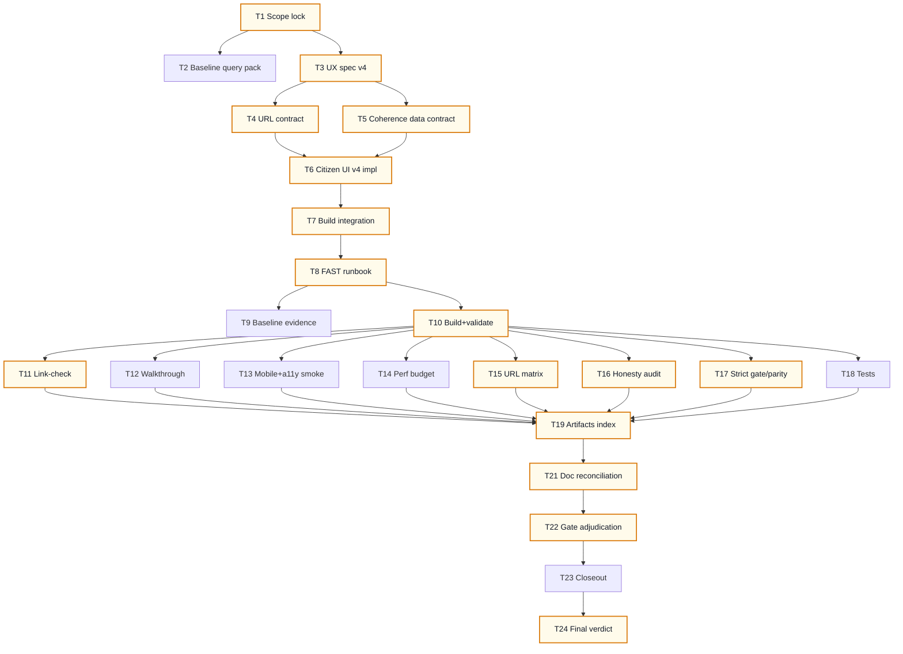

# AI-OPS-21 Sprint Prompt Pack

## Scale Metadata
- `scale_mode`: `LONG_10X`
- `baseline_reference`: `docs/etl/sprints/AI-OPS-20/sprint-ai-agents.md`
- `baseline_points`: `131`
- `target_points`: `130`
- `planned_points`: `131`
- `target_task_count`: `24`
- `planned_task_count`: `24`
- `horizon_weeks`: `6`

## Baseline Snapshot (2026-02-17)
- Citizen app shipped (v3):
  - Multi-concern selection + shareable URL restore (`concerns_ids`, `party_id`, `view`, `method`).
  - Static multi-method artifacts available (`combined|votes|declared`) under `docs/gh-pages/citizen/data/`.
  - Audit drill-down via explorers (Temas + SQL Explorer + Politico).
- Constraint reality:
  - Declared signal is sparse in the current snapshot; UI must surface coverage honestly (no "empty promises").

## Sprint Objective (Citizen Coverage + Coherence v1)
Make the citizen webapp answer the next question *honestly*:
- "Que sabemos (y que no) por preocupacion?" (coverage map)
- "Donde hay tension 'dice vs hace' cuando ambos existen?" (coherence view)

Deliver this as a static GH Pages upgrade:
- no server
- bounded artifacts
- auditable drill-down links
- shareable URLs that restore the view

Non-goals (explicit):
- No new upstream connectors.
- No black-box ranking/personalization.
- No pretending declared coverage is high; show gaps as first-class.

## Bottleneck Class
- Primary: `product bottleneck` (citizen needs coverage + coherence framing, not just toggles).
- Secondary: `signal bottleneck` (declared coverage is low; we mitigate via honest coverage UI).

## Lane Packing Plan
- `HI` setup wave: Tasks `1-8`
- `FAST` throughput wave: Tasks `9-20`
- `HI` closeout wave: Tasks `21-24`
- Lane switches: `2` (`HI -> FAST -> HI`)

## Must-Pass Gates
- `G1 Visible product delta`: new Coverage+Coherence view is usable on GH Pages and shareable via URL restore.
- `G2 Auditability`: coherence claims link to auditable topics/rows (Temas + SQL explorer links).
- `G3 Honesty`: mismatch logic is conservative and coverage-driven; `no_signal/unclear` remain explicit.
- `G4 Static budgets`: no single JSON artifact exceeds `5MB`; coherence view does not require downloading > ~3MB by default.
- `G5 Reproducibility`: `just explorer-gh-pages-build` remains the single builder; validator runs remain strict.
- `G6 Strict gate/parity`: strict tracker gate remains exit `0` and parity remains `overall_match=true`.

## Prompt Pack

1. Agent: L3 Orchestrator
- `depends_on`: `[]`
- `parallel_group`: `P1`
- `model_lane`: `HI`
- `points`: `5`
```text
Repository path/context:
- REPO_ROOT/vota-con-la-chola

Objective:
- Lock AI-OPS-21 scope + must-pass gates for "Coverage + Coherence v1" (static, evidence-first).

Concrete tasks:
- Define the minimal citizen journeys for this sprint (max 3).
- Freeze gates G1..G6 with PASS/FAIL criteria and required evidence artifacts.
- Declare explicit non-goals to prevent scope creep (no server, no new connectors, no ranking).

Output contract:
- docs/etl/sprints/AI-OPS-21/reports/scope-lock.md

Acceptance checks:
- test -f docs/etl/sprints/AI-OPS-21/reports/scope-lock.md
- rg -n "Journeys|Gates|Non-goals|PASS|FAIL" docs/etl/sprints/AI-OPS-21/reports/scope-lock.md

Task packet:
goal: Scope lock and gate contract for citizen coverage+coherence.
inputs: docs/roadmap.md; docs/roadmap-tecnico.md; AGENTS.md; docs/etl/sprints/AI-OPS-20/closeout.md
output_contract: scope-lock report with journeys + gate table + non-goals.
acceptance_query: grep for Journeys + Gates headers.
escalation_rule: Escalate if scope requires new connectors or a backend.
depends_on: []
parallel_group: P1
artifact_path: docs/etl/sprints/AI-OPS-21/reports/scope-lock.md
```

2. Agent: L2 Specialist Builder
- `depends_on`: `[1]`
- `parallel_group`: `P2`
- `model_lane`: `HI`
- `points`: `5`
```text
Repository path/context:
- REPO_ROOT/vota-con-la-chola

Objective:
- Produce baseline metrics + a deterministic query/run pack for the Coverage+Coherence view.

Concrete tasks:
- Define baseline coverage metrics by concern for each method artifact:
  - topics_total_in_concern
  - topics_with_signal_pct per method (votes/declared/combined)
- Define coherence metrics for comparable rows (votes vs declared):
  - comparable_pairs (both signal in {support,oppose})
  - match_count / mismatch_count (support vs oppose only)
  - not_comparable_count (mixed/unclear/no_signal)
- Provide exact commands that generate these artifacts under AI-OPS-21 evidence/.

Output contract:
- docs/etl/sprints/AI-OPS-21/reports/query-pack-baseline.md

Acceptance checks:
- test -f docs/etl/sprints/AI-OPS-21/reports/query-pack-baseline.md
- rg -n "coverage|coherence|mismatch|match|commands" docs/etl/sprints/AI-OPS-21/reports/query-pack-baseline.md

Task packet:
goal: baseline query pack and evidence commands for FAST execution.
inputs: docs/gh-pages/citizen/data/citizen.json; docs/gh-pages/citizen/data/citizen_votes.json; docs/gh-pages/citizen/data/citizen_declared.json; ui/citizen/concerns_v1.json
output_contract: runnable command snippets + expected outputs.
acceptance_query: grep for "Commands" and "Expected outputs".
escalation_rule: Escalate if baseline cannot be computed from existing artifacts.
depends_on: [1]
parallel_group: P2
artifact_path: docs/etl/sprints/AI-OPS-21/reports/query-pack-baseline.md
```

3. Agent: L2 Specialist Builder
- `depends_on`: `[1]`
- `parallel_group`: `P3`
- `model_lane`: `HI`
- `points`: `8`
```text
Repository path/context:
- REPO_ROOT/vota-con-la-chola

Objective:
- Write the UX spec for Coverage+Coherence view (citizen-first, static, audit-first).

Concrete tasks:
- Define UI entry points:
  - where the user discovers coverage/coherence (new view option or dashboard subpanel)
- Define coherence logic and copy:
  - mismatch defined ONLY when votes and declared are both in {support,oppose} and differ
  - everything else is "no_signal" / "not comparable"
- Define audit links:
  - coherence rows link to explorer-temas (topic focus) + explorer positions (SQL)
- Define the "coverage map" output:
  - per concern: totals and % with signal per method
- Define failure modes:
  - declared sparse -> show "insufficient declared signal" explicitly, not empty charts

Output contract:
- docs/etl/sprints/AI-OPS-21/reports/citizen-ux-v4-spec.md

Acceptance checks:
- test -f docs/etl/sprints/AI-OPS-21/reports/citizen-ux-v4-spec.md
- rg -n "coverage|coherence|mismatch|audit|URL" docs/etl/sprints/AI-OPS-21/reports/citizen-ux-v4-spec.md

Task packet:
goal: UX spec for coverage/coherence with honest definitions + audit drill-down.
inputs: ui/citizen/index.html; docs/etl/sprints/AI-OPS-20/reports/url-state-contract.md
output_contract: UX spec with wire-level descriptions and copy notes.
acceptance_query: grep for "mismatch definition" and "coverage map".
escalation_rule: Escalate if spec implies server-side compute.
depends_on: [1]
parallel_group: P3
artifact_path: docs/etl/sprints/AI-OPS-21/reports/citizen-ux-v4-spec.md
```

4. Agent: L2 Specialist Builder
- `depends_on`: `[3]`
- `parallel_group`: `P4`
- `model_lane`: `HI`
- `points`: `3`
```text
Repository path/context:
- REPO_ROOT/vota-con-la-chola

Objective:
- Extend the citizen URL state contract to support the new Coverage+Coherence view without breaking v3 URLs.

Concrete tasks:
- Propose minimal new query params (or extend `view=`) to encode:
  - coherence mode
  - method pair (votes vs declared) if configurable
- Define precedence rules with existing params:
  - `concerns_ids`, `concern`, `topic_id`, `party_id`, `method`
- Define push/replace rules (shareability first).

Output contract:
- docs/etl/sprints/AI-OPS-21/reports/url-state-contract.md

Acceptance checks:
- test -f docs/etl/sprints/AI-OPS-21/reports/url-state-contract.md
- rg -n \"Query params|Precedence|Examples\" docs/etl/sprints/AI-OPS-21/reports/url-state-contract.md

Task packet:
goal: stable, shareable URL contract for new view.
inputs: docs/etl/sprints/AI-OPS-20/reports/url-state-contract.md; ui/citizen/index.html
output_contract: param table + examples + precedence rules.
acceptance_query: grep for "coherence" or chosen token.
escalation_rule: Escalate if contract breaks backward compatibility.
depends_on: [3]
parallel_group: P4
artifact_path: docs/etl/sprints/AI-OPS-21/reports/url-state-contract.md
```

5. Agent: L2 Specialist Builder
- `depends_on`: `[3]`
- `parallel_group`: `P5`
- `model_lane`: `HI`
- `points`: `5`
```text
Repository path/context:
- REPO_ROOT/vota-con-la-chola

Objective:
- Decide the data contract for coherence computation (UI join vs new artifact) and document it.

Concrete tasks:
- Evaluate two options:
  A) UI loads `citizen_votes.json` + `citizen_declared.json` and joins on (topic_id, party_id)
  B) Export a new bounded artifact (e.g. `citizen_coherence.json`) that includes both stances per cell
- Pick the safest option given:
  - static budgets
  - reproducibility
  - UX latency (extra download)
- Document chosen approach + any build changes required.

Output contract:
- docs/etl/sprints/AI-OPS-21/reports/citizen-coherence-data-contract.md

Acceptance checks:
- test -f docs/etl/sprints/AI-OPS-21/reports/citizen-coherence-data-contract.md
- rg -n \"Option A|Option B|Decision\" docs/etl/sprints/AI-OPS-21/reports/citizen-coherence-data-contract.md

Task packet:
goal: choose coherence data plumbing with explicit tradeoffs.
inputs: scripts/export_citizen_snapshot.py; docs/gh-pages/citizen/data/citizen_votes.json; docs/gh-pages/citizen/data/citizen_declared.json
output_contract: short decision doc + constraints + file mapping.
acceptance_query: grep for "Decision".
escalation_rule: Escalate if budgets exceed 5MB per artifact.
depends_on: [3]
parallel_group: P5
artifact_path: docs/etl/sprints/AI-OPS-21/reports/citizen-coherence-data-contract.md
```

6. Agent: L2 Specialist Builder
- `depends_on`: `[3,4,5]`
- `parallel_group`: `P6`
- `model_lane`: `HI`
- `points`: `13`
```text
Repository path/context:
- REPO_ROOT/vota-con-la-chola

Objective:
- Implement Coverage+Coherence view in the citizen app (static GH Pages).

Concrete tasks:
- Update `ui/citizen/index.html`:
  - add a new view mode (or dashboard subpanel) for "Cobertura + coherencia"
  - compute coverage per concern for current method AND optionally show votes vs declared deltas
  - implement coherence summary per party across selected concerns:
    - mismatch only for {support,oppose} vs {support,oppose} differing
    - show counts: match/mismatch/no_signal/not_comparable
  - include deterministic audit links (pick first mismatch topic deterministically) to:
    - explorer-temas (topic focus)
    - explorer positions (SQL)
- Keep URL as source of truth:
  - add/consume new params per url-state-contract
- Ensure UI remains usable when declared coverage is near-zero (explicit empty state).

Output contract:
- Code: `ui/citizen/index.html`
- Report: `docs/etl/sprints/AI-OPS-21/reports/citizen-ui-v4.md`

Acceptance checks:
- rg -n \"coher\" ui/citizen/index.html
- just explorer-gh-pages-build (must pass)

Task packet:
goal: ship a user-visible coherence/coverage view without server dependencies.
inputs: ui/citizen/index.html; docs/etl/sprints/AI-OPS-21/reports/citizen-ux-v4-spec.md; docs/etl/sprints/AI-OPS-21/reports/url-state-contract.md
output_contract: updated citizen UI + implementation notes report.
acceptance_query: build + validator passes; manual walkthrough PASS.
escalation_rule: Escalate if implementing coherence requires ETL changes beyond static artifacts.
depends_on: [3,4,5]
parallel_group: P6
artifact_path: docs/etl/sprints/AI-OPS-21/reports/citizen-ui-v4.md
```

7. Agent: L2 Specialist Builder
- `depends_on`: `[6]`
- `parallel_group`: `P7`
- `model_lane`: `HI`
- `points`: `5`
```text
Repository path/context:
- REPO_ROOT/vota-con-la-chola

Objective:
- Integrate build outputs needed by Coverage+Coherence view and keep budgets strict.

Concrete tasks:
- If coherence requires multiple datasets, ensure the UI loads them from `./data/` paths on GH Pages.
- If a new artifact is introduced, update:
  - `justfile` (`explorer-gh-pages-build`)
  - `scripts/validate_citizen_snapshot.py` (if schema changes)
  - evidence budget checks
- Update any docs that mention method/file mapping.

Output contract:
- Updated `justfile` and/or validator/exporter (only if needed).
- Report: `docs/etl/sprints/AI-OPS-21/reports/build-integration.md`

Acceptance checks:
- just explorer-gh-pages-build exits 0
- validator outputs show <= 5MB for all exported artifacts

Task packet:
goal: keep GH Pages build as single command and budgets enforced.
inputs: justfile; scripts/export_citizen_snapshot.py; scripts/validate_citizen_snapshot.py
output_contract: build updates + report.
acceptance_query: grep for coherence artifacts in justfile if added.
escalation_rule: Escalate if budgets cannot be met.
depends_on: [6]
parallel_group: P7
artifact_path: docs/etl/sprints/AI-OPS-21/reports/build-integration.md
```

8. Agent: L2 Specialist Builder
- `depends_on`: `[6,7]`
- `parallel_group`: `P8`
- `model_lane`: `HI`
- `points`: `3`
```text
Repository path/context:
- REPO_ROOT/vota-con-la-chola

Objective:
- Write the FAST runbook for deterministic evidence generation and gate adjudication.

Concrete tasks:
- Write a step-by-step runbook that produces:
  - postrun GH Pages build logs
  - validator outputs
  - link check outputs
  - strict gate/parity evidence
  - tests evidence
- Ensure artifacts land under `docs/etl/sprints/AI-OPS-21/evidence/` and `reports/`.

Output contract:
- docs/etl/sprints/AI-OPS-21/reports/fast-runbook.md

Acceptance checks:
- test -f docs/etl/sprints/AI-OPS-21/reports/fast-runbook.md
- rg -n \"explorer-gh-pages-build|tracker-gate|status-parity|validate\" docs/etl/sprints/AI-OPS-21/reports/fast-runbook.md

Task packet:
goal: long contiguous FAST wave with minimal ambiguity.
inputs: docs/etl/sprints/AI-OPS-20/reports/fast-runbook.md
output_contract: AI-OPS-21 FAST runbook.
acceptance_query: grep for evidence file names.
escalation_rule: Escalate if steps require manual hidden state.
depends_on: [6,7]
parallel_group: P8
artifact_path: docs/etl/sprints/AI-OPS-21/reports/fast-runbook.md
```

9. Agent: L1 Mechanical Executor
- `depends_on`: `[8]`
- `parallel_group`: `P9`
- `model_lane`: `FAST`
- `points`: `3`
```text
Objective:
- Capture baseline coverage+coherence metrics and store as evidence.

Tasks:
- Run the commands from `query-pack-baseline.md`.
- Store outputs under:
  - docs/etl/sprints/AI-OPS-21/evidence/baseline_coverage.json
  - docs/etl/sprints/AI-OPS-21/evidence/baseline_coherence.json

Acceptance:
- Files exist and are valid JSON.
```

10. Agent: L1 Mechanical Executor
- `depends_on`: `[8]`
- `parallel_group`: `P10`
- `model_lane`: `FAST`
- `points`: `5`
```text
Objective:
- Run export + strict validation for all citizen artifacts used by coherence view.

Tasks:
- Run `just explorer-gh-pages-build` and capture log+exit.
- Validate each `docs/gh-pages/citizen/data/citizen*.json` via `scripts/validate_citizen_snapshot.py`.

Outputs:
- docs/etl/sprints/AI-OPS-21/evidence/gh-pages-build.log
- docs/etl/sprints/AI-OPS-21/evidence/gh-pages-build.exit
- docs/etl/sprints/AI-OPS-21/evidence/citizen-validate-post.log
- docs/etl/sprints/AI-OPS-21/evidence/citizen-json-budget.txt
```

11. Agent: L1 Mechanical Executor
- `depends_on`: `[10]`
- `parallel_group`: `P11`
- `model_lane`: `FAST`
- `points`: `3`
```text
Objective:
- Generate link-check evidence for audit navigation (all relevant citizen artifacts).

Tasks:
- Run a link-check script (same pragmatic method as AI-OPS-20) and store:
  - docs/etl/sprints/AI-OPS-21/evidence/link-check.json

Acceptance:
- missing_targets_total == 0
- non_relative_total == 0
```

12. Agent: L1 Mechanical Executor
- `depends_on`: `[10,11]`
- `parallel_group`: `P12`
- `model_lane`: `FAST`
- `points`: `3`
```text
Objective:
- Write the manual QA walkthrough for Coverage+Coherence view.

Output:
- docs/etl/sprints/AI-OPS-21/reports/citizen-walkthrough.md
```

13. Agent: L1 Mechanical Executor
- `depends_on`: `[10]`
- `parallel_group`: `P13`
- `model_lane`: `FAST`
- `points`: `2`
```text
Objective:
- Write mobile+a11y smoke checklist for coherence view additions.

Output:
- docs/etl/sprints/AI-OPS-21/reports/citizen-mobile-a11y-smoke.md
```

14. Agent: L1 Mechanical Executor
- `depends_on`: `[10]`
- `parallel_group`: `P14`
- `model_lane`: `FAST`
- `points`: `3`
```text
Objective:
- Record a pragmatic performance budget for coherence view.

Tasks:
- Record file byte sizes for citizen artifacts.
- If coherence view requires extra downloads, record total bytes downloaded in the worst-case path.

Output:
- docs/etl/sprints/AI-OPS-21/evidence/perf-budget.txt
```

15. Agent: L1 Mechanical Executor
- `depends_on`: `[6,10]`
- `parallel_group`: `P15`
- `model_lane`: `FAST`
- `points`: `3`
```text
Objective:
- Write shareable URL matrix including the new coherence view state params.

Output:
- docs/etl/sprints/AI-OPS-21/reports/shareable-url-matrix.md
```

16. Agent: L1 Mechanical Executor
- `depends_on`: `[6,10]`
- `parallel_group`: `P16`
- `model_lane`: `FAST`
- `points`: `3`
```text
Objective:
- Write honesty audit for coherence definitions and declared sparsity handling.

Output:
- docs/etl/sprints/AI-OPS-21/reports/honesty-audit.md
```

17. Agent: L1 Mechanical Executor
- `depends_on`: `[10]`
- `parallel_group`: `P17`
- `model_lane`: `FAST`
- `points`: `5`
```text
Objective:
- Capture strict tracker gate + status parity postrun evidence.

Tasks:
- just etl-tracker-gate -> log+exit
- export status snapshot to evidence + publish status.json
- generate status parity text summary

Outputs:
- docs/etl/sprints/AI-OPS-21/evidence/tracker-gate-postrun.log
- docs/etl/sprints/AI-OPS-21/evidence/tracker-gate-postrun.exit
- docs/etl/sprints/AI-OPS-21/evidence/status-postrun.json
- docs/etl/sprints/AI-OPS-21/evidence/status-parity-postrun.txt
```

18. Agent: L1 Mechanical Executor
- `depends_on`: `[10]`
- `parallel_group`: `P18`
- `model_lane`: `FAST`
- `points`: `3`
```text
Objective:
- Run regression tests and store evidence.

Tasks:
- just etl-test > docs/etl/sprints/AI-OPS-21/evidence/tests.log 2>&1; echo $? > docs/etl/sprints/AI-OPS-21/evidence/tests.exit
```

19. Agent: L1 Mechanical Executor
- `depends_on`: `[10,11,12,13,14,15,16,17,18]`
- `parallel_group`: `P19`
- `model_lane`: `FAST`
- `points`: `2`
```text
Objective:
- Write artifacts index for AI-OPS-21 (entry points, reports, evidence).

Output:
- docs/etl/sprints/AI-OPS-21/reports/artifacts-index.md
```

20. Agent: L1 Mechanical Executor
- `depends_on`: `[19]`
- `parallel_group`: `P20`
- `model_lane`: `FAST`
- `points`: `2`
```text
Objective:
- Update sprint index navigation to include AI-OPS-21 and ensure pointer is correct.

Tasks:
- Update `docs/etl/sprints/README.md` row for AI-OPS-21.
- Update `docs/etl/sprint-ai-agents.md` pointer if AI-OPS-21 is the active sprint.
```

21. Agent: L3 Orchestrator
- `depends_on`: `[19]`
- `parallel_group`: `P21`
- `model_lane`: `HI`
- `points`: `5`
```text
Objective:
- Reconcile any doc/contract drift uncovered during implementation (truth-first).

Tasks:
- Ensure contract docs match actual links/params and shipped behavior.
- If needed, add small compatibility notes rather than duplicating roadmaps.

Output:
- docs/etl/sprints/AI-OPS-21/reports/doc-reconciliation.md
```

22. Agent: L3 Orchestrator
- `depends_on`: `[21]`
- `parallel_group`: `P22`
- `model_lane`: `HI`
- `points`: `3`
```text
Objective:
- Adjudicate gates G1..G6 and record verdict evidence links.

Output:
- docs/etl/sprints/AI-OPS-21/reports/gate-adjudication.md
```

23. Agent: L3 Orchestrator
- `depends_on`: `[22]`
- `parallel_group`: `P23`
- `model_lane`: `HI`
- `points`: `2`
```text
Objective:
- Write closeout with PASS/FAIL, visible outcome, and reproduction commands.

Output:
- docs/etl/sprints/AI-OPS-21/closeout.md
```

24. Agent: L3 Orchestrator
- `depends_on`: `[23]`
- `parallel_group`: `P24`
- `model_lane`: `HI`
- `points`: `2`
```text
Objective:
- Final review: confirm the sprint is not looping, and next-step trigger is explicit.

Tasks:
- Confirm visible delta exists (not just docs).
- Confirm strict gate/parity remained green.
- Write next sprint trigger(s) in closeout.
```

## Flow Diagram (Mermaid, vertical)


## Folder Layout
```text
docs/etl/sprints/AI-OPS-21/
  sprint-ai-agents.md
  kickoff.md
  closeout.md
  reports/
  evidence/
  exports/
```

