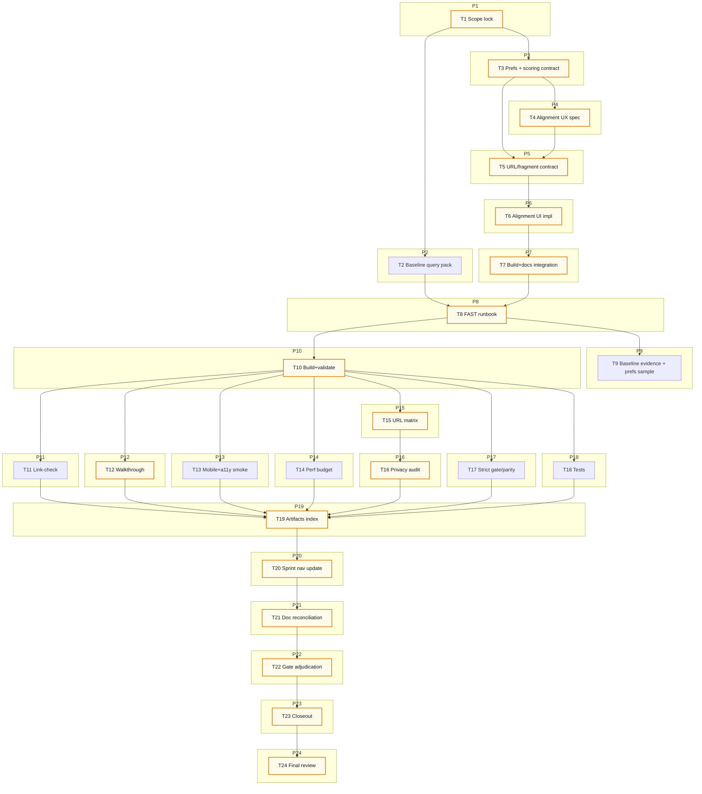

# AI-OPS-22 Sprint Prompt Pack

## Scale Metadata
- `scale_mode`: `LONG_10X`
- `baseline_reference`: `docs/etl/sprints/AI-OPS-21/sprint-ai-agents.md`
- `baseline_points`: `131`
- `target_points`: `130`
- `planned_points`: `131`
- `target_task_count`: `24`
- `planned_task_count`: `24`
- `horizon_weeks`: `6`

## Baseline Snapshot (2026-02-17)
- Citizen app shipped (static GH Pages):
  - Views: `detail`, `dashboard`, `coherence`.
  - Shareable URL state for non-sensitive view params: `concerns_ids`, `party_id`, `view`, `method`.
  - Artifacts (current snapshot `as_of_date=2026-02-16`): `citizen.json` (combined), `citizen_votes.json`, `citizen_declared.json`.
- Data reality:
  - We have usable stance grids (`party_topic_positions`) and concern tags (`topic.concern_ids`) for a bounded set of topics.
  - Declared signal remains sparse; coverage must be shown as first-class truth (no pretending we know more than we do).

## Sprint Objective (Citizen Alignment + Onboarding v0)
Turn the existing data into a citizen-first decision aid that is both usable and honest:
- Let a citizen express preferences on concrete items (topics) in under ~2 minutes.
- Show **transparent** match/mismatch/unknown counts per party based on the chosen method (`combined|votes|declared`).
- Keep everything **static-first** and **privacy-first**:
  - preferences stored locally by default
  - optional share link only via explicit user action (prefer URL fragment, not query)
- Every claim remains auditable via explorer drill-down links.

Non-goals (explicit):
- No server backend, no accounts, no analytics, no preference collection.
- No “magic number” ranking that hides coverage/unknowns.
- No new upstream connectors or heavy ETL work.

## Bottleneck Class
- Primary: `product bottleneck` (citizens can’t currently express preferences and get an evidence-backed match view).
- Secondary: `UX bottleneck` (onboarding + preference capture needs a minimal, safe flow).

## Lane Packing Plan
- `HI` setup wave: Tasks `1-8`
- `FAST` throughput wave: Tasks `9-20`
- `HI` closeout wave: Tasks `21-24`
- Lane switches: `2` (`HI -> FAST -> HI`)

## Workload Balance
- Points split: `L1=74 (56.49%)`, `L2=46 (35.11%)`, `L3=11 (8.40%)`
- Task split: `L1=12/24 (50.00%)`, `L2=7/24 (29.17%)`, `L3=5/24 (20.83%)`

## Must-Pass Gates
- `G1 Visible product delta`: new citizen view `view=alignment` exists and is usable on GH Pages.
- `G2 Auditability`: every match/mismatch row can drill down to concrete evidence (Temas/Explorer SQL links already in the snapshot).
- `G3 Honesty + Privacy`: unknowns are explicit; preferences are local-first; share-link is opt-in and uses URL fragment.
- `G4 Performance budgets`: no new JSON artifacts required; existing artifact size budgets remain <= `5MB` each; alignment UI does not require downloading > ~3MB by default.
- `G5 Reproducibility`: `just explorer-gh-pages-build` remains the single build command and stays green.
- `G6 Strict gate/parity`: strict tracker gate remains exit `0` and parity remains `overall_match=true`.

## Prompt Pack

1. Agent: L3 Orchestrator
- `depends_on`: `[]`
- `parallel_group`: `P1`
- `model_lane`: `HI`
- `points`: `5`
```text
Repository path/context:
- REPO_ROOT/vota-con-la-chola

Objective:
- Lock AI-OPS-22 scope + must-pass gates for "Citizen Alignment + Onboarding v0" (static, evidence-first, privacy-first).

Concrete tasks:
- Define the 2-3 primary citizen journeys (max) for alignment:
  - add preferences (topics)
  - see match summary per party
  - drill down to evidence
- Freeze gates G1..G6 with PASS/FAIL criteria and required evidence artifacts.
- Declare explicit non-goals to prevent scope creep (no server, no accounts, no analytics, no inferred values).
- Define the privacy contract: local-first persistence and opt-in sharing only.

Output contract:
- docs/etl/sprints/AI-OPS-22/reports/scope-lock.md

Acceptance checks:
- test -f docs/etl/sprints/AI-OPS-22/reports/scope-lock.md
- rg -n "Journeys|Non-goals|G1|G2|G3|G4|G5|G6|PASS|FAIL|privacy" docs/etl/sprints/AI-OPS-22/reports/scope-lock.md

Task packet:
goal: Scope lock and gate contract for alignment onboarding.
inputs: docs/roadmap.md; docs/roadmap-tecnico.md; AGENTS.md; docs/etl/sprints/AI-OPS-21/closeout.md; ui/citizen/index.html
output_contract: scope-lock report with journeys + gate table + non-goals + privacy contract.
acceptance_query: grep for Journeys + gates + privacy contract.
escalation_rule: Escalate if the MVP implies a backend or storing preferences server-side.
depends_on: []
parallel_group: P1
artifact_path: docs/etl/sprints/AI-OPS-22/reports/scope-lock.md
```

2. Agent: L2 Specialist Builder
- `depends_on`: `[1]`
- `parallel_group`: `P2`
- `model_lane`: `HI`
- `points`: `5`
```text
Repository path/context:
- REPO_ROOT/vota-con-la-chola

Objective:
- Produce baseline metrics + a deterministic query/run pack for AI-OPS-22 (alignment-ready).

Concrete tasks:
- Write a baseline/query pack (SQL/CLI + small Python snippets ok) that captures:
  - citizen artifact counts (topics, parties, pairs) for all 3 methods
  - concern coverage counts (topics per concern_id)
  - stance distribution totals by method (support/oppose/mixed/no_signal/unclear)
  - a small deterministic "prefs sample" generator for walkthrough (stored under exports/)
- Include exact output paths under AI-OPS-22 evidence/exports.

Output contract:
- docs/etl/sprints/AI-OPS-22/reports/query-pack-baseline.md

Acceptance checks:
- test -f docs/etl/sprints/AI-OPS-22/reports/query-pack-baseline.md
- rg -n "citizen_votes\\.json|citizen_declared\\.json|citizen\\.json|topics per concern|stance distribution|prefs_sample" docs/etl/sprints/AI-OPS-22/reports/query-pack-baseline.md

Task packet:
goal: Baseline query pack for sprint evidence and alignment QA.
inputs: docs/gh-pages/citizen/data/citizen*.json; docs/gh-pages/citizen/data/concerns_v1.json
output_contract: runnable command/query pack + paths for produced artifacts.
acceptance_query: grep for output paths under docs/etl/sprints/AI-OPS-22/evidence and exports.
escalation_rule: Escalate if citizen artifacts are missing required link fields for auditability.
depends_on: [1]
parallel_group: P2
artifact_path: docs/etl/sprints/AI-OPS-22/reports/query-pack-baseline.md
```

3. Agent: L2 Specialist Builder
- `depends_on`: `[1]`
- `parallel_group`: `P3`
- `model_lane`: `HI`
- `points`: `8`
```text
Repository path/context:
- REPO_ROOT/vota-con-la-chola

Objective:
- Define the preference + alignment scoring contract so the UI stays honest and stable.

Concrete tasks:
- Specify `prefs_v1` schema:
  - storage: localStorage key(s)
  - representation: per topic_id preference in {support, oppose, skip}
  - optional fields: note, created_at (local), versioning
- Specify alignment metrics:
  - per party: match_count, mismatch_count, unknown_count, comparable_count, coverage_pct
  - sorting rule (default) that never hides unknowns (coverage first-class)
  - tie-breaks deterministic
- Specify treatment of `mixed/unclear/no_signal` (always unknown; never impute).
- Specify share-link contract:
  - opt-in only
  - encode prefs in URL fragment (not query), with version tag and simple compression/base64
  - import precedence: URL fragment -> localStorage -> empty

Output contract:
- docs/etl/sprints/AI-OPS-22/reports/preferences-contract.md

Acceptance checks:
- test -f docs/etl/sprints/AI-OPS-22/reports/preferences-contract.md
- rg -n "prefs_v1|localStorage|fragment|match_count|mismatch_count|unknown_count|mixed|unclear|no_signal" docs/etl/sprints/AI-OPS-22/reports/preferences-contract.md

Task packet:
goal: Stable alignment algorithm + privacy-safe preference persistence contract.
inputs: ui/citizen/index.html; docs/etl/sprints/AI-OPS-21/closeout.md; AGENTS.md
output_contract: contract doc with schema + examples + edge-case rules.
acceptance_query: grep for schema + fragment contract + metric names.
escalation_rule: Escalate if contract implies sharing prefs in query params by default.
depends_on: [1]
parallel_group: P3
artifact_path: docs/etl/sprints/AI-OPS-22/reports/preferences-contract.md
```

4. Agent: L2 Specialist Builder
- `depends_on`: `[3]`
- `parallel_group`: `P4`
- `model_lane`: `HI`
- `points`: `5`
```text
Repository path/context:
- REPO_ROOT/vota-con-la-chola

Objective:
- Write the UX spec for the alignment view (minimal, mobile-safe, evidence-first).

Concrete tasks:
- Define the UI layout and states for `view=alignment`:
  - add/select topics (filter by concern + search)
  - set preference per topic (support/oppose/skip)
  - party summary table with match/mismatch/unknown
  - party drill-down list with chips + audit links
- Specify copy for honesty and privacy banners (short, factual).
- Specify empty/error states (no prefs yet, unknown-heavy result, missing method).

Output contract:
- docs/etl/sprints/AI-OPS-22/reports/citizen-alignment-ux-spec.md

Acceptance checks:
- test -f docs/etl/sprints/AI-OPS-22/reports/citizen-alignment-ux-spec.md
- rg -n "view=alignment|party summary|match|mismatch|unknown|privacy|audit link" docs/etl/sprints/AI-OPS-22/reports/citizen-alignment-ux-spec.md

Task packet:
goal: Clear UI spec for implementable alignment onboarding flow.
inputs: docs/gh-pages/citizen/data/citizen*.json; ui/citizen/index.html; docs/etl/sprints/AI-OPS-21/reports/citizen-walkthrough.md
output_contract: UX spec doc with states + copy + acceptance checklist.
acceptance_query: grep for required UI components and states.
escalation_rule: Escalate if UX implies collecting personal data.
depends_on: [3]
parallel_group: P4
artifact_path: docs/etl/sprints/AI-OPS-22/reports/citizen-alignment-ux-spec.md
```

5. Agent: L2 Specialist Builder
- `depends_on`: `[3,4]`
- `parallel_group`: `P5`
- `model_lane`: `HI`
- `points`: `8`
```text
Repository path/context:
- REPO_ROOT/vota-con-la-chola

Objective:
- Specify and implement the URL/state contract changes required for alignment, without leaking preferences.

Concrete tasks:
- Keep existing URL params behavior for non-sensitive view state:
  - `view`, `method`, `party_id`, `concerns_ids`, `topic_id`, `concern`
- Add alignment preference share/import via URL fragment:
  - e.g. `#prefs=v1:<payload>`
  - do not write prefs into query params automatically
- Ensure popstate navigation works without double-push.
- Document the contract succinctly.

Output contract:
- docs/etl/sprints/AI-OPS-22/reports/url-contract.md
- ui/citizen/index.html updated: parse/write state including fragment import/export mechanics

Acceptance checks:
- test -f docs/etl/sprints/AI-OPS-22/reports/url-contract.md
- rg -n "prefs" ui/citizen/index.html
- Manual sanity check: changing prefs does not change `location.search` by default.

Task packet:
goal: URL contract that preserves shareable view state while keeping preferences private-by-default.
inputs: ui/citizen/index.html; docs/etl/sprints/AI-OPS-22/reports/preferences-contract.md
output_contract: url contract doc + working fragment-based preference share/import.
acceptance_query: grep for fragment format and precedence rules.
escalation_rule: Escalate if the implementation cannot avoid writing prefs into query params.
depends_on: [3,4]
parallel_group: P5
artifact_path: docs/etl/sprints/AI-OPS-22/reports/url-contract.md
```

6. Agent: L2 Specialist Builder
- `depends_on`: `[4,5]`
- `parallel_group`: `P6`
- `model_lane`: `HI`
- `points`: `13`
```text
Repository path/context:
- REPO_ROOT/vota-con-la-chola

Objective:
- Implement `view=alignment` in the citizen app (static, audit-first, privacy-first).

Concrete tasks:
- Update `ui/citizen/index.html`:
  - add `Vista: alineamiento` selector option
  - implement preference CRUD (support/oppose/skip) per topic_id
  - compute per-party match/mismatch/unknown summary for current method dataset
  - implement party drill-down list with chips and audit links per topic/party
  - add explicit honesty text: "solo sobre estos temas"; show unknowns; show coverage counts
  - implement import/export of prefs:
    - localStorage default
    - optional share-link generation using fragment contract
    - optional download/upload JSON file (nice-to-have if small)
- Keep code size lean (no external JS deps).

Output contract:
- ui/citizen/index.html
- docs/etl/sprints/AI-OPS-22/reports/implementation-notes.md

Acceptance checks:
- rg -n "viewMode.*alignment|Vista: alineamiento|prefs" ui/citizen/index.html
- `just explorer-gh-pages-build` remains the only build command (run in FAST wave).

Task packet:
goal: Ship alignment view in citizen app with conservative matching and audit links.
inputs: docs/gh-pages/citizen/data/citizen*.json; ui/citizen/index.html; docs/etl/sprints/AI-OPS-22/reports/citizen-alignment-ux-spec.md
output_contract: UI feature + implementation notes (what shipped, what not).
acceptance_query: grep for alignment view wiring and prefs storage key.
escalation_rule: Escalate if matching logic cannot be made conservative or if UX encourages overclaiming.
depends_on: [4,5]
parallel_group: P6
artifact_path: docs/etl/sprints/AI-OPS-22/reports/implementation-notes.md
```

7. Agent: L2 Specialist Builder
- `depends_on`: `[6]`
- `parallel_group`: `P7`
- `model_lane`: `HI`
- `points`: `5`
```text
Repository path/context:
- REPO_ROOT/vota-con-la-chola

Objective:
- Keep build + budgets + docs consistent after alignment UI changes.

Concrete tasks:
- Ensure `AGENTS.md` includes the privacy exception for preferences (local-first; fragment only when sharing).
- Confirm `just explorer-gh-pages-build` still succeeds without extra steps.
- Add/adjust any small compatibility notes required (avoid duplicating roadmaps).

Output contract:
- AGENTS.md (updated privacy rule)
- docs/etl/sprints/AI-OPS-22/reports/build-integration.md

Acceptance checks:
- rg -n "preferences|fragment|privacy" AGENTS.md
- test -f docs/etl/sprints/AI-OPS-22/reports/build-integration.md

Task packet:
goal: Keep repo operating notes consistent with shipped privacy behavior.
inputs: AGENTS.md; justfile; ui/citizen/index.html
output_contract: privacy rule + build-integration report.
acceptance_query: grep for fragment-only share rule.
escalation_rule: Escalate if privacy rule conflicts with existing "shareable state" guidance.
depends_on: [6]
parallel_group: P7
artifact_path: docs/etl/sprints/AI-OPS-22/reports/build-integration.md
```

8. Agent: L2 Specialist Builder
- `depends_on`: `[2,6,7]`
- `parallel_group`: `P8`
- `model_lane`: `HI`
- `points`: `2`
```text
Repository path/context:
- REPO_ROOT/vota-con-la-chola

Objective:
- Write the FAST runbook for deterministic evidence generation and gate adjudication.

Concrete tasks:
- Write a step-by-step runbook that produces:
  - baseline metrics outputs
  - prefs sample export
  - GH Pages build logs + validator outputs
  - link check outputs
  - URL matrix results
  - privacy audit evidence
  - strict gate/parity evidence
  - tests evidence
- Ensure artifacts land under `docs/etl/sprints/AI-OPS-22/evidence/`, `exports/`, and `reports/`.

Output contract:
- docs/etl/sprints/AI-OPS-22/reports/fast-runbook.md

Acceptance checks:
- test -f docs/etl/sprints/AI-OPS-22/reports/fast-runbook.md
- rg -n "explorer-gh-pages-build|tracker-gate|status-parity|validate_citizen_snapshot|prefs_sample" docs/etl/sprints/AI-OPS-22/reports/fast-runbook.md

Task packet:
goal: Long contiguous FAST wave with minimal ambiguity.
inputs: docs/etl/sprints/AI-OPS-21/reports/fast-runbook.md; docs/etl/sprints/AI-OPS-22/reports/query-pack-baseline.md
output_contract: AI-OPS-22 FAST runbook.
acceptance_query: grep for evidence file names and commands.
escalation_rule: Escalate if steps require hidden manual state outside the repo.
depends_on: [2,6,7]
parallel_group: P8
artifact_path: docs/etl/sprints/AI-OPS-22/reports/fast-runbook.md
```

9. Agent: L1 Mechanical Executor
- `depends_on`: `[8]`
- `parallel_group`: `P9`
- `model_lane`: `FAST`
- `points`: `3`
```text
Repository path/context:
- REPO_ROOT/vota-con-la-chola

Objective:
- Capture baseline metrics + generate a deterministic prefs sample for walkthrough/QA.

Concrete tasks:
- Run the commands from `docs/etl/sprints/AI-OPS-22/reports/query-pack-baseline.md`.
- Store outputs under:
  - docs/etl/sprints/AI-OPS-22/evidence/baseline_metrics.json
  - docs/etl/sprints/AI-OPS-22/exports/prefs_sample_v1.json

Output contract:
- docs/etl/sprints/AI-OPS-22/evidence/baseline_metrics.json
- docs/etl/sprints/AI-OPS-22/exports/prefs_sample_v1.json

Acceptance checks:
- python3 -c "import json; json.load(open('docs/etl/sprints/AI-OPS-22/evidence/baseline_metrics.json'))"
- python3 -c "import json; json.load(open('docs/etl/sprints/AI-OPS-22/exports/prefs_sample_v1.json'))"

Task packet:
goal: Produce baseline + deterministic prefs sample artifact for alignment view QA.
inputs: docs/etl/sprints/AI-OPS-22/reports/query-pack-baseline.md
output_contract: baseline_metrics.json + prefs_sample_v1.json.
acceptance_query: JSON parses and includes expected top-level keys (per query pack).
escalation_rule: Escalate if query pack commands fail or artifacts are missing.
depends_on: [8]
parallel_group: P9
artifact_path: docs/etl/sprints/AI-OPS-22/evidence/baseline_metrics.json
```

10. Agent: L1 Mechanical Executor
- `depends_on`: `[8]`
- `parallel_group`: `P10`
- `model_lane`: `FAST`
- `points`: `8`
```text
Repository path/context:
- REPO_ROOT/vota-con-la-chola

Objective:
- Run export + strict validation and capture GH Pages build evidence.

Concrete tasks:
- Run `just explorer-gh-pages-build` and capture log+exit.
- Validate each `docs/gh-pages/citizen/data/citizen*.json` via `scripts/validate_citizen_snapshot.py`.

Output contract:
- docs/etl/sprints/AI-OPS-22/evidence/gh-pages-build.log
- docs/etl/sprints/AI-OPS-22/evidence/gh-pages-build.exit
- docs/etl/sprints/AI-OPS-22/evidence/citizen-validate-post.log
- docs/etl/sprints/AI-OPS-22/evidence/citizen-json-budget.txt

Acceptance checks:
- test "$(cat docs/etl/sprints/AI-OPS-22/evidence/gh-pages-build.exit)" = "0"
- rg -n "bytes=" docs/etl/sprints/AI-OPS-22/evidence/citizen-validate-post.log

Task packet:
goal: Produce reproducible build + validation evidence.
inputs: justfile; scripts/validate_citizen_snapshot.py; docs/gh-pages/citizen/data/citizen*.json
output_contract: build+validate evidence files under AI-OPS-22/evidence.
acceptance_query: build exit is 0 and validator output exists.
escalation_rule: Escalate if build fails or budgets exceed limits.
depends_on: [8]
parallel_group: P10
artifact_path: docs/etl/sprints/AI-OPS-22/evidence/gh-pages-build.log
```

11. Agent: L1 Mechanical Executor
- `depends_on`: `[10]`
- `parallel_group`: `P11`
- `model_lane`: `FAST`
- `points`: `5`
```text
Repository path/context:
- REPO_ROOT/vota-con-la-chola

Objective:
- Generate link-check evidence for audit navigation (alignment uses existing explorer links).

Concrete tasks:
- Run the pragmatic link-check (same method as AI-OPS-20/21) across:
  - docs/gh-pages/citizen/data/citizen.json
  - docs/gh-pages/citizen/data/citizen_votes.json
  - docs/gh-pages/citizen/data/citizen_declared.json
- Store output:
  - docs/etl/sprints/AI-OPS-22/evidence/link-check.json

Output contract:
- docs/etl/sprints/AI-OPS-22/evidence/link-check.json

Acceptance checks:
- python3 -c "import json; d=json.load(open('docs/etl/sprints/AI-OPS-22/evidence/link-check.json')); assert d.get('missing_targets_total',1)==0; assert d.get('non_relative_total',1)==0"

Task packet:
goal: Evidence that audit links remain resolvable after UI change.
inputs: docs/gh-pages/citizen/data/citizen*.json
output_contract: link-check.json with missing_targets_total == 0 and non_relative_total == 0.
acceptance_query: assert missing_targets_total==0.
escalation_rule: Escalate if any required audit links are missing or non-relative.
depends_on: [10]
parallel_group: P11
artifact_path: docs/etl/sprints/AI-OPS-22/evidence/link-check.json
```

12. Agent: L1 Mechanical Executor
- `depends_on`: `[10]`
- `parallel_group`: `P12`
- `model_lane`: `FAST`
- `points`: `8`
```text
Repository path/context:
- REPO_ROOT/vota-con-la-chola

Objective:
- Produce a citizen walkthrough for the alignment view, including a deterministic prefs sample.

Concrete tasks:
- Start local static server from the GH Pages build output.
- Use `docs/etl/sprints/AI-OPS-22/exports/prefs_sample_v1.json` as the walkthrough scenario.
- Document:
  - how to open alignment view (`view=alignment`)
  - how to import prefs sample (or paste share fragment if implemented)
  - party summary interpretation (match/mismatch/unknown)
  - one drill-down per: match, mismatch, unknown (audit links)
- Capture the final URL (without prefs in query params) as evidence.

Output contract:
- docs/etl/sprints/AI-OPS-22/reports/citizen-alignment-walkthrough.md

Acceptance checks:
- test -f docs/etl/sprints/AI-OPS-22/reports/citizen-alignment-walkthrough.md
- rg -n "view=alignment|match|mismatch|unknown|explorer" docs/etl/sprints/AI-OPS-22/reports/citizen-alignment-walkthrough.md

Task packet:
goal: Visible, reproducible walkthrough that proves the feature exists and is auditable.
inputs: docs/gh-pages (built); docs/etl/sprints/AI-OPS-22/exports/prefs_sample_v1.json
output_contract: walkthrough doc with steps + at least 3 audit links.
acceptance_query: grep for view=alignment and explorer links.
escalation_rule: Escalate if alignment view is not reachable on GH Pages output.
depends_on: [10]
parallel_group: P12
artifact_path: docs/etl/sprints/AI-OPS-22/reports/citizen-alignment-walkthrough.md
```

13. Agent: L1 Mechanical Executor
- `depends_on`: `[10]`
- `parallel_group`: `P13`
- `model_lane`: `FAST`
- `points`: `5`
```text
Repository path/context:
- REPO_ROOT/vota-con-la-chola

Objective:
- Mobile + a11y smoke check for alignment view.

Concrete tasks:
- Perform a quick mobile viewport smoke test (DevTools) for:
  - alignment view layout
  - preference buttons usable
  - party summary table readable (wrap/scroll ok)
- Perform keyboard nav smoke test:
  - tab through controls
  - focus visible
- Record findings as PASS/FAIL with 1-2 notes max.

Output contract:
- docs/etl/sprints/AI-OPS-22/evidence/mobile-a11y-smoke.md

Acceptance checks:
- test -f docs/etl/sprints/AI-OPS-22/evidence/mobile-a11y-smoke.md

Task packet:
goal: Catch obvious regressions for mobile citizens.
inputs: docs/gh-pages (built)
output_contract: short smoke report with PASS/FAIL.
acceptance_query: file exists.
escalation_rule: Escalate if alignment controls are not usable on mobile.
depends_on: [10]
parallel_group: P13
artifact_path: docs/etl/sprints/AI-OPS-22/evidence/mobile-a11y-smoke.md
```

14. Agent: L1 Mechanical Executor
- `depends_on`: `[10]`
- `parallel_group`: `P14`
- `model_lane`: `FAST`
- `points`: `3`
```text
Repository path/context:
- REPO_ROOT/vota-con-la-chola

Objective:
- Capture performance budget evidence (static payload sizes; no new artifacts).

Concrete tasks:
- Record sizes of:
  - docs/gh-pages/citizen/data/citizen.json
  - docs/gh-pages/citizen/data/citizen_votes.json
  - docs/gh-pages/citizen/data/citizen_declared.json
- Record combined size and confirm each <= 5MB.

Output contract:
- docs/etl/sprints/AI-OPS-22/evidence/perf-budget.txt

Acceptance checks:
- test -f docs/etl/sprints/AI-OPS-22/evidence/perf-budget.txt
- rg -n "citizen\\.json|citizen_votes\\.json|citizen_declared\\.json|total" docs/etl/sprints/AI-OPS-22/evidence/perf-budget.txt

Task packet:
goal: Evidence that static budgets remain bounded.
inputs: docs/gh-pages/citizen/data/citizen*.json
output_contract: perf-budget.txt with per-file and total sizes.
acceptance_query: grep for file names + sizes.
escalation_rule: Escalate if any single artifact exceeds 5MB.
depends_on: [10]
parallel_group: P14
artifact_path: docs/etl/sprints/AI-OPS-22/evidence/perf-budget.txt
```

15. Agent: L1 Mechanical Executor
- `depends_on`: `[10]`
- `parallel_group`: `P15`
- `model_lane`: `FAST`
- `points`: `8`
```text
Repository path/context:
- REPO_ROOT/vota-con-la-chola

Objective:
- Validate URL restore and share-link behavior for alignment view across a small deterministic matrix.

Concrete tasks:
- Test and record results for combinations:
  - view: alignment/detail/dashboard/coherence
  - method: combined/votes/declared
  - party_id set/unset
  - concerns_ids set/unset
  - prefs present in fragment vs absent
- Confirm:
  - prefs do not appear in query params by default
  - fragment-based link restores prefs (when present)
- Write a small matrix result file.

Output contract:
- docs/etl/sprints/AI-OPS-22/exports/url-matrix.csv

Acceptance checks:
- test -f docs/etl/sprints/AI-OPS-22/exports/url-matrix.csv
- rg -n "alignment" docs/etl/sprints/AI-OPS-22/exports/url-matrix.csv

Task packet:
goal: Evidence that shareable state works without leaking preferences.
inputs: docs/gh-pages (built); ui/citizen URL contract (docs)
output_contract: url-matrix.csv with PASS/FAIL per case and final URL examples.
acceptance_query: matrix includes at least one fragment-based prefs restore case.
escalation_rule: Escalate if prefs appear in `location.search` without explicit action.
depends_on: [10]
parallel_group: P15
artifact_path: docs/etl/sprints/AI-OPS-22/exports/url-matrix.csv
```

16. Agent: L1 Mechanical Executor
- `depends_on`: `[15]`
- `parallel_group`: `P16`
- `model_lane`: `FAST`
- `points`: `5`
```text
Repository path/context:
- REPO_ROOT/vota-con-la-chola

Objective:
- Privacy audit: confirm local-first preference behavior and opt-in sharing.

Concrete tasks:
- Verify:
  - prefs stored in localStorage by default
  - URL query params do not include prefs during normal use
  - share-link generation (if present) requires explicit click and uses fragment
- Record any violations and exact repro URL.

Output contract:
- docs/etl/sprints/AI-OPS-22/reports/privacy-audit.md

Acceptance checks:
- test -f docs/etl/sprints/AI-OPS-22/reports/privacy-audit.md
- rg -n "localStorage|fragment|query" docs/etl/sprints/AI-OPS-22/reports/privacy-audit.md

Task packet:
goal: Evidence that we did not accidentally ship preference leakage.
inputs: docs/gh-pages (built); docs/etl/sprints/AI-OPS-22/reports/url-contract.md
output_contract: privacy audit report with PASS/FAIL + repro details.
acceptance_query: grep for explicit PASS/FAIL.
escalation_rule: Escalate immediately on any preference leakage to query params.
depends_on: [15]
parallel_group: P16
artifact_path: docs/etl/sprints/AI-OPS-22/reports/privacy-audit.md
```

17. Agent: L1 Mechanical Executor
- `depends_on`: `[10]`
- `parallel_group`: `P17`
- `model_lane`: `FAST`
- `points`: `8`
```text
Repository path/context:
- REPO_ROOT/vota-con-la-chola

Objective:
- Re-run strict tracker gate + publish/status parity evidence after UI work.

Concrete tasks:
- Run:
  - `just etl-tracker-gate`
  - status export/parity checks (same method as AI-OPS-20/21 evidence)
- Store outputs under AI-OPS-22 evidence.

Output contract:
- docs/etl/sprints/AI-OPS-22/evidence/tracker-gate-postrun.log
- docs/etl/sprints/AI-OPS-22/evidence/tracker-gate-postrun.exit
- docs/etl/sprints/AI-OPS-22/evidence/status-postrun.json
- docs/etl/sprints/AI-OPS-22/evidence/status-parity-postrun.txt

Acceptance checks:
- test "$(cat docs/etl/sprints/AI-OPS-22/evidence/tracker-gate-postrun.exit)" = "0"
- rg -n "overall_match=true" docs/etl/sprints/AI-OPS-22/evidence/status-parity-postrun.txt

Task packet:
goal: Prove strict gate and parity stayed green.
inputs: etl/data/staging/politicos-es.db; docs/etl/e2e-scrape-load-tracker.md; docs/etl/mismatch-waivers.json
output_contract: tracker gate + status parity evidence files.
acceptance_query: tracker gate exit 0 and overall_match=true.
escalation_rule: Escalate on any gate regression or parity mismatch.
depends_on: [10]
parallel_group: P17
artifact_path: docs/etl/sprints/AI-OPS-22/evidence/tracker-gate-postrun.log
```

18. Agent: L1 Mechanical Executor
- `depends_on`: `[10]`
- `parallel_group`: `P18`
- `model_lane`: `FAST`
- `points`: `8`
```text
Repository path/context:
- REPO_ROOT/vota-con-la-chola

Objective:
- Run test suite and capture evidence.

Concrete tasks:
- Run the repo test command(s) used in recent sprints (dockerized if required).
- Store log + exit code under AI-OPS-22 evidence.

Output contract:
- docs/etl/sprints/AI-OPS-22/evidence/tests.log
- docs/etl/sprints/AI-OPS-22/evidence/tests.exit

Acceptance checks:
- test -f docs/etl/sprints/AI-OPS-22/evidence/tests.exit
- test "$(cat docs/etl/sprints/AI-OPS-22/evidence/tests.exit)" = "0"

Task packet:
goal: Regression signal from tests.
inputs: justfile; tests/
output_contract: tests.log + tests.exit.
acceptance_query: exit == 0.
escalation_rule: Escalate on failures with minimal repro snippet.
depends_on: [10]
parallel_group: P18
artifact_path: docs/etl/sprints/AI-OPS-22/evidence/tests.log
```

19. Agent: L1 Mechanical Executor
- `depends_on`: `[11,12,13,14,15,16,17,18]`
- `parallel_group`: `P19`
- `model_lane`: `FAST`
- `points`: `5`
```text
Repository path/context:
- REPO_ROOT/vota-con-la-chola

Objective:
- Assemble an artifact index for AI-OPS-22 so closeout is fast and evidence-backed.

Concrete tasks:
- Write a short index file listing all produced AI-OPS-22 evidence and reports with 1-line purpose each.

Output contract:
- docs/etl/sprints/AI-OPS-22/reports/artifacts-index.md

Acceptance checks:
- test -f docs/etl/sprints/AI-OPS-22/reports/artifacts-index.md
- rg -n "gh-pages-build|link-check|privacy|url-matrix|tracker-gate|tests" docs/etl/sprints/AI-OPS-22/reports/artifacts-index.md

Task packet:
goal: Make gate adjudication and closeout evidence-driven and quick.
inputs: docs/etl/sprints/AI-OPS-22/evidence; docs/etl/sprints/AI-OPS-22/reports
output_contract: artifacts-index.md referencing all must-pass gate artifacts.
acceptance_query: grep for key evidence filenames.
escalation_rule: Escalate if any required gate artifact is missing.
depends_on: [11,12,13,14,15,16,17,18]
parallel_group: P19
artifact_path: docs/etl/sprints/AI-OPS-22/reports/artifacts-index.md
```

20. Agent: L1 Mechanical Executor
- `depends_on`: `[19]`
- `parallel_group`: `P20`
- `model_lane`: `FAST`
- `points`: `8`
```text
Repository path/context:
- REPO_ROOT/vota-con-la-chola

Objective:
- Update sprint navigation artifacts to include AI-OPS-22 and ensure pointer is correct.

Concrete tasks:
- Update `docs/etl/sprints/README.md` row for AI-OPS-22:
  - status should reflect current sprint state (PLANNED/IN_PROGRESS/PASS/FAIL)
  - links correct
- Update `docs/etl/sprint-ai-agents.md` pointer to AI-OPS-22 if it is the active sprint.

Output contract:
- docs/etl/sprints/README.md (updated row)
- docs/etl/sprint-ai-agents.md (updated pointer if active)

Acceptance checks:
- rg -n "AI-OPS-22" docs/etl/sprints/README.md
- rg -n "AI-OPS-22" docs/etl/sprint-ai-agents.md

Task packet:
goal: Keep sprint navigation accurate and current.
inputs: docs/etl/sprints/README.md; docs/etl/sprint-ai-agents.md
output_contract: updated index row + pointer.
acceptance_query: grep for AI-OPS-22 links.
escalation_rule: Escalate if links are broken or inconsistent.
depends_on: [19]
parallel_group: P20
artifact_path: docs/etl/sprint-ai-agents.md
```

21. Agent: L3 Orchestrator
- `depends_on`: `[20]`
- `parallel_group`: `P21`
- `model_lane`: `HI`
- `points`: `2`
```text
Repository path/context:
- REPO_ROOT/vota-con-la-chola

Objective:
- Reconcile any doc/contract drift uncovered during implementation (truth-first).

Concrete tasks:
- Ensure shipped behavior matches:
  - preferences contract
  - URL contract
  - privacy rule in AGENTS.md
- Record any intentional deviations with rationale.

Output contract:
- docs/etl/sprints/AI-OPS-22/reports/doc-reconciliation.md

Acceptance checks:
- test -f docs/etl/sprints/AI-OPS-22/reports/doc-reconciliation.md

Task packet:
goal: Keep docs and shipped behavior aligned without duplicating roadmaps.
inputs: docs/etl/sprints/AI-OPS-22/reports/*; ui/citizen/index.html; AGENTS.md
output_contract: doc-reconciliation report.
acceptance_query: file exists and references any deviations explicitly.
escalation_rule: Escalate if privacy contract is violated.
depends_on: [20]
parallel_group: P21
artifact_path: docs/etl/sprints/AI-OPS-22/reports/doc-reconciliation.md
```

22. Agent: L3 Orchestrator
- `depends_on`: `[21]`
- `parallel_group`: `P22`
- `model_lane`: `HI`
- `points`: `2`
```text
Repository path/context:
- REPO_ROOT/vota-con-la-chola

Objective:
- Adjudicate gates G1..G6 and record verdict + evidence links.

Concrete tasks:
- Evaluate each gate using the artifacts-index and evidence outputs.
- Mark PASS/FAIL and cite the exact evidence file(s).

Output contract:
- docs/etl/sprints/AI-OPS-22/reports/gate-adjudication.md

Acceptance checks:
- test -f docs/etl/sprints/AI-OPS-22/reports/gate-adjudication.md
- rg -n "G1|G2|G3|G4|G5|G6|PASS|FAIL" docs/etl/sprints/AI-OPS-22/reports/gate-adjudication.md

Task packet:
goal: Gate verdict is evidence-backed and explicit.
inputs: docs/etl/sprints/AI-OPS-22/reports/artifacts-index.md
output_contract: gate-adjudication.md with evidence links per gate.
acceptance_query: grep for gate table with PASS/FAIL.
escalation_rule: Escalate if any must-pass gate cannot be evaluated.
depends_on: [21]
parallel_group: P22
artifact_path: docs/etl/sprints/AI-OPS-22/reports/gate-adjudication.md
```

23. Agent: L3 Orchestrator
- `depends_on`: `[22]`
- `parallel_group`: `P23`
- `model_lane`: `HI`
- `points`: `1`
```text
Repository path/context:
- REPO_ROOT/vota-con-la-chola

Objective:
- Write closeout with PASS/FAIL, visible outcome, and reproduction commands.

Concrete tasks:
- Summarize what shipped (user-visible).
- Record gate verdicts and the key evidence references.
- Include reproduction commands.
- Include "next sprint trigger" that is concrete and non-looping.

Output contract:
- docs/etl/sprints/AI-OPS-22/closeout.md

Acceptance checks:
- test -f docs/etl/sprints/AI-OPS-22/closeout.md
- rg -n "Status:|Objective|What Shipped|Gates|How To Reproduce|Next Sprint Trigger" docs/etl/sprints/AI-OPS-22/closeout.md

Task packet:
goal: Closeout is clear, evidence-backed, and reproducible.
inputs: docs/etl/sprints/AI-OPS-22/reports/gate-adjudication.md; docs/etl/sprints/AI-OPS-22/reports/artifacts-index.md
output_contract: closeout.md.
acceptance_query: grep for required headings.
escalation_rule: Escalate if visible delta cannot be demonstrated.
depends_on: [22]
parallel_group: P23
artifact_path: docs/etl/sprints/AI-OPS-22/closeout.md
```

24. Agent: L3 Orchestrator
- `depends_on`: `[23]`
- `parallel_group`: `P24`
- `model_lane`: `HI`
- `points`: `1`
```text
Repository path/context:
- REPO_ROOT/vota-con-la-chola

Objective:
- Final review: confirm visible progress + no loops + privacy contract enforced.

Concrete tasks:
- Confirm visible delta exists (not just docs): alignment view + walkthrough proves it.
- Confirm strict gate/parity remained green.
- Confirm privacy contract: prefs not leaked to query params by default.
- Add a short "what we do next" note (one step).

Output contract:
- Add final notes in docs/etl/sprints/AI-OPS-22/closeout.md (append-only).

Acceptance checks:
- rg -n "Visible|strict|privacy|next" docs/etl/sprints/AI-OPS-22/closeout.md

Task packet:
goal: Prevent "ship but unprovable" outcomes and prevent loops.
inputs: docs/etl/sprints/AI-OPS-22/closeout.md; docs/etl/sprints/AI-OPS-22/reports/privacy-audit.md
output_contract: closeout.md includes final checks and next step trigger.
acceptance_query: grep for privacy and strict gate notes.
escalation_rule: Escalate on any privacy contract violation.
depends_on: [23]
parallel_group: P24
artifact_path: docs/etl/sprints/AI-OPS-22/closeout.md
```

## Critical Path
1. T1 -> T3 -> T4 -> T5 -> T6 -> T7 -> T8 -> T10 -> T15 -> T16 -> T19 -> T20 -> T21 -> T22 -> T23 -> T24
- Critical-path points: `81`

## Parallel Plan
- P1: T1
- After T1:
  - P2: T2
  - P3: T3
- Then:
  - P4: T4
  - P5: T5
  - P6: T6
  - P7: T7
  - P8: T8
- FAST wave start (after T8):
  - P9: T9
  - P10: T10
- After T10:
  - P11: T11
  - P12: T12
  - P13: T13
  - P14: T14
  - P15: T15
  - P16: T16
  - P17: T17
  - P18: T18
- Then:
  - P19: T19
  - P20: T20
- HI closeout:
  - P21: T21
  - P22: T22
  - P23: T23
  - P24: T24

## Queue Waves
- `HI` wave (setup): T1..T8
- `FAST` wave (evidence + QA): T9..T20
- `HI` wave (closeout): T21..T24
- Lane switches: `2`

## Flow Diagram (Mermaid, vertical)


## Folder Layout
```text
docs/etl/sprints/AI-OPS-22/
  sprint-ai-agents.md
  kickoff.md
  closeout.md
  reports/
  evidence/
  exports/
```

## Scale Audit
- Baseline: `131` points / `24` tasks (reference: AI-OPS-21)
- Target: `130` points / `24` tasks
- Planned: `131` points / `24` tasks
- Horizon: `6` weeks
- 10x-scale intent: `PASS` (planned scope fits LONG_10X envelope and includes a visible product delta plus evidence gates)

