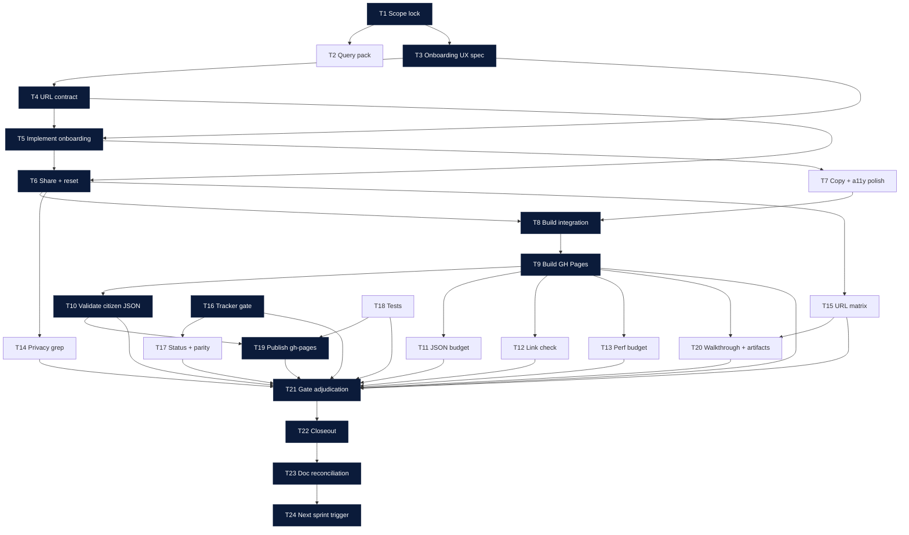

# AI-OPS-23 Sprint Prompt Pack

## Scale Metadata
- `scale_mode`: `LONG_10X`
- `baseline_reference`: `docs/etl/sprints/AI-OPS-22/sprint-ai-agents.md`
- `baseline_points`: `131`
- `target_points`: `130`
- `planned_points`: `131`
- `target_task_count`: `24`
- `planned_task_count`: `24`
- `horizon_weeks`: `6`

## Baseline Snapshot (2026-02-17)
- Citizen app (static GH Pages) exists at `/citizen`:
  - Views: `detail`, `dashboard`, `coherence`, `alignment`.
  - URL state is shareable for non-sensitive params: `concern_ids`, `party_id`, `view`, `method`.
  - Preferences are local-first (stored in `localStorage`) with explicit opt-in sharing via URL fragment.
- Citizen artifacts are bounded and validated:
  - `docs/gh-pages/citizen/data/citizen.json` (combined)
  - `docs/gh-pages/citizen/data/citizen_votes.json`
  - `docs/gh-pages/citizen/data/citizen_declared.json`
  - each target `<= 5MB`
- Data truth:
  - Declared signal is sparse; we must keep `unknown/no_signal` explicit.
  - Coverage and comparability are first-class: do not silently impute.

## Sprint Objective (Citizen Onboarding v1)
Reduce time-to-answer for a new citizen without adding servers or collecting preferences:
- From landing to a defensible, auditable view in ~60 seconds.
- One obvious "Start here" path that sets:
  - 1-3 concerns
  - method (`combined|votes|declared`)
  - destination view (`dashboard|coherence|alignment`)
- Shareability:
  - URL query params reproduce non-sensitive view state.
  - preferences remain local-first; share only via explicit action and fragment (`#...`).

Non-goals (explicit):
- No accounts, no analytics, no server state.
- No new upstream connectors.
- No black-box ranking that hides unknown/coverage.

## Bottleneck Class
- Primary: `product bottleneck` (new citizens don't reach an answer fast enough).
- Secondary: `UX bottleneck` (state is powerful but not guided; onboarding needs a safe default path).

## Lane Packing Plan
- `HI` setup wave: Tasks `1-8`
- `FAST` throughput wave: Tasks `9-20`
- `HI` closeout wave: Tasks `21-24`
- Lane switches: `2` (`HI -> FAST -> HI`)

## Workload Balance
- Points split: `L1=74 (56.49%)`, `L2=46 (35.11%)`, `L3=11 (8.40%)`
- Task split: `L1=12/24 (50.00%)`, `L2=7/24 (29.17%)`, `L3=5/24 (20.83%)`

## Must-Pass Gates
- `G1 Visible product delta`: citizen has a clear onboarding path (new `view=start` or equivalent) that results in a shareable, restored state.
- `G2 Auditability`: onboarding and its destination views preserve audit links (Temas + Explorer SQL) for every claim.
- `G3 Honesty + Privacy`: unknown/coverage are explicit; preferences are local-first; no auto preference leakage into query params.
- `G4 Static budgets`: citizen artifacts remain bounded (`<= 5MB` each) and mobile loads are acceptable.
- `G5 Reproducibility`: `just explorer-gh-pages-build` stays green; validator stays strict.
- `G6 Strict gate/parity`: `just etl-tracker-gate` exit `0` and status parity remains `overall_match=true`.

## Prompt Pack

1. Agent: L3 Orchestrator
- `depends_on`: `[]`
- `parallel_group`: `P1`
- `model_lane`: `HI`
- `points`: `5`
```text
Repository path/context:
- REPO_ROOT/vota-con-la-chola

Objective:
- Lock AI-OPS-23 scope + must-pass gates for "Citizen Onboarding v1".

Concrete tasks:
- Define the 2-3 primary onboarding journeys (max):
  - first visit -> pick concerns/method -> land on a useful view
  - share link -> restores view state
  - optional: proceed into alignment/preferences without leaking prefs
- Freeze gates G1..G6 with PASS/FAIL criteria and required evidence artifacts.
- Declare explicit non-goals to prevent scope creep.
- Define the exact privacy contract for onboarding (URL params allowed vs forbidden).

Output contract:
- docs/etl/sprints/AI-OPS-23/reports/scope-lock.md

Acceptance checks:
- test -f docs/etl/sprints/AI-OPS-23/reports/scope-lock.md
- rg -n "Journeys|Non-goals|G1|G2|G3|G4|G5|G6|PASS|FAIL|privacy" docs/etl/sprints/AI-OPS-23/reports/scope-lock.md

Task packet:
goal: Scope lock and gate contract for citizen onboarding v1.
inputs: docs/roadmap.md; docs/roadmap-tecnico.md; AGENTS.md; ui/citizen/index.html; docs/etl/sprints/AI-OPS-22/closeout.md
output_contract: scope-lock report with journeys + gate table + non-goals + privacy contract.
acceptance_query: grep for Journeys + gates + privacy contract.
escalation_rule: Escalate if onboarding implies server-side preference storage or analytics.
depends_on: []
parallel_group: P1
artifact_path: docs/etl/sprints/AI-OPS-23/reports/scope-lock.md
```

2. Agent: L2 Specialist Builder
- `depends_on`: `[1]`
- `parallel_group`: `P2`
- `model_lane`: `HI`
- `points`: `5`
```text
Repository path/context:
- REPO_ROOT/vota-con-la-chola

Objective:
- Produce a baseline/query pack for onboarding v1 so we can measure "time-to-answer" and preserve determinism.

Concrete tasks:
- Write a baseline/query pack that captures:
  - current citizen meta (`as_of_date`, `computed_method`, `methods_available`)
  - counts per method: topics, parties, party_topic_positions
  - concern coverage: topics per concern_id (from citizen snapshot)
  - current URL state contract (params used today)
- Include exact runnable commands and exact output paths under AI-OPS-23 evidence/exports.

Output contract:
- docs/etl/sprints/AI-OPS-23/reports/query-pack-baseline.md

Acceptance checks:
- test -f docs/etl/sprints/AI-OPS-23/reports/query-pack-baseline.md
- rg -n "explorer-gh-pages-build|validate_citizen_snapshot|citizen.json|citizen_votes.json|citizen_declared.json|tracker-gate|overall_match" docs/etl/sprints/AI-OPS-23/reports/query-pack-baseline.md

Task packet:
goal: Baseline query pack and reproducible command list.
inputs: docs/etl/sprints/AI-OPS-22/reports/query-pack-baseline.md; justfile; scripts/validate_citizen_snapshot.py
output_contract: query-pack-baseline report with runnable commands + expected outputs.
acceptance_query: grep for build + validate + tracker gate + parity.
escalation_rule: Escalate if baseline requires non-deterministic manual steps.
depends_on: [1]
parallel_group: P2
artifact_path: docs/etl/sprints/AI-OPS-23/reports/query-pack-baseline.md
```

3. Agent: L2 Specialist Builder
- `depends_on`: `[1]`
- `parallel_group`: `P3`
- `model_lane`: `HI`
- `points`: `8`
```text
Repository path/context:
- REPO_ROOT/vota-con-la-chola

Objective:
- Define the onboarding UX spec that makes the citizen app usable in ~60 seconds.

Concrete tasks:
- Specify onboarding as either:
  - a new `view=start`, OR
  - a persistent "Start here" panel shown when state is empty.
- The spec must define:
  - default concerns selection behavior
  - method selection behavior (and how we describe it honestly)
  - destination view selection (dashboard/coherence/alignment)
  - how state is stored/restored: URL params first, localStorage fallback
  - mobile/a11y constraints (keyboard, tap targets)
- Include exact UI copy in Spanish for:
  - why unknown exists
  - why preferences are local-first
  - how to share safely

Output contract:
- docs/etl/sprints/AI-OPS-23/reports/citizen-onboarding-ux-spec.md

Acceptance checks:
- test -f docs/etl/sprints/AI-OPS-23/reports/citizen-onboarding-ux-spec.md
- rg -n "view=start|Start here|60|URL|localStorage|fragment|unknown|coverage|audit" docs/etl/sprints/AI-OPS-23/reports/citizen-onboarding-ux-spec.md

Task packet:
goal: Concrete onboarding UX spec and copy.
inputs: ui/citizen/index.html; docs/etl/sprints/AI-OPS-22/reports/citizen-alignment-ux-spec.md
output_contract: UX spec with flows + copy + state rules.
acceptance_query: grep for view=start + state rules + privacy.
escalation_rule: Escalate if the spec requires collecting preferences on a server.
depends_on: [1]
parallel_group: P3
artifact_path: docs/etl/sprints/AI-OPS-23/reports/citizen-onboarding-ux-spec.md
```

4. Agent: L2 Specialist Builder
- `depends_on`: `[1, 3]`
- `parallel_group`: `P4`
- `model_lane`: `HI`
- `points`: `5`
```text
Repository path/context:
- REPO_ROOT/vota-con-la-chola

Objective:
- Freeze the URL/state contract for onboarding v1 (what is shareable vs private).

Concrete tasks:
- Specify query params (shareable):
  - concerns: `concern_ids=...`
  - view: `view=...`
  - party focus: `party_id=...`
  - method: `method=combined|votes|declared`
- Specify fragment-only payload (private by default, opt-in to share):
  - preferences payload format and limits
- Define backward compatibility and migration rules (older URLs should not break).

Output contract:
- docs/etl/sprints/AI-OPS-23/reports/url-contract.md

Acceptance checks:
- test -f docs/etl/sprints/AI-OPS-23/reports/url-contract.md
- rg -n "Query params|fragment|preferences|backward|migration" docs/etl/sprints/AI-OPS-23/reports/url-contract.md

Task packet:
goal: URL contract with explicit allow/deny list.
inputs: docs/etl/sprints/AI-OPS-22/reports/url-contract.md; ui/citizen/index.html
output_contract: url-contract report.
acceptance_query: grep for query params + fragment rules.
escalation_rule: Escalate if preferences are proposed for query params by default.
depends_on: [1, 3]
parallel_group: P4
artifact_path: docs/etl/sprints/AI-OPS-23/reports/url-contract.md
```

5. Agent: L2 Specialist Builder
- `depends_on`: `[3, 4]`
- `parallel_group`: `P5`
- `model_lane`: `HI`
- `points`: `13`
```text
Repository path/context:
- REPO_ROOT/vota-con-la-chola

Objective:
- Implement onboarding v1 in the citizen app, consistent with the UX spec + URL contract.

Concrete tasks:
- Add onboarding surface:
  - either `view=start` or an equivalent start panel when state is empty.
- The onboarding must set:
  - selected concerns (1-3)
  - method
  - destination view (dashboard/coherence/alignment)
- Ensure state rules:
  - URL params are the canonical state for shareable view settings
  - localStorage is only a fallback when URL is absent
- Keep audit-first:
  - onboarding includes direct links to `../explorer-temas/` and `../explorer/`.

Output contract:
- Code changes under:
  - ui/citizen/index.html

Acceptance checks:
- rg -n "view=start|onboarding" ui/citizen/index.html
- rg -n "concern_ids|method|party_id|view" ui/citizen/index.html

Task packet:
goal: Working onboarding v1 UI in citizen app.
inputs: docs/etl/sprints/AI-OPS-23/reports/citizen-onboarding-ux-spec.md; docs/etl/sprints/AI-OPS-23/reports/url-contract.md
output_contract: ui/citizen/index.html implements onboarding and state rules.
acceptance_query: grep for onboarding markers and URL param parsing.
escalation_rule: Escalate if implementation requires new backend endpoints.
depends_on: [3, 4]
parallel_group: P5
artifact_path: ui/citizen/index.html
```

6. Agent: L2 Specialist Builder
- `depends_on`: `[4, 5]`
- `parallel_group`: `P6`
- `model_lane`: `HI`
- `points`: `8`
```text
Repository path/context:
- REPO_ROOT/vota-con-la-chola

Objective:
- Implement "share my setup" safely (URL params for view state, fragment for preferences).

Concrete tasks:
- Add a share-link generator that:
  - includes non-sensitive state in query params
  - includes preferences only in fragment and only when user explicitly clicks "share preferences"
- Add a visible "reset" control that clears citizen local state (selected concerns/method/view/prefs).
- Ensure we never auto-write preferences into query params.

Output contract:
- Code changes under:
  - ui/citizen/index.html

Acceptance checks:
- rg -n "#prefs=|prefs=v1" ui/citizen/index.html
- rg -n "localStorage" ui/citizen/index.html

Task packet:
goal: Safe share + reset controls.
inputs: docs/etl/sprints/AI-OPS-23/reports/url-contract.md; docs/etl/sprints/AI-OPS-22/reports/preferences-contract.md
output_contract: share link + reset UI; fragment-only preference sharing.
acceptance_query: grep for fragment builder; ensure no query-param preference writes.
escalation_rule: Escalate if any preference key is written into URL query params automatically.
depends_on: [4, 5]
parallel_group: P6
artifact_path: ui/citizen/index.html
```

7. Agent: L2 Specialist Builder
- `depends_on`: `[5]`
- `parallel_group`: `P7`
- `model_lane`: `HI`
- `points`: `5`
```text
Repository path/context:
- REPO_ROOT/vota-con-la-chola

Objective:
- Tighten onboarding copy + honesty and mobile/a11y polish for the new flow.

Concrete tasks:
- Add/adjust copy for:
  - method selection (combined vs votes vs declared)
  - coverage/unknown explanation
  - audit links and how to verify
- Verify mobile tap targets and keyboard navigation for onboarding controls.

Output contract:
- Code changes under:
  - ui/citizen/index.html

Acceptance checks:
- rg -n "unknown|cobertura|audit|Temas|Explorer" ui/citizen/index.html

Task packet:
goal: Onboarding copy + a11y/mobile polish.
inputs: docs/etl/sprints/AI-OPS-23/reports/citizen-onboarding-ux-spec.md
output_contract: updated citizen UI copy and minor a11y improvements.
acceptance_query: grep for new copy anchors.
escalation_rule: Escalate if copy implies certainty when data is unknown.
depends_on: [5]
parallel_group: P7
artifact_path: ui/citizen/index.html
```

8. Agent: L2 Specialist Builder
- `depends_on`: `[5, 6, 7]`
- `parallel_group`: `P8`
- `model_lane`: `HI`
- `points`: `2`
```text
Repository path/context:
- REPO_ROOT/vota-con-la-chola

Objective:
- Ensure GH Pages build wiring remains canonical and captures onboarding changes.

Concrete tasks:
- Confirm `just explorer-gh-pages-build` still:
  - copies `ui/citizen/index.html` to `docs/gh-pages/citizen/index.html`
  - copies `ui/citizen/concerns_v1.json` to `docs/gh-pages/citizen/data/concerns_v1.json`
  - validates citizen artifacts via `scripts/validate_citizen_snapshot.py`
- If any wiring is missing, update `justfile` accordingly.

Output contract:
- docs/etl/sprints/AI-OPS-23/reports/build-integration.md

Acceptance checks:
- test -f docs/etl/sprints/AI-OPS-23/reports/build-integration.md
- rg -n "explorer-gh-pages-build" docs/etl/sprints/AI-OPS-23/reports/build-integration.md

Task packet:
goal: Build integration notes and wiring verification.
inputs: justfile
output_contract: build-integration report (and justfile fix if needed).
acceptance_query: grep for explorer-gh-pages-build.
escalation_rule: Escalate if build requires non-reproducible manual steps.
depends_on: [5, 6, 7]
parallel_group: P8
artifact_path: docs/etl/sprints/AI-OPS-23/reports/build-integration.md
```

9. Agent: L1 Mechanical Executor
- `depends_on`: `[8]`
- `parallel_group`: `P9`
- `model_lane`: `FAST`
- `points`: `5`
```text
Repository path/context:
- REPO_ROOT/vota-con-la-chola

Objective:
- Run the canonical GH Pages build and capture evidence.

Concrete tasks:
- Run:
  - just explorer-gh-pages-build
- Store logs + exit code under AI-OPS-23 evidence.

Output contract:
- docs/etl/sprints/AI-OPS-23/evidence/gh-pages-build.log
- docs/etl/sprints/AI-OPS-23/evidence/gh-pages-build.exit

Acceptance checks:
- test -f docs/etl/sprints/AI-OPS-23/evidence/gh-pages-build.log
- test -f docs/etl/sprints/AI-OPS-23/evidence/gh-pages-build.exit
- cat docs/etl/sprints/AI-OPS-23/evidence/gh-pages-build.exit | tr -d ' \n' | grep -q '^0$'

Task packet:
goal: Build GH Pages artifacts with reproducible command.
inputs: justfile
output_contract: build log + exit code.
acceptance_query: exit code == 0.
escalation_rule: Escalate if build fails or produces unbounded artifacts.
depends_on: [8]
parallel_group: P9
artifact_path: docs/etl/sprints/AI-OPS-23/evidence/gh-pages-build.log
```

10. Agent: L1 Mechanical Executor
- `depends_on`: `[9]`
- `parallel_group`: `P9`
- `model_lane`: `FAST`
- `points`: `5`
```text
Repository path/context:
- REPO_ROOT/vota-con-la-chola

Objective:
- Validate citizen artifacts post-build and capture validator output.

Concrete tasks:
- Run strict validation for every citizen JSON:
  - python3 scripts/validate_citizen_snapshot.py --path docs/gh-pages/citizen/data/citizen.json --max-bytes 5000000 --strict-grid
  - python3 scripts/validate_citizen_snapshot.py --path docs/gh-pages/citizen/data/citizen_votes.json --max-bytes 5000000 --strict-grid
  - python3 scripts/validate_citizen_snapshot.py --path docs/gh-pages/citizen/data/citizen_declared.json --max-bytes 5000000 --strict-grid
- Store logs under AI-OPS-23 evidence.

Output contract:
- docs/etl/sprints/AI-OPS-23/evidence/citizen-validate-post.log

Acceptance checks:
- test -f docs/etl/sprints/AI-OPS-23/evidence/citizen-validate-post.log

Task packet:
goal: Validate citizen snapshots are schema-correct and bounded.
inputs: docs/gh-pages/citizen/data/*.json
output_contract: validator log.
acceptance_query: validator exits 0.
escalation_rule: Escalate if validator fails or budgets are exceeded.
depends_on: [9]
parallel_group: P9
artifact_path: docs/etl/sprints/AI-OPS-23/evidence/citizen-validate-post.log
```

11. Agent: L1 Mechanical Executor
- `depends_on`: `[9]`
- `parallel_group`: `P10`
- `model_lane`: `FAST`
- `points`: `5`
```text
Repository path/context:
- REPO_ROOT/vota-con-la-chola

Objective:
- Capture citizen JSON size budgets as explicit evidence.

Concrete tasks:
- Measure sizes for:
  - docs/gh-pages/citizen/data/citizen.json
  - docs/gh-pages/citizen/data/citizen_votes.json
  - docs/gh-pages/citizen/data/citizen_declared.json
- Write a small report with bytes and PASS/FAIL vs 5MB.

Output contract:
- docs/etl/sprints/AI-OPS-23/evidence/citizen-json-budget.txt

Acceptance checks:
- test -f docs/etl/sprints/AI-OPS-23/evidence/citizen-json-budget.txt
- rg -n "PASS" docs/etl/sprints/AI-OPS-23/evidence/citizen-json-budget.txt

Task packet:
goal: Citizen JSON budgets evidence.
inputs: docs/gh-pages/citizen/data/citizen*.json
output_contract: budget text file.
acceptance_query: all <= 5000000 bytes.
escalation_rule: Escalate if any artifact exceeds budget.
depends_on: [9]
parallel_group: P10
artifact_path: docs/etl/sprints/AI-OPS-23/evidence/citizen-json-budget.txt
```

12. Agent: L1 Mechanical Executor
- `depends_on`: `[9]`
- `parallel_group`: `P11`
- `model_lane`: `FAST`
- `points`: `5`
```text
Repository path/context:
- REPO_ROOT/vota-con-la-chola

Objective:
- Run a pragmatic link check for citizen audit links (no broken internal targets).

Concrete tasks:
- Check:
  - required links exist for the citizen UI (Temas, Explorer SQL, Politico)
  - relative paths resolve inside docs/gh-pages/
- Store a JSON summary under AI-OPS-23 evidence.

Output contract:
- docs/etl/sprints/AI-OPS-23/evidence/link-check.json

Acceptance checks:
- test -f docs/etl/sprints/AI-OPS-23/evidence/link-check.json

Task packet:
goal: Link-check evidence for citizen app.
inputs: docs/gh-pages/citizen/index.html; docs/gh-pages/
output_contract: link-check JSON.
acceptance_query: missing_required == 0 and missing_targets == 0.
escalation_rule: Escalate if audit links are broken.
depends_on: [9]
parallel_group: P11
artifact_path: docs/etl/sprints/AI-OPS-23/evidence/link-check.json
```

13. Agent: L1 Mechanical Executor
- `depends_on`: `[9]`
- `parallel_group`: `P12`
- `model_lane`: `FAST`
- `points`: `5`
```text
Repository path/context:
- REPO_ROOT/vota-con-la-chola

Objective:
- Capture a minimal perf budget snapshot (pragmatic, not lab-grade).

Concrete tasks:
- Record:
  - citizen JSON sizes (already in budget file)
  - rough asset count under docs/gh-pages/citizen/
- Store a short perf-budget note under AI-OPS-23 evidence.

Output contract:
- docs/etl/sprints/AI-OPS-23/evidence/perf-budget.txt

Acceptance checks:
- test -f docs/etl/sprints/AI-OPS-23/evidence/perf-budget.txt

Task packet:
goal: Perf budget evidence.
inputs: docs/gh-pages/citizen/
output_contract: perf-budget.txt
acceptance_query: file exists and contains size summary.
escalation_rule: Escalate if onboarding requires downloading all methods by default.
depends_on: [9]
parallel_group: P12
artifact_path: docs/etl/sprints/AI-OPS-23/evidence/perf-budget.txt
```

14. Agent: L1 Mechanical Executor
- `depends_on`: `[6]`
- `parallel_group`: `P13`
- `model_lane`: `FAST`
- `points`: `5`
```text
Repository path/context:
- REPO_ROOT/vota-con-la-chola

Objective:
- Privacy audit grep: ensure preferences are not written into URL query params.

Concrete tasks:
- Grep the citizen UI for any suspicious URL state writes that include preference payload.
- Save grep output (and any reviewed snippet) under AI-OPS-23 evidence.

Output contract:
- docs/etl/sprints/AI-OPS-23/evidence/privacy-grep.txt

Acceptance checks:
- test -f docs/etl/sprints/AI-OPS-23/evidence/privacy-grep.txt

Task packet:
goal: Privacy grep evidence.
inputs: ui/citizen/index.html
output_contract: privacy-grep.txt with grep results and notes.
acceptance_query: no auto-write of prefs into query params.
escalation_rule: Escalate if any code writes prefs into URL query params.
depends_on: [6]
parallel_group: P13
artifact_path: docs/etl/sprints/AI-OPS-23/evidence/privacy-grep.txt
```

15. Agent: L1 Mechanical Executor
- `depends_on`: `[6, 9]`
- `parallel_group`: `P14`
- `model_lane`: `FAST`
- `points`: `8`
```text
Repository path/context:
- REPO_ROOT/vota-con-la-chola

Objective:
- Generate a shareable URL matrix for onboarding v1 (non-sensitive state + optional prefs fragment).

Concrete tasks:
- Produce a CSV with example links that cover:
  - onboarding start
  - dashboard with 2-3 concerns
  - coherence view
  - alignment view (no prefs)
  - alignment view (with prefs in fragment)
- Store under exports.

Output contract:
- docs/etl/sprints/AI-OPS-23/exports/url-matrix.csv

Acceptance checks:
- test -f docs/etl/sprints/AI-OPS-23/exports/url-matrix.csv

Task packet:
goal: URL matrix for shareability regression testing.
inputs: docs/etl/sprints/AI-OPS-23/reports/url-contract.md; docs/gh-pages/citizen/
output_contract: url-matrix.csv.
acceptance_query: CSV contains at least 6 example links.
escalation_rule: Escalate if share links require leaking prefs into query params.
depends_on: [6, 9]
parallel_group: P14
artifact_path: docs/etl/sprints/AI-OPS-23/exports/url-matrix.csv
```

16. Agent: L1 Mechanical Executor
- `depends_on`: `[]`
- `parallel_group`: `P15`
- `model_lane`: `FAST`
- `points`: `5`
```text
Repository path/context:
- REPO_ROOT/vota-con-la-chola

Objective:
- Run strict tracker gate after onboarding changes (should remain green).

Concrete tasks:
- Run:
  - just etl-tracker-gate
- Save logs + exit under AI-OPS-23 evidence.

Output contract:
- docs/etl/sprints/AI-OPS-23/evidence/tracker-gate-postrun.log
- docs/etl/sprints/AI-OPS-23/evidence/tracker-gate-postrun.exit

Acceptance checks:
- test -f docs/etl/sprints/AI-OPS-23/evidence/tracker-gate-postrun.exit
- cat docs/etl/sprints/AI-OPS-23/evidence/tracker-gate-postrun.exit | tr -d ' \n' | grep -q '^0$'

Task packet:
goal: Strict tracker gate evidence.
inputs: docs/etl/e2e-scrape-load-tracker.md
output_contract: tracker gate log + exit.
acceptance_query: exit code == 0.
escalation_rule: Escalate if strict gate fails.
depends_on: []
parallel_group: P15
artifact_path: docs/etl/sprints/AI-OPS-23/evidence/tracker-gate-postrun.log
```

17. Agent: L1 Mechanical Executor
- `depends_on`: `[16]`
- `parallel_group`: `P15`
- `model_lane`: `FAST`
- `points`: `5`
```text
Repository path/context:
- REPO_ROOT/vota-con-la-chola

Objective:
- Capture status snapshot and parity after sprint changes.

Concrete tasks:
- Run:
  - python3 scripts/export_explorer_sources_snapshot.py --db etl/data/staging/politicos-es.db --out docs/etl/sprints/AI-OPS-23/evidence/status-postrun.json
  - python3 scripts/export_explorer_sources_snapshot.py --db etl/data/staging/politicos-es.db --out docs/gh-pages/explorer-sources/data/status.json
  - python3 - <<'PY' > docs/etl/sprints/AI-OPS-23/evidence/status-parity-postrun.txt
import json
from pathlib import Path

final = json.loads(Path('docs/etl/sprints/AI-OPS-23/evidence/status-postrun.json').read_text(encoding='utf-8'))
published = json.loads(Path('docs/gh-pages/explorer-sources/data/status.json').read_text(encoding='utf-8'))

checks = [
  ('summary.tracker.mismatch', (('summary','tracker','mismatch'))),
  ('summary.tracker.waived_mismatch', (('summary','tracker','waived_mismatch'))),
  ('summary.tracker.done_zero_real', (('summary','tracker','done_zero_real'))),
  ('summary.tracker.waivers_expired', (('summary','tracker','waivers_expired'))),
  ('analytics.impact.indicator_series_total', (('analytics','impact','indicator_series_total'))),
  ('analytics.impact.indicator_points_total', (('analytics','impact','indicator_points_total'))),
]

def pick(obj, path):
    cur = obj
    for k in path:
        cur = (cur or {}).get(k)
    return cur

overall_match = True
print('# AI-OPS-23 status parity summary')
for name, path in checks:
    fv = pick(final, path)
    pv = pick(published, path)
    match = fv == pv
    overall_match = overall_match and match
    print(f'{name}: final={fv} published={pv} match={str(match).lower()}')
print(f'overall_match={str(overall_match).lower()}')
PY

Output contract:
- docs/etl/sprints/AI-OPS-23/evidence/status-postrun.json
- docs/etl/sprints/AI-OPS-23/evidence/status-parity-postrun.txt

Acceptance checks:
- test -f docs/etl/sprints/AI-OPS-23/evidence/status-parity-postrun.txt
- rg -n "overall_match=true" docs/etl/sprints/AI-OPS-23/evidence/status-parity-postrun.txt

Task packet:
goal: Status snapshot + parity evidence.
inputs: etl/data/staging/politicos-es.db; docs/etl/e2e-scrape-load-tracker.md
output_contract: status JSON + parity summary.
acceptance_query: overall_match=true.
escalation_rule: Escalate if parity fails.
depends_on: [16]
parallel_group: P15
artifact_path: docs/etl/sprints/AI-OPS-23/evidence/status-parity-postrun.txt
```

18. Agent: L1 Mechanical Executor
- `depends_on`: `[]`
- `parallel_group`: `P16`
- `model_lane`: `FAST`
- `points`: `8`
```text
Repository path/context:
- REPO_ROOT/vota-con-la-chola

Objective:
- Run tests and capture evidence.

Concrete tasks:
- Run:
  - just etl-test
- Save logs + exit under AI-OPS-23 evidence.

Output contract:
- docs/etl/sprints/AI-OPS-23/evidence/tests.log
- docs/etl/sprints/AI-OPS-23/evidence/tests.exit

Acceptance checks:
- test -f docs/etl/sprints/AI-OPS-23/evidence/tests.exit
- cat docs/etl/sprints/AI-OPS-23/evidence/tests.exit | tr -d ' \n' | grep -q '^0$'

Task packet:
goal: Tests evidence.
inputs: tests/
output_contract: tests.log + tests.exit
acceptance_query: exit code == 0.
escalation_rule: Escalate if tests fail.
depends_on: []
parallel_group: P16
artifact_path: docs/etl/sprints/AI-OPS-23/evidence/tests.log
```

19. Agent: L1 Mechanical Executor
- `depends_on`: `[9, 18]`
- `parallel_group`: `P17`
- `model_lane`: `FAST`
- `points`: `8`
```text
Repository path/context:
- REPO_ROOT/vota-con-la-chola

Objective:
- Publish updated static site to `gh-pages` branch and capture evidence.

Concrete tasks:
- Run:
  - just explorer-gh-pages-publish
- Save logs + exit under AI-OPS-23 evidence.

Output contract:
- docs/etl/sprints/AI-OPS-23/evidence/gh-pages-publish.log
- docs/etl/sprints/AI-OPS-23/evidence/gh-pages-publish.exit

Acceptance checks:
- test -f docs/etl/sprints/AI-OPS-23/evidence/gh-pages-publish.exit
- cat docs/etl/sprints/AI-OPS-23/evidence/gh-pages-publish.exit | tr -d ' \n' | grep -q '^0$'

Task packet:
goal: GH Pages publish evidence.
inputs: docs/gh-pages/
output_contract: publish log + exit.
acceptance_query: exit code == 0.
escalation_rule: Escalate if publish fails.
depends_on: [9, 18]
parallel_group: P17
artifact_path: docs/etl/sprints/AI-OPS-23/evidence/gh-pages-publish.log
```

20. Agent: L1 Mechanical Executor
- `depends_on`: `[9, 15]`
- `parallel_group`: `P18`
- `model_lane`: `FAST`
- `points`: `10`
```text
Repository path/context:
- REPO_ROOT/vota-con-la-chola

Objective:
- Write the citizen onboarding walkthrough and artifacts index (user-visible verification).

Concrete tasks:
- Write walkthrough:
  - how a new citizen uses onboarding to reach dashboard/coherence/alignment
  - how to share a link safely
  - how to audit via Temas + Explorer SQL
- Write artifacts index with entry points for:
  - prompt pack
  - key reports
  - evidence files
- Store under AI-OPS-23 reports.

Output contract:
- docs/etl/sprints/AI-OPS-23/reports/citizen-walkthrough.md
- docs/etl/sprints/AI-OPS-23/reports/artifacts-index.md

Acceptance checks:
- test -f docs/etl/sprints/AI-OPS-23/reports/citizen-walkthrough.md
- test -f docs/etl/sprints/AI-OPS-23/reports/artifacts-index.md

Task packet:
goal: Walkthrough + artifacts index.
inputs: docs/gh-pages/citizen/; docs/etl/sprints/AI-OPS-23/exports/url-matrix.csv
output_contract: walkthrough + artifacts index markdown.
acceptance_query: files exist and include audit links.
escalation_rule: Escalate if walkthrough requires non-reproducible steps.
depends_on: [9, 15]
parallel_group: P18
artifact_path: docs/etl/sprints/AI-OPS-23/reports/citizen-walkthrough.md
```

21. Agent: L3 Orchestrator
- `depends_on`: `[9, 10, 11, 12, 13, 14, 15, 16, 17, 18, 19, 20]`
- `parallel_group`: `P19`
- `model_lane`: `HI`
- `points`: `2`
```text
Repository path/context:
- REPO_ROOT/vota-con-la-chola

Objective:
- Adjudicate sprint gates G1..G6 and write the gate decision.

Concrete tasks:
- Evaluate each must-pass gate using the produced evidence.
- Record PASS/FAIL per gate and cite concrete artifact paths.

Output contract:
- docs/etl/sprints/AI-OPS-23/reports/gate-adjudication.md

Acceptance checks:
- test -f docs/etl/sprints/AI-OPS-23/reports/gate-adjudication.md
- rg -n "G1|G2|G3|G4|G5|G6" docs/etl/sprints/AI-OPS-23/reports/gate-adjudication.md

Task packet:
goal: Gate adjudication report.
inputs: docs/etl/sprints/AI-OPS-23/evidence/*; docs/etl/sprints/AI-OPS-23/reports/*
output_contract: gate-adjudication.md with PASS/FAIL + citations.
acceptance_query: grep for all gates.
escalation_rule: Escalate if any gate cannot be evaluated from evidence.
depends_on: [9, 10, 11, 12, 13, 14, 15, 16, 17, 18, 19, 20]
parallel_group: P19
artifact_path: docs/etl/sprints/AI-OPS-23/reports/gate-adjudication.md
```

22. Agent: L3 Orchestrator
- `depends_on`: `[21]`
- `parallel_group`: `P19`
- `model_lane`: `HI`
- `points`: `2`
```text
Repository path/context:
- REPO_ROOT/vota-con-la-chola

Objective:
- Write sprint closeout with a clear verdict and carryover.

Concrete tasks:
- Update closeout.md:
  - verdict PASS/FAIL
  - what shipped (user-visible)
  - gate summary (link to gate-adjudication)
  - evidence commands (copy exact commands from evidence logs)
  - follow-ups (bounded)

Output contract:
- docs/etl/sprints/AI-OPS-23/closeout.md

Acceptance checks:
- test -f docs/etl/sprints/AI-OPS-23/closeout.md
- rg -n "Sprint Verdict|PASS|FAIL|Evidence" docs/etl/sprints/AI-OPS-23/closeout.md

Task packet:
goal: Closeout doc.
inputs: docs/etl/sprints/AI-OPS-23/reports/gate-adjudication.md
output_contract: closeout.md with verdict and evidence refs.
acceptance_query: grep for verdict and Evidence.
escalation_rule: Escalate if closeout cannot cite concrete evidence.
depends_on: [21]
parallel_group: P19
artifact_path: docs/etl/sprints/AI-OPS-23/closeout.md
```

23. Agent: L3 Orchestrator
- `depends_on`: `[22]`
- `parallel_group`: `P19`
- `model_lane`: `HI`
- `points`: `1`
```text
Repository path/context:
- REPO_ROOT/vota-con-la-chola

Objective:
- Reconcile documentation pointers and avoid roadmap duplication.

Concrete tasks:
- Confirm `docs/etl/sprint-ai-agents.md` points to the current sprint.
- Confirm `docs/etl/sprints/README.md` row is updated (status + objective).
- Add a short doc-reconciliation note with any link fixes.

Output contract:
- docs/etl/sprints/AI-OPS-23/reports/doc-reconciliation.md

Acceptance checks:
- test -f docs/etl/sprints/AI-OPS-23/reports/doc-reconciliation.md

Task packet:
goal: Doc reconciliation and navigation correctness.
inputs: docs/etl/sprints/README.md; docs/etl/sprint-ai-agents.md
output_contract: doc-reconciliation.md note.
acceptance_query: file exists.
escalation_rule: Escalate if pointers are inconsistent.
depends_on: [22]
parallel_group: P19
artifact_path: docs/etl/sprints/AI-OPS-23/reports/doc-reconciliation.md
```

24. Agent: L3 Orchestrator
- `depends_on`: `[23]`
- `parallel_group`: `P19`
- `model_lane`: `HI`
- `points`: `1`
```text
Repository path/context:
- REPO_ROOT/vota-con-la-chola

Objective:
- Define the next sprint trigger to prevent looping and preserve visible progress.

Concrete tasks:
- Write a short trigger section that explains:
  - what would justify starting AI-OPS-24
  - what is explicitly not a trigger (no blind retries, no scope creep)

Output contract:
- docs/etl/sprints/AI-OPS-23/reports/next-sprint-trigger.md

Acceptance checks:
- test -f docs/etl/sprints/AI-OPS-23/reports/next-sprint-trigger.md

Task packet:
goal: Next sprint trigger doc.
inputs: docs/etl/sprints/AI-OPS-23/reports/gate-adjudication.md
output_contract: next-sprint-trigger.md
acceptance_query: file exists.
escalation_rule: Escalate if triggers are not controllable.
depends_on: [23]
parallel_group: P19
artifact_path: docs/etl/sprints/AI-OPS-23/reports/next-sprint-trigger.md
```

## Critical Path
1. T1 -> T3 -> T4 -> T5 -> T6 -> T8 -> T9 -> T10 -> T16 -> T19 -> T21 -> T22 -> T23 -> T24
2. Critical-path points (approx): `5 + 8 + 5 + 13 + 8 + 2 + 5 + 5 + 5 + 8 + 2 + 2 + 1 + 1 = 62`

## Parallel Plan
- `P1`:
  - T1
- `P2`:
  - T2 (after T1)
- `P3`:
  - T3 (after T1)
- `P4`:
  - T4 (after T1,T3)
- `P5`:
  - T5 (after T3,T4)
- `P6`:
  - T6 (after T4,T5)
- `P7`:
  - T7 (after T5)
- `P8`:
  - T8 (after T5,T6,T7)
- `FAST wave` groups:
  - T9-13 can run as soon as T8 (build) completes.
  - T14-15 depend on share implementation (T6).
  - T16-18 are independent of build (but should be captured after code merges).
  - T19 depends on build + tests.
  - T20 depends on build + url-matrix.

## Queue Waves
- `HI` wave (setup): T1-T8
- `FAST` wave (throughput/evidence): T9-T20
- `HI` wave (closeout): T21-T24
- Lane switches: `2`

## Flow Diagram (Mermaid, vertical)


## Folder Layout
```text
docs/etl/sprints/AI-OPS-23/
  sprint-ai-agents.md
  kickoff.md
  closeout.md
  reports/
    scope-lock.md
    query-pack-baseline.md
    citizen-onboarding-ux-spec.md
    url-contract.md
    build-integration.md
    citizen-walkthrough.md
    artifacts-index.md
    gate-adjudication.md
    doc-reconciliation.md
    next-sprint-trigger.md
  evidence/
    gh-pages-build.log
    gh-pages-build.exit
    citizen-validate-post.log
    citizen-json-budget.txt
    link-check.json
    perf-budget.txt
    privacy-grep.txt
    tracker-gate-postrun.log
    tracker-gate-postrun.exit
    status-postrun.json
    status-parity-postrun.txt
    tests.log
    tests.exit
    gh-pages-publish.log
    gh-pages-publish.exit
  exports/
    url-matrix.csv
```

## Scale Audit
- Baseline points: `131`
- Target points: `130`
- Planned points: `131`
- Baseline task count: `24`
- Target task count: `24`
- Planned task count: `24`
- Horizon (weeks): `6`
- 10x-scale intent: `PASS` (baseline is already LONG_10X; plan matches recent sprint scale)
