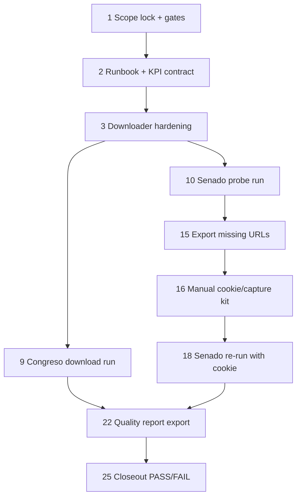

# AI-OPS-24 Sprint Prompt Pack

## Scale Metadata
- `scale_mode`: `LONG_10X`
- `baseline_reference`: `docs/etl/sprints/AI-OPS-23/sprint-ai-agents.md`
- `baseline_points`: `131`
- `target_points`: `160`
- `planned_points`: `156`
- `target_task_count`: `28`
- `planned_task_count`: `28`
- `horizon_weeks`: `6`

## Baseline Snapshot (2026-02-18)

We have votes and initiative linking, but the citizen question “what did they vote on” requires downloading the *primary source texts* (BOCG / Diario de Sesiones / initiative detail docs) and mapping them back to `initiative_id`.

Current state:
- Schema/model exists:
  - `parl_initiatives.links_bocg_json` / `links_ds_json`
  - `parl_initiative_documents` maps `initiative_id -> doc_url -> source_record_pk`
  - `text_documents` stores doc metadata; bytes live under `etl/data/raw/text_documents/parl_initiative_docs/`
  - `document_fetches` tracks URL attempts to avoid re-trying permanent 403/404 loops.
- Visible UI delta exists:
  - `/explorer-votaciones` vote summaries include `initiative.documents` when available.
- Coverage truth (from `quality-report --include-initiatives` written to `docs/etl/sprints/AI-OPS-24/exports/quality_initiatives_2026-02-18.json`):
  - Congreso: `initiatives_linked_to_votes_with_downloaded_docs_pct ~= 0.97` (almost complete for linked initiatives with doc links)
  - Senado: systematic `HTTP 403` on initiative/doc endpoints; currently `0` downloaded.

Evidence:
- `docs/etl/sprints/AI-OPS-24/evidence/initdocs_auto_2026-02-18.json`
- `docs/etl/sprints/AI-OPS-24/evidence/senado_retry_small_2026-02-18.json`
- Blocker log entry: `docs/etl/name-and-shame-access-blockers.md` row `nso-2026-02-senado-iniciativas-403`

## Sprint Objective
Deliver an audit-ready “what was voted” document layer:
1. Congreso: download and index all initiative documents referenced by votes (bounded per initiative, deduped by URL), reaching near-100% for doc-able linked initiatives.
2. Senado: either
   - recover reproducible document downloads using an approved lever (cookie injection) OR
   - explicitly mark as blocked with evidence and ship a deterministic manual capture kit + URL exports so progress is still possible.

Non-goals:
- Full PDF-to-text extraction/semantic summarization.
- Publishing PDFs to GH Pages.

## Bottleneck Class
- Primary: `source bottleneck` (Senado WAF/403).
- Secondary: `pipeline bottleneck` (need stable fetch-status + runbook + KPIs).

## Must-Pass Gates
- `G1 Congreso doc coverage`: in `quality-report --include-initiatives`, `by_source.congreso_iniciativas.initiatives_linked_to_votes_with_downloaded_docs_pct >= 0.99`.
- `G2 Senado honesty`: either `by_source.senado_iniciativas.initiatives_linked_to_votes_with_downloaded_docs > 0` OR blocker logged with fresh evidence + manual capture kit exported.
- `G3 No infinite loops`: rerunning the downloader without `--retry-forbidden` must not re-attempt known 403/404 URLs (validated via `document_fetches.attempts` stability for those URLs).
- `G4 Evidence mapping`: every downloaded doc must have:
  - a `text_documents` row (`source_id='parl_initiative_docs'`)
  - at least one `parl_initiative_documents` row pointing to its `source_record_pk`.
- `G5 Visible UX`: `/explorer-votaciones` shows document presence for initiatives when available.

## Lane Packing Plan
- `HI` setup wave: Tasks `1-8`
- `FAST` throughput wave: Tasks `9-24`
- `HI` closeout wave: Tasks `25-28`
- Lane switches: `2` (`HI -> FAST -> HI`)

## Dependency Graph



## Prompt Pack

1. Agent: L3 Orchestrator
- `depends_on`: `[]`
- `parallel_group`: `P1`
- `model_lane`: `HI`
- `points`: `5`
```text
Repository path/context:
- /Users/jesus/Library/CloudStorage/GoogleDrive-gsus123456@gmail.com/My Drive/CdC/Obsidian Vault/vota-con-la-chola

Objective:
- Lock AI-OPS-24 scope and the precise meaning of “download them all”.

Concrete tasks:
- Define “download them all” as a finite target set:
  - initiatives linked to votes (via parl_vote_event_initiatives)
  - with at least one doc URL (links_bocg_json/links_ds_json)
  - bounded max docs per initiative per kind.
- Freeze gates G1..G5 with PASS/FAIL thresholds and required evidence artifacts.
- Define disk/size budgets and operational safety limits.

Output contract:
- docs/etl/sprints/AI-OPS-24/reports/scope-lock.md

Acceptance checks:
- test -f docs/etl/sprints/AI-OPS-24/reports/scope-lock.md
- rg -n "download them all|G1|G2|G3|G4|G5|budgets|Non-goals" docs/etl/sprints/AI-OPS-24/reports/scope-lock.md

Artifact path:
- docs/etl/sprints/AI-OPS-24/reports/scope-lock.md
```

2. Agent: L2 Specialist Builder
- `depends_on`: `[1]`
- `parallel_group`: `P1`
- `model_lane`: `HI`
- `points`: `8`
```text
Repository path/context:
- /Users/jesus/Library/CloudStorage/GoogleDrive-gsus123456@gmail.com/My Drive/CdC/Obsidian Vault/vota-con-la-chola

Objective:
- Harden the initiative-doc downloader for large-scale runs without retry loops.

Concrete tasks:
- Ensure we track URL fetch attempts in SQLite (`document_fetches`).
- Ensure known-permanent statuses (403/404) are skipped by default unless explicitly retried.
- Ensure `--auto` stops with a clear stop_reason and includes diagnostics (`urls_to_fetch`, `skipped_forbidden`).
- Add cookie injection support via `--cookie` and `--cookie-file` (Playwright cookies.json) for senado.es.
- Ensure `--sleep-seconds` jitter exists for anti-WAF.

Output contract:
- Code changes (if needed) under:
  - etl/load/sqlite_schema.sql
  - etl/parlamentario_es/text_documents.py
  - etl/parlamentario_es/cli.py

Acceptance checks:
- python3 -m py_compile etl/parlamentario_es/text_documents.py etl/parlamentario_es/cli.py
- python3 -m unittest discover -s tests -v

Artifact path:
- docs/etl/sprints/AI-OPS-24/evidence/* (commands outputs recorded by L1)
```

3. Agent: L2 Specialist Builder
- `depends_on`: `[2]`
- `parallel_group`: `P1`
- `model_lane`: `HI`
- `points`: `5`
```text
Repository path/context:
- /Users/jesus/Library/CloudStorage/GoogleDrive-gsus123456@gmail.com/My Drive/CdC/Obsidian Vault/vota-con-la-chola

Objective:
- Add measurable KPIs for initiative document coverage.

Concrete tasks:
- Extend initiative KPIs in quality-report to include:
  - initiatives_with_doc_links
  - initiatives_with_downloaded_docs
  - initiatives_linked_to_votes_with_downloaded_docs (+ pct)
- Ensure outputs are visible via:
  - python3 scripts/ingestar_parlamentario_es.py quality-report --include-initiatives

Output contract:
- etl/parlamentario_es/quality.py

Acceptance checks:
- python3 scripts/ingestar_parlamentario_es.py quality-report --db etl/data/staging/politicos-es.db --include-initiatives --initiative-source-ids congreso_iniciativas,senado_iniciativas

Artifact path:
- docs/etl/sprints/AI-OPS-24/exports/quality_initiatives_<date>.json
```

4. Agent: L2 Specialist Builder
- `depends_on`: `[2]`
- `parallel_group`: `P1`
- `model_lane`: `HI`
- `points`: `3`
```text
Repository path/context:
- /Users/jesus/Library/CloudStorage/GoogleDrive-gsus123456@gmail.com/My Drive/CdC/Obsidian Vault/vota-con-la-chola

Objective:
- Provide a deterministic URL export tool for manual/headful capture.

Concrete tasks:
- Implement/export script that emits missing doc URLs from SQLite, filtered by:
  - initiative source (congreso/senado)
  - missing mapping (source_record_pk IS NULL)
  - optional status filter (e.g. only 403)

Output contract:
- scripts/export_missing_initiative_doc_urls.py

Acceptance checks:
- python3 -m py_compile scripts/export_missing_initiative_doc_urls.py
- scripts/export_missing_initiative_doc_urls.py --db etl/data/staging/politicos-es.db --initiative-source-ids senado_iniciativas --only-missing --only-status 403 --out /tmp/senado_urls.txt

Artifact path:
- docs/etl/sprints/AI-OPS-24/exports/senado_missing_doc_urls_403.txt
```

5. Agent: L3 Orchestrator
- `depends_on`: `[1,2,3,4]`
- `parallel_group`: `P2`
- `model_lane`: `HI`
- `points`: `3`
```text
Repository path/context:
- /Users/jesus/Library/CloudStorage/GoogleDrive-gsus123456@gmail.com/My Drive/CdC/Obsidian Vault/vota-con-la-chola

Objective:
- Decide the Senado unblock policy for this sprint.

Concrete tasks:
- Choose one of:
  A) Treat Senado docs as blocked unless cookie is provided; ship manual capture kit + blocker evidence.
  B) Approve cookie injection as “reproducible enough” for civic purposes, with strict documentation and explicit opt-in.
- Update scope-lock.md with the policy decision.

Output contract:
- docs/etl/sprints/AI-OPS-24/reports/scope-lock.md (append decision)

Acceptance checks:
- rg -n "Senado unblock policy|cookie|manual capture" docs/etl/sprints/AI-OPS-24/reports/scope-lock.md

Artifact path:
- docs/etl/sprints/AI-OPS-24/reports/scope-lock.md
```

6. Agent: L2 Specialist Builder
- `depends_on`: `[5]`
- `parallel_group`: `P2`
- `model_lane`: `HI`
- `points`: `8`
```text
Repository path/context:
- /Users/jesus/Library/CloudStorage/GoogleDrive-gsus123456@gmail.com/My Drive/CdC/Obsidian Vault/vota-con-la-chola

Objective:
- Ship a “Senado manual capture kit” runbook that is explicit and safe.

Concrete tasks:
- Document how to:
  1) Export missing Senate URLs from DB.
  2) Use a headful browser to solve challenges.
  3) Capture cookies into cookies.json.
  4) Run backfill with --cookie-file.
- Ensure the runbook never suggests committing cookies.

Output contract:
- docs/etl/sprints/AI-OPS-24/reports/senado_manual_capture_kit.md

Acceptance checks:
- test -f docs/etl/sprints/AI-OPS-24/reports/senado_manual_capture_kit.md
- rg -n "cookie-file|Playwright|export_missing_initiative_doc_urls|do not commit" docs/etl/sprints/AI-OPS-24/reports/senado_manual_capture_kit.md

Artifact path:
- docs/etl/sprints/AI-OPS-24/reports/senado_manual_capture_kit.md
```

7. Agent: L2 Specialist Builder
- `depends_on`: `[2]`
- `parallel_group`: `P2`
- `model_lane`: `HI`
- `points`: `5`
```text
Repository path/context:
- /Users/jesus/Library/CloudStorage/GoogleDrive-gsus123456@gmail.com/My Drive/CdC/Obsidian Vault/vota-con-la-chola

Objective:
- Ensure Explorer vote summaries show document availability consistently.

Concrete tasks:
- Validate that scripts/graph_ui_server.py attaches initiative doc summaries.
- If needed, add minimal fields:
  - documents.total
  - documents.by_kind
  - documents.docs[] {kind,url,downloaded}

Output contract:
- scripts/graph_ui_server.py (only if missing)

Acceptance checks:
- python3 -m py_compile scripts/graph_ui_server.py
- python3 scripts/export_explorer_votaciones_snapshot.py --db etl/data/staging/politicos-es.db --out /tmp/votes.json --limit 5

Artifact path:
- docs/etl/sprints/AI-OPS-24/evidence/votes_preview_with_docs.json (generated by L1)
```

8. Agent: L3 Orchestrator
- `depends_on`: `[1,6]`
- `parallel_group`: `P2`
- `model_lane`: `HI`
- `points`: `5`
```text
Repository path/context:
- /Users/jesus/Library/CloudStorage/GoogleDrive-gsus123456@gmail.com/My Drive/CdC/Obsidian Vault/vota-con-la-chola

Objective:
- Define PASS/FAIL criteria for Senado lane given current 403 evidence.

Concrete tasks:
- If Senado remains blocked, define what constitutes PASS:
  - blocker log updated with fresh evidence
  - URL export + manual capture kit shipped
  - downloader avoids infinite retries
- If Senado unblocks with cookie, define the new evidence gates.

Output contract:
- docs/etl/sprints/AI-OPS-24/reports/scope-lock.md (append)

Acceptance checks:
- rg -n "PASS if Senado blocked|PASS if Senado unblocked" docs/etl/sprints/AI-OPS-24/reports/scope-lock.md

Artifact path:
- docs/etl/sprints/AI-OPS-24/reports/scope-lock.md
```

9. Agent: L1 Mechanical Executor
- `depends_on`: `[2]`
- `parallel_group`: `P3`
- `model_lane`: `FAST`
- `points`: `5`
```text
Objective:
- Run Congreso-only doc downloader to completion and capture evidence.

Commands:
- python3 scripts/ingestar_parlamentario_es.py backfill-initiative-documents \
    --db etl/data/staging/politicos-es.db \
    --initiative-source-ids congreso_iniciativas \
    --snapshot-date 2026-02-12 \
    --limit-initiatives 500 \
    --max-docs-per-initiative 3 \
    --timeout 25 \
    --auto --max-loops 50

Output contract:
- docs/etl/sprints/AI-OPS-24/evidence/congreso_initdocs_auto.json

Acceptance checks:
- jq '.documents.stop_reason' docs/etl/sprints/AI-OPS-24/evidence/congreso_initdocs_auto.json
- quality-report shows congreso initiatives_linked_to_votes_with_downloaded_docs_pct >= 0.99
```

10. Agent: L1 Mechanical Executor
- `depends_on`: `[2]`
- `parallel_group`: `P3`
- `model_lane`: `FAST`
- `points`: `5`
```text
Objective:
- Run Senado doc downloader (no cookie) and capture evidence, without loops.

Commands:
- python3 scripts/ingestar_parlamentario_es.py backfill-initiative-documents \
    --db etl/data/staging/politicos-es.db \
    --initiative-source-ids senado_iniciativas \
    --snapshot-date 2026-02-12 \
    --limit-initiatives 200 \
    --max-docs-per-initiative 2 \
    --timeout 25 \
    --auto --max-loops 3

Output contract:
- docs/etl/sprints/AI-OPS-24/evidence/senado_initdocs_auto_nocookie.json

Acceptance checks:
- jq '.documents.stop_reason' docs/etl/sprints/AI-OPS-24/evidence/senado_initdocs_auto_nocookie.json
- Verify most skipped are forbidden (document_fetches.last_http_status=403)
```

11. Agent: L1 Mechanical Executor
- `depends_on`: `[4]`
- `parallel_group`: `P3`
- `model_lane`: `FAST`
- `points`: `3`
```text
Objective:
- Export missing/forbidden Senado URLs for manual capture.

Commands:
- scripts/export_missing_initiative_doc_urls.py \
    --db etl/data/staging/politicos-es.db \
    --initiative-source-ids senado_iniciativas \
    --only-missing \
    --only-status 403 \
    --format txt \
    --out docs/etl/sprints/AI-OPS-24/exports/senado_missing_doc_urls_403.txt

Acceptance checks:
- wc -l docs/etl/sprints/AI-OPS-24/exports/senado_missing_doc_urls_403.txt
```

12. Agent: L1 Mechanical Executor
- `depends_on`: `[2]`
- `parallel_group`: `P3`
- `model_lane`: `FAST`
- `points`: `3`
```text
Objective:
- Validate no infinite retry loops on forbidden URLs.

Commands (SQL):
- sqlite3 -readonly etl/data/staging/politicos-es.db \
  "SELECT last_http_status, COUNT(*) FROM document_fetches WHERE source_id='parl_initiative_docs' GROUP BY last_http_status ORDER BY COUNT(*) DESC;"

Acceptance checks:
- Re-run the downloader without --retry-forbidden on senado_iniciativas and confirm document_fetches.attempts does not increase for 403 URLs.

Output contract:
- docs/etl/sprints/AI-OPS-24/exports/document_fetches_status_breakdown.txt
```

13. Agent: L1 Mechanical Executor
- `depends_on`: `[3]`
- `parallel_group`: `P3`
- `model_lane`: `FAST`
- `points`: `2`
```text
Objective:
- Export quality-report with initiatives KPIs.

Commands:
- python3 scripts/ingestar_parlamentario_es.py quality-report \
    --db etl/data/staging/politicos-es.db \
    --include-initiatives \
    --initiative-source-ids congreso_iniciativas,senado_iniciativas \
    --json-out docs/etl/sprints/AI-OPS-24/exports/quality_initiatives_latest.json

Acceptance checks:
- jq '.initiatives.kpis.by_source.congreso_iniciativas.initiatives_linked_to_votes_with_downloaded_docs_pct' docs/etl/sprints/AI-OPS-24/exports/quality_initiatives_latest.json
```

14. Agent: L1 Mechanical Executor
- `depends_on`: `[7]`
- `parallel_group`: `P3`
- `model_lane`: `FAST`
- `points`: `2`
```text
Objective:
- Generate a vote preview payload and confirm docs appear.

Commands:
- python3 scripts/export_explorer_votaciones_snapshot.py --db etl/data/staging/politicos-es.db --out docs/etl/sprints/AI-OPS-24/evidence/votes_preview_with_docs.json --limit 20 --q "paritaria"

Acceptance checks:
- jq '.events[0].initiative.documents.total' docs/etl/sprints/AI-OPS-24/evidence/votes_preview_with_docs.json
```

15. Agent: L1 Mechanical Executor
- `depends_on`: `[6,11]`
- `parallel_group`: `P4`
- `model_lane`: `FAST`
- `points`: `8`
```text
Objective:
- Execute the Senado manual capture kit (headful) to obtain cookies.json.

Notes:
- This is manual and must not be committed.
- Output cookie file path should remain under etl/data/raw/manual/.

Output contract:
- etl/data/raw/manual/<...>/...cookies.json
- docs/etl/sprints/AI-OPS-24/evidence/senado_cookie_capture_notes.txt (record only the path + timestamp, no cookie values)

Acceptance checks:
- test -f <cookies.json path>
```

16. Agent: L1 Mechanical Executor
- `depends_on`: `[15]`
- `parallel_group`: `P4`
- `model_lane`: `FAST`
- `points`: `8`
```text
Objective:
- Re-run Senado downloader using the captured cookies.json.

Commands:
- python3 scripts/ingestar_parlamentario_es.py backfill-initiative-documents \
    --db etl/data/staging/politicos-es.db \
    --initiative-source-ids senado_iniciativas \
    --snapshot-date 2026-02-12 \
    --limit-initiatives 200 \
    --max-docs-per-initiative 2 \
    --timeout 25 \
    --cookie-file <path to cookies.json> \
    --cookie-domain senado.es \
    --retry-forbidden \
    --sleep-seconds 1.0 --sleep-jitter-seconds 1.0

Output contract:
- docs/etl/sprints/AI-OPS-24/evidence/senado_initdocs_cookie_run.json

Acceptance checks:
- jq '.documents.fetched_ok' docs/etl/sprints/AI-OPS-24/evidence/senado_initdocs_cookie_run.json
```

17. Agent: L1 Mechanical Executor
- `depends_on`: `[16,13]`
- `parallel_group`: `P4`
- `model_lane`: `FAST`
- `points`: `5`
```text
Objective:
- Refresh initiative quality report after cookie run.

Commands:
- python3 scripts/ingestar_parlamentario_es.py quality-report \
    --db etl/data/staging/politicos-es.db \
    --include-initiatives \
    --initiative-source-ids congreso_iniciativas,senado_iniciativas \
    --json-out docs/etl/sprints/AI-OPS-24/exports/quality_initiatives_post_cookie.json

Acceptance checks:
- jq '.initiatives.kpis.by_source.senado_iniciativas.initiatives_linked_to_votes_with_downloaded_docs' docs/etl/sprints/AI-OPS-24/exports/quality_initiatives_post_cookie.json
```

18. Agent: L1 Mechanical Executor
- `depends_on`: `[10]`
- `parallel_group`: `P3`
- `model_lane`: `FAST`
- `points`: `3`
```text
Objective:
- Update blocker log entry with latest evidence artifacts if Senado remains blocked.

Files:
- docs/etl/name-and-shame-access-blockers.md

Acceptance checks:
- rg -n "nso-2026-02-senado-iniciativas-403" docs/etl/name-and-shame-access-blockers.md
```

19. Agent: L1 Mechanical Executor
- `depends_on`: `[9,10,13]`
- `parallel_group`: `P3`
- `model_lane`: `FAST`
- `points`: `3`
```text
Objective:
- Update tracker row for "Textos de iniciativas (qué se votó)" with real numbers + links to AI-OPS-24 evidence.

Files:
- docs/etl/e2e-scrape-load-tracker.md

Acceptance checks:
- rg -n "Textos de iniciativas \(qué se votó\)" docs/etl/e2e-scrape-load-tracker.md
```

20. Agent: L1 Mechanical Executor
- `depends_on`: `[9,13]`
- `parallel_group`: `P3`
- `model_lane`: `FAST`
- `points`: `2`
```text
Objective:
- Verify Congreso gate G1 via quality-report.

Acceptance:
- congreso initiatives_linked_to_votes_with_downloaded_docs_pct >= 0.99

Evidence:
- docs/etl/sprints/AI-OPS-24/exports/quality_initiatives_latest.json
```

21. Agent: L1 Mechanical Executor
- `depends_on`: `[2]`
- `parallel_group`: `P3`
- `model_lane`: `FAST`
- `points`: `5`
```text
Objective:
- Run a clean, bounded "all" downloader pass (no cookie) to confirm it no longer loops.

Commands:
- python3 scripts/ingestar_parlamentario_es.py backfill-initiative-documents \
    --db etl/data/staging/politicos-es.db \
    --initiative-source-ids congreso_iniciativas,senado_iniciativas \
    --snapshot-date 2026-02-12 \
    --limit-initiatives 200 \
    --max-docs-per-initiative 2 \
    --timeout 25

Output contract:
- docs/etl/sprints/AI-OPS-24/evidence/initdocs_single_pass_nocookie.json
```

22. Agent: L1 Mechanical Executor
- `depends_on`: `[2]`
- `parallel_group`: `P3`
- `model_lane`: `FAST`
- `points`: `3`
```text
Objective:
- Confirm DB integrity after bulk backfills.

Commands:
- sqlite3 -readonly etl/data/staging/politicos-es.db "PRAGMA foreign_key_check;"

Acceptance:
- No rows returned.

Output:
- docs/etl/sprints/AI-OPS-24/exports/foreign_key_check.txt
```

23. Agent: L1 Mechanical Executor
- `depends_on`: `[9,10,13]`
- `parallel_group`: `P3`
- `model_lane`: `FAST`
- `points`: `2`
```text
Objective:
- Update AGENTS.md runbooks if new commands/flags were introduced.

Files:
- AGENTS.md

Acceptance:
- rg -n "backfill-initiative-documents|cookie|document_fetches" AGENTS.md
```

24. Agent: L1 Mechanical Executor
- `depends_on`: `[6]`
- `parallel_group`: `P3`
- `model_lane`: `FAST`
- `points`: `2`
```text
Objective:
- Ensure justfile has recipes for initiative doc backfills.

Files:
- justfile

Acceptance:
- just --list | rg -n "parl-backfill-initiative-documents"
```

25. Agent: L3 Orchestrator
- `depends_on`: `[13,18,19,20,22]`
- `parallel_group`: `P5`
- `model_lane`: `HI`
- `points`: `5`
```text
Objective:
- Write AI-OPS-24 closeout PASS/FAIL with explicit gate evidence.

Concrete tasks:
- Evaluate G1..G5.
- If FAIL, specify which gate failed and what the next lever is.

Output contract:
- docs/etl/sprints/AI-OPS-24/closeout.md

Acceptance checks:
- rg -n "PASS|FAIL|G1|G2|G3|G4|G5" docs/etl/sprints/AI-OPS-24/closeout.md
```

26. Agent: L2 Specialist Builder
- `depends_on`: `[25]`
- `parallel_group`: `P5`
- `model_lane`: `HI`
- `points`: `5`
```text
Objective:
- If Senado remains blocked, add a small, explicit guardrail to avoid accidental large WAF-triggering runs.

Concrete tasks:
- Consider adding a default low rate limit (sleep) for senado_iniciativas unless overridden.
- Ensure behavior is documented and opt-out is explicit.

Output contract:
- Code + docs update as needed.

Acceptance:
- Unit tests still pass.
```

27. Agent: L1 Mechanical Executor
- `depends_on`: `[25]`
- `parallel_group`: `P5`
- `model_lane`: `FAST`
- `points`: `3`
```text
Objective:
- Update sprint index and pointer files.

Files:
- docs/etl/sprints/README.md
- docs/etl/sprint-ai-agents.md

Acceptance:
- rg -n "AI-OPS-24" docs/etl/sprints/README.md
- rg -n "AI-OPS-24" docs/etl/sprint-ai-agents.md
```

28. Agent: L3 Orchestrator
- `depends_on`: `[25,27]`
- `parallel_group`: `P5`
- `model_lane`: `HI`
- `points`: `5`
```text
Objective:
- Final sanity check: we have a visible citizen/audit delta and a truthful blocker story.

Checks:
- Explorer vote preview includes documents.
- Congreso coverage meets threshold.
- Senado status is honest: either progress with cookie or blocker+manual kit.

Output:
- Update docs/etl/sprints/AI-OPS-24/closeout.md with final decision.
```
