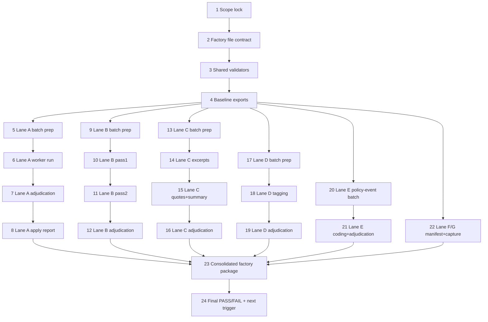

# AI-OPS-25 Sprint Prompt Pack

## Scale Metadata
- `scale_mode`: `LONG_10X`
- `baseline_reference`: `docs/etl/sprints/AI-OPS-24/sprint-ai-agents.md`
- `baseline_points`: `156`
- `target_points`: `1560`
- `planned_points`: `312`
- `target_task_count`: `40`
- `planned_task_count`: `24`
- `horizon_weeks`: `8`
- `scale_shortfall`: `Backlog is bottlenecked by a finite manual queue and blocked-source levers; this pack maximizes executable factory throughput now and leaves explicit unlocks for 10x expansion.`

## Baseline Snapshot (2026-02-19)

Current measurable manual workload in `etl/data/staging/politicos-es.db`:
- `topic_evidence_reviews`: `pending=6` (all `source_id=programas_partidos`, `review_reason=no_signal`).
- `parl_vote_member_votes`: `34,780` rows missing `person_id` (`319` distinct names to resolve: Congreso `263`, Senado `56`).
- `text_documents` for `parl_initiative_docs`: `316` rows total, `289` with missing `text_excerpt`.
- `document_fetches` for `parl_initiative_docs`: `903` URLs with `HTTP 403`, `18` with `404`.
- `policy_events`: `548` rows; `policy_event_axis_scores`: `0` rows (full manual coding backlog).

## Sprint Objective

Build a self-contained manual-labour factory route map so external workers can deliver import-ready artifacts without further interaction.

The factory must produce, in strict schemas:
1. stance adjudication decisions,
2. vote-member name resolution proposals,
3. initiative document excerpts + quotes + short summaries,
4. concern tags for initiatives/docs,
5. policy event axis-score proposals,
6. party program manifest expansions,
7. blocked-source manual capture evidence packs.

## Non-Negotiables

- Keep traceability keys in every artifact (`source_id`, stable unit ids, source URL/path).
- No schema/policy changes in factory output; only proposal datasets.
- Manual outputs are append-only per batch; never overwrite raw worker exports.
- Use deterministic file naming under sprint artifacts.
- `unknown/no_signal/ambiguous` are valid outputs; do not force a guess.

## Global Output Contracts

Factory root for this sprint:
- `docs/etl/sprints/AI-OPS-25/exports/factory/`

Required per-batch files:
- `manifest.json`: batch metadata, source query hash, row counts, timestamps.
- `workers_raw.csv`: untouched worker output.
- `decisions_adjudicated.csv`: final internal adjudication.
- `qa_report.md`: validation checks + failure counts + decision rationale summary.

### CSV Schemas (exact headers)

1) Lane A stance review (`topic_evidence_reviews`):
- `tasks_input.csv`
  - `batch_id,evidence_id,person_name,topic_label,evidence_excerpt,evidence_date,source_url,review_reason`
- `workers_raw.csv`
  - `batch_id,evidence_id,worker_id,worker_stance,worker_confidence,worker_note`
- `decisions_adjudicated.csv`
  - `batch_id,evidence_id,proposed_status,proposed_final_stance,agreement_ratio,adjudicator_note`

2) Lane B name resolution (`parl_vote_member_votes` unresolved):
- `tasks_input.csv`
  - `batch_id,source_id,member_name_normalized,member_name_example,group_code_example,legislature_example,candidate_person_ids_json,candidate_names_json,candidate_party_json,task_note`
- `workers_raw.csv`
  - `batch_id,source_id,member_name_normalized,worker_id,selected_person_id,decision,worker_confidence,worker_note`
- `decisions_adjudicated.csv`
  - `batch_id,source_id,member_name_normalized,final_decision,final_person_id,agreement_ratio,adjudicator_note`
- `final_decision` enum:
  - `match|ambiguous|no_match`

3) Lane C document excerpt/quote extraction (`parl_initiative_docs`):
- `tasks_input.csv`
  - `batch_id,doc_url,initiative_id,doc_kind,content_type,source_record_pk,raw_path`
- `workers_raw.csv`
  - `batch_id,doc_url,worker_id,excerpt_text,excerpt_chars,quote_1,quote_2,summary_1to3_sentences,worker_note`
- `decisions_adjudicated.csv`
  - `batch_id,doc_url,final_excerpt_text,final_excerpt_chars,final_quote_1,final_quote_2,final_summary_1to3_sentences,adjudicator_note`

4) Lane D concern tagging (`concerns_v1` taxonomy):
- `tasks_input.csv`
  - `batch_id,unit_type,unit_id,title,excerpt,source_url,allowed_concerns_json`
- `workers_raw.csv`
  - `batch_id,unit_type,unit_id,worker_id,concern_ids_csv,primary_concern_id,confidence,worker_note`
- `decisions_adjudicated.csv`
  - `batch_id,unit_type,unit_id,final_concern_ids_csv,primary_concern_id,agreement_ratio,adjudicator_note`

5) Lane E policy axis coding (`policy_events` -> codebook axes):
- `tasks_input.csv`
  - `batch_id,policy_event_id,event_date,title,summary,source_id,source_url,domain_hint,candidate_axes_json`
- `workers_raw.csv`
  - `batch_id,policy_event_id,worker_id,policy_axis_key,direction,intensity,confidence,worker_note`
- `decisions_adjudicated.csv`
  - `batch_id,policy_event_id,policy_axis_key,final_direction,final_intensity,final_confidence,agreement_ratio,adjudicator_note`
- `direction` enum:
  - `-1|0|1`

6) Lane F programas manifest expansion:
- `manifest_rows.csv`
  - `party_id,party_name,election_cycle,kind,source_url,format_hint,language,scope,snapshot_date,local_path,notes`

7) Lane G blocked-source manual capture evidence:
- `capture_index.csv`
  - `batch_id,source_id,target_url,captured_at_utc,http_observed,title_observed,artifact_html,artifact_png,artifact_meta_json,artifact_cookies_json,artifact_storage_json,operator_note`

## Must-Pass Gates

- `G1`: Every lane produces all required files with exact headers.
- `G2`: All `decisions_adjudicated.csv` files have unique unit ids and `agreement_ratio` in `[0,1]`.
- `G3`: No raw export file edited in place after initial write.
- `G4`: Every output row can be traced to a source unit id and source URL/path.
- `G5`: Factory index report summarizes row counts and rejection reasons per lane.

## Lane Packing Plan

- `HI` setup wave: Tasks `1-4`
- `FAST` throughput wave: Tasks `5-22`
- `HI` closeout wave: Tasks `23-24`
- Lane switches: `2` (`HI -> FAST -> HI`)

## Dependency Graph



## Prompt Pack

1. Agent: L3 Orchestrator
- `depends_on`: `[]`
- `parallel_group`: `P1`
- `model_lane`: `HI`
- `points`: `8`
```text
Repository path/context:
- /Users/jesus/Library/CloudStorage/GoogleDrive-gsus123456@gmail.com/My Drive/CdC/Obsidian Vault/vota-con-la-chola

Objective:
- Freeze scope, gates, and “done” criteria for the manual labour factory run.

Concrete tasks:
- Confirm all lanes A..G and freeze enums/headers.
- Lock acceptance gates G1..G5 for this sprint.
- Define immutable batch naming: factory-YYYYMMDD-<lane>-<seq>.

Output contract:
- docs/etl/sprints/AI-OPS-25/reports/scope-lock.md

Acceptance checks:
- test -f docs/etl/sprints/AI-OPS-25/reports/scope-lock.md
- rg -n "Lane A|Lane B|Lane C|Lane D|Lane E|Lane F|Lane G|G1|G2|G3|G4|G5" docs/etl/sprints/AI-OPS-25/reports/scope-lock.md

Artifact path:
- docs/etl/sprints/AI-OPS-25/reports/scope-lock.md
```

2. Agent: L2 Specialist Builder
- `depends_on`: `[1]`
- `parallel_group`: `P1`
- `model_lane`: `HI`
- `points`: `13`
```text
Repository path/context:
- /Users/jesus/Library/CloudStorage/GoogleDrive-gsus123456@gmail.com/My Drive/CdC/Obsidian Vault/vota-con-la-chola

Objective:
- Materialize the common factory contract as reusable templates.

Concrete tasks:
- Create per-lane CSV header templates in markdown.
- Define allowed enum values and nullability rules.
- Define standard manifest.json keys and required metadata.

Output contract:
- docs/etl/sprints/AI-OPS-25/reports/factory-contract.md

Acceptance checks:
- test -f docs/etl/sprints/AI-OPS-25/reports/factory-contract.md
- rg -n "manifest.json|tasks_input.csv|workers_raw.csv|decisions_adjudicated.csv|enum" docs/etl/sprints/AI-OPS-25/reports/factory-contract.md

Artifact path:
- docs/etl/sprints/AI-OPS-25/reports/factory-contract.md
```

3. Agent: L2 Specialist Builder
- `depends_on`: `[2]`
- `parallel_group`: `P1`
- `model_lane`: `HI`
- `points`: `8`
```text
Repository path/context:
- /Users/jesus/Library/CloudStorage/GoogleDrive-gsus123456@gmail.com/My Drive/CdC/Obsidian Vault/vota-con-la-chola

Objective:
- Build one deterministic validation checklist that all lanes must pass.

Concrete tasks:
- Define checks for header exactness, duplicate IDs, enum validity, and agreement ratio bounds.
- Provide CLI commands (sqlite3, rg, wc) for factory operators.
- Include failure handling (reject batch vs accept with warnings).

Output contract:
- docs/etl/sprints/AI-OPS-25/reports/factory-validation-checklist.md

Acceptance checks:
- test -f docs/etl/sprints/AI-OPS-25/reports/factory-validation-checklist.md
- rg -n "header|duplicate|agreement_ratio|reject|warning" docs/etl/sprints/AI-OPS-25/reports/factory-validation-checklist.md

Artifact path:
- docs/etl/sprints/AI-OPS-25/reports/factory-validation-checklist.md
```

4. Agent: L2 Specialist Builder
- `depends_on`: `[1,2,3]`
- `parallel_group`: `P1`
- `model_lane`: `HI`
- `points`: `8`
```text
Repository path/context:
- /Users/jesus/Library/CloudStorage/GoogleDrive-gsus123456@gmail.com/My Drive/CdC/Obsidian Vault/vota-con-la-chola

Objective:
- Export baseline lane-sized inputs for all lanes from current DB state.

Concrete tasks:
- Run SQL extracts for lanes A..E and save tasks_input.csv stubs.
- Export baseline counters and include SQL used.
- Initialize factory folder skeleton under sprint exports.

Output contract:
- docs/etl/sprints/AI-OPS-25/exports/factory/baseline/
- docs/etl/sprints/AI-OPS-25/evidence/baseline-sql.md

Acceptance checks:
- test -d docs/etl/sprints/AI-OPS-25/exports/factory/baseline
- test -f docs/etl/sprints/AI-OPS-25/evidence/baseline-sql.md

Artifact path:
- docs/etl/sprints/AI-OPS-25/exports/factory/baseline/
```

5. Agent: L1 Mechanical Executor
- `depends_on`: `[4]`
- `parallel_group`: `P2`
- `model_lane`: `FAST`
- `points`: `8`
```text
Repository path/context:
- /Users/jesus/Library/CloudStorage/GoogleDrive-gsus123456@gmail.com/My Drive/CdC/Obsidian Vault/vota-con-la-chola

Objective:
- Prepare Lane A batch for declared-stance pending queue.

Concrete tasks:
- Extract pending rows from topic_evidence_reviews for source_id=programas_partidos.
- Build tasks_input.csv with exact header contract.
- Write manifest.json with extraction SQL and row count.

Output contract:
- docs/etl/sprints/AI-OPS-25/exports/factory/lane_a/<batch_id>/tasks_input.csv
- docs/etl/sprints/AI-OPS-25/exports/factory/lane_a/<batch_id>/manifest.json

Acceptance checks:
- wc -l docs/etl/sprints/AI-OPS-25/exports/factory/lane_a/<batch_id>/tasks_input.csv
- rg -n "batch_id,evidence_id,person_name,topic_label" docs/etl/sprints/AI-OPS-25/exports/factory/lane_a/<batch_id>/tasks_input.csv

Artifact path:
- docs/etl/sprints/AI-OPS-25/exports/factory/lane_a/<batch_id>/
```

6. Agent: L1 Mechanical Executor
- `depends_on`: `[5]`
- `parallel_group`: `P2`
- `model_lane`: `FAST`
- `points`: `13`
```text
Repository path/context:
- /Users/jesus/Library/CloudStorage/GoogleDrive-gsus123456@gmail.com/My Drive/CdC/Obsidian Vault/vota-con-la-chola

Objective:
- Run Lane A worker collection and produce raw worker labels.

Concrete tasks:
- Collect 3 independent labels per evidence_id.
- Enforce worker_note non-empty and stance enum validity.
- Save immutable workers_raw.csv.

Output contract:
- docs/etl/sprints/AI-OPS-25/exports/factory/lane_a/<batch_id>/workers_raw.csv

Acceptance checks:
- wc -l docs/etl/sprints/AI-OPS-25/exports/factory/lane_a/<batch_id>/workers_raw.csv
- rg -n "batch_id,evidence_id,worker_id,worker_stance,worker_confidence,worker_note" docs/etl/sprints/AI-OPS-25/exports/factory/lane_a/<batch_id>/workers_raw.csv

Artifact path:
- docs/etl/sprints/AI-OPS-25/exports/factory/lane_a/<batch_id>/workers_raw.csv
```

7. Agent: L1 Mechanical Executor
- `depends_on`: `[6]`
- `parallel_group`: `P2`
- `model_lane`: `FAST`
- `points`: `8`
```text
Repository path/context:
- /Users/jesus/Library/CloudStorage/GoogleDrive-gsus123456@gmail.com/My Drive/CdC/Obsidian Vault/vota-con-la-chola

Objective:
- Adjudicate Lane A into import-ready decisions.

Concrete tasks:
- Apply 2/3 majority rule.
- Mark consensus no_signal as proposed_status=ignored.
- Produce decisions_adjudicated.csv and qa_report.md.

Output contract:
- docs/etl/sprints/AI-OPS-25/exports/factory/lane_a/<batch_id>/decisions_adjudicated.csv
- docs/etl/sprints/AI-OPS-25/exports/factory/lane_a/<batch_id>/qa_report.md

Acceptance checks:
- rg -n "batch_id,evidence_id,proposed_status,proposed_final_stance,agreement_ratio,adjudicator_note" docs/etl/sprints/AI-OPS-25/exports/factory/lane_a/<batch_id>/decisions_adjudicated.csv
- rg -n "agreement|rejected|warnings" docs/etl/sprints/AI-OPS-25/exports/factory/lane_a/<batch_id>/qa_report.md

Artifact path:
- docs/etl/sprints/AI-OPS-25/exports/factory/lane_a/<batch_id>/
```

8. Agent: L1 Mechanical Executor
- `depends_on`: `[7]`
- `parallel_group`: `P2`
- `model_lane`: `FAST`
- `points`: `8`
```text
Repository path/context:
- /Users/jesus/Library/CloudStorage/GoogleDrive-gsus123456@gmail.com/My Drive/CdC/Obsidian Vault/vota-con-la-chola

Objective:
- Apply Lane A decisions to DB and emit before/after evidence.

Concrete tasks:
- Group evidence IDs by final status/final stance.
- Run scripts/ingestar_parlamentario_es.py review-decision with mturk-style note and recompute where applicable.
- Export before/after status counts.

Output contract:
- docs/etl/sprints/AI-OPS-25/evidence/lane_a_apply.log
- docs/etl/sprints/AI-OPS-25/exports/factory/lane_a/post_apply_counts.csv

Acceptance checks:
- test -f docs/etl/sprints/AI-OPS-25/evidence/lane_a_apply.log
- test -f docs/etl/sprints/AI-OPS-25/exports/factory/lane_a/post_apply_counts.csv

Artifact path:
- docs/etl/sprints/AI-OPS-25/evidence/lane_a_apply.log
```

9. Agent: L1 Mechanical Executor
- `depends_on`: `[4]`
- `parallel_group`: `P2`
- `model_lane`: `FAST`
- `points`: `8`
```text
Repository path/context:
- /Users/jesus/Library/CloudStorage/GoogleDrive-gsus123456@gmail.com/My Drive/CdC/Obsidian Vault/vota-con-la-chola

Objective:
- Prepare Lane B unresolved-name resolution tasks.

Concrete tasks:
- Extract unresolved member names grouped by source_id and normalized name.
- Attach candidate persons (ids/names/party) as JSON arrays.
- Emit tasks_input.csv and manifest.json.

Output contract:
- docs/etl/sprints/AI-OPS-25/exports/factory/lane_b/<batch_id>/tasks_input.csv
- docs/etl/sprints/AI-OPS-25/exports/factory/lane_b/<batch_id>/manifest.json

Acceptance checks:
- rg -n "batch_id,source_id,member_name_normalized" docs/etl/sprints/AI-OPS-25/exports/factory/lane_b/<batch_id>/tasks_input.csv
- wc -l docs/etl/sprints/AI-OPS-25/exports/factory/lane_b/<batch_id>/tasks_input.csv

Artifact path:
- docs/etl/sprints/AI-OPS-25/exports/factory/lane_b/<batch_id>/
```

10. Agent: L1 Mechanical Executor
- `depends_on`: `[9]`
- `parallel_group`: `P2`
- `model_lane`: `FAST`
- `points`: `13`
```text
Repository path/context:
- /Users/jesus/Library/CloudStorage/GoogleDrive-gsus123456@gmail.com/My Drive/CdC/Obsidian Vault/vota-con-la-chola

Objective:
- Execute Lane B first-pass mapping labels.

Concrete tasks:
- For each name key, select match/ambiguous/no_match.
- If match, provide selected_person_id from candidate list only.
- Save immutable workers_raw.csv (pass1).

Output contract:
- docs/etl/sprints/AI-OPS-25/exports/factory/lane_b/<batch_id>/workers_raw_pass1.csv

Acceptance checks:
- rg -n "batch_id,source_id,member_name_normalized,worker_id,selected_person_id,decision" docs/etl/sprints/AI-OPS-25/exports/factory/lane_b/<batch_id>/workers_raw_pass1.csv

Artifact path:
- docs/etl/sprints/AI-OPS-25/exports/factory/lane_b/<batch_id>/workers_raw_pass1.csv
```

11. Agent: L1 Mechanical Executor
- `depends_on`: `[9]`
- `parallel_group`: `P3`
- `model_lane`: `FAST`
- `points`: `13`
```text
Repository path/context:
- /Users/jesus/Library/CloudStorage/GoogleDrive-gsus123456@gmail.com/My Drive/CdC/Obsidian Vault/vota-con-la-chola

Objective:
- Execute Lane B independent second-pass mapping labels.

Concrete tasks:
- Repeat pass on the same tasks without seeing pass1 outputs.
- Save immutable workers_raw_pass2.csv.

Output contract:
- docs/etl/sprints/AI-OPS-25/exports/factory/lane_b/<batch_id>/workers_raw_pass2.csv

Acceptance checks:
- rg -n "batch_id,source_id,member_name_normalized,worker_id,selected_person_id,decision" docs/etl/sprints/AI-OPS-25/exports/factory/lane_b/<batch_id>/workers_raw_pass2.csv

Artifact path:
- docs/etl/sprints/AI-OPS-25/exports/factory/lane_b/<batch_id>/workers_raw_pass2.csv
```

12. Agent: L1 Mechanical Executor
- `depends_on`: `[10,11]`
- `parallel_group`: `P2`
- `model_lane`: `FAST`
- `points`: `8`
```text
Repository path/context:
- /Users/jesus/Library/CloudStorage/GoogleDrive-gsus123456@gmail.com/My Drive/CdC/Obsidian Vault/vota-con-la-chola

Objective:
- Adjudicate Lane B pass1/pass2 to final mapping proposals.

Concrete tasks:
- Mark final_decision as match/ambiguous/no_match.
- Include final_person_id only when final_decision=match.
- Emit decisions_adjudicated.csv + qa_report.md.

Output contract:
- docs/etl/sprints/AI-OPS-25/exports/factory/lane_b/<batch_id>/decisions_adjudicated.csv
- docs/etl/sprints/AI-OPS-25/exports/factory/lane_b/<batch_id>/qa_report.md

Acceptance checks:
- rg -n "final_decision,final_person_id,agreement_ratio" docs/etl/sprints/AI-OPS-25/exports/factory/lane_b/<batch_id>/decisions_adjudicated.csv

Artifact path:
- docs/etl/sprints/AI-OPS-25/exports/factory/lane_b/<batch_id>/
```

13. Agent: L1 Mechanical Executor
- `depends_on`: `[4]`
- `parallel_group`: `P2`
- `model_lane`: `FAST`
- `points`: `8`
```text
Repository path/context:
- /Users/jesus/Library/CloudStorage/GoogleDrive-gsus123456@gmail.com/My Drive/CdC/Obsidian Vault/vota-con-la-chola

Objective:
- Prepare Lane C missing excerpt extraction tasks.

Concrete tasks:
- Export docs from text_documents where source_id=parl_initiative_docs and text_excerpt empty.
- Include doc_url, initiative_id, doc_kind, content_type, source_record_pk, raw_path.
- Emit tasks_input.csv + manifest.json.

Output contract:
- docs/etl/sprints/AI-OPS-25/exports/factory/lane_c/<batch_id>/tasks_input.csv
- docs/etl/sprints/AI-OPS-25/exports/factory/lane_c/<batch_id>/manifest.json

Acceptance checks:
- wc -l docs/etl/sprints/AI-OPS-25/exports/factory/lane_c/<batch_id>/tasks_input.csv
- rg -n "batch_id,doc_url,initiative_id,doc_kind" docs/etl/sprints/AI-OPS-25/exports/factory/lane_c/<batch_id>/tasks_input.csv

Artifact path:
- docs/etl/sprints/AI-OPS-25/exports/factory/lane_c/<batch_id>/
```

14. Agent: L1 Mechanical Executor
- `depends_on`: `[13]`
- `parallel_group`: `P2`
- `model_lane`: `FAST`
- `points`: `13`
```text
Repository path/context:
- /Users/jesus/Library/CloudStorage/GoogleDrive-gsus123456@gmail.com/My Drive/CdC/Obsidian Vault/vota-con-la-chola

Objective:
- Produce Lane C excerpt extraction output.

Concrete tasks:
- Read each document from source_url or raw_path.
- Extract one clean excerpt (<=4000 chars) representing the voted content.
- Fill excerpt_chars and worker_note.

Output contract:
- docs/etl/sprints/AI-OPS-25/exports/factory/lane_c/<batch_id>/workers_raw_excerpts.csv

Acceptance checks:
- rg -n "batch_id,doc_url,worker_id,excerpt_text,excerpt_chars" docs/etl/sprints/AI-OPS-25/exports/factory/lane_c/<batch_id>/workers_raw_excerpts.csv
- rg -n "^.*,.*,.*,.*,0," docs/etl/sprints/AI-OPS-25/exports/factory/lane_c/<batch_id>/workers_raw_excerpts.csv

Artifact path:
- docs/etl/sprints/AI-OPS-25/exports/factory/lane_c/<batch_id>/workers_raw_excerpts.csv
```

15. Agent: L1 Mechanical Executor
- `depends_on`: `[13]`
- `parallel_group`: `P3`
- `model_lane`: `FAST`
- `points`: `13`
```text
Repository path/context:
- /Users/jesus/Library/CloudStorage/GoogleDrive-gsus123456@gmail.com/My Drive/CdC/Obsidian Vault/vota-con-la-chola

Objective:
- Produce Lane C quote + short summary output.

Concrete tasks:
- For each doc_url, extract two short verbatim quotes (non-overlapping when possible).
- Write neutral summary in 1-3 sentences.
- Save workers_raw_quotes.csv.

Output contract:
- docs/etl/sprints/AI-OPS-25/exports/factory/lane_c/<batch_id>/workers_raw_quotes.csv

Acceptance checks:
- rg -n "batch_id,doc_url,worker_id,quote_1,quote_2,summary_1to3_sentences" docs/etl/sprints/AI-OPS-25/exports/factory/lane_c/<batch_id>/workers_raw_quotes.csv

Artifact path:
- docs/etl/sprints/AI-OPS-25/exports/factory/lane_c/<batch_id>/workers_raw_quotes.csv
```

16. Agent: L1 Mechanical Executor
- `depends_on`: `[14,15]`
- `parallel_group`: `P2`
- `model_lane`: `FAST`
- `points`: `8`
```text
Repository path/context:
- /Users/jesus/Library/CloudStorage/GoogleDrive-gsus123456@gmail.com/My Drive/CdC/Obsidian Vault/vota-con-la-chola

Objective:
- Adjudicate Lane C into final excerpt/quote/summary records.

Concrete tasks:
- Resolve conflicts and remove malformed/unreadable text.
- Produce decisions_adjudicated.csv with final excerpt and quotes.
- Emit qa_report.md with rejection reasons.

Output contract:
- docs/etl/sprints/AI-OPS-25/exports/factory/lane_c/<batch_id>/decisions_adjudicated.csv
- docs/etl/sprints/AI-OPS-25/exports/factory/lane_c/<batch_id>/qa_report.md

Acceptance checks:
- rg -n "final_excerpt_text,final_quote_1,final_quote_2,final_summary_1to3_sentences" docs/etl/sprints/AI-OPS-25/exports/factory/lane_c/<batch_id>/decisions_adjudicated.csv

Artifact path:
- docs/etl/sprints/AI-OPS-25/exports/factory/lane_c/<batch_id>/
```

17. Agent: L1 Mechanical Executor
- `depends_on`: `[4]`
- `parallel_group`: `P2`
- `model_lane`: `FAST`
- `points`: `8`
```text
Repository path/context:
- /Users/jesus/Library/CloudStorage/GoogleDrive-gsus123456@gmail.com/My Drive/CdC/Obsidian Vault/vota-con-la-chola

Objective:
- Prepare Lane D concern-tagging tasks.

Concrete tasks:
- Export unit candidates (initiative/doc level) with title+excerpt+source_url.
- Attach allowed_concerns_json from ui/citizen/concerns_v1.json.
- Emit tasks_input.csv + manifest.json.

Output contract:
- docs/etl/sprints/AI-OPS-25/exports/factory/lane_d/<batch_id>/tasks_input.csv
- docs/etl/sprints/AI-OPS-25/exports/factory/lane_d/<batch_id>/manifest.json

Acceptance checks:
- rg -n "batch_id,unit_type,unit_id,title,excerpt,source_url,allowed_concerns_json" docs/etl/sprints/AI-OPS-25/exports/factory/lane_d/<batch_id>/tasks_input.csv

Artifact path:
- docs/etl/sprints/AI-OPS-25/exports/factory/lane_d/<batch_id>/
```

18. Agent: L1 Mechanical Executor
- `depends_on`: `[17]`
- `parallel_group`: `P2`
- `model_lane`: `FAST`
- `points`: `13`
```text
Repository path/context:
- /Users/jesus/Library/CloudStorage/GoogleDrive-gsus123456@gmail.com/My Drive/CdC/Obsidian Vault/vota-con-la-chola

Objective:
- Execute Lane D worker tagging and produce raw outputs.

Concrete tasks:
- Choose concern_ids_csv (1-3 tags) and one primary_concern_id.
- Use confidence enum high|medium|low.
- Save workers_raw.csv.

Output contract:
- docs/etl/sprints/AI-OPS-25/exports/factory/lane_d/<batch_id>/workers_raw.csv

Acceptance checks:
- rg -n "batch_id,unit_type,unit_id,worker_id,concern_ids_csv,primary_concern_id,confidence,worker_note" docs/etl/sprints/AI-OPS-25/exports/factory/lane_d/<batch_id>/workers_raw.csv

Artifact path:
- docs/etl/sprints/AI-OPS-25/exports/factory/lane_d/<batch_id>/workers_raw.csv
```

19. Agent: L1 Mechanical Executor
- `depends_on`: `[18]`
- `parallel_group`: `P2`
- `model_lane`: `FAST`
- `points`: `8`
```text
Repository path/context:
- /Users/jesus/Library/CloudStorage/GoogleDrive-gsus123456@gmail.com/My Drive/CdC/Obsidian Vault/vota-con-la-chola

Objective:
- Adjudicate Lane D concern tags.

Concrete tasks:
- Resolve disagreements and output final tag sets.
- Emit decisions_adjudicated.csv with agreement_ratio and note.
- Emit qa_report.md.

Output contract:
- docs/etl/sprints/AI-OPS-25/exports/factory/lane_d/<batch_id>/decisions_adjudicated.csv
- docs/etl/sprints/AI-OPS-25/exports/factory/lane_d/<batch_id>/qa_report.md

Acceptance checks:
- rg -n "final_concern_ids_csv,primary_concern_id,agreement_ratio" docs/etl/sprints/AI-OPS-25/exports/factory/lane_d/<batch_id>/decisions_adjudicated.csv

Artifact path:
- docs/etl/sprints/AI-OPS-25/exports/factory/lane_d/<batch_id>/
```

20. Agent: L1 Mechanical Executor
- `depends_on`: `[4]`
- `parallel_group`: `P2`
- `model_lane`: `FAST`
- `points`: `8`
```text
Repository path/context:
- /Users/jesus/Library/CloudStorage/GoogleDrive-gsus123456@gmail.com/My Drive/CdC/Obsidian Vault/vota-con-la-chola

Objective:
- Prepare Lane E policy-event annotation tasks from existing policy_events.

Concrete tasks:
- Export policy_event_id, title, summary, source_url, domain_hint, candidate_axes_json.
- Keep batch sizes manageable (<=150 events per batch).
- Emit tasks_input.csv + manifest.json.

Output contract:
- docs/etl/sprints/AI-OPS-25/exports/factory/lane_e/<batch_id>/tasks_input.csv
- docs/etl/sprints/AI-OPS-25/exports/factory/lane_e/<batch_id>/manifest.json

Acceptance checks:
- rg -n "batch_id,policy_event_id,event_date,title,summary,source_id,source_url,domain_hint,candidate_axes_json" docs/etl/sprints/AI-OPS-25/exports/factory/lane_e/<batch_id>/tasks_input.csv

Artifact path:
- docs/etl/sprints/AI-OPS-25/exports/factory/lane_e/<batch_id>/
```

21. Agent: L1 Mechanical Executor
- `depends_on`: `[20]`
- `parallel_group`: `P2`
- `model_lane`: `FAST`
- `points`: `13`
```text
Repository path/context:
- /Users/jesus/Library/CloudStorage/GoogleDrive-gsus123456@gmail.com/My Drive/CdC/Obsidian Vault/vota-con-la-chola

Objective:
- Execute Lane E double-entry axis coding and adjudication.

Concrete tasks:
- Pass1 and pass2 coding on each policy_event_id/axis.
- Produce workers_raw_pass1.csv and workers_raw_pass2.csv.
- Adjudicate to decisions_adjudicated.csv with final_direction/final_intensity/final_confidence.

Output contract:
- docs/etl/sprints/AI-OPS-25/exports/factory/lane_e/<batch_id>/workers_raw_pass1.csv
- docs/etl/sprints/AI-OPS-25/exports/factory/lane_e/<batch_id>/workers_raw_pass2.csv
- docs/etl/sprints/AI-OPS-25/exports/factory/lane_e/<batch_id>/decisions_adjudicated.csv

Acceptance checks:
- rg -n "policy_axis_key,direction,intensity,confidence" docs/etl/sprints/AI-OPS-25/exports/factory/lane_e/<batch_id>/workers_raw_pass1.csv
- rg -n "final_direction,final_intensity,final_confidence,agreement_ratio" docs/etl/sprints/AI-OPS-25/exports/factory/lane_e/<batch_id>/decisions_adjudicated.csv

Artifact path:
- docs/etl/sprints/AI-OPS-25/exports/factory/lane_e/<batch_id>/
```

22. Agent: L1 Mechanical Executor
- `depends_on`: `[4]`
- `parallel_group`: `P2`
- `model_lane`: `FAST`
- `points`: `13`
```text
Repository path/context:
- /Users/jesus/Library/CloudStorage/GoogleDrive-gsus123456@gmail.com/My Drive/CdC/Obsidian Vault/vota-con-la-chola

Objective:
- Produce Lane F/G manual-collection artifacts (program manifest expansion + blocked-source capture evidence).

Concrete tasks:
- Lane F: compile manifest_rows.csv for programas_partidos using contract fields.
- Lane G: perform headful capture attempts for senado_iniciativas, parlamento_galicia_deputados, parlamento_navarra_parlamentarios_forales and log evidence.
- Build capture_index.csv with artifact paths.

Output contract:
- docs/etl/sprints/AI-OPS-25/exports/factory/lane_f/manifest_rows.csv
- docs/etl/sprints/AI-OPS-25/exports/factory/lane_g/capture_index.csv
- docs/etl/sprints/AI-OPS-25/evidence/lane_g_capture_notes.md

Acceptance checks:
- rg -n "party_id,party_name,election_cycle,kind,source_url,format_hint,language,scope,snapshot_date,local_path,notes" docs/etl/sprints/AI-OPS-25/exports/factory/lane_f/manifest_rows.csv
- rg -n "batch_id,source_id,target_url,captured_at_utc,http_observed" docs/etl/sprints/AI-OPS-25/exports/factory/lane_g/capture_index.csv

Artifact path:
- docs/etl/sprints/AI-OPS-25/exports/factory/lane_f/
- docs/etl/sprints/AI-OPS-25/exports/factory/lane_g/
```

23. Agent: L3 Orchestrator
- `depends_on`: `[8,12,16,19,21,22]`
- `parallel_group`: `P4`
- `model_lane`: `HI`
- `points`: `13`
```text
Repository path/context:
- /Users/jesus/Library/CloudStorage/GoogleDrive-gsus123456@gmail.com/My Drive/CdC/Obsidian Vault/vota-con-la-chola

Objective:
- Consolidate all lane outputs into one import-ready package with explicit readiness status.

Concrete tasks:
- Aggregate row counts, rejects, acceptance results per lane.
- Mark each lane as ready_for_apply or needs_rework with reasons.
- Publish consolidated_factory_index.md.

Output contract:
- docs/etl/sprints/AI-OPS-25/reports/consolidated_factory_index.md

Acceptance checks:
- test -f docs/etl/sprints/AI-OPS-25/reports/consolidated_factory_index.md
- rg -n "lane_a|lane_b|lane_c|lane_d|lane_e|lane_f|lane_g|ready_for_apply|needs_rework" docs/etl/sprints/AI-OPS-25/reports/consolidated_factory_index.md

Artifact path:
- docs/etl/sprints/AI-OPS-25/reports/consolidated_factory_index.md
```

24. Agent: L3 Orchestrator
- `depends_on`: `[23]`
- `parallel_group`: `P4`
- `model_lane`: `HI`
- `points`: `13`
```text
Repository path/context:
- /Users/jesus/Library/CloudStorage/GoogleDrive-gsus123456@gmail.com/My Drive/CdC/Obsidian Vault/vota-con-la-chola

Objective:
- Execute final gate check and publish closeout decision.

Concrete tasks:
- Evaluate G1..G5 with explicit PASS/FAIL.
- List what can be applied immediately vs what needs another factory cycle.
- Define next sprint trigger criteria and unlock levers.

Output contract:
- docs/etl/sprints/AI-OPS-25/closeout.md

Acceptance checks:
- test -f docs/etl/sprints/AI-OPS-25/closeout.md
- rg -n "G1|G2|G3|G4|G5|PASS|FAIL|next sprint trigger" docs/etl/sprints/AI-OPS-25/closeout.md

Artifact path:
- docs/etl/sprints/AI-OPS-25/closeout.md
```
