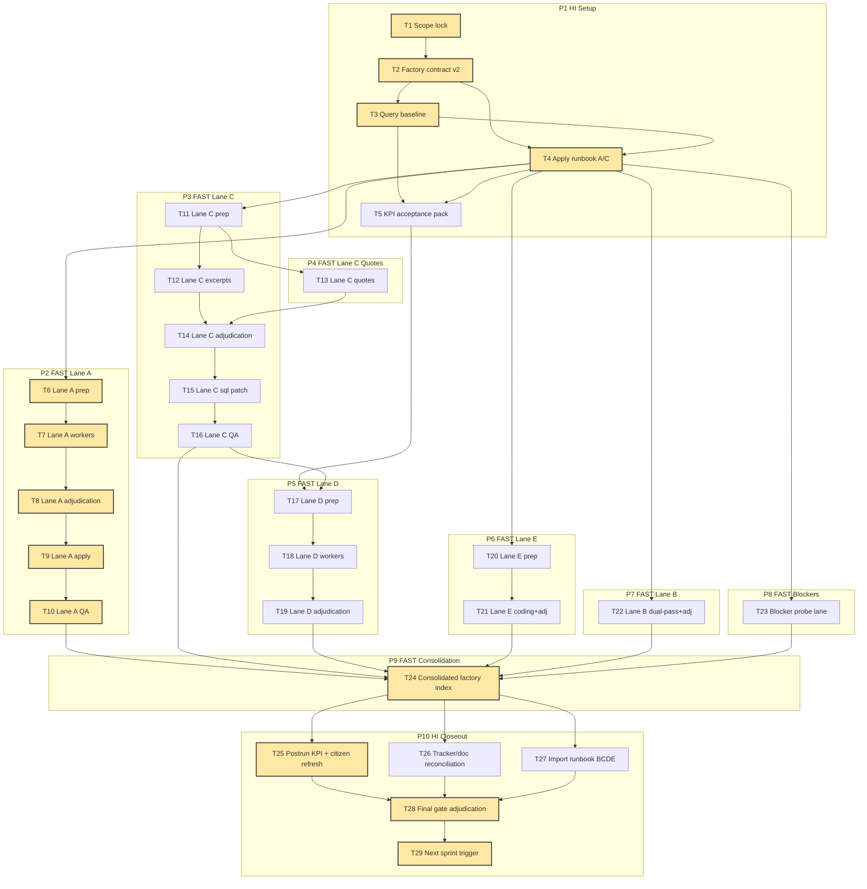

# AI-OPS-26 Sprint Prompt Pack

## Scale Metadata
- `scale_mode`: `LONG_10X`
- `baseline_reference`: `docs/etl/sprints/AI-OPS-25/sprint-ai-agents.md`
- `baseline_points`: `312`
- `target_points`: `3120`
- `planned_points`: `288`
- `target_task_count`: `240`
- `planned_task_count`: `29`
- `horizon_weeks`: `8`
- `scale_shortfall`: `The current queue is finite and partly blocker-limited. This sprint maximizes executable, controllable throughput now (factory execution + applied delta) while keeping a bounded blocker lane and explicit unlocks for larger expansion.`

## Baseline Snapshot (2026-02-19)

Live metrics from `etl/data/staging/politicos-es.db` and tracker status:
- `topic_evidence_reviews`: `pending=6` (`total=537`).
- `parl_vote_member_votes` unresolved: `34,780` rows (`321` distinct unresolved names).
- `text_documents` for `parl_initiative_docs`: `555` rows total, `456` missing `text_excerpt`.
- `policy_events`: `548`; `policy_event_axis_scores`: `0`.
- Tracker status counts: `DONE=34`, `PARTIAL=6`, `TODO=8`; parity check `mismatches=0`.
- Active blocked/partial sources requiring bounded retry evidence: `aemet_opendata_series`, `bde_series_api`, `parlamento_galicia_deputados`, `parlamento_navarra_parlamentarios_forales`, plus remaining Senate initiative-doc WAF pockets.

## Sprint Objective

Execute the first real factory cycle (not just planning) and ship one visible, user-facing delta by applying adjudicated Lane A decisions and refreshing citizen/explorer artifacts, while producing import-ready proposal packets for Lanes B/C/D/E and bounded blocker evidence.

## Bottleneck Class

- Primary: `signal bottleneck` (manual adjudication backlog) and `pipeline bottleneck` (factory outputs not yet executed).
- Secondary: `source bottleneck` for blocked strict-network sources.

## Workload Balance

- Points split: `L1=186 (64.6%)`, `L2=73 (25.3%)`, `L3=29 (10.1%)`.
- Task split: `L1=19/29 (65.5%)`, `L2=7/29 (24.1%)`, `L3=3/29 (10.3%)`.
- WIP limits: `L3<=1`, `L2<=2`, `L1<=6`.

## Must-Pass Gates

- `G1` Contract gate: all lane artifacts match exact schemas and enum contracts.
- `G2` Lane A execution gate: pending review queue decreases (`pending_before > pending_after`) and applied decisions are traceable.
- `G3` Recompute gate: post-apply `declared` and `combined` refresh executed with evidence.
- `G4` Factory throughput gate: Lanes `B/C/D/E` each emit `tasks_input`, `workers_raw`, `decisions_adjudicated`, `qa_report`.
- `G5` Blocker honesty gate: exactly one strict-network retry per blocked source without new lever; log `no_new_lever` when applicable.
- `G6` Parity gate: tracker-vs-SQL parity remains `mismatches=0`.
- `G7` Citizen artifact gate: refreshed static payload validates and stays within size budget.
- `G8` Visible progress gate: publish one measurable KPI delta under sprint evidence.

## Lane Packing Plan

- `HI` setup wave: `T1-T5`
- `FAST` throughput wave: `T6-T24`
- `HI` closeout wave: `T25-T29`
- lane switches: `2` (`HI -> FAST -> HI`)

## Prompt Pack

1. Agent: L3 Orchestrator
- `depends_on`: `[]`
- `parallel_group`: `P1`
- `model_lane`: `HI`
- `points`: `8`
```text
Repository path/context:
- /Users/jesus/Library/CloudStorage/GoogleDrive-gsus123456@gmail.com/My Drive/CdC/Obsidian Vault/vota-con-la-chola

goal:
- Lock objective, acceptance gates, and anti-loop policy for AI-OPS-26 execution.

inputs:
- docs/roadmap.md
- docs/roadmap-tecnico.md
- docs/etl/e2e-scrape-load-tracker.md
- docs/etl/sprints/AI-OPS-25/sprint-ai-agents.md

concrete tasks:
- Freeze a single objective and map G1..G8 to measurable checks.
- Confirm controllable vs blocker budget (>=70% controllable work).
- Lock batch naming and immutable artifact policy.

output_contract:
- docs/etl/sprints/AI-OPS-26/reports/scope-lock.md

acceptance_query:
- test -f docs/etl/sprints/AI-OPS-26/reports/scope-lock.md
- rg -n "G1|G2|G3|G4|G5|G6|G7|G8|controllable|blocker" docs/etl/sprints/AI-OPS-26/reports/scope-lock.md

escalation_rule:
- Escalate to L3 immediately if scope expands beyond one objective.

depends_on:
- []

parallel_group:
- P1

artifact_path:
- docs/etl/sprints/AI-OPS-26/reports/scope-lock.md
```

2. Agent: L2 Specialist Builder
- `depends_on`: `[1]`
- `parallel_group`: `P1`
- `model_lane`: `HI`
- `points`: `13`
```text
Repository path/context:
- /Users/jesus/Library/CloudStorage/GoogleDrive-gsus123456@gmail.com/My Drive/CdC/Obsidian Vault/vota-con-la-chola

goal:
- Convert AI-OPS-25 factory contract into an execution-grade v2 contract for AI-OPS-26.

inputs:
- docs/etl/sprints/AI-OPS-25/sprint-ai-agents.md
- docs/etl/sprints/AI-OPS-26/reports/scope-lock.md

concrete tasks:
- Freeze exact headers/enums/nullability for lanes A/B/C/D/E.
- Define manifest and QA schema requirements.
- Add rejection policy for malformed rows.

output_contract:
- docs/etl/sprints/AI-OPS-26/reports/factory-contract-v2.md

acceptance_query:
- test -f docs/etl/sprints/AI-OPS-26/reports/factory-contract-v2.md
- rg -n "tasks_input.csv|workers_raw|decisions_adjudicated|qa_report|enum|null" docs/etl/sprints/AI-OPS-26/reports/factory-contract-v2.md

escalation_rule:
- Escalate to L3 if contract changes imply schema/policy changes.

depends_on:
- [1]

parallel_group:
- P1

artifact_path:
- docs/etl/sprints/AI-OPS-26/reports/factory-contract-v2.md
```

3. Agent: L2 Specialist Builder
- `depends_on`: `[2]`
- `parallel_group`: `P1`
- `model_lane`: `HI`
- `points`: `8`
```text
Repository path/context:
- /Users/jesus/Library/CloudStorage/GoogleDrive-gsus123456@gmail.com/My Drive/CdC/Obsidian Vault/vota-con-la-chola

goal:
- Produce baseline SQL/query pack and frozen baseline metrics for all active lanes.

inputs:
- etl/data/staging/politicos-es.db
- docs/etl/sprints/AI-OPS-26/reports/factory-contract-v2.md

concrete tasks:
- Export SQL snippets for lane A/B/C/D/E batch prep.
- Capture baseline counters in JSON and CSV.
- Record reproducible commands.

output_contract:
- docs/etl/sprints/AI-OPS-26/reports/query-pack-baseline.md
- docs/etl/sprints/AI-OPS-26/evidence/baseline-metrics.json

acceptance_query:
- test -f docs/etl/sprints/AI-OPS-26/reports/query-pack-baseline.md
- test -f docs/etl/sprints/AI-OPS-26/evidence/baseline-metrics.json
- rg -n "topic_evidence_reviews|parl_vote_member_votes|text_documents|policy_events" docs/etl/sprints/AI-OPS-26/reports/query-pack-baseline.md

escalation_rule:
- Escalate if required source tables/columns are missing.

depends_on:
- [2]

parallel_group:
- P1

artifact_path:
- docs/etl/sprints/AI-OPS-26/reports/query-pack-baseline.md
```

4. Agent: L2 Specialist Builder
- `depends_on`: `[2,3]`
- `parallel_group`: `P1`
- `model_lane`: `HI`
- `points`: `8`
```text
Repository path/context:
- /Users/jesus/Library/CloudStorage/GoogleDrive-gsus123456@gmail.com/My Drive/CdC/Obsidian Vault/vota-con-la-chola

goal:
- Publish deterministic apply runbook for lanes with immediate apply scope (A mandatory, C optional preview).

inputs:
- docs/etl/sprints/AI-OPS-26/reports/factory-contract-v2.md
- docs/etl/sprints/AI-OPS-26/reports/query-pack-baseline.md

concrete tasks:
- Define apply commands for Lane A decisions and recompute chain.
- Define preview-only patch flow for Lane C.
- Define rollback-free safety checks.

output_contract:
- docs/etl/sprints/AI-OPS-26/reports/apply-runbook-lane-a-c.md

acceptance_query:
- test -f docs/etl/sprints/AI-OPS-26/reports/apply-runbook-lane-a-c.md
- rg -n "lane_a|lane_c|recompute|before/after|safety" docs/etl/sprints/AI-OPS-26/reports/apply-runbook-lane-a-c.md

escalation_rule:
- Escalate if apply path requires destructive DB operations.

depends_on:
- [2,3]

parallel_group:
- P1

artifact_path:
- docs/etl/sprints/AI-OPS-26/reports/apply-runbook-lane-a-c.md
```

5. Agent: L2 Specialist Builder
- `depends_on`: `[3,4]`
- `parallel_group`: `P1`
- `model_lane`: `HI`
- `points`: `5`
```text
Repository path/context:
- /Users/jesus/Library/CloudStorage/GoogleDrive-gsus123456@gmail.com/My Drive/CdC/Obsidian Vault/vota-con-la-chola

goal:
- Define KPI acceptance pack for visible-progress validation.

inputs:
- docs/etl/sprints/AI-OPS-26/reports/query-pack-baseline.md
- docs/gh-pages/citizen/data/citizen_declared.json

concrete tasks:
- Freeze KPI queries for lane A delta, tracker parity, and citizen payload budget.
- Define PASS/FAIL thresholds and evidence file names.

output_contract:
- docs/etl/sprints/AI-OPS-26/reports/kpi-acceptance-pack.md

acceptance_query:
- test -f docs/etl/sprints/AI-OPS-26/reports/kpi-acceptance-pack.md
- rg -n "pending_before|pending_after|mismatches|citizen|size" docs/etl/sprints/AI-OPS-26/reports/kpi-acceptance-pack.md

escalation_rule:
- Escalate if KPI requires non-existent artifacts.

depends_on:
- [3,4]

parallel_group:
- P1

artifact_path:
- docs/etl/sprints/AI-OPS-26/reports/kpi-acceptance-pack.md
```

6. Agent: L1 Mechanical Executor
- `depends_on`: `[4]`
- `parallel_group`: `P2`
- `model_lane`: `FAST`
- `points`: `8`
```text
Repository path/context:
- /Users/jesus/Library/CloudStorage/GoogleDrive-gsus123456@gmail.com/My Drive/CdC/Obsidian Vault/vota-con-la-chola

goal:
- Prepare Lane A batch from pending declared-stance queue.

inputs:
- etl/data/staging/politicos-es.db
- docs/etl/sprints/AI-OPS-26/reports/factory-contract-v2.md

concrete tasks:
- Export pending rows from topic_evidence_reviews to tasks_input.csv.
- Write lane manifest with SQL hash and row count.

output_contract:
- docs/etl/sprints/AI-OPS-26/exports/factory/lane_a/<batch_id>/tasks_input.csv
- docs/etl/sprints/AI-OPS-26/exports/factory/lane_a/<batch_id>/manifest.json

acceptance_query:
- rg -n "batch_id,evidence_id,person_name,topic_label" docs/etl/sprints/AI-OPS-26/exports/factory/lane_a/<batch_id>/tasks_input.csv
- test -f docs/etl/sprints/AI-OPS-26/exports/factory/lane_a/<batch_id>/manifest.json

escalation_rule:
- Escalate if extracted queue is empty unexpectedly.

depends_on:
- [4]

parallel_group:
- P2

artifact_path:
- docs/etl/sprints/AI-OPS-26/exports/factory/lane_a/<batch_id>/
```

7. Agent: L1 Mechanical Executor
- `depends_on`: `[6]`
- `parallel_group`: `P2`
- `model_lane`: `FAST`
- `points`: `13`
```text
Repository path/context:
- /Users/jesus/Library/CloudStorage/GoogleDrive-gsus123456@gmail.com/My Drive/CdC/Obsidian Vault/vota-con-la-chola

goal:
- Collect Lane A raw labels with independent worker votes.

inputs:
- docs/etl/sprints/AI-OPS-26/exports/factory/lane_a/<batch_id>/tasks_input.csv

concrete tasks:
- Collect 3 independent labels per evidence row.
- Enforce valid stance enum and non-empty note.

output_contract:
- docs/etl/sprints/AI-OPS-26/exports/factory/lane_a/<batch_id>/workers_raw.csv

acceptance_query:
- rg -n "batch_id,evidence_id,worker_id,worker_stance,worker_confidence,worker_note" docs/etl/sprints/AI-OPS-26/exports/factory/lane_a/<batch_id>/workers_raw.csv

escalation_rule:
- Escalate if agreement cannot be computed due malformed rows.

depends_on:
- [6]

parallel_group:
- P2

artifact_path:
- docs/etl/sprints/AI-OPS-26/exports/factory/lane_a/<batch_id>/workers_raw.csv
```

8. Agent: L1 Mechanical Executor
- `depends_on`: `[7]`
- `parallel_group`: `P2`
- `model_lane`: `FAST`
- `points`: `8`
```text
Repository path/context:
- /Users/jesus/Library/CloudStorage/GoogleDrive-gsus123456@gmail.com/My Drive/CdC/Obsidian Vault/vota-con-la-chola

goal:
- Adjudicate Lane A into apply-ready decisions.

inputs:
- docs/etl/sprints/AI-OPS-26/exports/factory/lane_a/<batch_id>/workers_raw.csv

concrete tasks:
- Apply majority rule and mark ambiguous rows explicitly.
- Emit decisions and QA report.

output_contract:
- docs/etl/sprints/AI-OPS-26/exports/factory/lane_a/<batch_id>/decisions_adjudicated.csv
- docs/etl/sprints/AI-OPS-26/exports/factory/lane_a/<batch_id>/qa_report.md

acceptance_query:
- rg -n "proposed_status,proposed_final_stance,agreement_ratio" docs/etl/sprints/AI-OPS-26/exports/factory/lane_a/<batch_id>/decisions_adjudicated.csv
- test -f docs/etl/sprints/AI-OPS-26/exports/factory/lane_a/<batch_id>/qa_report.md

escalation_rule:
- Escalate to L2 if agreement_ratio logic conflicts with contract.

depends_on:
- [7]

parallel_group:
- P2

artifact_path:
- docs/etl/sprints/AI-OPS-26/exports/factory/lane_a/<batch_id>/
```

9. Agent: L1 Mechanical Executor
- `depends_on`: `[8]`
- `parallel_group`: `P2`
- `model_lane`: `FAST`
- `points`: `13`
```text
Repository path/context:
- /Users/jesus/Library/CloudStorage/GoogleDrive-gsus123456@gmail.com/My Drive/CdC/Obsidian Vault/vota-con-la-chola

goal:
- Apply Lane A adjudicated decisions and run mandatory recompute chain.

inputs:
- docs/etl/sprints/AI-OPS-26/exports/factory/lane_a/<batch_id>/decisions_adjudicated.csv
- docs/etl/sprints/AI-OPS-26/reports/apply-runbook-lane-a-c.md
- etl/data/staging/politicos-es.db

concrete tasks:
- Apply decisions using review command flow.
- Run declared + combined recompute commands.
- Capture before/after queue and position counters.

output_contract:
- docs/etl/sprints/AI-OPS-26/evidence/lane_a_apply.log
- docs/etl/sprints/AI-OPS-26/evidence/lane_a_recompute.log
- docs/etl/sprints/AI-OPS-26/exports/factory/lane_a/post_apply_metrics.csv

acceptance_query:
- test -f docs/etl/sprints/AI-OPS-26/evidence/lane_a_apply.log
- test -f docs/etl/sprints/AI-OPS-26/evidence/lane_a_recompute.log
- sqlite3 etl/data/staging/politicos-es.db "select count(*) from topic_evidence_reviews where status='pending';"

escalation_rule:
- Escalate if apply fails or queue count does not move.

depends_on:
- [8]

parallel_group:
- P2

artifact_path:
- docs/etl/sprints/AI-OPS-26/evidence/lane_a_apply.log
```

10. Agent: L1 Mechanical Executor
- `depends_on`: `[9]`
- `parallel_group`: `P2`
- `model_lane`: `FAST`
- `points`: `5`
```text
Repository path/context:
- /Users/jesus/Library/CloudStorage/GoogleDrive-gsus123456@gmail.com/My Drive/CdC/Obsidian Vault/vota-con-la-chola

goal:
- Produce Lane A apply QA summary for consolidation.

inputs:
- docs/etl/sprints/AI-OPS-26/evidence/lane_a_apply.log
- docs/etl/sprints/AI-OPS-26/exports/factory/lane_a/post_apply_metrics.csv

concrete tasks:
- Summarize accepted/rejected rows and KPI deltas.
- Record anomalies and rework needs.

output_contract:
- docs/etl/sprints/AI-OPS-26/reports/lane_a_apply.md

acceptance_query:
- test -f docs/etl/sprints/AI-OPS-26/reports/lane_a_apply.md
- rg -n "accepted|rejected|pending_before|pending_after" docs/etl/sprints/AI-OPS-26/reports/lane_a_apply.md

escalation_rule:
- Escalate if summary cannot reconcile with metrics CSV.

depends_on:
- [9]

parallel_group:
- P2

artifact_path:
- docs/etl/sprints/AI-OPS-26/reports/lane_a_apply.md
```

11. Agent: L1 Mechanical Executor
- `depends_on`: `[4]`
- `parallel_group`: `P3`
- `model_lane`: `FAST`
- `points`: `8`
```text
Repository path/context:
- /Users/jesus/Library/CloudStorage/GoogleDrive-gsus123456@gmail.com/My Drive/CdC/Obsidian Vault/vota-con-la-chola

goal:
- Prepare Lane C batch for missing initiative document excerpts.

inputs:
- etl/data/staging/politicos-es.db
- docs/etl/sprints/AI-OPS-26/reports/factory-contract-v2.md

concrete tasks:
- Export top missing-excerpt units with traceability columns.
- Write manifest with deterministic ordering and row counts.

output_contract:
- docs/etl/sprints/AI-OPS-26/exports/factory/lane_c/<batch_id>/tasks_input.csv
- docs/etl/sprints/AI-OPS-26/exports/factory/lane_c/<batch_id>/manifest.json

acceptance_query:
- rg -n "batch_id,doc_url,initiative_id,doc_kind,content_type,source_record_pk,raw_path" docs/etl/sprints/AI-OPS-26/exports/factory/lane_c/<batch_id>/tasks_input.csv
- test -f docs/etl/sprints/AI-OPS-26/exports/factory/lane_c/<batch_id>/manifest.json

escalation_rule:
- Escalate if raw path/source URL is missing for large portions.

depends_on:
- [4]

parallel_group:
- P3

artifact_path:
- docs/etl/sprints/AI-OPS-26/exports/factory/lane_c/<batch_id>/
```

12. Agent: L1 Mechanical Executor
- `depends_on`: `[11]`
- `parallel_group`: `P3`
- `model_lane`: `FAST`
- `points`: `13`
```text
Repository path/context:
- /Users/jesus/Library/CloudStorage/GoogleDrive-gsus123456@gmail.com/My Drive/CdC/Obsidian Vault/vota-con-la-chola

goal:
- Produce Lane C excerpt extraction raw output.

inputs:
- docs/etl/sprints/AI-OPS-26/exports/factory/lane_c/<batch_id>/tasks_input.csv

concrete tasks:
- Extract one excerpt per document according to contract bounds.
- Populate excerpt_chars and notes.

output_contract:
- docs/etl/sprints/AI-OPS-26/exports/factory/lane_c/<batch_id>/workers_raw_excerpts.csv

acceptance_query:
- rg -n "batch_id,doc_url,worker_id,excerpt_text,excerpt_chars,worker_note" docs/etl/sprints/AI-OPS-26/exports/factory/lane_c/<batch_id>/workers_raw_excerpts.csv

escalation_rule:
- Escalate if documents are unreadable or blocked in bulk.

depends_on:
- [11]

parallel_group:
- P3

artifact_path:
- docs/etl/sprints/AI-OPS-26/exports/factory/lane_c/<batch_id>/workers_raw_excerpts.csv
```

13. Agent: L1 Mechanical Executor
- `depends_on`: `[11]`
- `parallel_group`: `P4`
- `model_lane`: `FAST`
- `points`: `13`
```text
Repository path/context:
- /Users/jesus/Library/CloudStorage/GoogleDrive-gsus123456@gmail.com/My Drive/CdC/Obsidian Vault/vota-con-la-chola

goal:
- Produce Lane C quote and short-summary raw output.

inputs:
- docs/etl/sprints/AI-OPS-26/exports/factory/lane_c/<batch_id>/tasks_input.csv

concrete tasks:
- Extract two short quotes and a neutral 1-3 sentence summary.
- Preserve source linkage in every row.

output_contract:
- docs/etl/sprints/AI-OPS-26/exports/factory/lane_c/<batch_id>/workers_raw_quotes.csv

acceptance_query:
- rg -n "batch_id,doc_url,worker_id,quote_1,quote_2,summary_1to3_sentences" docs/etl/sprints/AI-OPS-26/exports/factory/lane_c/<batch_id>/workers_raw_quotes.csv

escalation_rule:
- Escalate if quote quality is too low to adjudicate.

depends_on:
- [11]

parallel_group:
- P4

artifact_path:
- docs/etl/sprints/AI-OPS-26/exports/factory/lane_c/<batch_id>/workers_raw_quotes.csv
```

14. Agent: L1 Mechanical Executor
- `depends_on`: `[12,13]`
- `parallel_group`: `P3`
- `model_lane`: `FAST`
- `points`: `8`
```text
Repository path/context:
- /Users/jesus/Library/CloudStorage/GoogleDrive-gsus123456@gmail.com/My Drive/CdC/Obsidian Vault/vota-con-la-chola

goal:
- Adjudicate Lane C excerpt/quote outputs into final records.

inputs:
- docs/etl/sprints/AI-OPS-26/exports/factory/lane_c/<batch_id>/workers_raw_excerpts.csv
- docs/etl/sprints/AI-OPS-26/exports/factory/lane_c/<batch_id>/workers_raw_quotes.csv

concrete tasks:
- Resolve conflicts and remove malformed text.
- Emit final adjudicated rows plus QA report.

output_contract:
- docs/etl/sprints/AI-OPS-26/exports/factory/lane_c/<batch_id>/decisions_adjudicated.csv
- docs/etl/sprints/AI-OPS-26/exports/factory/lane_c/<batch_id>/qa_report.md

acceptance_query:
- rg -n "final_excerpt_text,final_quote_1,final_quote_2,final_summary_1to3_sentences" docs/etl/sprints/AI-OPS-26/exports/factory/lane_c/<batch_id>/decisions_adjudicated.csv
- test -f docs/etl/sprints/AI-OPS-26/exports/factory/lane_c/<batch_id>/qa_report.md

escalation_rule:
- Escalate if final rows fail contract checks.

depends_on:
- [12,13]

parallel_group:
- P3

artifact_path:
- docs/etl/sprints/AI-OPS-26/exports/factory/lane_c/<batch_id>/
```

15. Agent: L1 Mechanical Executor
- `depends_on`: `[14]`
- `parallel_group`: `P3`
- `model_lane`: `FAST`
- `points`: `13`
```text
Repository path/context:
- /Users/jesus/Library/CloudStorage/GoogleDrive-gsus123456@gmail.com/My Drive/CdC/Obsidian Vault/vota-con-la-chola

goal:
- Generate apply-preview patch set for Lane C without mutating DB.

inputs:
- docs/etl/sprints/AI-OPS-26/exports/factory/lane_c/<batch_id>/decisions_adjudicated.csv

concrete tasks:
- Build sql_patch.csv keyed by source_record_pk/doc_url.
- Build preview report with counts and null checks.

output_contract:
- docs/etl/sprints/AI-OPS-26/exports/factory/lane_c/<batch_id>/sql_patch.csv
- docs/etl/sprints/AI-OPS-26/reports/lane_c_apply_preview.md

acceptance_query:
- rg -n "source_record_pk|doc_url|final_excerpt_text" docs/etl/sprints/AI-OPS-26/exports/factory/lane_c/<batch_id>/sql_patch.csv
- test -f docs/etl/sprints/AI-OPS-26/reports/lane_c_apply_preview.md

escalation_rule:
- Escalate if patch keys are non-unique.

depends_on:
- [14]

parallel_group:
- P3

artifact_path:
- docs/etl/sprints/AI-OPS-26/exports/factory/lane_c/<batch_id>/sql_patch.csv
```

16. Agent: L1 Mechanical Executor
- `depends_on`: `[15]`
- `parallel_group`: `P3`
- `model_lane`: `FAST`
- `points`: `5`
```text
Repository path/context:
- /Users/jesus/Library/CloudStorage/GoogleDrive-gsus123456@gmail.com/My Drive/CdC/Obsidian Vault/vota-con-la-chola

goal:
- Publish Lane C QA summary and rejection ledger.

inputs:
- docs/etl/sprints/AI-OPS-26/exports/factory/lane_c/<batch_id>/qa_report.md
- docs/etl/sprints/AI-OPS-26/exports/factory/lane_c/<batch_id>/sql_patch.csv

concrete tasks:
- Summarize valid/rejected rows and reasons.
- Record any blocker patterns by source host.

output_contract:
- docs/etl/sprints/AI-OPS-26/reports/lane_c_qa.md

acceptance_query:
- test -f docs/etl/sprints/AI-OPS-26/reports/lane_c_qa.md
- rg -n "valid|rejected|reason" docs/etl/sprints/AI-OPS-26/reports/lane_c_qa.md

escalation_rule:
- Escalate if rejection rate exceeds threshold in contract.

depends_on:
- [15]

parallel_group:
- P3

artifact_path:
- docs/etl/sprints/AI-OPS-26/reports/lane_c_qa.md
```

17. Agent: L1 Mechanical Executor
- `depends_on`: `[5,16]`
- `parallel_group`: `P5`
- `model_lane`: `FAST`
- `points`: `8`
```text
Repository path/context:
- /Users/jesus/Library/CloudStorage/GoogleDrive-gsus123456@gmail.com/My Drive/CdC/Obsidian Vault/vota-con-la-chola

goal:
- Prepare Lane D concern-tagging batch using adjudicated excerpts and declared evidence.

inputs:
- docs/etl/sprints/AI-OPS-26/exports/factory/lane_c/<batch_id>/decisions_adjudicated.csv
- ui/citizen/concerns_v1.json

concrete tasks:
- Build tasks_input.csv with allowed_concerns_json.
- Emit deterministic manifest.

output_contract:
- docs/etl/sprints/AI-OPS-26/exports/factory/lane_d/<batch_id>/tasks_input.csv
- docs/etl/sprints/AI-OPS-26/exports/factory/lane_d/<batch_id>/manifest.json

acceptance_query:
- rg -n "batch_id,unit_type,unit_id,title,excerpt,source_url,allowed_concerns_json" docs/etl/sprints/AI-OPS-26/exports/factory/lane_d/<batch_id>/tasks_input.csv

escalation_rule:
- Escalate if concern taxonomy keys do not match contract.

depends_on:
- [5,16]

parallel_group:
- P5

artifact_path:
- docs/etl/sprints/AI-OPS-26/exports/factory/lane_d/<batch_id>/
```

18. Agent: L1 Mechanical Executor
- `depends_on`: `[17]`
- `parallel_group`: `P5`
- `model_lane`: `FAST`
- `points`: `13`
```text
Repository path/context:
- /Users/jesus/Library/CloudStorage/GoogleDrive-gsus123456@gmail.com/My Drive/CdC/Obsidian Vault/vota-con-la-chola

goal:
- Execute Lane D concern tagging raw pass.

inputs:
- docs/etl/sprints/AI-OPS-26/exports/factory/lane_d/<batch_id>/tasks_input.csv

concrete tasks:
- Tag each unit with 1-3 concerns and one primary concern.
- Emit workers_raw.csv with confidence and notes.

output_contract:
- docs/etl/sprints/AI-OPS-26/exports/factory/lane_d/<batch_id>/workers_raw.csv

acceptance_query:
- rg -n "batch_id,unit_type,unit_id,worker_id,concern_ids_csv,primary_concern_id,confidence,worker_note" docs/etl/sprints/AI-OPS-26/exports/factory/lane_d/<batch_id>/workers_raw.csv

escalation_rule:
- Escalate if confidence vocabulary drifts from contract.

depends_on:
- [17]

parallel_group:
- P5

artifact_path:
- docs/etl/sprints/AI-OPS-26/exports/factory/lane_d/<batch_id>/workers_raw.csv
```

19. Agent: L1 Mechanical Executor
- `depends_on`: `[18]`
- `parallel_group`: `P5`
- `model_lane`: `FAST`
- `points`: `8`
```text
Repository path/context:
- /Users/jesus/Library/CloudStorage/GoogleDrive-gsus123456@gmail.com/My Drive/CdC/Obsidian Vault/vota-con-la-chola

goal:
- Adjudicate Lane D tagging output.

inputs:
- docs/etl/sprints/AI-OPS-26/exports/factory/lane_d/<batch_id>/workers_raw.csv

concrete tasks:
- Resolve disagreements and produce final concern sets.
- Emit QA report with agreement ratios.

output_contract:
- docs/etl/sprints/AI-OPS-26/exports/factory/lane_d/<batch_id>/decisions_adjudicated.csv
- docs/etl/sprints/AI-OPS-26/exports/factory/lane_d/<batch_id>/qa_report.md

acceptance_query:
- rg -n "final_concern_ids_csv,primary_concern_id,agreement_ratio" docs/etl/sprints/AI-OPS-26/exports/factory/lane_d/<batch_id>/decisions_adjudicated.csv
- test -f docs/etl/sprints/AI-OPS-26/exports/factory/lane_d/<batch_id>/qa_report.md

escalation_rule:
- Escalate if final decisions exceed allowed concern cardinality.

depends_on:
- [18]

parallel_group:
- P5

artifact_path:
- docs/etl/sprints/AI-OPS-26/exports/factory/lane_d/<batch_id>/
```

20. Agent: L1 Mechanical Executor
- `depends_on`: `[4]`
- `parallel_group`: `P6`
- `model_lane`: `FAST`
- `points`: `8`
```text
Repository path/context:
- /Users/jesus/Library/CloudStorage/GoogleDrive-gsus123456@gmail.com/My Drive/CdC/Obsidian Vault/vota-con-la-chola

goal:
- Prepare Lane E policy-axis coding batch from policy_events.

inputs:
- etl/data/staging/politicos-es.db
- docs/etl/sprints/AI-OPS-26/reports/factory-contract-v2.md

concrete tasks:
- Export bounded batch (<=120 events) with candidate_axes_json.
- Emit deterministic manifest and ordering.

output_contract:
- docs/etl/sprints/AI-OPS-26/exports/factory/lane_e/<batch_id>/tasks_input.csv
- docs/etl/sprints/AI-OPS-26/exports/factory/lane_e/<batch_id>/manifest.json

acceptance_query:
- rg -n "batch_id,policy_event_id,event_date,title,summary,source_id,source_url,domain_hint,candidate_axes_json" docs/etl/sprints/AI-OPS-26/exports/factory/lane_e/<batch_id>/tasks_input.csv

escalation_rule:
- Escalate if candidate axis keys are missing for most rows.

depends_on:
- [4]

parallel_group:
- P6

artifact_path:
- docs/etl/sprints/AI-OPS-26/exports/factory/lane_e/<batch_id>/
```

21. Agent: L1 Mechanical Executor
- `depends_on`: `[20]`
- `parallel_group`: `P6`
- `model_lane`: `FAST`
- `points`: `13`
```text
Repository path/context:
- /Users/jesus/Library/CloudStorage/GoogleDrive-gsus123456@gmail.com/My Drive/CdC/Obsidian Vault/vota-con-la-chola

goal:
- Execute Lane E double-entry coding and adjudication.

inputs:
- docs/etl/sprints/AI-OPS-26/exports/factory/lane_e/<batch_id>/tasks_input.csv

concrete tasks:
- Produce pass1 and pass2 worker files.
- Adjudicate final_direction/final_intensity/final_confidence.
- Emit QA report.

output_contract:
- docs/etl/sprints/AI-OPS-26/exports/factory/lane_e/<batch_id>/workers_raw_pass1.csv
- docs/etl/sprints/AI-OPS-26/exports/factory/lane_e/<batch_id>/workers_raw_pass2.csv
- docs/etl/sprints/AI-OPS-26/exports/factory/lane_e/<batch_id>/decisions_adjudicated.csv
- docs/etl/sprints/AI-OPS-26/exports/factory/lane_e/<batch_id>/qa_report.md

acceptance_query:
- rg -n "policy_axis_key,direction,intensity,confidence" docs/etl/sprints/AI-OPS-26/exports/factory/lane_e/<batch_id>/workers_raw_pass1.csv
- rg -n "final_direction,final_intensity,final_confidence,agreement_ratio" docs/etl/sprints/AI-OPS-26/exports/factory/lane_e/<batch_id>/decisions_adjudicated.csv

escalation_rule:
- Escalate if direction/intensity values drift from enums.

depends_on:
- [20]

parallel_group:
- P6

artifact_path:
- docs/etl/sprints/AI-OPS-26/exports/factory/lane_e/<batch_id>/
```

22. Agent: L1 Mechanical Executor
- `depends_on`: `[4]`
- `parallel_group`: `P7`
- `model_lane`: `FAST`
- `points`: `13`
```text
Repository path/context:
- /Users/jesus/Library/CloudStorage/GoogleDrive-gsus123456@gmail.com/My Drive/CdC/Obsidian Vault/vota-con-la-chola

goal:
- Produce Lane B unresolved-name dual-pass adjudication proposals.

inputs:
- etl/data/staging/politicos-es.db
- docs/etl/sprints/AI-OPS-26/reports/factory-contract-v2.md

concrete tasks:
- Export top unresolved name keys with candidate person arrays.
- Run independent pass1/pass2 mapping.
- Adjudicate final_decision and final_person_id.

output_contract:
- docs/etl/sprints/AI-OPS-26/exports/factory/lane_b/<batch_id>/tasks_input.csv
- docs/etl/sprints/AI-OPS-26/exports/factory/lane_b/<batch_id>/workers_raw_pass1.csv
- docs/etl/sprints/AI-OPS-26/exports/factory/lane_b/<batch_id>/workers_raw_pass2.csv
- docs/etl/sprints/AI-OPS-26/exports/factory/lane_b/<batch_id>/decisions_adjudicated.csv
- docs/etl/sprints/AI-OPS-26/exports/factory/lane_b/<batch_id>/qa_report.md

acceptance_query:
- rg -n "member_name_normalized|candidate_person_ids_json" docs/etl/sprints/AI-OPS-26/exports/factory/lane_b/<batch_id>/tasks_input.csv
- rg -n "final_decision,final_person_id,agreement_ratio" docs/etl/sprints/AI-OPS-26/exports/factory/lane_b/<batch_id>/decisions_adjudicated.csv

escalation_rule:
- Escalate if candidate arrays are empty for most tasks.

depends_on:
- [4]

parallel_group:
- P7

artifact_path:
- docs/etl/sprints/AI-OPS-26/exports/factory/lane_b/<batch_id>/
```

23. Agent: L1 Mechanical Executor
- `depends_on`: `[4]`
- `parallel_group`: `P8`
- `model_lane`: `FAST`
- `points`: `8`
```text
Repository path/context:
- /Users/jesus/Library/CloudStorage/GoogleDrive-gsus123456@gmail.com/My Drive/CdC/Obsidian Vault/vota-con-la-chola

goal:
- Execute bounded blocker probe lane with evidence-first logging.

inputs:
- docs/etl/e2e-scrape-load-tracker.md
- docs/etl/name-and-shame-access-blockers.md

concrete tasks:
- Run at most one strict-network retry for each blocked source without new lever.
- Capture machine-verifiable failure signals and commands.
- Draft tracker/name-and-shame evidence update packet.

output_contract:
- docs/etl/sprints/AI-OPS-26/evidence/blocker-probe-refresh.log
- docs/etl/sprints/AI-OPS-26/reports/blocker-refresh.md
- docs/etl/sprints/AI-OPS-26/exports/unblock_feasibility_matrix.csv

acceptance_query:
- test -f docs/etl/sprints/AI-OPS-26/evidence/blocker-probe-refresh.log
- rg -n "HTTP 403|cf-mitigated|timeout|no_new_lever" docs/etl/sprints/AI-OPS-26/reports/blocker-refresh.md

escalation_rule:
- Escalate only when a new unblock lever is confirmed.

depends_on:
- [4]

parallel_group:
- P8

artifact_path:
- docs/etl/sprints/AI-OPS-26/reports/blocker-refresh.md
```

24. Agent: L1 Mechanical Executor
- `depends_on`: `[10,16,19,21,22,23]`
- `parallel_group`: `P9`
- `model_lane`: `FAST`
- `points`: `8`
```text
Repository path/context:
- /Users/jesus/Library/CloudStorage/GoogleDrive-gsus123456@gmail.com/My Drive/CdC/Obsidian Vault/vota-con-la-chola

goal:
- Consolidate all lane outputs into one import queue and readiness index.

inputs:
- All lane reports/artifacts from AI-OPS-26 exports and evidence

concrete tasks:
- Aggregate row counts, rejection counts, and readiness flags by lane.
- Build import_queue.csv with apply_now vs hold_for_review.

output_contract:
- docs/etl/sprints/AI-OPS-26/reports/consolidated_factory_index.md
- docs/etl/sprints/AI-OPS-26/exports/factory/import_queue.csv

acceptance_query:
- test -f docs/etl/sprints/AI-OPS-26/reports/consolidated_factory_index.md
- rg -n "lane_a|lane_b|lane_c|lane_d|lane_e|ready_for_apply|hold_for_review" docs/etl/sprints/AI-OPS-26/reports/consolidated_factory_index.md

escalation_rule:
- Escalate if any lane misses mandatory files.

depends_on:
- [10,16,19,21,22,23]

parallel_group:
- P9

artifact_path:
- docs/etl/sprints/AI-OPS-26/reports/consolidated_factory_index.md
```

25. Agent: L2 Specialist Builder
- `depends_on`: `[24]`
- `parallel_group`: `P10`
- `model_lane`: `HI`
- `points`: `13`
```text
Repository path/context:
- /Users/jesus/Library/CloudStorage/GoogleDrive-gsus123456@gmail.com/My Drive/CdC/Obsidian Vault/vota-con-la-chola

goal:
- Publish postrun KPI packet and refresh citizen/explorer artifacts from applied lane output.

inputs:
- docs/etl/sprints/AI-OPS-26/reports/consolidated_factory_index.md
- docs/etl/sprints/AI-OPS-26/reports/kpi-acceptance-pack.md
- etl/data/staging/politicos-es.db

concrete tasks:
- Run postrun KPI queries and export deltas.
- Refresh citizen snapshot artifacts and validation output.
- Record budget/status parity evidence.

output_contract:
- docs/etl/sprints/AI-OPS-26/evidence/status-postrun.json
- docs/etl/sprints/AI-OPS-26/evidence/citizen-validate.txt
- docs/etl/sprints/AI-OPS-26/exports/kpi_delta.csv

acceptance_query:
- test -f docs/etl/sprints/AI-OPS-26/evidence/status-postrun.json
- test -f docs/etl/sprints/AI-OPS-26/evidence/citizen-validate.txt
- test -f docs/etl/sprints/AI-OPS-26/exports/kpi_delta.csv

escalation_rule:
- Escalate if citizen validation fails or payload exceeds budget.

depends_on:
- [24]

parallel_group:
- P10

artifact_path:
- docs/etl/sprints/AI-OPS-26/exports/kpi_delta.csv
```

26. Agent: L2 Specialist Builder
- `depends_on`: `[24]`
- `parallel_group`: `P10`
- `model_lane`: `HI`
- `points`: `13`
```text
Repository path/context:
- /Users/jesus/Library/CloudStorage/GoogleDrive-gsus123456@gmail.com/My Drive/CdC/Obsidian Vault/vota-con-la-chola

goal:
- Reconcile tracker/status/docs with postrun evidence and draft required updates.

inputs:
- docs/etl/sprints/AI-OPS-26/evidence/status-postrun.json
- docs/etl/sprints/AI-OPS-26/reports/blocker-refresh.md
- docs/etl/e2e-scrape-load-tracker.md
- docs/etl/name-and-shame-access-blockers.md

concrete tasks:
- Produce tracker-row update draft tied to evidence.
- Produce name-and-shame update draft for unresolved blockers.
- Confirm mismatch/waiver counters stay clean.

output_contract:
- docs/etl/sprints/AI-OPS-26/reports/tracker-reconciliation-draft.md
- docs/etl/sprints/AI-OPS-26/reports/name-and-shame-draft.md

acceptance_query:
- test -f docs/etl/sprints/AI-OPS-26/reports/tracker-reconciliation-draft.md
- test -f docs/etl/sprints/AI-OPS-26/reports/name-and-shame-draft.md
- rg -n "mismatch|waiver|evidence|next escalation" docs/etl/sprints/AI-OPS-26/reports/tracker-reconciliation-draft.md

escalation_rule:
- Escalate if any draft claim lacks immutable evidence path.

depends_on:
- [24]

parallel_group:
- P10

artifact_path:
- docs/etl/sprints/AI-OPS-26/reports/tracker-reconciliation-draft.md
```

27. Agent: L2 Specialist Builder
- `depends_on`: `[24]`
- `parallel_group`: `P10`
- `model_lane`: `HI`
- `points`: `13`
```text
Repository path/context:
- /Users/jesus/Library/CloudStorage/GoogleDrive-gsus123456@gmail.com/My Drive/CdC/Obsidian Vault/vota-con-la-chola

goal:
- Build import-enabler runbooks for non-applied lanes (B/C/D/E) from this sprint outputs.

inputs:
- docs/etl/sprints/AI-OPS-26/exports/factory/import_queue.csv
- docs/etl/sprints/AI-OPS-26/reports/consolidated_factory_index.md

concrete tasks:
- Write lane-specific apply preconditions and command contracts.
- Define rejection/hold criteria and escalation boundaries.
- Keep policy/model changes out of scope.

output_contract:
- docs/etl/sprints/AI-OPS-26/reports/import-runbook-bcde.md

acceptance_query:
- test -f docs/etl/sprints/AI-OPS-26/reports/import-runbook-bcde.md
- rg -n "lane_b|lane_c|lane_d|lane_e|preconditions|apply|hold" docs/etl/sprints/AI-OPS-26/reports/import-runbook-bcde.md

escalation_rule:
- Escalate if lane apply would require schema migration.

depends_on:
- [24]

parallel_group:
- P10

artifact_path:
- docs/etl/sprints/AI-OPS-26/reports/import-runbook-bcde.md
```

28. Agent: L3 Orchestrator
- `depends_on`: `[25,26,27]`
- `parallel_group`: `P10`
- `model_lane`: `HI`
- `points`: `13`
```text
Repository path/context:
- /Users/jesus/Library/CloudStorage/GoogleDrive-gsus123456@gmail.com/My Drive/CdC/Obsidian Vault/vota-con-la-chola

goal:
- Execute final gate adjudication and publish sprint closeout PASS/FAIL.

inputs:
- docs/etl/sprints/AI-OPS-26/exports/kpi_delta.csv
- docs/etl/sprints/AI-OPS-26/reports/tracker-reconciliation-draft.md
- docs/etl/sprints/AI-OPS-26/reports/import-runbook-bcde.md

concrete tasks:
- Evaluate gates G1..G8 with explicit evidence links.
- Mark each gate PASS/FAIL and list corrective actions.
- Publish closeout decision.

output_contract:
- docs/etl/sprints/AI-OPS-26/closeout.md

acceptance_query:
- test -f docs/etl/sprints/AI-OPS-26/closeout.md
- rg -n "G1|G2|G3|G4|G5|G6|G7|G8|PASS|FAIL" docs/etl/sprints/AI-OPS-26/closeout.md

escalation_rule:
- Escalate if visible progress gate fails despite completed throughput.

depends_on:
- [25,26,27]

parallel_group:
- P10

artifact_path:
- docs/etl/sprints/AI-OPS-26/closeout.md
```

29. Agent: L3 Orchestrator
- `depends_on`: `[28]`
- `parallel_group`: `P10`
- `model_lane`: `HI`
- `points`: `8`
```text
Repository path/context:
- /Users/jesus/Library/CloudStorage/GoogleDrive-gsus123456@gmail.com/My Drive/CdC/Obsidian Vault/vota-con-la-chola

goal:
- Publish next-sprint trigger and handoff packet.

inputs:
- docs/etl/sprints/AI-OPS-26/closeout.md
- docs/etl/sprints/AI-OPS-26/reports/consolidated_factory_index.md

concrete tasks:
- Define AI-OPS-27 trigger conditions from unresolved holds.
- Draft kickoff stub with first 3 executable tasks.

output_contract:
- docs/etl/sprints/AI-OPS-26/reports/next-sprint-trigger.md
- docs/etl/sprints/AI-OPS-27/kickoff.md

acceptance_query:
- test -f docs/etl/sprints/AI-OPS-26/reports/next-sprint-trigger.md
- test -f docs/etl/sprints/AI-OPS-27/kickoff.md

escalation_rule:
- Escalate only if AI-OPS-27 objective would depend solely on external unblock.

depends_on:
- [28]

parallel_group:
- P10

artifact_path:
- docs/etl/sprints/AI-OPS-26/reports/next-sprint-trigger.md
```

## Critical Path

1. `T1` Scope lock (`8`)
2. `T2` Factory contract v2 (`13`)
3. `T3` Query baseline (`8`)
4. `T4` Apply runbook (`8`)
5. `T6` Lane A batch prep (`8`)
6. `T7` Lane A raw workers (`13`)
7. `T8` Lane A adjudication (`8`)
8. `T9` Lane A apply + recompute (`13`)
9. `T10` Lane A QA (`5`)
10. `T24` Consolidated factory index (`8`)
11. `T25` Postrun metrics + citizen refresh (`13`)
12. `T28` Final gate adjudication (`13`)
13. `T29` Next sprint trigger (`8`)

Total critical-path points: `126`

## Parallel Plan

- `P1` (`HI`): `T1-T5` scope/contract/query/runbook/KPI setup.
- `P2` (`FAST`): Lane A execution (`T6-T10`).
- `P3` (`FAST`): Lane C excerpt pipeline (`T11-T16`).
- `P4` (`FAST`): Lane C quote pass (`T13`) in parallel with `T12`.
- `P5` (`FAST`): Lane D concern tagging (`T17-T19`) after `T16`.
- `P6` (`FAST`): Lane E axis coding (`T20-T21`).
- `P7` (`FAST`): Lane B name resolution (`T22`).
- `P8` (`FAST`): Blocker probe + evidence (`T23`).
- `P9` (`FAST`): Consolidation (`T24`) after all FAST lane outputs.
- `P10` (`HI`): Closeout (`T25-T29`).

Immediate-start after setup (`T4` done): `T6`, `T11`, `T20`, `T22`, `T23`.

## Queue Waves

- `HI wave 1`: `T1, T2, T3, T4, T5`
- `FAST wave`: `T6, T11, T20, T22, T23, T7, T12, T13, T21, T8, T14, T9, T15, T16, T17, T18, T19, T10, T24`
- `HI wave 2`: `T25, T26, T27, T28, T29`
- lane switches count: `2`
- estimated tasks-per-switch ratio: `14.5`

## Flow Diagram (Mermaid, vertical)



## Folder Layout

```text
docs/etl/sprints/AI-OPS-26/
├── sprint-ai-agents.md
├── kickoff.md
├── closeout.md
├── reports/
│   ├── scope-lock.md
│   ├── factory-contract-v2.md
│   ├── query-pack-baseline.md
│   ├── apply-runbook-lane-a-c.md
│   ├── kpi-acceptance-pack.md
│   ├── lane_a_apply.md
│   ├── lane_c_apply_preview.md
│   ├── lane_c_qa.md
│   ├── blocker-refresh.md
│   ├── consolidated_factory_index.md
│   ├── tracker-reconciliation-draft.md
│   ├── name-and-shame-draft.md
│   ├── import-runbook-bcde.md
│   └── next-sprint-trigger.md
├── evidence/
│   ├── baseline-metrics.json
│   ├── lane_a_apply.log
│   ├── lane_a_recompute.log
│   ├── blocker-probe-refresh.log
│   ├── status-postrun.json
│   └── citizen-validate.txt
└── exports/
    ├── kpi_delta.csv
    ├── unblock_feasibility_matrix.csv
    └── factory/
        ├── lane_a/
        ├── lane_b/
        ├── lane_c/
        ├── lane_d/
        ├── lane_e/
        └── import_queue.csv
```

## Scale Audit

- Points: baseline `312` -> target `3120` -> planned `288`.
- Task count: baseline `24` -> target `240` -> planned `29`.
- Horizon: `8 weeks`.
- 10x intent result: `FAIL (justified shortfall)`.
- Why shortfall is acceptable now:
  - manual queue and review throughput are finite in a single sprint,
  - blocker-dependent work is explicitly bounded,
  - this plan prioritizes a real applied output and user-visible delta over speculative expansion.
