# Flow Diagram (E2E)

Diagrama único del sistema actual + la extensión prevista en roadmap, manteniendo KISS.

```mermaid
flowchart TD
  %% Planning and operating rules
  subgraph GOV["Plan, reglas y backlog (fuente de verdad)"]
    G1["docs/roadmap.md"]
    G2["docs/roadmap-tecnico.md"]
    G3["docs/etl/e2e-scrape-load-tracker.md"]
    G4["AGENTS.md"]
  end

  %% Inputs
  subgraph SRC["Fuentes externas (listadas individualmente)"]
    direction TB
    S1["Routing: representantes y mandatos"]
    S2["Routing: parlamentario (votos/iniciativas/intervenciones/texto)"]
    S3["Routing: electoral"]
    S4["Routing: normativa/dinero/outcomes/UE/editorial"]

    subgraph SRC_REP["Representantes y mandatos"]
      direction TB
      R01["Congreso OpenData Diputados"]
      R02["Cortes de Aragon (diputados XI)"]
      R03["Senado OpenData XML (grupos + fichas)"]
      R04["Europarl MEP XML"]
      R05["RED SARA Concejales"]
      R06["Asamblea de Madrid OpenData Ocupaciones"]
      R07["Asamblea de Ceuta (miembros 2023/2027)"]
      R08["Asamblea de Melilla (diputados 2023/2027)"]
      R09["Asamblea de Extremadura (dipslegis + paginacion)"]
      R10["Asamblea Regional de Murcia (listado + fichas)"]
      R11["Junta General del Principado de Asturias (diputados)"]
      R12["Parlamento de Canarias API (diputados + grupos)"]
      R13["Parlamento de Cantabria"]
      R14["Parlamento de Galicia (deputados, fichas HTML)"]
      R15["Parlament Illes Balears (listado + fichas webGTP)"]
      R16["Parlamento de La Rioja (listado + fichas)"]
      R17["Parlament de Catalunya (composicio + fichas)"]
      R18["Corts Valencianes (listado + fichas)"]
      R19["Cortes de Castilla-La Mancha (listado + fichas)"]
      R20["Cortes de Castilla y Leon (PlenoAlfabetico)"]
      R21["Parlamento de Andalucia (listado + fichas)"]
      R22["Parlamento de Navarra (parlamentarios forales, fichas HTML)"]
      R23["Parlamento Vasco (listado ACT)"]
      R01 --- R02
      R02 --- R03
      R03 --- R04
      R04 --- R05
      R05 --- R06
      R06 --- R07
      R07 --- R08
      R08 --- R09
      R09 --- R10
      R10 --- R11
      R11 --- R12
      R12 --- R13
      R13 --- R14
      R14 --- R15
      R15 --- R16
      R16 --- R17
      R17 --- R18
      R18 --- R19
      R19 --- R20
      R20 --- R21
      R21 --- R22
      R22 --- R23
    end

    subgraph SRC_PARL["Parlamentario y evidencia textual"]
      direction TB
      P01["Congreso votaciones"]
      P02["Congreso iniciativas"]
      P03["Congreso intervenciones"]
      P04["Senado votaciones"]
      P05["Senado mociones"]
      P06["Diarios de sesiones"]
      P07["Preguntas parlamentarias"]
      P08["Notas oficiales"]
      P01 --- P02
      P02 --- P03
      P03 --- P04
      P04 --- P05
      P05 --- P06
      P06 --- P07
      P07 --- P08
    end

    subgraph SRC_ELEC["Electoral"]
      direction TB
      E01["Infoelectoral (descargas/procesos)"]
      E02["Junta Electoral Central"]
      E01 --- E02
    end

    subgraph SRC_EXT["Normativa, dinero, outcomes, UE, editorial, catalogos"]
      direction TB
      X01["BOE API"]
      X02["BOCM (Madrid)"]
      X03["DOGC (Catalunya)"]
      X04["BOJA (Andalucia)"]
      X05["PLACSP (filtrado por organos autonomicos)"]
      X06["OpenPLACSP (dataset)"]
      X07["PLACSP ATOM/CODICE (Espana)"]
      X08["BDNS/SNPSAP (filtrado por organo/territorio)"]
      X09["BDNS/SNPSAP API (Espana)"]
      X10["Portales presupuestarios autonomicos"]
      X11["IGAE (ejecucion presupuestaria)"]
      X12["La Moncloa (referencias)"]
      X13["La Moncloa (RSS)"]
      X14["Portal Transparencia (agendas)"]
      X15["Portal Transparencia (declaraciones bienes/intereses)"]
      X16["REL"]
      X17["INE (referencias territoriales)"]
      X18["IGN"]
      X19["INE API (series + metadatos)"]
      X20["Eurostat API/SDMX"]
      X21["Banco de Espana API (series)"]
      X22["AEMET OpenData"]
      X23["ESIOS/REE API"]
      X24["CNMC Data"]
      X25["OCDE API SDMX"]
      X26["EUR-Lex / Cellar (SPARQL/REST)"]
      X27["Parlamento Europeo (votes XML/PDF)"]
      X28["Parlamento Europeo Open Data Portal"]
      X29["TED API (notices)"]
      X30["EU Transparency Register"]
      X31["Webs/programas de partidos"]
      X32["datos.gob.es (API/SPARQL catalogo)"]
      X33["data.europa.eu (SPARQL catalogo)"]
      X01 --- X02
      X02 --- X03
      X03 --- X04
      X04 --- X05
      X05 --- X06
      X06 --- X07
      X07 --- X08
      X08 --- X09
      X09 --- X10
      X10 --- X11
      X11 --- X12
      X12 --- X13
      X13 --- X14
      X14 --- X15
      X15 --- X16
      X16 --- X17
      X17 --- X18
      X18 --- X19
      X19 --- X20
      X20 --- X21
      X21 --- X22
      X22 --- X23
      X23 --- X24
      X24 --- X25
      X25 --- X26
      X26 --- X27
      X27 --- X28
      X28 --- X29
      X29 --- X30
      X30 --- X31
      X31 --- X32
      X32 --- X33
    end

    R23 --> S1
    P08 --> S2
    E02 --> S3
    X33 --> S4
  end

  %% Ingest
  subgraph ING["Ingesta reproducible"]
    I1["scripts/ingestar_politicos_es.py"]
    I2["scripts/ingestar_parlamentario_es.py"]
    I3["scripts/ingestar_infoelectoral_es.py"]
    I4["etl/data/raw/* + source_records/raw_payload"]
    I5["ingestion_runs + strict-network + quality gates"]
  end

  %% Core DB
  subgraph DB["SQLite único (etl/data/staging/politicos-es.db)"]
    D1["Identidad y mandatos: persons, mandates, parties, institutions, territories"]
    D2["Parlamentario: parl_vote_events, parl_vote_member_votes, parl_initiatives"]
    D3["Temas y evidencia: topics, topic_evidence, topic_evidence_reviews, topic_positions"]
  end

  %% Analytics
  subgraph ANA["Loop analítico (dicen/hacen)"]
    A1["backfill-topic-analytics (votos -> topic_evidence/topic_positions)"]
    A2["backfill-text-documents (intervenciones -> text_documents + excerpt)"]
    A3["backfill-declared-stance (regex v2 conservador)"]
    A4["review-queue (pending)"]
    A5["backfill-declared-positions (computed_method=declared)"]
    A6["backfill-combined-positions (votes if exists else declared)"]
  end

  %% Manual/Crowd review
  subgraph HUM["Revisión humana (MTurk + arbitraje interno)"]
    H1["docs/etl/mechanical-turk-review-instructions.md"]
    H2["etl/data/raw/manual/mturk_reviews/<batch_id>/tasks_input.csv"]
    H3["workers_raw.csv + decisions_adjudicated.csv"]
    H4["review-decision (resolved/ignored + note batch_id)"]
  end

  %% Publishing and API/UI
  subgraph PUB["Publicación y consumo"]
    P1["scripts/publicar_representantes_es.py"]
    P2["scripts/publicar_votaciones_es.py"]
    P3["scripts/export_explorer_*_snapshot.py"]
    P4["etl/data/published/*.json"]
    P5["docs/gh-pages/* (explorer snapshots)"]
    P6["scripts/graph_ui_server.py + ui/graph/explorer*.html"]
    P7["Dashboards: /explorer-sources, /explorer-temas, /explorer-votaciones"]
  end

  %% Roadmap extension
  subgraph FUT["Extensión roadmap (acción revelada + impacto)"]
    F1["policy_events + policy_instruments + policy_axes + event_axis_scores"]
    F2["interventions + intervention_events"]
    F3["indicator_series + indicator_points + confusores"]
    F4["causal_estimates + diagnostics + evidence_links"]
  end

  %% Main path
  S1 --> I1
  S2 --> I2
  S3 --> I3
  S4 --> I2
  I1 --> I4
  I2 --> I4
  I3 --> I4
  I4 --> I5
  I5 --> D1
  I5 --> D2
  I5 --> D3

  %% Analytics path
  D2 --> A1
  D3 --> A1
  D3 --> A2
  A2 --> A3
  A3 --> A4
  A3 --> A5
  A1 --> A6
  A5 --> A6

  %% Human review loop
  A4 --> H2
  H1 --> H2
  H2 --> H3
  H3 --> H4
  H4 --> D3
  H4 --> A5
  H4 --> A6

  %% Publish path
  D1 --> P1
  D2 --> P2
  D3 --> P2
  D1 --> P3
  D2 --> P3
  D3 --> P3
  P1 --> P4
  P2 --> P4
  P3 --> P5
  D1 --> P6
  D2 --> P6
  D3 --> P6
  P6 --> P7
  P4 --> P7
  P5 --> P7

  %% Governance feedback loop
  P7 --> G3
  G1 --> G2
  G2 --> G3
  G4 --> I1
  G4 --> I2
  G4 --> I3
  G3 --> ANA
  G3 --> FUT

  %% Future model path
  D2 --> F1
  D3 --> F1
  F1 --> F2
  S4 --> F3
  F2 --> F4
  F3 --> F4
  F4 --> P7
```

Lectura rápida:
- Camino actual en producción: `SRC -> ING -> DB -> ANA/HUM -> PUB`.
- Cuello de botella humano: `topic_evidence_reviews` y arbitraje de casos ambiguos.
- Próximo salto de roadmap: llenar `FUT` sin romper el patrón actual de reproducibilidad y trazabilidad.
